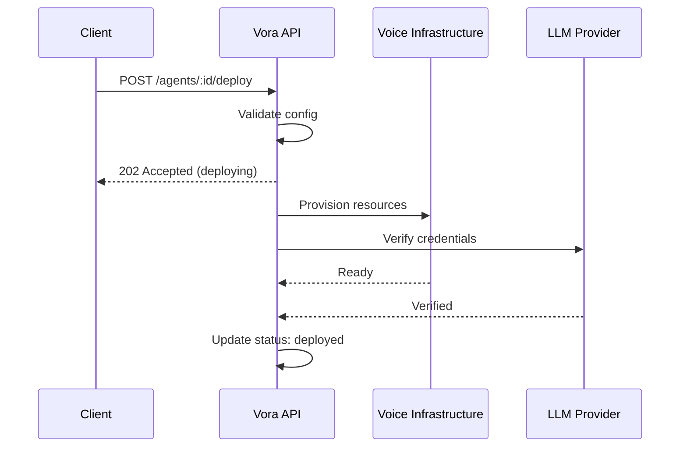

# Deploy Agent

Deploy an agent to make it available for voice calls. After creating or updating an agent, you must deploy it for changes to take effect.

## Request

```
POST https://api.voicevora.com/v1/agents/:id/deploy
```

### Path Parameters

| Parameter | Type | Description |
|-----------|------|-------------|
| `id` | string | The agent ID to deploy |

### Body Parameters (Optional)

| Parameter | Type | Default | Description |
|-----------|------|---------|-------------|
| `environment` | string | `production` | Deployment environment |
| `rollout_percentage` | number | `100` | Percentage of traffic (for gradual rollouts) |
| `notes` | string | - | Deployment notes for logging |

## Response

<Tabs>
  <Tab title="Success (202)">
    ```json
    {
      "data": {
        "deployment_id": "deploy_xyz789",
        "agent_id": "agent_abc123xyz",
        "status": "deploying",
        "environment": "production",
        "rollout_percentage": 100,
        "started_at": "2024-01-15T14:50:00Z",
        "estimated_completion": "2024-01-15T14:51:00Z"
      },
      "meta": {
        "request_id": "req_xyz789"
      }
    }
    ```
  </Tab>
  <Tab title="Already Deploying (409)">
    ```json
    {
      "error": {
        "code": "CONFLICT",
        "message": "Agent is already being deployed",
        "details": {
          "current_deployment": "deploy_abc123",
          "started_at": "2024-01-15T14:49:00Z",
          "hint": "Wait for current deployment to complete"
        }
      }
    }
    ```
  </Tab>
  <Tab title="Validation Failed (422)">
    ```json
    {
      "error": {
        "code": "VALIDATION_ERROR",
        "message": "Agent configuration is invalid",
        "details": {
          "errors": [
            {
              "field": "config.voice_id",
              "message": "Voice ID is required for deployment"
            }
          ]
        }
      }
    }
    ```
  </Tab>
</Tabs>

## Deployment Process

When you deploy an agent, Vora:

1. **Validates** the agent configuration
2. **Provisions** voice infrastructure resources
3. **Configures** the LLM and knowledge base connections
4. **Activates** the agent for incoming calls



## Examples

### Basic Deployment

<CodeGroup>
```javascript JavaScript
const deployment = await vora.agents.deploy('agent_abc123xyz');

console.log(`Deployment started: ${deployment.deployment_id}`);
console.log(`Status: ${deployment.status}`);
```

```python Python
deployment = vora.agents.deploy('agent_abc123xyz')

print(f"Deployment started: {deployment.deployment_id}")
print(f"Status: {deployment.status}")
```

```bash cURL
curl -X POST https://api.voicevora.com/v1/agents/agent_abc123xyz/deploy \
  -H "Authorization: Bearer YOUR_API_KEY"
```
</CodeGroup>

### Deployment with Notes

<CodeGroup>
```javascript JavaScript
const deployment = await vora.agents.deploy('agent_abc123xyz', {
  notes: 'Updated greeting and temperature settings'
});
```

```python Python
deployment = vora.agents.deploy(
    'agent_abc123xyz',
    notes='Updated greeting and temperature settings'
)
```

```bash cURL
curl -X POST https://api.voicevora.com/v1/agents/agent_abc123xyz/deploy \
  -H "Authorization: Bearer YOUR_API_KEY" \
  -H "Content-Type: application/json" \
  -d '{"notes": "Updated greeting and temperature settings"}'
```
</CodeGroup>

### Gradual Rollout

<CodeGroup>
```javascript JavaScript
// Deploy to 10% of traffic first
const deployment = await vora.agents.deploy('agent_abc123xyz', {
  rollout_percentage: 10,
  notes: 'Testing new prompt with 10% traffic'
});

// After validation, increase to 50%
await vora.agents.deploy('agent_abc123xyz', {
  rollout_percentage: 50,
  notes: 'Expanding to 50% traffic'
});

// Full rollout
await vora.agents.deploy('agent_abc123xyz', {
  rollout_percentage: 100,
  notes: 'Full production rollout'
});
```

```python Python
# Deploy to 10% of traffic first
deployment = vora.agents.deploy(
    'agent_abc123xyz',
    rollout_percentage=10,
    notes='Testing new prompt with 10% traffic'
)

# After validation, increase to 50%
vora.agents.deploy(
    'agent_abc123xyz',
    rollout_percentage=50,
    notes='Expanding to 50% traffic'
)

# Full rollout
vora.agents.deploy(
    'agent_abc123xyz',
    rollout_percentage=100,
    notes='Full production rollout'
)
```
</CodeGroup>

### Wait for Deployment Completion

<CodeGroup>
```javascript JavaScript
async function deployAndWait(agentId, options = {}) {
  // Start deployment
  const deployment = await vora.agents.deploy(agentId, options);
  console.log(`Deployment started: ${deployment.deployment_id}`);

  // Poll for completion
  const maxWait = 120000; // 2 minutes
  const startTime = Date.now();

  while (Date.now() - startTime < maxWait) {
    const agent = await vora.agents.get(agentId);

    switch (agent.status) {
      case 'deployed':
        console.log('Deployment successful!');
        return agent;

      case 'error':
        throw new Error('Deployment failed');

      case 'deploying':
        console.log('Still deploying...');
        await sleep(3000);
        break;
    }
  }

  throw new Error('Deployment timeout');
}

function sleep(ms) {
  return new Promise(resolve => setTimeout(resolve, ms));
}

// Usage
const agent = await deployAndWait('agent_abc123xyz', {
  notes: 'Production release v2.1'
});
```

```python Python
import time

def deploy_and_wait(agent_id: str, timeout: int = 120, **options):
    # Start deployment
    deployment = vora.agents.deploy(agent_id, **options)
    print(f"Deployment started: {deployment.deployment_id}")

    # Poll for completion
    start_time = time.time()

    while time.time() - start_time < timeout:
        agent = vora.agents.get(agent_id)

        if agent.status == 'deployed':
            print('Deployment successful!')
            return agent

        if agent.status == 'error':
            raise Exception('Deployment failed')

        print('Still deploying...')
        time.sleep(3)

    raise Exception('Deployment timeout')

# Usage
agent = deploy_and_wait('agent_abc123xyz', notes='Production release v2.1')
```
</CodeGroup>

## Checking Deployment Status

### Get Current Deployment Status

The agent's `status` field reflects the deployment state:

<CodeGroup>
```javascript JavaScript
const agent = await vora.agents.get('agent_abc123xyz');

switch (agent.status) {
  case 'draft':
    console.log('Agent needs deployment');
    break;
  case 'deploying':
    console.log('Deployment in progress');
    break;
  case 'deployed':
    console.log(`Deployed at: ${agent.deployed_at}`);
    break;
  case 'error':
    console.log('Deployment failed');
    break;
}
```

```python Python
agent = vora.agents.get('agent_abc123xyz')

if agent.status == 'draft':
    print('Agent needs deployment')
elif agent.status == 'deploying':
    print('Deployment in progress')
elif agent.status == 'deployed':
    print(f'Deployed at: {agent.deployed_at}')
elif agent.status == 'error':
    print('Deployment failed')
```
</CodeGroup>

### List Deployment History

<CodeGroup>
```javascript JavaScript
const { data: deployments } = await vora.agents.listDeployments('agent_abc123xyz');

deployments.forEach(d => {
  console.log(`${d.deployment_id}: ${d.status} at ${d.started_at}`);
  if (d.notes) console.log(`  Notes: ${d.notes}`);
});
```

```python Python
deployments = vora.agents.list_deployments('agent_abc123xyz')

for d in deployments.data:
    print(f"{d.deployment_id}: {d.status} at {d.started_at}")
    if d.notes:
        print(f"  Notes: {d.notes}")
```

```bash cURL
curl https://api.voicevora.com/v1/agents/agent_abc123xyz/deployments \
  -H "Authorization: Bearer YOUR_API_KEY"
```
</CodeGroup>

## Rollback to Previous Version

If a deployment causes issues, you can rollback:

<CodeGroup>
```javascript JavaScript
// Get deployment history
const { data: deployments } = await vora.agents.listDeployments('agent_abc123xyz');

// Find the previous successful deployment
const previousDeployment = deployments.find(d =>
  d.status === 'completed' && d.deployment_id !== deployments[0].deployment_id
);

// Rollback
await vora.agents.rollback('agent_abc123xyz', {
  deployment_id: previousDeployment.deployment_id
});
```

```python Python
# Get deployment history
deployments = vora.agents.list_deployments('agent_abc123xyz')

# Find previous successful deployment
previous = next(
    d for d in deployments.data[1:]
    if d.status == 'completed'
)

# Rollback
vora.agents.rollback('agent_abc123xyz', deployment_id=previous.deployment_id)
```

```bash cURL
curl -X POST https://api.voicevora.com/v1/agents/agent_abc123xyz/rollback \
  -H "Authorization: Bearer YOUR_API_KEY" \
  -H "Content-Type: application/json" \
  -d '{"deployment_id": "deploy_previous123"}'
```
</CodeGroup>

## Best Practices

<AccordionGroup>
  <Accordion title="Test before deploying to production">
    Use the Sessions API in test mode to verify agent behavior:

    ```javascript
    // Create a test session
    const session = await vora.sessions.create({
      agent_id: agentId,
      test_mode: true
    });

    // Test the agent behavior
    // ...

    // If tests pass, deploy
    await vora.agents.deploy(agentId);
    ```
  </Accordion>

  <Accordion title="Use gradual rollouts for major changes">
    When making significant prompt or model changes, use gradual rollouts:

    ```javascript
    // Start with 10%
    await deploy(agentId, { rollout_percentage: 10 });

    // Monitor metrics for 1 hour
    await monitorMetrics(agentId, 3600);

    // Increase to 50%
    await deploy(agentId, { rollout_percentage: 50 });

    // Monitor again
    await monitorMetrics(agentId, 3600);

    // Full rollout
    await deploy(agentId, { rollout_percentage: 100 });
    ```
  </Accordion>

  <Accordion title="Add deployment notes">
    Always include notes describing what changed:

    ```javascript
    await vora.agents.deploy(agentId, {
      notes: 'v2.3: Improved greeting, added FAQ responses'
    });
    ```

    This helps with debugging and understanding deployment history.
  </Accordion>

  <Accordion title="Monitor after deployment">
    Watch key metrics after deploying:
    - Call success rate
    - Average call duration
    - User satisfaction scores
    - Error rates

    Set up alerts for anomalies and be ready to rollback.
  </Accordion>
</AccordionGroup>

## Rate Limits

| Limit | Value |
|-------|-------|
| Deployments per hour | 10 |
| Concurrent deployments | 1 per agent |

<Warning>
  If you exceed the deployment rate limit, you'll receive a `429 Too Many Requests` error. Wait before retrying.
</Warning>

## Error Codes

| Code | Description | Resolution |
|------|-------------|------------|
| `CONFLICT` | Deployment already in progress | Wait for current deployment |
| `VALIDATION_ERROR` | Invalid agent configuration | Fix configuration issues |
| `VOICE_NOT_FOUND` | Voice ID doesn't exist | Update voice_id in config |
| `RATE_LIMIT_EXCEEDED` | Too many deployments | Wait before retrying |

## Next Steps

<CardGroup cols={2}>
  <Card title="Start a Session" icon="phone" href="/api/sessions/create">
    Test your deployed agent
  </Card>
  <Card title="Monitor Usage" icon="chart-line" href="/api/agents/get">
    Check agent statistics
  </Card>
</CardGroup>
