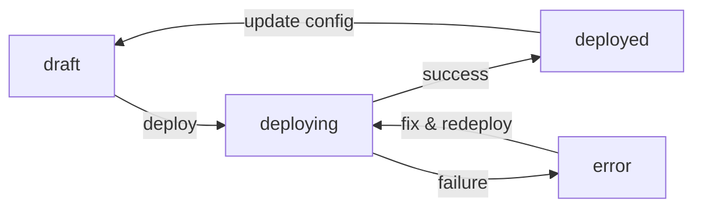

# Agents API

Agents are the core building blocks of Vora. An agent represents a voice AI assistant with specific behaviors, knowledge, and capabilities.

## Overview

The Agents API allows you to:
- Create new voice agents with custom configurations
- Retrieve and list existing agents
- Update agent settings and behaviors
- Deploy agents to production
- Delete agents when no longer needed

## Endpoints

| Method | Endpoint | Description |
|--------|----------|-------------|
| `POST` | `/agents` | [Create a new agent](/api/agents/create) |
| `GET` | `/agents` | [List all agents](/api/agents/get) |
| `GET` | `/agents/:id` | [Get a specific agent](/api/agents/get) |
| `PUT` | `/agents/:id` | [Update an agent](/api/agents/update) |
| `DELETE` | `/agents/:id` | [Delete an agent](/api/agents/delete) |
| `POST` | `/agents/:id/deploy` | [Deploy an agent](/api/agents/deploy) |

## Agent Object

```json
{
  "id": "agent_abc123xyz",
  "name": "Customer Support Agent",
  "description": "Handles customer inquiries and support requests",
  "status": "deployed",
  "config": {
    "voice_id": "voice_sarah",
    "llm_provider": "openai",
    "llm_model": "gpt-4-turbo",
    "system_prompt": "You are a helpful customer support agent...",
    "temperature": 0.7,
    "max_tokens": 500,
    "language": "en",
    "interruption_threshold": 0.5
  },
  "knowledge_bases": ["kb_docs123"],
  "functions": ["fn_lookup_order", "fn_create_ticket"],
  "created_at": "2024-01-15T10:30:00Z",
  "updated_at": "2024-01-15T14:45:00Z",
  "deployed_at": "2024-01-15T14:50:00Z",
  "stats": {
    "total_calls": 1250,
    "avg_duration_seconds": 180,
    "last_call_at": "2024-01-15T18:30:00Z"
  }
}
```

### Agent Fields

| Field | Type | Description |
|-------|------|-------------|
| `id` | string | Unique identifier for the agent |
| `name` | string | Display name for the agent |
| `description` | string | Optional description of the agent's purpose |
| `status` | string | Current status: `draft`, `deploying`, `deployed`, `error` |
| `config` | object | Agent configuration (see below) |
| `knowledge_bases` | array | IDs of attached knowledge bases |
| `functions` | array | IDs of custom functions available to the agent |
| `created_at` | string | ISO 8601 timestamp of creation |
| `updated_at` | string | ISO 8601 timestamp of last update |
| `deployed_at` | string | ISO 8601 timestamp of last deployment |
| `stats` | object | Usage statistics (read-only) |

### Agent Config

| Field | Type | Default | Description |
|-------|------|---------|-------------|
| `voice_id` | string | - | ID of the voice to use (required) |
| `llm_provider` | string | `openai` | LLM provider: `openai`, `anthropic`, `google` |
| `llm_model` | string | `gpt-4-turbo` | Model to use for the LLM |
| `system_prompt` | string | - | System instructions for the agent |
| `temperature` | number | `0.7` | LLM temperature (0-1) |
| `max_tokens` | number | `500` | Maximum tokens per response |
| `language` | string | `en` | Primary language code |
| `interruption_threshold` | number | `0.5` | Sensitivity for user interruptions (0-1) |
| `silence_timeout_ms` | number | `5000` | Timeout for user silence |
| `greeting` | string | - | Initial greeting message |
| `fallback_message` | string | - | Message when agent can't respond |

## Agent Status

Agents progress through these statuses:



| Status | Description |
|--------|-------------|
| `draft` | Agent created but not deployed |
| `deploying` | Deployment in progress |
| `deployed` | Agent is live and accepting calls |
| `error` | Deployment failed |

## Quick Start

### Create and Deploy an Agent

<CodeGroup>
```javascript JavaScript
import { VoraClient } from '@vora/sdk';

const vora = new VoraClient({ apiKey: process.env.VORA_API_KEY });

// Create agent
const agent = await vora.agents.create({
  name: 'Sales Assistant',
  config: {
    voice_id: 'voice_sarah',
    llm_provider: 'openai',
    llm_model: 'gpt-4-turbo',
    system_prompt: `You are a friendly sales assistant for Acme Corp.
    Help customers learn about our products and answer questions.`,
    greeting: 'Hi! Welcome to Acme Corp. How can I help you today?'
  }
});

// Deploy to production
await vora.agents.deploy(agent.id);

console.log(`Agent deployed: ${agent.id}`);
```

```python Python
from vora import VoraClient

vora = VoraClient(api_key=os.environ['VORA_API_KEY'])

# Create agent
agent = vora.agents.create(
    name='Sales Assistant',
    config={
        'voice_id': 'voice_sarah',
        'llm_provider': 'openai',
        'llm_model': 'gpt-4-turbo',
        'system_prompt': '''You are a friendly sales assistant for Acme Corp.
        Help customers learn about our products and answer questions.''',
        'greeting': 'Hi! Welcome to Acme Corp. How can I help you today?'
    }
)

# Deploy to production
vora.agents.deploy(agent.id)

print(f"Agent deployed: {agent.id}")
```

```bash cURL
# Create agent
curl -X POST https://api.voicevora.com/v1/agents \
  -H "Authorization: Bearer YOUR_API_KEY" \
  -H "Content-Type: application/json" \
  -d '{
    "name": "Sales Assistant",
    "config": {
      "voice_id": "voice_sarah",
      "llm_provider": "openai",
      "llm_model": "gpt-4-turbo",
      "system_prompt": "You are a friendly sales assistant...",
      "greeting": "Hi! Welcome to Acme Corp. How can I help you today?"
    }
  }'

# Deploy agent
curl -X POST https://api.voicevora.com/v1/agents/agent_abc123/deploy \
  -H "Authorization: Bearer YOUR_API_KEY"
```
</CodeGroup>

## Next Steps

<CardGroup cols={2}>
  <Card title="Create Agent" icon="plus" href="/api/agents/create">
    Create a new voice agent
  </Card>
  <Card title="Deploy Agent" icon="rocket" href="/api/agents/deploy">
    Deploy to production
  </Card>
  <Card title="Sessions API" icon="phone" href="/api/sessions">
    Start voice calls with agents
  </Card>
  <Card title="Knowledge Base" icon="database" href="/api/knowledge-base">
    Add knowledge to agents
  </Card>
</CardGroup>
