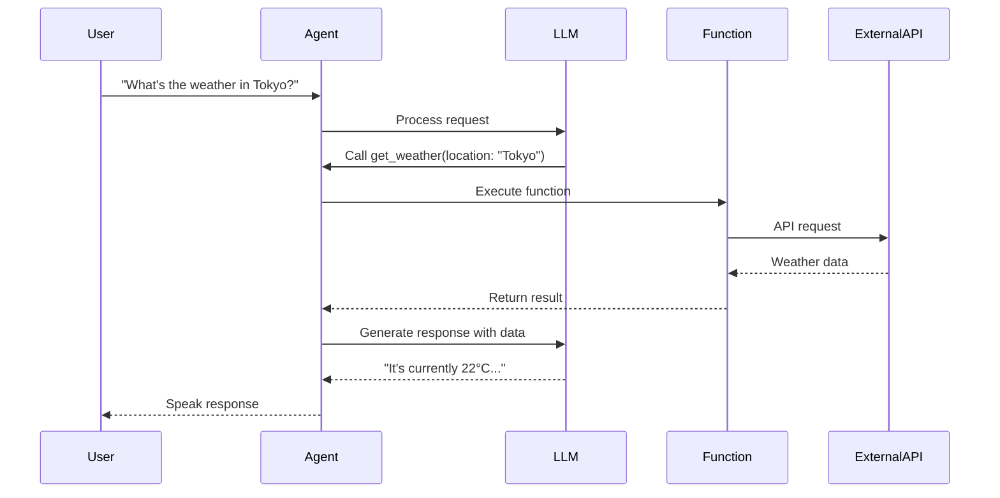

# Functions API

Functions allow your voice agents to interact with external systems, fetch real-time data, and perform actions during conversations.

## Overview

Functions are tools that agents can invoke during a voice session. When a user's request requires external data or actions, the agent automatically calls the appropriate function.

## How It Works



1. **User makes a request** that requires external data
2. **LLM identifies** the need to call a function
3. **Agent executes** the function with extracted parameters
4. **Function calls** your external API or service
5. **Result is returned** to the LLM for response generation
6. **Agent speaks** the final response to the user

## Endpoints

| Method | Endpoint | Description |
|--------|----------|-------------|
| `POST` | `/functions` | [Create a function](/api/functions/create) |
| `GET` | `/functions` | List all functions |
| `GET` | `/functions/:id` | Get a function |
| `PATCH` | `/functions/:id` | Update a function |
| `DELETE` | `/functions/:id` | Delete a function |

## Function Object

```json
{
  "id": "fn_abc123xyz",
  "name": "get_weather",
  "description": "Get current weather for a location",
  "parameters": {
    "type": "object",
    "properties": {
      "location": {
        "type": "string",
        "description": "City name or coordinates"
      },
      "units": {
        "type": "string",
        "enum": ["celsius", "fahrenheit"],
        "default": "celsius"
      }
    },
    "required": ["location"]
  },
  "endpoint": {
    "url": "https://api.example.com/weather",
    "method": "GET",
    "headers": {
      "X-API-Key": "{{WEATHER_API_KEY}}"
    }
  },
  "response_template": "The weather in {{location}} is {{temperature}}° with {{conditions}}.",
  "timeout_ms": 5000,
  "agents": ["agent_def456uvw"],
  "created_at": "2024-01-15T10:30:00Z",
  "updated_at": "2024-01-15T10:30:00Z"
}
```

### Fields

| Field | Type | Description |
|-------|------|-------------|
| `id` | string | Unique identifier |
| `name` | string | Function name (used by LLM) |
| `description` | string | What the function does (helps LLM decide when to call) |
| `parameters` | object | JSON Schema for function parameters |
| `endpoint` | object | HTTP endpoint configuration |
| `response_template` | string | Template for formatting the response |
| `timeout_ms` | number | Request timeout (default: 5000) |
| `agents` | array | Agents that can use this function |

### Endpoint Configuration

| Field | Type | Description |
|-------|------|-------------|
| `url` | string | The API endpoint URL |
| `method` | string | HTTP method (GET, POST, PUT, DELETE) |
| `headers` | object | Request headers (supports secrets) |
| `body_template` | string | Request body template (for POST/PUT) |

## Quick Start

### Create a Weather Function

<CodeGroup>
```javascript JavaScript
const weatherFn = await vora.functions.create({
  name: 'get_weather',
  description: 'Get current weather conditions for any city',
  parameters: {
    type: 'object',
    properties: {
      city: {
        type: 'string',
        description: 'City name'
      }
    },
    required: ['city']
  },
  endpoint: {
    url: 'https://api.weatherapi.com/v1/current.json?q={{city}}',
    method: 'GET',
    headers: {
      'X-API-Key': '{{WEATHER_API_KEY}}'
    }
  },
  response_template: 'Currently {{current.temp_c}}°C with {{current.condition.text}}'
});

console.log(`Created function: ${weatherFn.id}`);
```

```python Python
weather_fn = vora.functions.create(
    name='get_weather',
    description='Get current weather conditions for any city',
    parameters={
        'type': 'object',
        'properties': {
            'city': {
                'type': 'string',
                'description': 'City name'
            }
        },
        'required': ['city']
    },
    endpoint={
        'url': 'https://api.weatherapi.com/v1/current.json?q={{city}}',
        'method': 'GET',
        'headers': {
            'X-API-Key': '{{WEATHER_API_KEY}}'
        }
    },
    response_template='Currently {{current.temp_c}}°C with {{current.condition.text}}'
)

print(f"Created function: {weather_fn.id}")
```

```bash cURL
curl -X POST https://api.voicevora.com/v1/functions \
  -H "Authorization: Bearer YOUR_API_KEY" \
  -H "Content-Type: application/json" \
  -d '{
    "name": "get_weather",
    "description": "Get current weather conditions for any city",
    "parameters": {
      "type": "object",
      "properties": {
        "city": {
          "type": "string",
          "description": "City name"
        }
      },
      "required": ["city"]
    },
    "endpoint": {
      "url": "https://api.weatherapi.com/v1/current.json?q={{city}}",
      "method": "GET",
      "headers": {
        "X-API-Key": "{{WEATHER_API_KEY}}"
      }
    }
  }'
```
</CodeGroup>

### Attach to Agent

<CodeGroup>
```javascript JavaScript
// Create or update agent with functions
const agent = await vora.agents.update('agent_abc123', {
  functions: [weatherFn.id]
});

// Or attach during agent creation
const newAgent = await vora.agents.create({
  name: 'Weather Assistant',
  config: {
    voice_id: 'voice_sarah',
    system_prompt: 'You help users with weather information.'
  },
  functions: [weatherFn.id]
});
```

```python Python
# Create or update agent with functions
agent = vora.agents.update('agent_abc123', functions=[weather_fn.id])

# Or attach during agent creation
new_agent = vora.agents.create(
    name='Weather Assistant',
    config={
        'voice_id': 'voice_sarah',
        'system_prompt': 'You help users with weather information.'
    },
    functions=[weather_fn.id]
)
```
</CodeGroup>

### Test the Function

<CodeGroup>
```javascript JavaScript
// Test function execution directly
const result = await vora.functions.test(weatherFn.id, {
  city: 'London'
});

console.log('Response:', result.response);
console.log('Latency:', result.latency_ms);
```

```python Python
# Test function execution directly
result = vora.functions.test(weather_fn.id, city='London')

print(f"Response: {result.response}")
print(f"Latency: {result.latency_ms}")
```

```bash cURL
curl -X POST https://api.voicevora.com/v1/functions/fn_abc123/test \
  -H "Authorization: Bearer YOUR_API_KEY" \
  -H "Content-Type: application/json" \
  -d '{"city": "London"}'
```
</CodeGroup>

## Function Types

### HTTP Functions

Call any REST API:

```javascript
const fn = await vora.functions.create({
  name: 'lookup_order',
  description: 'Look up order status by order ID',
  parameters: {
    type: 'object',
    properties: {
      order_id: { type: 'string', description: 'Order ID' }
    },
    required: ['order_id']
  },
  endpoint: {
    url: 'https://api.myshop.com/orders/{{order_id}}',
    method: 'GET',
    headers: {
      'Authorization': 'Bearer {{SHOP_API_KEY}}'
    }
  }
});
```

### Webhook Functions

Post data to your webhook:

```javascript
const fn = await vora.functions.create({
  name: 'create_ticket',
  description: 'Create a support ticket',
  parameters: {
    type: 'object',
    properties: {
      subject: { type: 'string' },
      description: { type: 'string' },
      priority: { type: 'string', enum: ['low', 'medium', 'high'] }
    },
    required: ['subject', 'description']
  },
  endpoint: {
    url: 'https://api.mycompany.com/tickets',
    method: 'POST',
    headers: {
      'Authorization': 'Bearer {{TICKET_API_KEY}}',
      'Content-Type': 'application/json'
    },
    body_template: JSON.stringify({
      subject: '{{subject}}',
      description: '{{description}}',
      priority: '{{priority}}'
    })
  }
});
```

## Secrets Management

Use secrets for API keys and sensitive data:

```javascript
// Store a secret
await vora.secrets.set('WEATHER_API_KEY', 'sk_live_xxx');

// Reference in function endpoint
const fn = await vora.functions.create({
  // ...
  endpoint: {
    headers: {
      'X-API-Key': '{{WEATHER_API_KEY}}'  // Resolved at runtime
    }
  }
});
```

Secrets are:
- Encrypted at rest
- Never logged or exposed in responses
- Resolved at function execution time

## Response Templates

Format API responses for natural speech:

```javascript
// Raw API response
{
  "temp": 22,
  "humidity": 65,
  "conditions": "partly cloudy"
}

// Response template
"It's {{temp}} degrees with {{humidity}}% humidity. Conditions are {{conditions}}."

// Agent speaks
"It's 22 degrees with 65% humidity. Conditions are partly cloudy."
```

### Template Syntax

| Syntax | Description | Example |
|--------|-------------|---------|
| `{{field}}` | Simple value | `{{temperature}}` |
| `{{obj.field}}` | Nested value | `{{weather.current.temp}}` |
| `{{arr[0]}}` | Array index | `{{forecasts[0].high}}` |
| `{{#if}}` | Conditional | `{{#if rain}}Bring an umbrella{{/if}}` |

## Best Practices

<AccordionGroup>
  <Accordion title="Write clear descriptions">
    The description helps the LLM decide when to call the function:

    ```javascript
    // ✅ Good - Specific and actionable
    description: 'Look up the status and shipping information for an order by its order ID'

    // ❌ Bad - Vague
    description: 'Order function'
    ```
  </Accordion>

  <Accordion title="Define precise parameters">
    Use JSON Schema features for better parameter extraction:

    ```javascript
    parameters: {
      type: 'object',
      properties: {
        date: {
          type: 'string',
          format: 'date',
          description: 'Appointment date in YYYY-MM-DD format'
        },
        time: {
          type: 'string',
          pattern: '^([01]?[0-9]|2[0-3]):[0-5][0-9]$',
          description: 'Time in HH:MM 24-hour format'
        }
      },
      required: ['date', 'time']
    }
    ```
  </Accordion>

  <Accordion title="Handle errors gracefully">
    Provide fallback responses for API failures:

    ```javascript
    const fn = await vora.functions.create({
      // ...
      error_response: "I'm having trouble looking that up right now. Can I help with something else?",
      timeout_ms: 5000,
      retry: {
        max_attempts: 2,
        delay_ms: 1000
      }
    });
    ```
  </Accordion>

  <Accordion title="Test before deploying">
    Always test functions before attaching to production agents:

    ```javascript
    // Test with various inputs
    const tests = [
      { city: 'London' },
      { city: 'New York' },
      { city: 'Invalid City 12345' }
    ];

    for (const params of tests) {
      const result = await vora.functions.test(fn.id, params);
      console.log(params, result.success ? '✓' : '✗');
    }
    ```
  </Accordion>
</AccordionGroup>

## Common Use Cases

| Use Case | Function Type | Example |
|----------|---------------|---------|
| Order lookup | HTTP GET | Check order status |
| Appointment booking | HTTP POST | Schedule appointments |
| CRM integration | HTTP GET/POST | Look up customer info |
| Payment processing | Webhook | Process refunds |
| Inventory check | HTTP GET | Check product availability |
| Ticket creation | HTTP POST | Create support tickets |

## Next Steps

<CardGroup cols={2}>
  <Card title="Create Functions" icon="plus" href="/api/functions/create">
    Create custom functions
  </Card>
  <Card title="Function Templates" icon="copy" href="/api/functions/templates">
    Pre-built function templates
  </Card>
  <Card title="Agents" icon="robot" href="/api/agents">
    Attach functions to agents
  </Card>
  <Card title="Webhooks" icon="webhook" href="/api/webhooks">
    Receive function execution events
  </Card>
</CardGroup>
