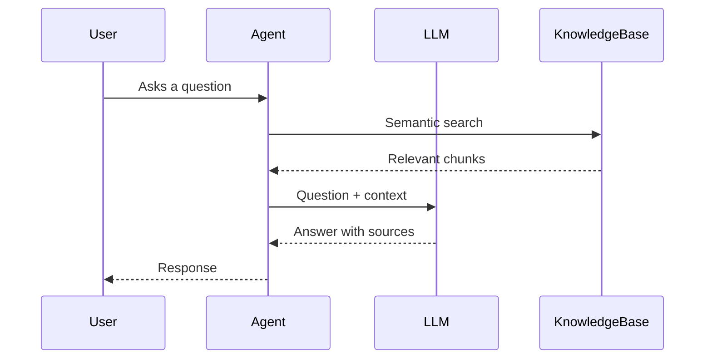

# Knowledge Base API

Knowledge bases enable your agents to answer questions using your own documents through Retrieval Augmented Generation (RAG).

## Overview

The Knowledge Base API allows you to:
- Create knowledge bases to organize documents
- Upload documents in various formats (PDF, TXT, DOCX)
- Perform semantic search across documents
- Attach knowledge bases to agents for RAG responses

## How It Works



1. **User asks a question** during a voice call
2. **Agent searches** the knowledge base for relevant content
3. **RAG retrieval** returns the most relevant document chunks
4. **LLM generates** an answer using the retrieved context
5. **Agent responds** with accurate, sourced information

## Endpoints

| Method | Endpoint | Description |
|--------|----------|-------------|
| `POST` | `/knowledge-base` | Create a knowledge base |
| `GET` | `/knowledge-base` | List knowledge bases |
| `GET` | `/knowledge-base/:id` | Get a knowledge base |
| `DELETE` | `/knowledge-base/:id` | Delete a knowledge base |
| `POST` | `/knowledge-base/:id/documents` | [Upload documents](/api/knowledge-base/documents) |
| `GET` | `/knowledge-base/:id/documents` | [List documents](/api/knowledge-base/documents) |
| `DELETE` | `/knowledge-base/:id/documents/:docId` | [Delete a document](/api/knowledge-base/documents) |
| `POST` | `/knowledge-base/:id/search` | [Search documents](/api/knowledge-base/search) |

## Knowledge Base Object

```json
{
  "id": "kb_abc123xyz",
  "name": "Product Documentation",
  "description": "Official product manuals and guides",
  "embedding_model": "text-embedding-3-small",
  "chunk_size": 512,
  "chunk_overlap": 50,
  "documents_count": 12,
  "total_chunks": 458,
  "total_bytes": 2457600,
  "status": "ready",
  "created_at": "2024-01-15T10:30:00Z",
  "updated_at": "2024-01-15T14:45:00Z"
}
```

### Fields

| Field | Type | Description |
|-------|------|-------------|
| `id` | string | Unique identifier |
| `name` | string | Display name |
| `description` | string | Optional description |
| `embedding_model` | string | Model used for embeddings |
| `chunk_size` | number | Characters per chunk |
| `chunk_overlap` | number | Overlap between chunks |
| `documents_count` | number | Number of documents |
| `total_chunks` | number | Total indexed chunks |
| `total_bytes` | number | Total document size |
| `status` | string | `processing`, `ready`, `error` |

## Supported File Types

| Format | Extension | Max Size |
|--------|-----------|----------|
| PDF | `.pdf` | 50 MB |
| Plain Text | `.txt` | 10 MB |
| Word Document | `.docx` | 25 MB |
| Markdown | `.md` | 10 MB |
| HTML | `.html` | 10 MB |
| CSV | `.csv` | 25 MB |

## Quick Start

### Create and Populate a Knowledge Base

<CodeGroup>
```javascript JavaScript
import { VoraClient } from '@vora/sdk';

const vora = new VoraClient({ apiKey: process.env.VORA_API_KEY });

// 1. Create knowledge base
const kb = await vora.knowledgeBases.create({
  name: 'Product Documentation',
  description: 'Official product manuals and FAQ'
});

console.log(`Created KB: ${kb.id}`);

// 2. Upload documents
await vora.knowledgeBases.uploadDocument(kb.id, {
  file: fs.createReadStream('product-manual.pdf'),
  name: 'Product Manual'
});

await vora.knowledgeBases.uploadDocument(kb.id, {
  file: fs.createReadStream('faq.md'),
  name: 'FAQ'
});

// 3. Wait for processing
await waitForProcessing(kb.id);

// 4. Test search
const results = await vora.knowledgeBases.search(kb.id, {
  query: 'How do I reset my password?'
});

console.log(`Found ${results.length} relevant chunks`);
```

```python Python
from vora import VoraClient
import os

vora = VoraClient(api_key=os.environ['VORA_API_KEY'])

# 1. Create knowledge base
kb = vora.knowledge_bases.create(
    name='Product Documentation',
    description='Official product manuals and FAQ'
)

print(f"Created KB: {kb.id}")

# 2. Upload documents
with open('product-manual.pdf', 'rb') as f:
    vora.knowledge_bases.upload_document(kb.id, file=f, name='Product Manual')

with open('faq.md', 'rb') as f:
    vora.knowledge_bases.upload_document(kb.id, file=f, name='FAQ')

# 3. Wait for processing
wait_for_processing(kb.id)

# 4. Test search
results = vora.knowledge_bases.search(kb.id, query='How do I reset my password?')
print(f"Found {len(results)} relevant chunks")
```

```bash cURL
# Create knowledge base
curl -X POST https://api.voicevora.com/v1/knowledge-base \
  -H "Authorization: Bearer YOUR_API_KEY" \
  -H "Content-Type: application/json" \
  -d '{
    "name": "Product Documentation",
    "description": "Official product manuals and FAQ"
  }'

# Upload document
curl -X POST https://api.voicevora.com/v1/knowledge-base/kb_abc123/documents \
  -H "Authorization: Bearer YOUR_API_KEY" \
  -F "file=@product-manual.pdf" \
  -F "name=Product Manual"
```
</CodeGroup>

### Attach to an Agent

<CodeGroup>
```javascript JavaScript
// Create agent with knowledge base
const agent = await vora.agents.create({
  name: 'Product Support',
  config: {
    voice_id: 'voice_sarah',
    system_prompt: `You are a product support agent.
    Use the knowledge base to answer questions about our products.
    Always cite the source when providing information.`,
    temperature: 0.3 // Lower for factual responses
  },
  knowledge_bases: [kb.id]
});

await vora.agents.deploy(agent.id);
```

```python Python
# Create agent with knowledge base
agent = vora.agents.create(
    name='Product Support',
    config={
        'voice_id': 'voice_sarah',
        'system_prompt': '''You are a product support agent.
        Use the knowledge base to answer questions about our products.
        Always cite the source when providing information.''',
        'temperature': 0.3
    },
    knowledge_bases=[kb.id]
)

vora.agents.deploy(agent.id)
```
</CodeGroup>

## Embedding Models

| Model | Dimensions | Best For |
|-------|------------|----------|
| `text-embedding-3-small` | 1536 | General use, cost-effective |
| `text-embedding-3-large` | 3072 | Higher accuracy, more nuanced |
| `text-embedding-ada-002` | 1536 | Legacy compatibility |

<Info>
  The default model is `text-embedding-3-small`. You can specify a different model when creating the knowledge base.
</Info>

## Chunking Strategy

Documents are split into chunks for optimal retrieval:

| Parameter | Default | Description |
|-----------|---------|-------------|
| `chunk_size` | 512 | Characters per chunk |
| `chunk_overlap` | 50 | Overlap between chunks |

<Tip>
  **Smaller chunks** (256-512) work better for specific Q&A.
  **Larger chunks** (1024-2048) work better for broader context.
</Tip>

```javascript
// Custom chunking for long-form content
const kb = await vora.knowledgeBases.create({
  name: 'Technical Docs',
  chunk_size: 1024,
  chunk_overlap: 100
});
```

## Best Practices

<AccordionGroup>
  <Accordion title="Organize by topic">
    Create separate knowledge bases for different domains:

    ```javascript
    const productKB = await vora.knowledgeBases.create({
      name: 'Product Information'
    });

    const policyKB = await vora.knowledgeBases.create({
      name: 'Company Policies'
    });

    const technicalKB = await vora.knowledgeBases.create({
      name: 'Technical Documentation'
    });
    ```
  </Accordion>

  <Accordion title="Use descriptive file names">
    Name documents clearly for better context:

    ```javascript
    // ✅ Good
    await uploadDocument(kbId, {
      name: 'Widget Pro User Manual v2.1',
      file: widgetManual
    });

    // ❌ Bad
    await uploadDocument(kbId, {
      name: 'doc1',
      file: widgetManual
    });
    ```
  </Accordion>

  <Accordion title="Keep documents current">
    Set up a refresh schedule for frequently updated content:

    ```javascript
    async function refreshDocument(kbId, docId, newFile) {
      // Delete old version
      await vora.knowledgeBases.deleteDocument(kbId, docId);

      // Upload new version
      await vora.knowledgeBases.uploadDocument(kbId, {
        file: newFile,
        name: 'Updated Document'
      });
    }
    ```
  </Accordion>

  <Accordion title="Test search quality">
    Validate retrieval before deploying:

    ```javascript
    const testQueries = [
      'How do I reset my password?',
      'What are the system requirements?',
      'How do I contact support?'
    ];

    for (const query of testQueries) {
      const results = await vora.knowledgeBases.search(kbId, { query });

      console.log(`Query: "${query}"`);
      console.log(`Top result: ${results[0]?.text.substring(0, 100)}...`);
      console.log(`Score: ${results[0]?.score}`);
    }
    ```
  </Accordion>
</AccordionGroup>

## Next Steps

<CardGroup cols={2}>
  <Card title="Documents" icon="file" href="/api/knowledge-base/documents">
    Upload and manage documents
  </Card>
  <Card title="Search" icon="magnifying-glass" href="/api/knowledge-base/search">
    Perform semantic searches
  </Card>
  <Card title="Agents" icon="robot" href="/api/agents">
    Attach knowledge bases to agents
  </Card>
</CardGroup>
