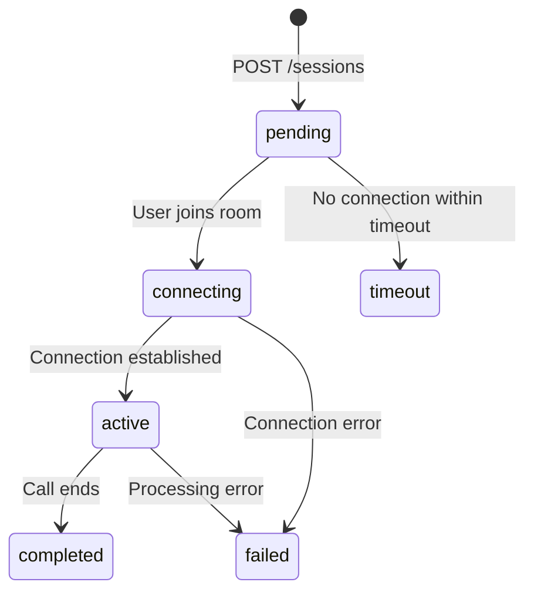

# Sessions API

Sessions represent voice calls between users and agents. Each session tracks the conversation, captures transcripts, and records analytics.

## Overview

The Sessions API allows you to:
- Create new voice call sessions
- Retrieve active and completed sessions
- Access full transcripts with speaker identification
- Track session metrics and analytics

## Endpoints

| Method | Endpoint | Description |
|--------|----------|-------------|
| `POST` | `/sessions` | [Create a new session](/api/sessions/create) |
| `GET` | `/sessions` | [List all sessions](/api/sessions/get) |
| `GET` | `/sessions/:id` | [Get a specific session](/api/sessions/get) |
| `GET` | `/sessions/:id/transcript` | [Get session transcript](/api/sessions/transcripts) |
| `POST` | `/sessions/:id/end` | End an active session |

## Session Object

```json
{
  "id": "session_abc123xyz",
  "agent_id": "agent_def456uvw",
  "status": "completed",
  "participant": {
    "phone_number": "+1234567890",
    "name": "John Doe",
    "metadata": {
      "customer_id": "cust_123",
      "plan": "premium"
    }
  },
  "room": {
    "name": "room_xyz789",
    "url": "wss://livekit.voicevora.com/room_xyz789",
    "token": "eyJ..."
  },
  "started_at": "2024-01-15T10:30:00Z",
  "ended_at": "2024-01-15T10:35:30Z",
  "duration_seconds": 330,
  "metrics": {
    "turns": 12,
    "agent_words": 245,
    "user_words": 89,
    "avg_response_time_ms": 850,
    "interruptions": 2,
    "sentiment_score": 0.8
  },
  "test_mode": false,
  "created_at": "2024-01-15T10:29:55Z"
}
```

### Session Fields

| Field | Type | Description |
|-------|------|-------------|
| `id` | string | Unique session identifier |
| `agent_id` | string | ID of the agent handling the call |
| `status` | string | Session status (see below) |
| `participant` | object | Information about the caller |
| `room` | object | LiveKit room details |
| `started_at` | string | When the call connected |
| `ended_at` | string | When the call ended |
| `duration_seconds` | number | Total call duration |
| `metrics` | object | Call analytics (read-only) |
| `test_mode` | boolean | Whether this is a test session |

### Session Status

| Status | Description |
|--------|-------------|
| `pending` | Session created, waiting for connection |
| `connecting` | Establishing voice connection |
| `active` | Call in progress |
| `completed` | Call ended normally |
| `failed` | Connection or processing error |
| `timeout` | Session expired before connection |

### Participant Object

| Field | Type | Description |
|-------|------|-------------|
| `phone_number` | string | Caller's phone number (if available) |
| `name` | string | Caller's name (if provided) |
| `metadata` | object | Custom data attached to the participant |

### Metrics Object

| Field | Type | Description |
|-------|------|-------------|
| `turns` | number | Number of conversation turns |
| `agent_words` | number | Total words spoken by agent |
| `user_words` | number | Total words spoken by user |
| `avg_response_time_ms` | number | Average agent response time |
| `interruptions` | number | Times user interrupted the agent |
| `sentiment_score` | number | Overall sentiment (-1 to 1) |

## Session Lifecycle



## Quick Start

### Create and Join a Session

<CodeGroup>
```javascript JavaScript
import { VoraClient } from '@vora/sdk';

const vora = new VoraClient({ apiKey: process.env.VORA_API_KEY });

// Create a session
const session = await vora.sessions.create({
  agent_id: 'agent_abc123xyz',
  participant: {
    name: 'John Doe',
    metadata: {
      customer_id: 'cust_123'
    }
  }
});

console.log(`Session created: ${session.id}`);
console.log(`Room URL: ${session.room.url}`);
console.log(`Token: ${session.room.token}`);

// Connect using LiveKit client
import { Room } from 'livekit-client';

const room = new Room();
await room.connect(session.room.url, session.room.token);
```

```python Python
from vora import VoraClient
import os

vora = VoraClient(api_key=os.environ['VORA_API_KEY'])

# Create a session
session = vora.sessions.create(
    agent_id='agent_abc123xyz',
    participant={
        'name': 'John Doe',
        'metadata': {'customer_id': 'cust_123'}
    }
)

print(f"Session created: {session.id}")
print(f"Room URL: {session.room['url']}")
print(f"Token: {session.room['token']}")
```

```bash cURL
curl -X POST https://api.voicevora.com/v1/sessions \
  -H "Authorization: Bearer YOUR_API_KEY" \
  -H "Content-Type: application/json" \
  -d '{
    "agent_id": "agent_abc123xyz",
    "participant": {
      "name": "John Doe",
      "metadata": {
        "customer_id": "cust_123"
      }
    }
  }'
```
</CodeGroup>

### Get Session Transcript

<CodeGroup>
```javascript JavaScript
const transcript = await vora.sessions.getTranscript('session_abc123xyz');

transcript.messages.forEach(msg => {
  console.log(`[${msg.speaker}] ${msg.text}`);
});
```

```python Python
transcript = vora.sessions.get_transcript('session_abc123xyz')

for msg in transcript.messages:
    print(f"[{msg.speaker}] {msg.text}")
```

```bash cURL
curl https://api.voicevora.com/v1/sessions/session_abc123xyz/transcript \
  -H "Authorization: Bearer YOUR_API_KEY"
```
</CodeGroup>

## WebRTC Integration

Vora uses [LiveKit](https://livekit.io) for real-time voice communication. When you create a session, you receive:

- **Room URL**: WebSocket endpoint for the voice room
- **Token**: JWT for authenticating into the room

### Browser Integration

```javascript
import { Room, RoomEvent, Track } from 'livekit-client';

async function joinCall(session) {
  const room = new Room();

  room.on(RoomEvent.TrackSubscribed, (track) => {
    if (track.kind === Track.Kind.Audio) {
      // Agent audio track
      const audioElement = track.attach();
      document.body.appendChild(audioElement);
    }
  });

  await room.connect(session.room.url, session.room.token);

  // Publish local microphone
  await room.localParticipant.setMicrophoneEnabled(true);
}
```

### React Integration

```jsx
import { LiveKitRoom, useVoiceAssistant } from '@livekit/components-react';

function VoiceCall({ session }) {
  return (
    <LiveKitRoom
      serverUrl={session.room.url}
      token={session.room.token}
      connect={true}
    >
      <VoiceInterface />
    </LiveKitRoom>
  );
}

function VoiceInterface() {
  const { state, audioTrack } = useVoiceAssistant();

  return (
    <div>
      <p>Status: {state}</p>
      {audioTrack && <audio ref={el => el && audioTrack.attach(el)} />}
    </div>
  );
}
```

## Test Mode

Create test sessions to validate agents without affecting production metrics:

<CodeGroup>
```javascript JavaScript
const testSession = await vora.sessions.create({
  agent_id: 'agent_abc123xyz',
  test_mode: true,
  participant: {
    name: 'Test User'
  }
});
```

```python Python
test_session = vora.sessions.create(
    agent_id='agent_abc123xyz',
    test_mode=True,
    participant={'name': 'Test User'}
)
```
</CodeGroup>

<Info>
  Test sessions are free and don't count toward your usage quota. They're marked with `test_mode: true` in responses.
</Info>

## Next Steps

<CardGroup cols={2}>
  <Card title="Create Session" icon="plus" href="/api/sessions/create">
    Start a new voice call
  </Card>
  <Card title="Get Transcripts" icon="file-lines" href="/api/sessions/transcripts">
    Access conversation history
  </Card>
  <Card title="React SDK" icon="react" href="/sdks/react">
    Build voice UIs with React
  </Card>
  <Card title="JavaScript SDK" icon="js" href="/sdks/javascript">
    Client-side integration
  </Card>
</CardGroup>
