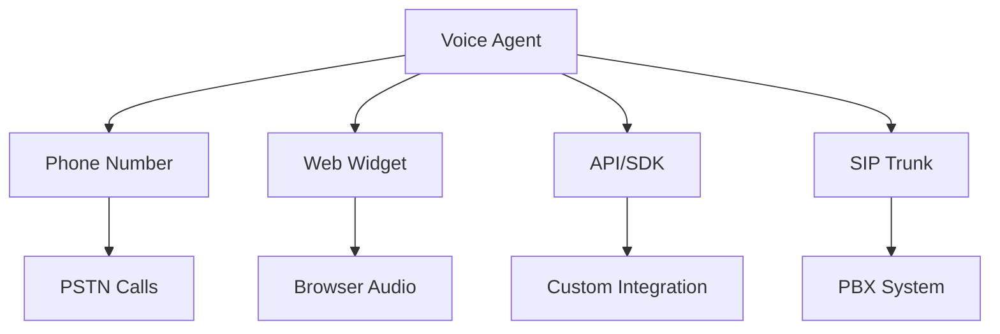

# Deployments

Deployments connect agents to communication channels—phone numbers, web widgets, and API endpoints. This guide covers deployment options, configuration, and management.

---

## Deployment Channels



| Channel | Best For |
|---------|----------|
| **Phone Number** | Inbound customer calls, outbound campaigns |
| **Web Widget** | Website support, in-app assistance |
| **API/SDK** | Custom integrations, mobile apps |
| **SIP Trunk** | Call center integration |

---

## Phone Number Deployment

### Acquire a Number

```javascript
// Search available numbers
const numbers = await vora.phoneNumbers.search({
  country: 'US',
  type: 'local',
  areaCode: '415'
});

// Purchase a number
const number = await vora.phoneNumbers.purchase({
  phoneNumber: numbers[0].number,
  name: 'Support Line'
});
```

### Assign to Agent

```javascript
// Assign agent to number
await vora.phoneNumbers.assignAgent(number.id, {
  agentId: 'agent_abc123',
  mode: 'inbound'  // or 'outbound', 'both'
});
```

### Configuration

```javascript
await vora.phoneNumbers.update(number.id, {
  agentId: 'agent_abc123',
  settings: {
    welcomeMessage: 'Thanks for calling Acme Corp.',
    businessHours: {
      timezone: 'America/New_York',
      schedule: {
        monday: { start: '09:00', end: '17:00' },
        tuesday: { start: '09:00', end: '17:00' },
        // ...
      }
    },
    afterHours: {
      action: 'voicemail',  // or 'message', 'transfer'
      message: 'We are currently closed. Please leave a message.'
    },
    recording: {
      enabled: true,
      consent: 'This call may be recorded for quality purposes.'
    }
  }
});
```

---

## Web Widget Deployment

### Generate Embed Code

```javascript
const widget = await vora.widgets.create({
  agentId: 'agent_abc123',
  name: 'Support Widget',
  config: {
    position: 'bottom-right',
    theme: {
      primaryColor: '#0066FF',
      buttonText: 'Talk to Us'
    }
  }
});

console.log(widget.embedCode);
// <script src="https://widget.vora.ai/v1/widget.js"></script>
// <script>VoraWidget.init({ agentId: 'agent_abc123' });</script>
```

### Embed in Website

```html
<!DOCTYPE html>
<html>
<head>
  <title>Your Website</title>
</head>
<body>
  <!-- Your content -->

  <!-- Vora Widget -->
  <script src="https://widget.vora.ai/v1/widget.js"></script>
  <script>
    VoraWidget.init({
      agentId: 'agent_abc123',
      theme: {
        primaryColor: '#0066FF'
      }
    });
  </script>
</body>
</html>
```

### Widget Configuration

```javascript
VoraWidget.init({
  agentId: 'agent_abc123',

  // Appearance
  theme: {
    primaryColor: '#0066FF',
    fontFamily: 'Inter, sans-serif',
    borderRadius: 12
  },
  position: 'bottom-right',  // or 'bottom-left'
  buttonText: 'Talk to Us',
  buttonIcon: 'microphone',

  // Behavior
  autoOpen: false,
  greeting: 'Hi! How can I help you today?',
  persistSession: true,

  // User context
  user: {
    id: 'user_123',
    name: 'John Doe',
    email: 'john@example.com'
  },
  variables: {
    page: window.location.pathname,
    referrer: document.referrer
  },

  // Callbacks
  onOpen: () => console.log('Widget opened'),
  onClose: () => console.log('Widget closed'),
  onSessionStart: (session) => console.log('Session started', session.id),
  onSessionEnd: (session) => console.log('Session ended', session.id)
});
```

### Widget Methods

```javascript
// Open widget programmatically
VoraWidget.open();

// Close widget
VoraWidget.close();

// Update user context
VoraWidget.setUser({ id: 'user_456', name: 'Jane' });

// Update variables
VoraWidget.setVariables({ cart: 'item_123' });

// Start a new session
VoraWidget.startSession();

// End current session
VoraWidget.endSession();
```

---

## API/SDK Deployment

### Session-Based Integration

```javascript
// Backend: Create session
app.post('/api/voice-session', async (req, res) => {
  const session = await vora.sessions.create({
    agentId: 'agent_abc123',
    userId: req.user.id,
    variables: {
      customerName: req.user.name
    }
  });

  res.json({
    token: session.token,
    roomUrl: session.roomUrl
  });
});
```

```javascript
// Frontend: Connect to session
const { token, roomUrl } = await fetch('/api/voice-session').then(r => r.json());

const room = new Room();
await room.connect(roomUrl, token);
await room.localParticipant.setMicrophoneEnabled(true);
```

### Outbound Calls

```javascript
// Initiate outbound call
const call = await vora.calls.create({
  agentId: 'agent_abc123',
  to: '+15551234567',
  from: '+15559876543',  // Must be a number you own
  variables: {
    customerName: 'John',
    appointmentDate: '2024-01-20'
  }
});

console.log(call.id);  // call_xyz789
```

---

## SIP Trunk Deployment

### Configure SIP Trunk

```javascript
const trunk = await vora.sip.createTrunk({
  name: 'Main Office PBX',
  host: 'sip.yourpbx.com',
  port: 5060,
  transport: 'udp',
  authentication: {
    username: 'vora',
    password: 'secure_password'
  }
});
```

### Assign Agent

```javascript
await vora.sip.createRoute({
  trunkId: trunk.id,
  pattern: '*',  // All calls, or specific DID pattern
  agentId: 'agent_abc123'
});
```

### SIP Headers

Access SIP headers in agent context:

```javascript
variables: {
  callerNumber: '{{sip.from}}',
  calledNumber: '{{sip.to}}',
  customHeader: '{{sip.X-Custom-Header}}'
}
```

---

## Environment Management

### Environments

| Environment | Purpose |
|-------------|---------|
| **Development** | Testing and iteration |
| **Staging** | Pre-production validation |
| **Production** | Live traffic |

### Promoting Deployments

```javascript
// Create deployment in staging
const deployment = await vora.deployments.create({
  agentId: 'agent_abc123',
  environment: 'staging',
  channel: 'web_widget'
});

// Test in staging
// ...

// Promote to production
await vora.deployments.promote(deployment.id, {
  targetEnvironment: 'production'
});
```

---

## Traffic Management

### A/B Testing

```javascript
const deployment = await vora.deployments.update(deploymentId, {
  trafficSplit: {
    'agent_abc123': 0.8,  // 80% to main agent
    'agent_xyz789': 0.2   // 20% to test agent
  }
});
```

### Gradual Rollout

```javascript
// Start with 10%
await vora.deployments.update(deploymentId, {
  trafficSplit: { 'agent_new': 0.1, 'agent_old': 0.9 }
});

// Monitor metrics...

// Increase to 50%
await vora.deployments.update(deploymentId, {
  trafficSplit: { 'agent_new': 0.5, 'agent_old': 0.5 }
});

// Full rollout
await vora.deployments.update(deploymentId, {
  trafficSplit: { 'agent_new': 1.0 }
});
```

---

## Monitoring Deployments

### Health Checks

```javascript
const health = await vora.deployments.health(deploymentId);

console.log(health);
// {
//   status: 'healthy',
//   uptime: 0.999,
//   latency: { p50: 450, p95: 820, p99: 1200 },
//   errorRate: 0.002,
//   activeSessions: 12
// }
```

### Alerts

```javascript
await vora.deployments.setAlerts(deploymentId, {
  alerts: [
    {
      metric: 'error_rate',
      threshold: 0.05,
      window: '5m',
      notify: ['ops@company.com']
    },
    {
      metric: 'latency_p95',
      threshold: 2000,
      window: '5m',
      notify: ['ops@company.com']
    }
  ]
});
```

---

## Domain Whitelisting

Control where widgets can be embedded:

```javascript
await vora.widgets.update(widgetId, {
  allowedDomains: [
    'yoursite.com',
    '*.yoursite.com',
    'localhost'  // For development
  ]
});
```

---

## Best Practices

<AccordionGroup>
  <Accordion title="Use staging for testing">
    Always test changes in staging before deploying to production. Use real user scenarios.
  </Accordion>

  <Accordion title="Gradual rollouts">
    Roll out changes gradually (10% → 50% → 100%) to catch issues early.
  </Accordion>

  <Accordion title="Monitor after deployment">
    Watch error rates and latency closely after any deployment change.
  </Accordion>

  <Accordion title="Configure alerts">
    Set up alerts for key metrics to catch issues before users report them.
  </Accordion>

  <Accordion title="Document deployments">
    Keep a changelog of deployment changes for debugging and rollback.
  </Accordion>
</AccordionGroup>

---

## Next Steps

<CardGroup cols={2}>
  <Card title="Webhooks" icon="webhook" href="/developers/webhooks">
    Receive deployment events
  </Card>
  <Card title="Analytics" icon="chart-line" href="/developers/analytics">
    Monitor deployment metrics
  </Card>
</CardGroup>
