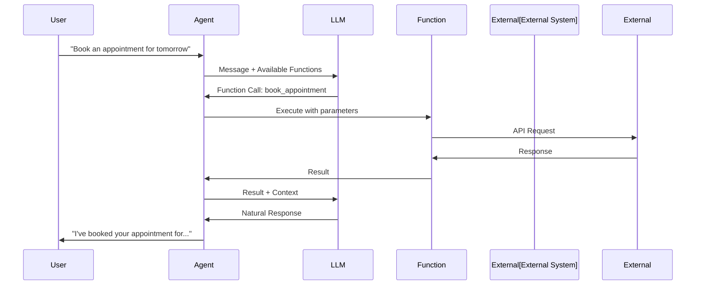

# Functions

Functions enable agents to take actions during conversations—booking appointments, looking up orders, transferring calls, and more. This guide covers function definition, execution, and best practices.

---

## How Functions Work



---

## Function Definition

### Basic Structure

```javascript
{
  name: 'get_order_status',
  description: 'Look up the status of a customer order',
  parameters: {
    type: 'object',
    properties: {
      orderId: {
        type: 'string',
        description: 'The order ID to look up'
      }
    },
    required: ['orderId']
  }
}
```

### Complete Example

```javascript
const agent = await vora.agents.create({
  name: 'Order Support',
  systemPrompt: 'You help customers with their orders...',
  functions: [
    {
      name: 'get_order_status',
      description: 'Look up the current status of an order by order ID',
      parameters: {
        type: 'object',
        properties: {
          orderId: {
            type: 'string',
            description: 'Order ID (e.g., ORD-12345)'
          }
        },
        required: ['orderId']
      },
      handler: {
        type: 'webhook',
        url: 'https://api.yoursite.com/orders/status',
        method: 'POST',
        headers: {
          'Authorization': 'Bearer {{ORDERS_API_KEY}}'
        }
      }
    },
    {
      name: 'initiate_return',
      description: 'Start a return process for an order',
      parameters: {
        type: 'object',
        properties: {
          orderId: {
            type: 'string',
            description: 'Order ID to return'
          },
          reason: {
            type: 'string',
            enum: ['defective', 'wrong_item', 'no_longer_needed', 'other'],
            description: 'Reason for return'
          },
          description: {
            type: 'string',
            description: 'Additional details about the return'
          }
        },
        required: ['orderId', 'reason']
      },
      handler: {
        type: 'webhook',
        url: 'https://api.yoursite.com/returns/create'
      }
    }
  ]
});
```

---

## Parameter Types

### Supported Types

| Type | Description | Example |
|------|-------------|---------|
| `string` | Text values | `"John Doe"` |
| `number` | Numeric values | `42`, `3.14` |
| `integer` | Whole numbers | `42` |
| `boolean` | True/false | `true` |
| `array` | List of items | `["a", "b"]` |
| `object` | Nested object | `{"key": "value"}` |

### String with Enum

```javascript
parameters: {
  type: 'object',
  properties: {
    priority: {
      type: 'string',
      enum: ['low', 'medium', 'high', 'urgent'],
      description: 'Ticket priority level'
    }
  }
}
```

### String with Format

```javascript
parameters: {
  type: 'object',
  properties: {
    email: {
      type: 'string',
      format: 'email',
      description: 'Customer email address'
    },
    appointmentDate: {
      type: 'string',
      format: 'date',
      description: 'Appointment date (YYYY-MM-DD)'
    },
    appointmentTime: {
      type: 'string',
      format: 'time',
      description: 'Appointment time (HH:MM)'
    }
  }
}
```

### Array Parameters

```javascript
parameters: {
  type: 'object',
  properties: {
    productIds: {
      type: 'array',
      items: {
        type: 'string'
      },
      description: 'List of product IDs to check'
    }
  }
}
```

### Nested Objects

```javascript
parameters: {
  type: 'object',
  properties: {
    customer: {
      type: 'object',
      properties: {
        name: { type: 'string' },
        email: { type: 'string', format: 'email' },
        phone: { type: 'string' }
      },
      required: ['name', 'email']
    }
  }
}
```

---

## Handler Types

### Webhook Handler

Execute a function by calling an external HTTP endpoint:

```javascript
handler: {
  type: 'webhook',
  url: 'https://api.yoursite.com/function-endpoint',
  method: 'POST',                    // POST, GET, PUT, DELETE
  headers: {
    'Authorization': 'Bearer {{API_KEY}}',
    'Content-Type': 'application/json'
  },
  timeout: 30000,                    // 30 second timeout
  retries: 2                         // Retry on failure
}
```

#### Request Format

```json
POST /function-endpoint
{
  "functionName": "get_order_status",
  "parameters": {
    "orderId": "ORD-12345"
  },
  "context": {
    "sessionId": "sess_abc123",
    "agentId": "agent_xyz789",
    "userId": "user_123"
  }
}
```

#### Response Format

```json
{
  "success": true,
  "result": {
    "orderId": "ORD-12345",
    "status": "shipped",
    "trackingNumber": "1Z999AA10123456784",
    "estimatedDelivery": "2024-01-20"
  }
}
```

### Built-in Handler

Use Vora's built-in functions:

```javascript
handler: {
  type: 'builtin',
  action: 'transfer_call',
  config: {
    destination: '+15551234567',
    message: 'Transferring you to a specialist...'
  }
}
```

Available built-in actions:
- `transfer_call` - Transfer to phone number
- `end_call` - End the conversation
- `send_sms` - Send SMS message
- `send_email` - Send email
- `kb_query` - Query knowledge base

---

## Function Execution

### Execution Flow

1. LLM decides to call a function
2. Vora validates parameters
3. Handler is executed
4. Result is returned to LLM
5. LLM generates response using result

### Handling Results

Your webhook should return structured results:

```javascript
// Success response
{
  "success": true,
  "result": {
    "orderId": "ORD-12345",
    "status": "delivered"
  }
}

// Error response
{
  "success": false,
  "error": {
    "code": "ORDER_NOT_FOUND",
    "message": "Order ORD-12345 was not found"
  }
}
```

### Streaming Results

For long-running functions, stream progress updates:

```javascript
// In your webhook handler
res.setHeader('Content-Type', 'text/event-stream');

// Send progress
res.write(`data: ${JSON.stringify({ progress: 'Looking up order...' })}\n\n`);

// ... do work ...

res.write(`data: ${JSON.stringify({ progress: 'Found order, checking status...' })}\n\n`);

// Final result
res.write(`data: ${JSON.stringify({ success: true, result: { ... } })}\n\n`);
res.end();
```

---

## Function Best Practices

### Writing Good Descriptions

<Tabs>
  <Tab title="Good">
    ```javascript
    {
      name: 'check_appointment_availability',
      description: 'Check available appointment slots for a specific date. Returns a list of available time slots. Use this before booking to show options to the customer.',
      parameters: {
        type: 'object',
        properties: {
          date: {
            type: 'string',
            format: 'date',
            description: 'The date to check availability (YYYY-MM-DD format)'
          },
          serviceType: {
            type: 'string',
            enum: ['consultation', 'followup', 'procedure'],
            description: 'Type of appointment to check'
          }
        },
        required: ['date', 'serviceType']
      }
    }
    ```
  </Tab>
  <Tab title="Bad">
    ```javascript
    {
      name: 'check',
      description: 'Check appointments',
      parameters: {
        type: 'object',
        properties: {
          d: { type: 'string' },
          t: { type: 'string' }
        }
      }
    }
    ```
  </Tab>
</Tabs>

### Confirmation Before Actions

For irreversible actions, require confirmation:

```javascript
{
  name: 'cancel_order',
  description: 'Permanently cancel an order. IMPORTANT: Always confirm with the customer before calling this function. Ask them to confirm the order ID.',
  parameters: {
    type: 'object',
    properties: {
      orderId: { type: 'string' },
      confirmationCode: {
        type: 'string',
        description: 'Customer must verbally confirm this code'
      }
    },
    required: ['orderId', 'confirmationCode']
  }
}
```

### Error Handling

Provide clear error messages:

```javascript
// In your webhook handler
try {
  const order = await getOrder(orderId);

  if (!order) {
    return res.json({
      success: false,
      error: {
        code: 'ORDER_NOT_FOUND',
        message: `Order ${orderId} was not found. Please verify the order ID and try again.`,
        suggestion: 'Ask the customer to check their confirmation email for the correct order ID.'
      }
    });
  }

  return res.json({ success: true, result: order });
} catch (error) {
  return res.json({
    success: false,
    error: {
      code: 'INTERNAL_ERROR',
      message: 'Unable to look up order at this time. Please try again in a moment.'
    }
  });
}
```

---

## Testing Functions

### In Dashboard

1. Go to **Agent** → **Functions**
2. Click **Test** next to any function
3. Enter test parameters
4. View request/response

### Via API

```javascript
const result = await vora.functions.test({
  agentId: 'agent_abc123',
  functionName: 'get_order_status',
  parameters: {
    orderId: 'ORD-12345'
  }
});

console.log(result);
// { success: true, result: { ... }, latency: 245 }
```

### Mock Mode

Test without calling real endpoints:

```javascript
const session = await vora.sessions.create({
  agentId: 'agent_abc123',
  debug: {
    mockFunctions: {
      get_order_status: {
        success: true,
        result: { status: 'shipped', tracking: '1Z999...' }
      }
    }
  }
});
```

---

## Function Templates

Common function patterns you can copy:

### Order Lookup

```javascript
{
  name: 'get_order_status',
  description: 'Look up order status by order ID or email',
  parameters: {
    type: 'object',
    properties: {
      orderId: { type: 'string', description: 'Order ID (e.g., ORD-12345)' },
      email: { type: 'string', format: 'email', description: 'Customer email (alternative lookup)' }
    }
  },
  handler: { type: 'webhook', url: '{{ORDER_API}}/status' }
}
```

### Appointment Booking

```javascript
{
  name: 'book_appointment',
  description: 'Book an appointment for a customer',
  parameters: {
    type: 'object',
    properties: {
      date: { type: 'string', format: 'date' },
      time: { type: 'string', format: 'time' },
      serviceType: { type: 'string', enum: ['consultation', 'followup'] },
      customerName: { type: 'string' },
      customerEmail: { type: 'string', format: 'email' },
      customerPhone: { type: 'string' },
      notes: { type: 'string' }
    },
    required: ['date', 'time', 'serviceType', 'customerName', 'customerEmail']
  },
  handler: { type: 'webhook', url: '{{CALENDAR_API}}/book' }
}
```

### Transfer Call

```javascript
{
  name: 'transfer_to_human',
  description: 'Transfer the call to a human agent. Use when customer requests it or issue requires human assistance.',
  parameters: {
    type: 'object',
    properties: {
      department: {
        type: 'string',
        enum: ['sales', 'support', 'billing', 'technical'],
        description: 'Department to transfer to'
      },
      context: {
        type: 'string',
        description: 'Summary of conversation to pass to human agent'
      }
    },
    required: ['department']
  },
  handler: {
    type: 'builtin',
    action: 'transfer_call'
  }
}
```

---

## Next Steps

<CardGroup cols={2}>
  <Card title="Knowledge Base" icon="book" href="/developers/concepts/knowledge-base">
    Add context with RAG
  </Card>
  <Card title="Webhooks" icon="webhook" href="/developers/webhooks">
    Receive function events
  </Card>
</CardGroup>
