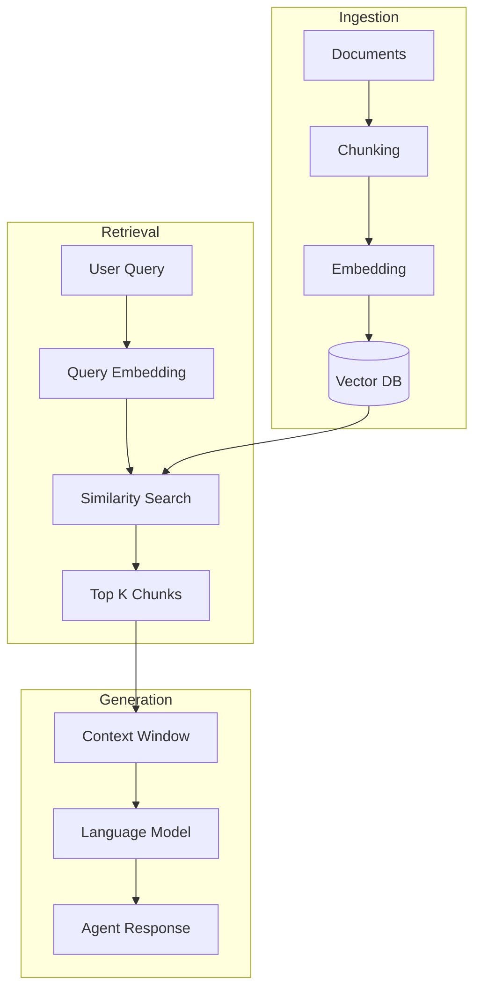

# Knowledge Base

The Knowledge Base gives agents access to your documents, FAQs, and product information through Retrieval-Augmented Generation (RAG). This guide covers the architecture, configuration, and optimization of knowledge-powered agents.

---

## How RAG Works



---

## Knowledge Base Architecture

### Components

| Component | Purpose |
|-----------|---------|
| **Document Processor** | Chunks and prepares documents |
| **Embedding Model** | Converts text to vectors |
| **Vector Database** | Stores and searches embeddings |
| **Retriever** | Finds relevant chunks |
| **Reranker** | Improves result relevance |

### Supported Sources

| Source | Description |
|--------|-------------|
| **Documents** | PDF, DOCX, TXT, MD files |
| **URLs** | Web pages, documentation sites |
| **Text** | Direct text input |
| **APIs** | Custom data sources via API |

---

## Creating a Knowledge Base

### Via Dashboard

1. Go to **Knowledge Base** → **Create**
2. Name your knowledge base
3. Upload documents or add URLs
4. Wait for processing
5. Connect to agent

### Via API

```javascript
// Create knowledge base
const kb = await vora.knowledgeBases.create({
  name: 'Product Documentation',
  description: 'Product manuals and FAQs'
});

// Add documents
await vora.knowledgeBases.addDocuments(kb.id, {
  documents: [
    {
      name: 'Product Manual',
      content: fs.readFileSync('manual.pdf'),
      type: 'pdf'
    },
    {
      name: 'FAQ',
      type: 'url',
      url: 'https://docs.yoursite.com/faq'
    }
  ]
});

// Connect to agent
await vora.agents.update(agentId, {
  knowledgeBase: {
    id: kb.id,
    enabled: true
  }
});
```

---

## Document Processing

### Chunking Strategies

| Strategy | Best For |
|----------|----------|
| **Semantic** | General documents (default) |
| **Paragraph** | Well-structured docs |
| **Sentence** | FAQs, short answers |
| **Fixed Size** | Long-form content |

```javascript
const kb = await vora.knowledgeBases.create({
  name: 'Documentation',
  chunking: {
    strategy: 'semantic',
    maxChunkSize: 1000,      // Max tokens per chunk
    overlap: 200,            // Overlap between chunks
    minChunkSize: 100        // Minimum chunk size
  }
});
```

### Metadata Extraction

```javascript
await vora.knowledgeBases.addDocuments(kb.id, {
  documents: [{
    name: 'Product Guide',
    content: pdfBuffer,
    metadata: {
      category: 'products',
      product: 'Widget Pro',
      version: '2.0',
      audience: 'customers'
    }
  }]
});
```

---

## Retrieval Configuration

### Basic Configuration

```javascript
await vora.agents.update(agentId, {
  knowledgeBase: {
    id: kb.id,
    enabled: true,
    topK: 5,                 // Number of chunks to retrieve
    threshold: 0.7,          // Minimum similarity score
    rerank: true             // Enable reranking
  }
});
```

### Advanced Options

```javascript
await vora.agents.update(agentId, {
  knowledgeBase: {
    id: kb.id,
    enabled: true,
    retrieval: {
      topK: 10,              // Initial retrieval count
      threshold: 0.6,
      rerank: {
        enabled: true,
        model: 'cross-encoder',
        topN: 5              // Final chunks after reranking
      },
      filters: {
        category: 'products',
        version: '2.0'
      },
      hybridSearch: {
        enabled: true,
        alpha: 0.7           // Blend semantic (1.0) vs keyword (0.0)
      }
    }
  }
});
```

---

## Search Types

### Semantic Search (Default)

Uses embeddings to find conceptually similar content:

```javascript
// User asks: "How do I reset my password?"
// Retrieves: Content about password recovery, even if words differ
```

### Keyword Search

Exact matching for specific terms:

```javascript
retrieval: {
  hybridSearch: {
    enabled: true,
    alpha: 0.0  // Pure keyword search
  }
}
```

### Hybrid Search

Combines semantic and keyword search:

```javascript
retrieval: {
  hybridSearch: {
    enabled: true,
    alpha: 0.7  // 70% semantic, 30% keyword
  }
}
```

---

## Context Window Management

### How Context is Injected

```javascript
// System prompt with knowledge context
`${systemPrompt}

## Relevant Information
${retrievedChunks.map(c => c.content).join('\n\n')}

## Instructions
Use the above information to answer user questions. If the information doesn't contain the answer, say so.`
```

### Controlling Context Size

```javascript
knowledgeBase: {
  id: kb.id,
  maxContextTokens: 2000,    // Max tokens for KB context
  summarize: {
    enabled: true,           // Summarize if too long
    threshold: 3000          // Trigger summarization at this token count
  }
}
```

---

## Query Understanding

### Automatic Query Enhancement

Vora automatically enhances user queries:

```
User: "How much is shipping?"
Enhanced: "What are the shipping costs and delivery fees?"
```

### Custom Query Templates

```javascript
knowledgeBase: {
  id: kb.id,
  queryTemplate: `Find information about: {{query}}
    Focus on: pricing, policies, procedures
    Exclude: marketing content, outdated information`
}
```

---

## Document Updates

### Updating Content

```javascript
// Replace document
await vora.knowledgeBases.updateDocument(kb.id, docId, {
  content: newContent,
  reprocess: true  // Re-chunk and re-embed
});

// Update metadata only
await vora.knowledgeBases.updateDocument(kb.id, docId, {
  metadata: { version: '2.1' }
});
```

### Syncing from URLs

```javascript
// Set up automatic sync
await vora.knowledgeBases.setSyncSchedule(kb.id, {
  sourceId: 'src_abc123',  // URL source
  schedule: 'daily',
  time: '03:00',
  timezone: 'UTC'
});
```

---

## Performance Optimization

### Indexing Best Practices

<AccordionGroup>
  <Accordion title="Use appropriate chunk sizes">
    - **FAQ/Support**: 200-500 tokens (specific answers)
    - **Documentation**: 500-1000 tokens (context)
    - **Long-form**: 1000-2000 tokens (narrative)
  </Accordion>

  <Accordion title="Add relevant metadata">
    Metadata enables filtering and improves relevance:
    ```javascript
    metadata: {
      category: 'billing',
      productLine: 'enterprise',
      lastUpdated: '2024-01-15'
    }
    ```
  </Accordion>

  <Accordion title="Enable reranking">
    Reranking significantly improves result quality for complex queries.
  </Accordion>

  <Accordion title="Use hybrid search for technical content">
    Technical documentation often benefits from keyword matching combined with semantic search.
  </Accordion>
</AccordionGroup>

### Query Optimization

<AccordionGroup>
  <Accordion title="Pre-filter when possible">
    Use metadata filters to reduce search space:
    ```javascript
    filters: {
      category: session.context.topic,
      audience: 'customers'
    }
    ```
  </Accordion>

  <Accordion title="Adjust threshold based on use case">
    - High threshold (0.8+): Precise answers, fewer results
    - Low threshold (0.5-0.7): Broader results, more recall
  </Accordion>

  <Accordion title="Monitor retrieval quality">
    Review session transcripts to identify missed or irrelevant retrievals.
  </Accordion>
</AccordionGroup>

---

## Analytics

### Knowledge Base Metrics

| Metric | Description |
|--------|-------------|
| **Retrieval Rate** | % of queries that retrieve content |
| **Relevance Score** | Average similarity score |
| **Coverage** | % of documents accessed |
| **Response Quality** | User satisfaction with KB-powered responses |

### Accessing Metrics

```javascript
const metrics = await vora.knowledgeBases.getMetrics(kb.id, {
  period: 'last_7_days'
});

console.log(metrics);
// {
//   retrievalRate: 0.85,
//   avgRelevanceScore: 0.78,
//   documentCoverage: 0.62,
//   totalQueries: 1250,
//   topDocuments: [...]
// }
```

---

## Troubleshooting

### Common Issues

| Issue | Cause | Solution |
|-------|-------|----------|
| Low relevance | Poor chunking | Adjust chunk size/overlap |
| Missing answers | Content not indexed | Check document processing |
| Wrong context | Broad query | Add filters, use hybrid search |
| Slow retrieval | Large index | Enable caching, pre-filter |

### Testing Retrieval

```javascript
// Test query without agent
const results = await vora.knowledgeBases.query(kb.id, {
  query: 'What is the return policy?',
  topK: 5
});

console.log(results);
// [
//   { content: '...', score: 0.92, document: 'Return Policy.pdf' },
//   { content: '...', score: 0.85, document: 'FAQ.md' },
//   ...
// ]
```

---

## Next Steps

<CardGroup cols={2}>
  <Card title="Deployments" icon="rocket" href="/developers/concepts/deployments">
    Deploy agents to channels
  </Card>
  <Card title="Knowledge Base API" icon="code" href="/api/knowledge-base">
    API reference
  </Card>
</CardGroup>
