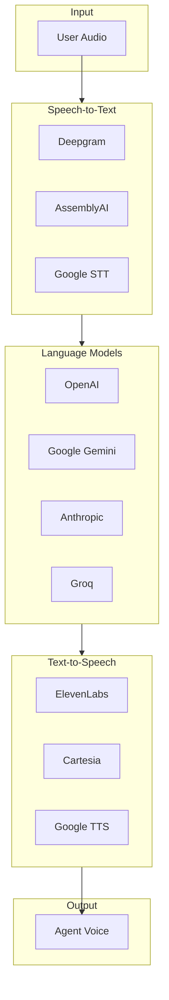

# Providers

Vora integrates with multiple AI providers for language models (LLM), speech-to-text (STT), and text-to-speech (TTS). This guide covers provider configuration, fallbacks, and best practices.

---

## Provider Architecture



---

## Provider Configuration

### Default Configuration

```javascript
const agent = await vora.agents.create({
  name: 'My Agent',
  systemPrompt: '...',
  providers: {
    stt: {
      provider: 'deepgram',
      model: 'nova-2'
    },
    llm: {
      provider: 'openai',
      model: 'gpt-4-turbo',
      temperature: 0.7
    },
    tts: {
      provider: 'elevenlabs',
      voiceId: 'EXAVITQu4vr4xnSDxMaL'
    }
  }
});
```

### Per-Session Override

```javascript
const session = await vora.sessions.create({
  agentId: 'agent_abc123',
  providers: {
    llm: {
      model: 'gpt-4o'  // Override for this session
    }
  }
});
```

---

## Language Models (LLM)

### Available Providers

| Provider | Models | Best For |
|----------|--------|----------|
| **OpenAI** | GPT-4 Turbo, GPT-4o, GPT-3.5 | General purpose, function calling |
| **Google** | Gemini Pro, Gemini Flash | Long context, speed |
| **Anthropic** | Claude 3 Opus, Sonnet, Haiku | Nuanced conversations |
| **Groq** | Llama 3, Mixtral | Low latency |
| **Mistral** | Mistral Large, Medium | European data residency |

### OpenAI Configuration

```javascript
llm: {
  provider: 'openai',
  model: 'gpt-4-turbo',      // or 'gpt-4o', 'gpt-3.5-turbo'
  temperature: 0.7,           // 0.0-2.0
  maxTokens: 1024,            // Max response length
  topP: 1.0,                  // Nucleus sampling
  frequencyPenalty: 0.0,      // Reduce repetition
  presencePenalty: 0.0        // Encourage new topics
}
```

### Google Gemini Configuration

```javascript
llm: {
  provider: 'google',
  model: 'gemini-1.5-pro',   // or 'gemini-1.5-flash'
  temperature: 0.7,
  maxOutputTokens: 1024,
  topP: 0.95,
  topK: 40
}
```

### Anthropic Claude Configuration

```javascript
llm: {
  provider: 'anthropic',
  model: 'claude-3-sonnet',   // or 'claude-3-opus', 'claude-3-haiku'
  temperature: 0.7,
  maxTokens: 1024
}
```

### Groq Configuration

```javascript
llm: {
  provider: 'groq',
  model: 'llama-3.1-70b-versatile',  // or 'mixtral-8x7b-32768'
  temperature: 0.7,
  maxTokens: 1024
}
```

---

## Speech-to-Text (STT)

### Available Providers

| Provider | Models | Best For |
|----------|--------|----------|
| **Deepgram** | Nova-2, Enhanced | Real-time, accuracy |
| **AssemblyAI** | Universal | Multi-language |
| **Google** | Cloud STT | Enterprise, 125 languages |
| **Soniox** | Soniox | Low latency |

### Deepgram Configuration

```javascript
stt: {
  provider: 'deepgram',
  model: 'nova-2',           // or 'enhanced', 'base'
  language: 'en-US',         // BCP-47 code
  punctuate: true,           // Add punctuation
  profanityFilter: false,    // Filter profanity
  diarize: false,            // Speaker separation
  smartFormat: true          // Format numbers, dates
}
```

### AssemblyAI Configuration

```javascript
stt: {
  provider: 'assemblyai',
  languageCode: 'en',
  punctuate: true,
  formatText: true
}
```

### Google Cloud STT Configuration

```javascript
stt: {
  provider: 'google',
  languageCode: 'en-US',
  model: 'latest_long',       // or 'command_and_search', 'phone_call'
  useEnhanced: true,
  enableAutomaticPunctuation: true
}
```

---

## Text-to-Speech (TTS)

### Available Providers

| Provider | Voices | Best For |
|----------|--------|----------|
| **ElevenLabs** | 100+ | Natural voices, cloning |
| **Cartesia** | 50+ | Low latency |
| **Google** | 300+ | Multi-language, SSML |

### ElevenLabs Configuration

```javascript
tts: {
  provider: 'elevenlabs',
  voiceId: 'EXAVITQu4vr4xnSDxMaL',  // Sarah
  model: 'eleven_turbo_v2',          // or 'eleven_multilingual_v2'
  stability: 0.5,                    // 0.0-1.0
  similarityBoost: 0.75,             // 0.0-1.0
  style: 0.5,                        // 0.0-1.0 (style exaggeration)
  useSpeakerBoost: true
}
```

### Cartesia Configuration

```javascript
tts: {
  provider: 'cartesia',
  voiceId: 'a0e99841-438c-4a64-b679-ae501e7d6091',
  language: 'en',
  speed: 1.0                         // 0.5-2.0
}
```

### Google Cloud TTS Configuration

```javascript
tts: {
  provider: 'google',
  languageCode: 'en-US',
  voiceName: 'en-US-Neural2-C',
  speakingRate: 1.0,                 // 0.25-4.0
  pitch: 0.0,                        // -20.0 to 20.0
  volumeGainDb: 0.0                  // -96.0 to 16.0
}
```

---

## Fallback Strategies

Configure automatic fallback when providers fail:

### Simple Fallback

```javascript
providers: {
  llm: {
    provider: 'openai',
    model: 'gpt-4-turbo',
    fallback: {
      provider: 'groq',
      model: 'llama-3.1-70b-versatile'
    }
  }
}
```

### Cascading Fallback

```javascript
providers: {
  llm: {
    provider: 'openai',
    model: 'gpt-4-turbo',
    fallbacks: [
      { provider: 'anthropic', model: 'claude-3-sonnet' },
      { provider: 'groq', model: 'llama-3.1-70b-versatile' }
    ]
  }
}
```

### Fallback Triggers

| Trigger | Description |
|---------|-------------|
| `rate_limit` | Provider rate limit exceeded |
| `timeout` | Request timeout (10s default) |
| `error` | Provider returned error |
| `unavailable` | Provider service down |

```javascript
providers: {
  llm: {
    provider: 'openai',
    model: 'gpt-4-turbo',
    fallback: {
      provider: 'groq',
      model: 'llama-3.1-70b-versatile',
      triggers: ['rate_limit', 'timeout']  // Only for these errors
    }
  }
}
```

---

## Custom Provider Keys

Use your own API keys instead of Vora's:

### In Dashboard

1. Go to **Settings** → **Provider Keys**
2. Add your API keys for each provider
3. Enable "Use custom keys" on agents

### In API

```javascript
const agent = await vora.agents.create({
  name: 'My Agent',
  systemPrompt: '...',
  providers: {
    llm: {
      provider: 'openai',
      model: 'gpt-4-turbo',
      apiKey: 'sk-your-key-here'  // Your OpenAI key
    }
  }
});
```

<Warning>
  When using custom keys, you're responsible for usage and costs. Ensure keys have appropriate permissions and rate limits.
</Warning>

---

## Provider Selection Guide

### By Use Case

| Use Case | Recommended Stack |
|----------|-------------------|
| **Customer Support** | Deepgram Nova-2 + GPT-4 Turbo + ElevenLabs |
| **Low Latency** | Soniox + Groq Llama + Cartesia |
| **Multi-language** | AssemblyAI + Gemini Pro + Google TTS |
| **Cost Sensitive** | Deepgram Base + GPT-3.5 + Google TTS |
| **Enterprise** | Google STT + Claude 3 + ElevenLabs |

### By Latency

| Stack | Approximate Latency |
|-------|---------------------|
| Soniox + Groq + Cartesia | ~400ms |
| Deepgram + Gemini Flash + Cartesia | ~500ms |
| Deepgram + GPT-4 Turbo + ElevenLabs | ~800ms |
| AssemblyAI + Claude 3 Opus + ElevenLabs | ~1200ms |

### By Cost

| Stack | Relative Cost |
|-------|---------------|
| Google STT + Gemini Flash + Google TTS | $ |
| Deepgram + GPT-3.5 + Cartesia | $$ |
| Deepgram + GPT-4 Turbo + ElevenLabs | $$$ |
| Multiple providers + Claude 3 Opus + ElevenLabs | $$$$ |

---

## Monitoring Provider Health

### Check Provider Status

```javascript
const health = await vora.providers.health();

console.log(health);
// {
//   llm: {
//     openai: { status: 'healthy', latency: 450 },
//     anthropic: { status: 'healthy', latency: 520 },
//     groq: { status: 'degraded', latency: 1200 }
//   },
//   stt: { ... },
//   tts: { ... }
// }
```

### Provider Metrics

Available in the Analytics dashboard:

- Request latency (p50, p95, p99)
- Error rates by provider
- Token usage
- Cost breakdown

---

## Best Practices

<AccordionGroup>
  <Accordion title="Always configure fallbacks">
    No provider has 100% uptime. Configure fallbacks for critical applications to ensure continuity.
  </Accordion>

  <Accordion title="Match provider to use case">
    Use faster, cheaper providers for simple queries. Reserve expensive providers for complex conversations.
  </Accordion>

  <Accordion title="Monitor latency">
    Voice applications are sensitive to latency. Monitor provider performance and switch if latency increases.
  </Accordion>

  <Accordion title="Test with real conversations">
    Different providers perform differently on various topics. Test with realistic scenarios before deploying.
  </Accordion>

  <Accordion title="Consider data residency">
    For European customers, consider providers with EU data centers (Google Cloud, Mistral).
  </Accordion>
</AccordionGroup>

---

## Next Steps

<CardGroup cols={2}>
  <Card title="Functions" icon="function" href="/developers/concepts/functions">
    Add actions to your agent
  </Card>
  <Card title="Provider Comparison" icon="scale-balanced" href="/providers">
    Detailed provider comparison
  </Card>
</CardGroup>
