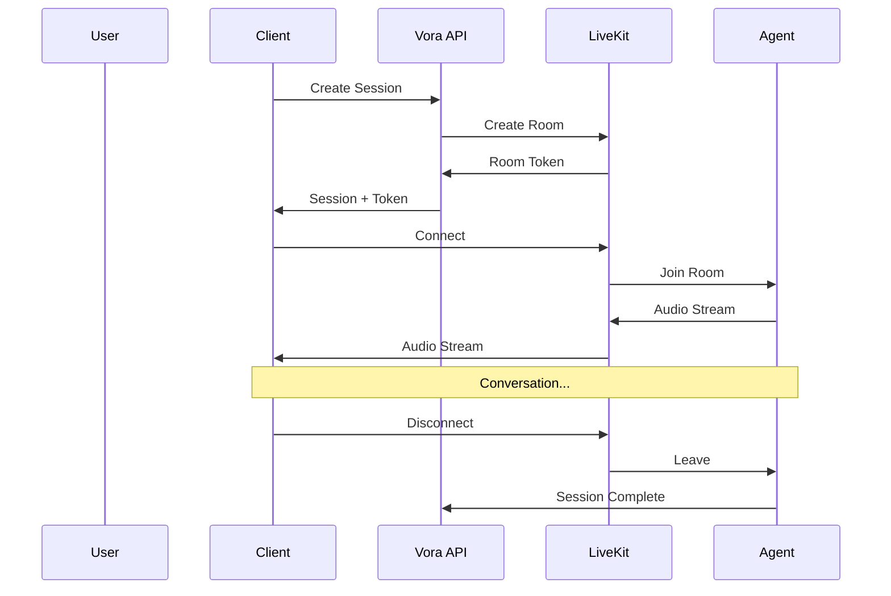
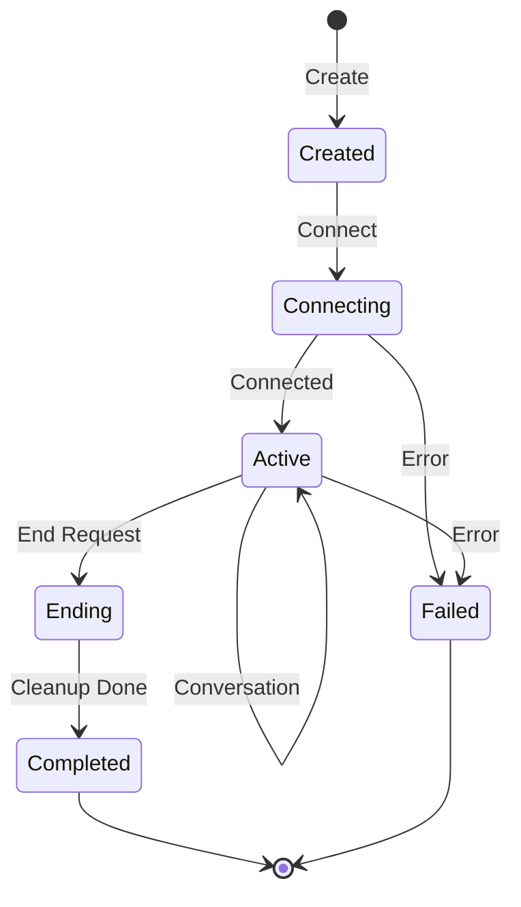

# Sessions

A session represents a single voice conversation between a user and an agent. This guide covers the session lifecycle, connection handling, and state management.

---

## Session Overview



---

## Session States

Sessions transition through these states:



| State | Description |
|-------|-------------|
| **Created** | Session initialized, waiting for connection |
| **Connecting** | Client connecting to LiveKit room |
| **Active** | Conversation in progress |
| **Ending** | Cleanup in progress |
| **Completed** | Session ended successfully |
| **Failed** | Session ended with error |

---

## Creating a Session

### Basic Session

<Tabs>
  <Tab title="JavaScript">
    ```javascript
    const session = await vora.sessions.create({
      agentId: 'agent_abc123'
    });

    console.log(session);
    // {
    //   id: 'sess_xyz789',
    //   agentId: 'agent_abc123',
    //   token: 'eyJ...',
    //   roomUrl: 'wss://livekit.vora.ai',
    //   status: 'created',
    //   expiresAt: '2024-01-15T10:45:00Z'
    // }
    ```
  </Tab>
  <Tab title="Python">
    ```python
    session = await vora.sessions.create(
        agent_id="agent_abc123"
    )

    print(session)
    # Session(
    #   id='sess_xyz789',
    #   agent_id='agent_abc123',
    #   token='eyJ...',
    #   room_url='wss://livekit.vora.ai',
    #   status='created',
    #   expires_at=datetime(...)
    # )
    ```
  </Tab>
</Tabs>

### Session with User Context

```javascript
const session = await vora.sessions.create({
  agentId: 'agent_abc123',
  userId: 'user_123',           // Your user ID
  metadata: {                   // Custom metadata
    source: 'mobile_app',
    orderId: 'order_456'
  },
  variables: {                  // Variables for agent prompt
    customerName: 'John',
    accountTier: 'premium'
  }
});
```

### Session with Initial Message

```javascript
const session = await vora.sessions.create({
  agentId: 'agent_abc123',
  initialMessage: 'Hello! How can I help you today?',  // Agent speaks first
  skipGreeting: false                                   // Use default greeting
});
```

---

## Connecting to a Session

### Using LiveKit Client

```javascript
import { Room, RoomEvent } from 'livekit-client';

const room = new Room();

// Set up event handlers
room.on(RoomEvent.Connected, () => {
  console.log('Connected to session');
});

room.on(RoomEvent.Disconnected, (reason) => {
  console.log('Disconnected:', reason);
});

room.on(RoomEvent.TrackSubscribed, (track, publication, participant) => {
  if (track.kind === 'audio') {
    // Attach audio to DOM
    const element = track.attach();
    document.body.appendChild(element);
  }
});

// Connect
await room.connect(session.roomUrl, session.token);

// Publish microphone
await room.localParticipant.setMicrophoneEnabled(true);
```

### Using React Components

```jsx
import { LiveKitRoom, AudioRenderer } from '@livekit/components-react';

function VoiceSession({ session }) {
  return (
    <LiveKitRoom
      token={session.token}
      serverUrl={session.roomUrl}
      connect={true}
    >
      <AudioRenderer />
      <MicrophoneControl />
    </LiveKitRoom>
  );
}
```

---

## Session Events

Monitor session state through events:

### Client-Side Events

```javascript
room.on(RoomEvent.ParticipantConnected, (participant) => {
  if (participant.identity.startsWith('agent_')) {
    console.log('Agent joined');
  }
});

room.on(RoomEvent.DataReceived, (data, participant) => {
  const event = JSON.parse(new TextDecoder().decode(data));

  switch (event.type) {
    case 'transcript':
      console.log('Transcript:', event.text);
      break;
    case 'function_call':
      console.log('Function called:', event.name);
      break;
    case 'agent_thinking':
      console.log('Agent is thinking...');
      break;
  }
});
```

### Webhook Events

Configure webhooks to receive server-side events:

| Event | Description |
|-------|-------------|
| `session.started` | Session connected |
| `session.ended` | Session completed |
| `session.transcript` | Transcript available |
| `session.function_called` | Function executed |
| `session.error` | Error occurred |

See [Webhooks](/developers/webhooks) for setup details.

---

## Session Transcripts

Access conversation transcripts:

### Real-Time Transcript

```javascript
room.on(RoomEvent.DataReceived, (data) => {
  const message = JSON.parse(new TextDecoder().decode(data));

  if (message.type === 'transcript') {
    console.log(`${message.speaker}: ${message.text}`);
    // agent: Hello! How can I help you?
    // user: I need to check my order status.
  }
});
```

### Fetch Complete Transcript

```javascript
// After session ends
const transcript = await vora.sessions.getTranscript(sessionId);

console.log(transcript);
// {
//   sessionId: 'sess_xyz789',
//   messages: [
//     { speaker: 'agent', text: 'Hello!...', timestamp: '...' },
//     { speaker: 'user', text: 'I need...', timestamp: '...' }
//   ],
//   duration: 180,
//   wordCount: 245
// }
```

---

## Session Recordings

Access audio recordings (if enabled):

```javascript
// Check if recording is available
const session = await vora.sessions.get(sessionId);

if (session.recordingUrl) {
  const recording = await vora.sessions.getRecording(sessionId);

  console.log(recording);
  // {
  //   url: 'https://...',
  //   duration: 180,
  //   format: 'mp3',
  //   expiresAt: '...'
  // }
}
```

---

## Ending a Session

### Client-Initiated End

```javascript
// Disconnect from room
await room.disconnect();

// Session automatically ends when both parties leave
```

### Server-Initiated End

```javascript
// Force end a session
await vora.sessions.end(sessionId, {
  reason: 'timeout',
  message: 'Session timed out after 30 minutes of inactivity'
});
```

### Graceful Handoff

```javascript
// Transfer to human
room.localParticipant.publishData(
  new TextEncoder().encode(JSON.stringify({
    type: 'transfer_request',
    reason: 'customer_request',
    context: 'Customer needs help with billing dispute'
  })),
  { reliable: true }
);
```

---

## Session Metadata

### Setting Metadata

```javascript
// At creation
const session = await vora.sessions.create({
  agentId: 'agent_abc123',
  metadata: {
    source: 'web_widget',
    page: '/pricing',
    experiment: 'new_greeting_v2'
  }
});

// During session
await vora.sessions.update(sessionId, {
  metadata: {
    outcome: 'resolved',
    satisfaction: 5
  }
});
```

### Reading Metadata

```javascript
const session = await vora.sessions.get(sessionId);

console.log(session.metadata);
// { source: 'web_widget', outcome: 'resolved', ... }
```

---

## Session Variables

Variables are injected into the agent's context:

```javascript
const session = await vora.sessions.create({
  agentId: 'agent_abc123',
  variables: {
    customerName: 'John Smith',
    accountId: 'acc_123',
    recentOrders: ['order_1', 'order_2']
  }
});
```

The agent can reference these in responses:

```
System Prompt:
You are helping {{customerName}} with their account {{accountId}}.
Their recent orders are: {{recentOrders}}.
```

---

## Error Handling

### Connection Errors

```javascript
room.on(RoomEvent.Disconnected, (reason) => {
  switch (reason) {
    case 'client_initiated':
      // Normal disconnect
      break;
    case 'room_deleted':
      // Session ended by server
      break;
    case 'participant_removed':
      // Kicked from session
      break;
    default:
      // Unexpected disconnect - attempt reconnect
      reconnect();
  }
});

async function reconnect() {
  for (let i = 0; i < 3; i++) {
    try {
      await room.connect(session.roomUrl, session.token);
      return;
    } catch (error) {
      await sleep(1000 * (i + 1));
    }
  }
  // Reconnection failed
  showError('Connection lost. Please refresh to try again.');
}
```

### Session Errors

```javascript
room.on(RoomEvent.DataReceived, (data) => {
  const message = JSON.parse(new TextDecoder().decode(data));

  if (message.type === 'error') {
    console.error('Session error:', message.error);
    // { code: 'PROVIDER_ERROR', message: 'LLM rate limit exceeded' }
  }
});
```

---

## Best Practices

<AccordionGroup>
  <Accordion title="Handle disconnections gracefully">
    Implement reconnection logic with exponential backoff. Show users a clear status during reconnection attempts.
  </Accordion>

  <Accordion title="Use metadata for analytics">
    Store relevant context (source, user segment, experiment) in metadata for post-session analysis.
  </Accordion>

  <Accordion title="Set reasonable timeouts">
    Configure session timeouts to prevent idle sessions from consuming resources.
  </Accordion>

  <Accordion title="Clean up resources">
    Ensure audio elements are detached and room connections are closed when sessions end.
  </Accordion>
</AccordionGroup>

---

## Next Steps

<CardGroup cols={2}>
  <Card title="Providers" icon="plug" href="/developers/concepts/providers">
    Configure LLM, STT, and TTS
  </Card>
  <Card title="Functions" icon="function" href="/developers/concepts/functions">
    Add actions to conversations
  </Card>
</CardGroup>
