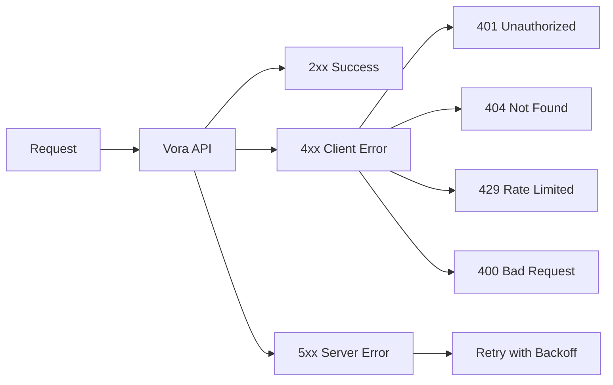

# Error Handling

Robust error handling ensures your voice application remains reliable. This guide covers error types, handling strategies, and recovery patterns for Vora integrations.

---

## Error Types

### API Errors

Errors returned by the Vora REST API:



| Status | Error Type | Description | Action |
|--------|-----------|-------------|--------|
| `400` | `VALIDATION_ERROR` | Invalid request parameters | Fix request |
| `401` | `AUTHENTICATION_ERROR` | Invalid API key | Check credentials |
| `403` | `AUTHORIZATION_ERROR` | Insufficient permissions | Check access |
| `404` | `NOT_FOUND` | Resource doesn't exist | Verify ID |
| `429` | `RATE_LIMIT_ERROR` | Too many requests | Slow down |
| `500` | `INTERNAL_ERROR` | Server error | Retry later |
| `503` | `SERVICE_UNAVAILABLE` | Service down | Retry later |

### Voice Session Errors

Errors during live voice sessions:

| Error | Cause | User Experience |
|-------|-------|-----------------|
| `CONNECTION_FAILED` | Network issue | "Connection failed" |
| `ROOM_NOT_FOUND` | Invalid session | "Session expired" |
| `TOKEN_EXPIRED` | Session timeout | "Please refresh" |
| `PROVIDER_ERROR` | STT/TTS failure | Agent silent |
| `LLM_ERROR` | Model error | Agent unresponsive |
| `FUNCTION_ERROR` | Handler failed | Graceful fallback |

### SDK Errors

Errors from SDK operations:

```typescript
import {
  VoraError,
  AuthenticationError,
  RateLimitError,
  ValidationError,
  NotFoundError,
  ConnectionError
} from '@vora-ai/sdk';
```

---

## API Error Response Format

All API errors follow this structure:

```json
{
  "error": {
    "type": "VALIDATION_ERROR",
    "code": "INVALID_AGENT_CONFIG",
    "message": "Voice provider 'invalid' is not supported",
    "details": {
      "field": "voice.provider",
      "value": "invalid",
      "allowed": ["elevenlabs", "cartesia", "google"]
    },
    "requestId": "req_abc123",
    "docUrl": "https://docs.vora.ai/errors/INVALID_AGENT_CONFIG"
  }
}
```

| Field | Description |
|-------|-------------|
| `type` | Error category |
| `code` | Specific error code |
| `message` | Human-readable description |
| `details` | Additional context |
| `requestId` | For support reference |
| `docUrl` | Documentation link |

---

## JavaScript/TypeScript Error Handling

### Basic Try-Catch

```typescript
import { VoraClient, VoraError, RateLimitError } from '@vora-ai/sdk';

const vora = new VoraClient({ apiKey: process.env.VORA_API_KEY });

async function createAgent(config) {
  try {
    const agent = await vora.agents.create(config);
    return agent;
  } catch (error) {
    if (error instanceof RateLimitError) {
      console.log(`Rate limited. Retry after ${error.retryAfter}s`);
      await sleep(error.retryAfter * 1000);
      return createAgent(config);  // Retry
    }

    if (error instanceof VoraError) {
      console.error('Vora error:', error.code, error.message);
      throw error;
    }

    console.error('Unexpected error:', error);
    throw error;
  }
}
```

### Comprehensive Handler

```typescript
import {
  VoraError,
  AuthenticationError,
  RateLimitError,
  ValidationError,
  NotFoundError,
  InternalError
} from '@vora-ai/sdk';

async function handleVoraOperation<T>(
  operation: () => Promise<T>,
  options: {
    maxRetries?: number;
    onRetry?: (attempt: number, error: Error) => void;
  } = {}
): Promise<T> {
  const { maxRetries = 3, onRetry } = options;

  for (let attempt = 1; attempt <= maxRetries; attempt++) {
    try {
      return await operation();
    } catch (error) {
      // Auth errors - don't retry
      if (error instanceof AuthenticationError) {
        throw new Error('Invalid API key. Please check your configuration.');
      }

      // Validation errors - don't retry
      if (error instanceof ValidationError) {
        console.error('Validation error:', error.details);
        throw error;
      }

      // Not found - don't retry
      if (error instanceof NotFoundError) {
        throw error;
      }

      // Rate limit - wait and retry
      if (error instanceof RateLimitError) {
        const delay = error.retryAfter || Math.pow(2, attempt);
        onRetry?.(attempt, error);
        await sleep(delay * 1000);
        continue;
      }

      // Server errors - retry with backoff
      if (error instanceof InternalError) {
        if (attempt < maxRetries) {
          const delay = Math.pow(2, attempt) * 1000;
          onRetry?.(attempt, error);
          await sleep(delay);
          continue;
        }
      }

      throw error;
    }
  }

  throw new Error('Max retries exceeded');
}

// Usage
const agent = await handleVoraOperation(
  () => vora.agents.create({ name: 'Test', systemPrompt: '...' }),
  {
    maxRetries: 3,
    onRetry: (attempt, error) => {
      console.log(`Retry ${attempt}: ${error.message}`);
    }
  }
);
```

### Voice Session Errors

```typescript
import { Room, RoomEvent, DisconnectReason } from 'livekit-client';

function setupErrorHandling(room: Room) {
  // Connection errors
  room.on(RoomEvent.Disconnected, (reason) => {
    switch (reason) {
      case DisconnectReason.CLIENT_INITIATED:
        console.log('User disconnected');
        break;

      case DisconnectReason.DUPLICATE_IDENTITY:
        showError('Connected from another device');
        break;

      case DisconnectReason.ROOM_DELETED:
        showError('Session expired');
        break;

      case DisconnectReason.PARTICIPANT_REMOVED:
        showError('Removed from session');
        break;

      case DisconnectReason.STATE_MISMATCH:
      case DisconnectReason.JOIN_FAILURE:
        // Attempt reconnection
        attemptReconnect();
        break;

      default:
        showError('Connection lost. Reconnecting...');
        attemptReconnect();
    }
  });

  // Media errors
  room.on(RoomEvent.MediaDevicesError, (error) => {
    if (error.name === 'NotAllowedError') {
      showError('Microphone access denied. Please allow microphone access.');
    } else if (error.name === 'NotFoundError') {
      showError('No microphone found. Please connect a microphone.');
    } else {
      showError('Audio device error. Please try again.');
    }
  });

  // Agent errors
  room.on(RoomEvent.DataReceived, (data, participant) => {
    const message = JSON.parse(new TextDecoder().decode(data));

    if (message.type === 'error') {
      handleAgentError(message.error);
    }
  });
}

function handleAgentError(error: { code: string; message: string }) {
  switch (error.code) {
    case 'PROVIDER_ERROR':
      showError('Voice service temporarily unavailable');
      break;

    case 'LLM_ERROR':
      showError('AI service error. Please try again.');
      break;

    case 'FUNCTION_ERROR':
      // Don't show to user - agent handles gracefully
      console.error('Function error:', error.message);
      break;

    default:
      console.error('Agent error:', error);
  }
}

async function attemptReconnect(maxAttempts = 3) {
  for (let i = 0; i < maxAttempts; i++) {
    try {
      showStatus('Reconnecting...');
      await room.connect(sessionUrl, sessionToken);
      showStatus('Connected');
      return;
    } catch (error) {
      await sleep(1000 * Math.pow(2, i));
    }
  }
  showError('Could not reconnect. Please refresh the page.');
}
```

---

## Python Error Handling

### Basic Handling

```python
from vora import VoraClient
from vora.exceptions import (
    VoraError,
    AuthenticationError,
    RateLimitError,
    ValidationError,
    NotFoundError
)
import asyncio

client = VoraClient(api_key=os.environ.get("VORA_API_KEY"))

async def create_agent_safe(config):
    try:
        return await client.agents.create(**config)

    except AuthenticationError:
        raise ValueError("Invalid API key")

    except ValidationError as e:
        print(f"Validation error: {e.details}")
        raise

    except RateLimitError as e:
        delay = e.retry_after or 5
        await asyncio.sleep(delay)
        return await create_agent_safe(config)  # Retry

    except VoraError as e:
        print(f"Vora error: {e.code} - {e.message}")
        raise
```

### Retry Decorator

```python
import asyncio
from functools import wraps
from typing import Type

def with_retry(
    max_retries: int = 3,
    retry_exceptions: tuple[Type[Exception], ...] = (RateLimitError,),
    base_delay: float = 1.0
):
    def decorator(func):
        @wraps(func)
        async def wrapper(*args, **kwargs):
            last_error = None

            for attempt in range(max_retries):
                try:
                    return await func(*args, **kwargs)

                except retry_exceptions as e:
                    last_error = e
                    delay = getattr(e, 'retry_after', None) or (base_delay * (2 ** attempt))
                    print(f"Attempt {attempt + 1} failed, retrying in {delay}s...")
                    await asyncio.sleep(delay)

                except (AuthenticationError, ValidationError, NotFoundError):
                    raise  # Don't retry these

            raise last_error or Exception("Max retries exceeded")

        return wrapper
    return decorator

@with_retry(max_retries=3)
async def create_session(agent_id: str):
    return await client.sessions.create(agent_id=agent_id)
```

---

## Error Recovery Patterns

### Graceful Degradation

```typescript
async function getAgentWithFallback(agentId: string) {
  try {
    return await vora.agents.get(agentId);
  } catch (error) {
    if (error instanceof NotFoundError) {
      // Fall back to default agent
      console.log('Agent not found, using default');
      return await vora.agents.get(process.env.DEFAULT_AGENT_ID);
    }
    throw error;
  }
}
```

### Circuit Breaker

```typescript
class CircuitBreaker {
  private failures = 0;
  private lastFailure: Date | null = null;
  private state: 'closed' | 'open' | 'half-open' = 'closed';

  constructor(
    private threshold = 5,
    private resetTimeout = 30000
  ) {}

  async execute<T>(operation: () => Promise<T>): Promise<T> {
    if (this.state === 'open') {
      if (Date.now() - this.lastFailure!.getTime() > this.resetTimeout) {
        this.state = 'half-open';
      } else {
        throw new Error('Circuit breaker is open');
      }
    }

    try {
      const result = await operation();
      this.onSuccess();
      return result;
    } catch (error) {
      this.onFailure();
      throw error;
    }
  }

  private onSuccess() {
    this.failures = 0;
    this.state = 'closed';
  }

  private onFailure() {
    this.failures++;
    this.lastFailure = new Date();

    if (this.failures >= this.threshold) {
      this.state = 'open';
    }
  }
}

const voraCircuit = new CircuitBreaker(5, 30000);

async function createSessionSafe(agentId: string) {
  return voraCircuit.execute(() =>
    vora.sessions.create({ agentId })
  );
}
```

### Health Check

```typescript
async function checkVoraHealth(): Promise<{
  api: boolean;
  providers: Record<string, boolean>;
}> {
  try {
    const health = await vora.health.check();

    return {
      api: health.status === 'healthy',
      providers: {
        llm: health.providers.llm.status === 'healthy',
        stt: health.providers.stt.status === 'healthy',
        tts: health.providers.tts.status === 'healthy'
      }
    };
  } catch (error) {
    return {
      api: false,
      providers: { llm: false, stt: false, tts: false }
    };
  }
}
```

---

## User-Facing Error Messages

Map technical errors to user-friendly messages:

```typescript
const errorMessages: Record<string, string> = {
  // Authentication
  'AUTHENTICATION_ERROR': 'Please sign in to continue.',
  'UNAUTHORIZED': 'You don\'t have access to this feature.',

  // Session
  'SESSION_EXPIRED': 'Your session has expired. Please start a new conversation.',
  'SESSION_NOT_FOUND': 'Session not found. Please try again.',

  // Voice
  'MICROPHONE_DENIED': 'Please allow microphone access to use voice.',
  'NO_MICROPHONE': 'No microphone detected. Please connect a microphone.',
  'CONNECTION_FAILED': 'Could not connect. Please check your internet.',

  // Provider
  'PROVIDER_ERROR': 'Service temporarily unavailable. Please try again.',
  'LLM_ERROR': 'AI service error. Please try again in a moment.',

  // Rate limit
  'RATE_LIMIT_ERROR': 'Too many requests. Please wait a moment.',

  // Default
  'UNKNOWN': 'Something went wrong. Please try again.'
};

function getUserMessage(error: VoraError): string {
  return errorMessages[error.code] || errorMessages['UNKNOWN'];
}
```

---

## Logging and Monitoring

### Structured Logging

```typescript
import pino from 'pino';

const logger = pino({
  level: process.env.LOG_LEVEL || 'info'
});

function logVoraError(error: VoraError, context: Record<string, any> = {}) {
  logger.error({
    type: 'vora_error',
    error: {
      code: error.code,
      message: error.message,
      type: error.type,
      requestId: error.requestId
    },
    ...context
  });
}

// Usage
try {
  await vora.sessions.create({ agentId });
} catch (error) {
  if (error instanceof VoraError) {
    logVoraError(error, {
      agentId,
      userId: currentUser.id,
      operation: 'create_session'
    });
  }
  throw error;
}
```

### Error Tracking

```typescript
import * as Sentry from '@sentry/node';

Sentry.init({
  dsn: process.env.SENTRY_DSN,
  environment: process.env.NODE_ENV
});

function captureVoraError(error: VoraError, context: Record<string, any> = {}) {
  Sentry.withScope((scope) => {
    scope.setTag('error_type', error.type);
    scope.setTag('error_code', error.code);
    scope.setExtra('request_id', error.requestId);
    scope.setContext('vora', context);

    Sentry.captureException(error);
  });
}
```

---

## Testing Error Scenarios

### Mock Errors

```typescript
import { jest } from '@jest/globals';

describe('Error handling', () => {
  it('handles rate limit', async () => {
    const mockCreate = jest.spyOn(vora.sessions, 'create')
      .mockRejectedValueOnce(new RateLimitError('Rate limited', { retryAfter: 1 }))
      .mockResolvedValueOnce({ id: 'sess_123' });

    const result = await createSessionWithRetry('agent_123');

    expect(mockCreate).toHaveBeenCalledTimes(2);
    expect(result.id).toBe('sess_123');
  });

  it('throws on auth error', async () => {
    jest.spyOn(vora.sessions, 'create')
      .mockRejectedValue(new AuthenticationError('Invalid API key'));

    await expect(createSessionWithRetry('agent_123'))
      .rejects.toThrow('Invalid API key');
  });
});
```

---

## Next Steps

<CardGroup cols={2}>
  <Card title="Webhooks" icon="webhook" href="/developers/webhooks">
    Receive real-time events
  </Card>
  <Card title="Analytics" icon="chart-line" href="/developers/analytics">
    Monitor performance
  </Card>
</CardGroup>
