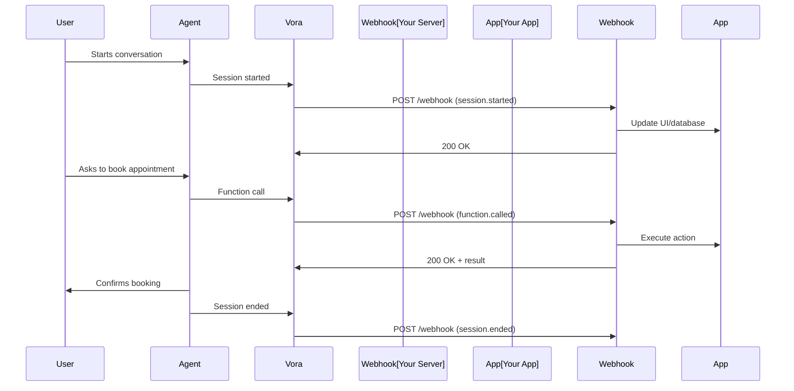

# Webhooks

Webhooks notify your application when events occur in your voice agents—session starts, function calls, transcripts, and more. This guide covers webhook configuration, event types, security, and best practices.

---

## How Webhooks Work



---

## Configuration

### In Dashboard

1. Go to **Settings** → **Webhooks**
2. Click **Add Endpoint**
3. Enter your endpoint URL
4. Select events to receive
5. Copy the signing secret

### Via API

```javascript
const webhook = await vora.webhooks.create({
  url: 'https://yourapp.com/webhooks/vora',
  events: [
    'session.started',
    'session.ended',
    'function.called',
    'transcript.ready'
  ],
  secret: 'whsec_optional_custom_secret'  // Optional, auto-generated if omitted
});

console.log(webhook.secret);  // Save this for verification
```

---

## Event Types

### Session Events

| Event | Description | When Sent |
|-------|-------------|-----------|
| `session.started` | Voice session connected | User connects to room |
| `session.ended` | Session completed | User disconnects |
| `session.failed` | Session error occurred | Connection or processing error |

**Payload: session.started**

```json
{
  "id": "evt_abc123",
  "type": "session.started",
  "timestamp": "2024-01-15T10:30:00Z",
  "data": {
    "sessionId": "sess_xyz789",
    "agentId": "agent_abc123",
    "userId": "user_123",
    "metadata": {
      "source": "web_widget"
    },
    "variables": {
      "customerName": "John"
    }
  }
}
```

**Payload: session.ended**

```json
{
  "id": "evt_def456",
  "type": "session.ended",
  "timestamp": "2024-01-15T10:35:00Z",
  "data": {
    "sessionId": "sess_xyz789",
    "agentId": "agent_abc123",
    "userId": "user_123",
    "duration": 300,
    "endReason": "user_hangup",
    "summary": {
      "turns": 12,
      "functionCalls": 2
    }
  }
}
```

### Function Events

| Event | Description | When Sent |
|-------|-------------|-----------|
| `function.called` | Agent invoked a function | Function execution starts |
| `function.completed` | Function finished | Result returned |
| `function.failed` | Function errored | Handler returned error |

**Payload: function.called**

```json
{
  "id": "evt_ghi789",
  "type": "function.called",
  "timestamp": "2024-01-15T10:32:00Z",
  "data": {
    "sessionId": "sess_xyz789",
    "agentId": "agent_abc123",
    "functionName": "get_order_status",
    "parameters": {
      "orderId": "ORD-12345"
    },
    "context": {
      "conversationTurn": 5
    }
  }
}
```

### Transcript Events

| Event | Description | When Sent |
|-------|-------------|-----------|
| `transcript.ready` | Full transcript available | After session ends |
| `transcript.segment` | Partial transcript | During session (real-time) |

**Payload: transcript.ready**

```json
{
  "id": "evt_jkl012",
  "type": "transcript.ready",
  "timestamp": "2024-01-15T10:36:00Z",
  "data": {
    "sessionId": "sess_xyz789",
    "agentId": "agent_abc123",
    "transcript": [
      {
        "speaker": "agent",
        "text": "Hello! How can I help you today?",
        "timestamp": "2024-01-15T10:30:05Z"
      },
      {
        "speaker": "user",
        "text": "I need to check my order status.",
        "timestamp": "2024-01-15T10:30:12Z"
      }
    ],
    "wordCount": 45,
    "duration": 300
  }
}
```

### Recording Events

| Event | Description | When Sent |
|-------|-------------|-----------|
| `recording.ready` | Audio recording available | After processing |

**Payload: recording.ready**

```json
{
  "id": "evt_mno345",
  "type": "recording.ready",
  "timestamp": "2024-01-15T10:40:00Z",
  "data": {
    "sessionId": "sess_xyz789",
    "recordingUrl": "https://storage.vora.ai/recordings/sess_xyz789.mp3",
    "duration": 300,
    "format": "mp3",
    "expiresAt": "2024-01-22T10:40:00Z"
  }
}
```

---

## Receiving Webhooks

### Express.js Handler

```javascript
import express from 'express';
import { verifyWebhookSignature } from '@vora-ai/sdk';

const app = express();

// Raw body for signature verification
app.use('/webhooks/vora', express.raw({ type: 'application/json' }));

app.post('/webhooks/vora', async (req, res) => {
  const signature = req.headers['x-vora-signature'];
  const timestamp = req.headers['x-vora-timestamp'];

  // Verify signature
  try {
    const isValid = verifyWebhookSignature(
      req.body,
      signature,
      timestamp,
      process.env.VORA_WEBHOOK_SECRET
    );

    if (!isValid) {
      return res.status(401).json({ error: 'Invalid signature' });
    }
  } catch (error) {
    return res.status(401).json({ error: 'Verification failed' });
  }

  const event = JSON.parse(req.body);

  // Handle event
  switch (event.type) {
    case 'session.started':
      console.log('Session started:', event.data.sessionId);
      await handleSessionStart(event.data);
      break;

    case 'session.ended':
      console.log('Session ended:', event.data.sessionId);
      await handleSessionEnd(event.data);
      break;

    case 'function.called':
      console.log('Function called:', event.data.functionName);
      await handleFunctionCall(event.data);
      break;

    case 'transcript.ready':
      console.log('Transcript ready:', event.data.sessionId);
      await saveTranscript(event.data);
      break;

    default:
      console.log('Unhandled event:', event.type);
  }

  // Acknowledge receipt
  res.status(200).json({ received: true });
});

async function handleSessionStart(data) {
  await db.sessions.upsert({
    id: data.sessionId,
    agentId: data.agentId,
    userId: data.userId,
    status: 'active',
    startedAt: new Date()
  });
}

async function handleSessionEnd(data) {
  await db.sessions.update({
    where: { id: data.sessionId },
    data: {
      status: 'completed',
      duration: data.duration,
      endedAt: new Date()
    }
  });
}

async function handleFunctionCall(data) {
  // Log function usage for analytics
  await db.functionCalls.create({
    sessionId: data.sessionId,
    functionName: data.functionName,
    parameters: data.parameters,
    calledAt: new Date()
  });
}

async function saveTranscript(data) {
  await db.transcripts.create({
    sessionId: data.sessionId,
    messages: data.transcript,
    wordCount: data.wordCount
  });
}

app.listen(3000);
```

### Python/FastAPI Handler

```python
from fastapi import FastAPI, Request, HTTPException
from vora import verify_webhook_signature
import os

app = FastAPI()

@app.post("/webhooks/vora")
async def handle_webhook(request: Request):
    # Get raw body
    body = await request.body()
    signature = request.headers.get("x-vora-signature")
    timestamp = request.headers.get("x-vora-timestamp")

    # Verify signature
    try:
        is_valid = verify_webhook_signature(
            body,
            signature,
            timestamp,
            os.environ.get("VORA_WEBHOOK_SECRET")
        )
        if not is_valid:
            raise HTTPException(status_code=401, detail="Invalid signature")
    except Exception as e:
        raise HTTPException(status_code=401, detail=str(e))

    event = await request.json()

    # Handle events
    match event["type"]:
        case "session.started":
            await handle_session_start(event["data"])
        case "session.ended":
            await handle_session_end(event["data"])
        case "function.called":
            await handle_function_call(event["data"])
        case "transcript.ready":
            await save_transcript(event["data"])
        case _:
            print(f"Unhandled event: {event['type']}")

    return {"received": True}
```

---

## Signature Verification

All webhook requests include a signature for verification:

### Headers

```
X-Vora-Signature: sha256=a1b2c3d4e5f6...
X-Vora-Timestamp: 1705320000
X-Vora-Event-ID: evt_abc123
```

### Verification Algorithm

```javascript
import crypto from 'crypto';

function verifyWebhookSignature(body, signature, timestamp, secret) {
  // Check timestamp (prevent replay attacks)
  const now = Math.floor(Date.now() / 1000);
  const webhookTime = parseInt(timestamp);

  if (Math.abs(now - webhookTime) > 300) {  // 5 minute tolerance
    throw new Error('Timestamp too old');
  }

  // Build signed payload
  const signedPayload = `${timestamp}.${body}`;

  // Compute expected signature
  const expectedSignature = crypto
    .createHmac('sha256', secret)
    .update(signedPayload)
    .digest('hex');

  // Compare signatures
  const providedSignature = signature.replace('sha256=', '');

  return crypto.timingSafeEqual(
    Buffer.from(expectedSignature),
    Buffer.from(providedSignature)
  );
}
```

---

## Retry Policy

Vora retries failed webhook deliveries with exponential backoff:

| Attempt | Delay | Total Time |
|---------|-------|------------|
| 1 | Immediate | 0s |
| 2 | 1 minute | 1m |
| 3 | 5 minutes | 6m |
| 4 | 30 minutes | 36m |
| 5 | 2 hours | 2h 36m |

### Success Criteria

A webhook is considered successful if your server returns:
- Status code `2xx`
- Within 30 seconds

### Failure Handling

After 5 failed attempts:
- Event is marked as failed
- Visible in dashboard under **Webhooks** → **Failed Events**
- Can be manually retried

---

## Best Practices

<AccordionGroup>
  <Accordion title="Return 200 quickly">
    Process events asynchronously. Return 200 immediately, then handle the event in a background job.

    ```javascript
    app.post('/webhooks/vora', async (req, res) => {
      const event = JSON.parse(req.body);

      // Queue for async processing
      await queue.add('webhook-event', event);

      // Respond immediately
      res.status(200).json({ received: true });
    });
    ```
  </Accordion>

  <Accordion title="Implement idempotency">
    Use the event ID to prevent duplicate processing:

    ```javascript
    async function handleEvent(event) {
      const existing = await db.events.findUnique({
        where: { id: event.id }
      });

      if (existing) {
        console.log('Already processed:', event.id);
        return;
      }

      // Process event
      await processEvent(event);

      // Mark as processed
      await db.events.create({
        data: { id: event.id, processedAt: new Date() }
      });
    }
    ```
  </Accordion>

  <Accordion title="Use a queue for reliability">
    Store events in a queue for reliable processing:

    ```javascript
    import { Queue, Worker } from 'bullmq';

    const webhookQueue = new Queue('webhooks');

    // Webhook handler
    app.post('/webhooks/vora', async (req, res) => {
      await webhookQueue.add('process', req.body);
      res.status(200).send();
    });

    // Worker
    new Worker('webhooks', async (job) => {
      const event = job.data;
      await handleEvent(event);
    });
    ```
  </Accordion>

  <Accordion title="Monitor webhook health">
    Track webhook metrics:
    - Delivery success rate
    - Average processing time
    - Failed event types

    Set up alerts for sustained failures.
  </Accordion>

  <Accordion title="Handle signature verification errors">
    Log verification failures for debugging:

    ```javascript
    try {
      verifySignature(req);
    } catch (error) {
      console.error('Webhook verification failed:', {
        error: error.message,
        headers: req.headers,
        ip: req.ip
      });
      return res.status(401).json({ error: 'Invalid signature' });
    }
    ```
  </Accordion>
</AccordionGroup>

---

## Testing Webhooks

### Local Development

Use a tunnel service for local testing:

```bash
# Using ngrok
ngrok http 3000

# Using localtunnel
lt --port 3000
```

### Test Events

Send test events from the dashboard:

1. Go to **Webhooks** → your endpoint
2. Click **Send Test Event**
3. Select event type
4. Check your server logs

### CLI Testing

```bash
curl -X POST https://yourapp.com/webhooks/vora \
  -H "Content-Type: application/json" \
  -H "X-Vora-Signature: sha256=test" \
  -H "X-Vora-Timestamp: $(date +%s)" \
  -d '{
    "id": "evt_test123",
    "type": "session.started",
    "timestamp": "2024-01-15T10:30:00Z",
    "data": {
      "sessionId": "sess_test",
      "agentId": "agent_test"
    }
  }'
```

---

## Webhook Logs

Access delivery logs in the dashboard:

| Field | Description |
|-------|-------------|
| Event ID | Unique event identifier |
| Type | Event type |
| Status | Success, Failed, Pending |
| Response | Your server's response |
| Duration | Delivery time |
| Attempts | Number of delivery attempts |

---

## Next Steps

<CardGroup cols={2}>
  <Card title="Error Handling" icon="bug" href="/developers/error-handling">
    Handle errors gracefully
  </Card>
  <Card title="Analytics" icon="chart-line" href="/developers/analytics">
    Track agent performance
  </Card>
</CardGroup>
