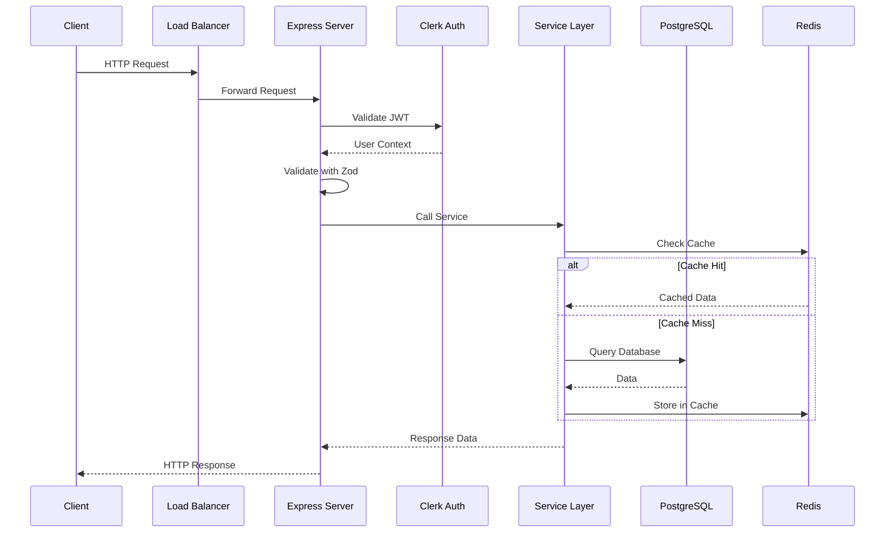
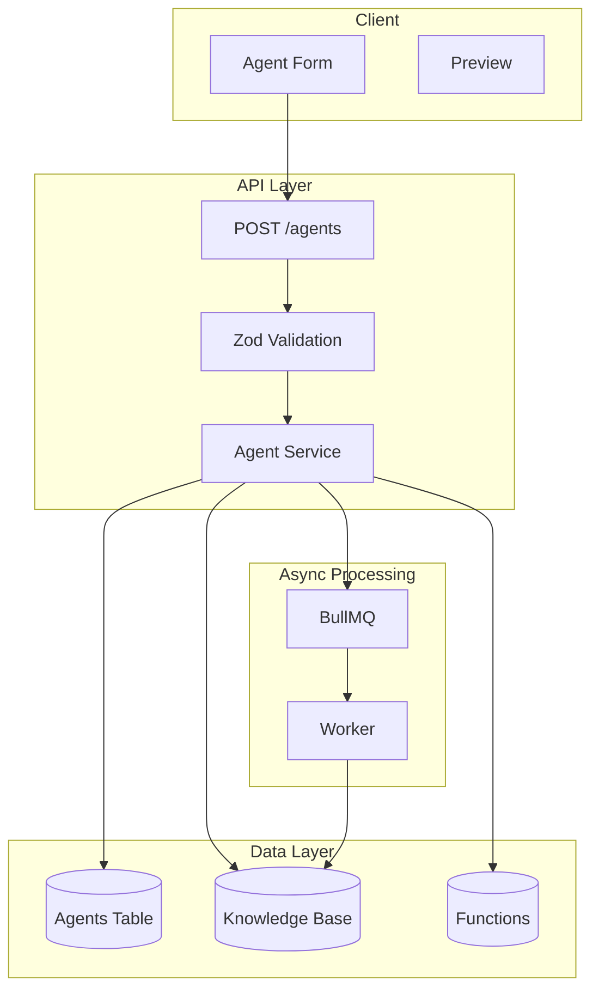
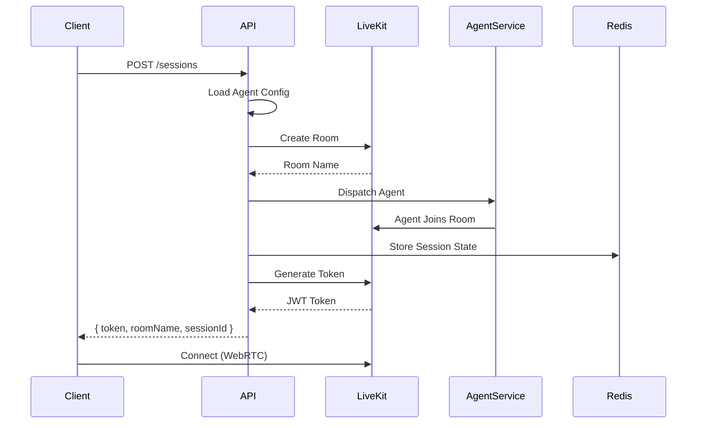
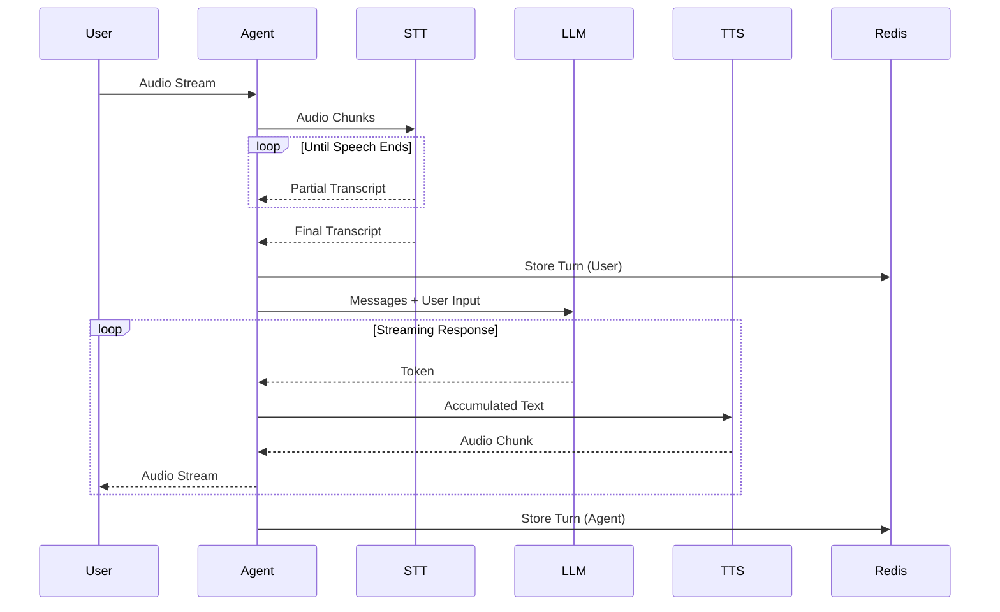
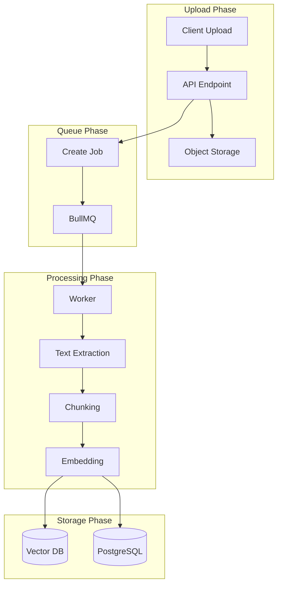
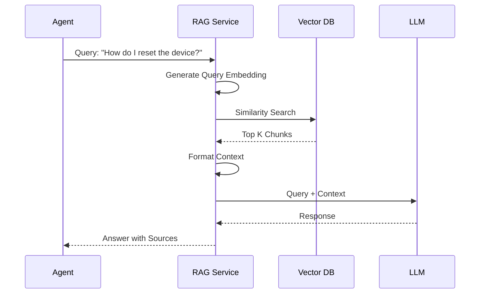
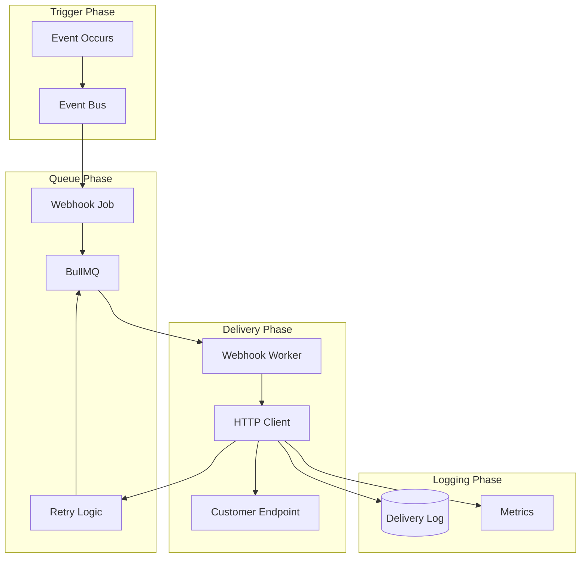
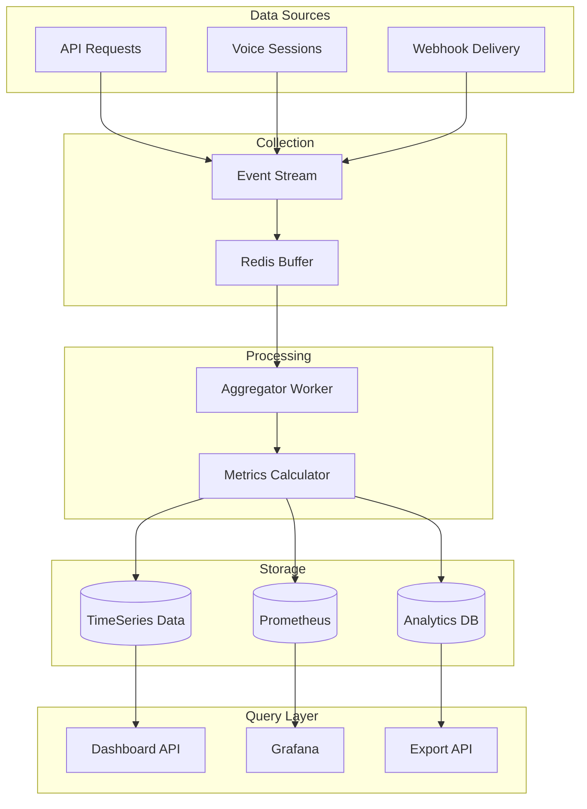

# Data Flow Documentation

This document describes how data flows through the Vora platform for different operations.

---

## API Request Flow

### Standard API Request



### Request Processing Steps

| Step | Component | Action |
|------|-----------|--------|
| 1 | Load Balancer | Route to healthy backend |
| 2 | Express | Parse request |
| 3 | Clerk Middleware | Validate JWT token |
| 4 | Auth Middleware | Extract user context |
| 5 | Validation | Zod schema validation |
| 6 | Service Layer | Business logic |
| 7 | Cache Check | Redis lookup |
| 8 | Database | Prisma query |
| 9 | Response | Format and return |

---

## Agent Creation Flow



### Data Transformation

```typescript
// Input (Client)
{
  name: "Sales Agent",
  description: "Handles sales inquiries",
  systemPrompt: "You are a helpful sales representative...",
  llm: { provider: "openai", model: "gpt-4" },
  stt: { provider: "deepgram", language: "en-US" },
  tts: { provider: "elevenlabs", voiceId: "rachel" }
}

// Validated (After Zod)
{
  name: "Sales Agent",           // Trimmed, length validated
  description: "Handles...",      // Optional, validated
  systemPrompt: "You are...",    // Min/max length checked
  llm: { provider: "openai", model: "gpt-4", temperature: 0.7 },
  stt: { provider: "deepgram", language: "en-US", punctuate: true },
  tts: { provider: "elevenlabs", voiceId: "rachel", speed: 1.0 }
}

// Stored (Database)
{
  id: "ag_123abc",
  userId: "user_456",
  name: "Sales Agent",
  description: "Handles sales inquiries",
  systemPrompt: "You are...",
  llmConfig: {...},              // JSONB
  sttConfig: {...},              // JSONB
  ttsConfig: {...},              // JSONB
  status: "draft",
  createdAt: "2024-01-15T...",
  updatedAt: "2024-01-15T..."
}
```

---

## Voice Session Flow

### Session Initialization



### Voice Turn Processing



### Session State

```typescript
// Redis Session State
{
  sessionId: "sess_abc123",
  roomName: "room_xyz",
  agentId: "ag_456",
  userId: "user_789",
  status: "active",
  startedAt: 1705123456789,
  turns: [
    { role: "user", content: "Hello", timestamp: 1705123460000 },
    { role: "agent", content: "Hi there!", timestamp: 1705123462000 }
  ],
  context: {
    // Accumulated conversation context
  },
  metrics: {
    turnCount: 2,
    totalDuration: 6000,
    avgLatency: 450
  }
}
```

---

## Knowledge Base Ingestion

### Document Upload Flow



### Document Processing Pipeline

```typescript
// Step 1: Upload
{
  documentId: "doc_123",
  fileName: "product-manual.pdf",
  fileSize: 1024000,
  mimeType: "application/pdf",
  storageUrl: "s3://bucket/docs/doc_123.pdf"
}

// Step 2: Text Extraction
{
  documentId: "doc_123",
  rawText: "Chapter 1: Introduction\n\nThis manual describes...",
  pageCount: 50,
  wordCount: 25000
}

// Step 3: Chunking
[
  { id: "chunk_1", text: "Chapter 1: Introduction\n\nThis manual...", tokens: 256 },
  { id: "chunk_2", text: "describes the product features...", tokens: 256 },
  // ... more chunks
]

// Step 4: Embedding
[
  { chunkId: "chunk_1", embedding: [0.123, -0.456, ...], dimension: 1536 },
  { chunkId: "chunk_2", embedding: [0.789, -0.012, ...], dimension: 1536 },
  // ... more embeddings
]

// Step 5: Storage
// PostgreSQL
{
  id: "doc_123",
  knowledgeBaseId: "kb_456",
  fileName: "product-manual.pdf",
  chunkCount: 98,
  status: "indexed",
  indexedAt: "2024-01-15T..."
}

// Vector DB
{
  id: "chunk_1",
  documentId: "doc_123",
  vector: [0.123, -0.456, ...],
  metadata: { pageNumber: 1, section: "Introduction" }
}
```

---

## RAG Query Flow



### Query Processing

```typescript
// Input Query
"How do I factory reset the device?"

// Query Embedding
[0.234, -0.567, 0.891, ...]  // 1536 dimensions

// Similarity Search Results
[
  { chunkId: "chunk_45", score: 0.92, text: "To perform a factory reset..." },
  { chunkId: "chunk_12", score: 0.87, text: "Warning: Factory reset will..." },
  { chunkId: "chunk_78", score: 0.81, text: "Reset options include..." }
]

// Formatted Context
`Based on the following documentation:

[1] To perform a factory reset, hold the power button for 10 seconds...
[2] Warning: Factory reset will erase all user data and settings...
[3] Reset options include soft reset, hard reset, and factory reset...

Answer the user's question: How do I factory reset the device?`

// LLM Response
{
  answer: "To factory reset your device, hold the power button for 10 seconds...",
  sources: ["chunk_45", "chunk_12"],
  confidence: 0.95
}
```

---

## Webhook Delivery Flow



### Webhook Payload

```typescript
// Event: session.completed
{
  id: "evt_123abc",
  type: "session.completed",
  timestamp: "2024-01-15T10:30:00Z",
  data: {
    sessionId: "sess_456",
    agentId: "ag_789",
    duration: 180,
    turnCount: 12,
    transcript: [
      { role: "user", content: "Hello" },
      { role: "agent", content: "Hi, how can I help?" },
      // ...
    ],
    metrics: {
      avgLatency: 420,
      totalTokens: 1500
    }
  }
}

// Delivery Attempt
{
  webhookId: "wh_abc",
  endpoint: "https://customer.com/webhooks/vora",
  attempt: 1,
  status: 200,
  responseTime: 150,
  timestamp: "2024-01-15T10:30:01Z"
}

// Failed Delivery (Retry)
{
  webhookId: "wh_abc",
  endpoint: "https://customer.com/webhooks/vora",
  attempt: 2,
  status: 500,
  error: "Internal Server Error",
  nextRetry: "2024-01-15T10:31:01Z",  // Exponential backoff
  timestamp: "2024-01-15T10:30:31Z"
}
```

---

## Analytics Data Flow



---

## Data Retention

### Retention Policies

| Data Type | Retention | Storage |
|-----------|-----------|---------|
| Agents | Indefinite | PostgreSQL |
| Sessions | 90 days | PostgreSQL |
| Transcripts | 30 days | PostgreSQL |
| Audio Recordings | 7 days | S3 |
| Metrics (detailed) | 30 days | TimeSeries |
| Metrics (aggregated) | 1 year | Analytics |
| Logs | 14 days | Loki |

### Cleanup Jobs

```typescript
// Scheduled cleanup job
const cleanupJob = new CronJob('0 2 * * *', async () => {
  // Delete old sessions
  await prisma.session.deleteMany({
    where: {
      createdAt: { lt: subDays(new Date(), 90) }
    }
  });

  // Delete old transcripts
  await prisma.transcript.deleteMany({
    where: {
      createdAt: { lt: subDays(new Date(), 30) }
    }
  });

  // Delete old audio files
  await s3.deleteObjects({
    Bucket: 'vora-audio',
    Delete: {
      Objects: await getOldAudioFiles(7)
    }
  });
});
```

---

## Related Documentation

<CardGroup cols={2}>
  <Card title="System Overview" icon="layer-group" href="/internal/architecture/overview">
    5-layer architecture
  </Card>
  <Card title="Voice Pipeline" icon="microphone" href="/internal/architecture/voice-pipeline">
    Voice processing details
  </Card>
  <Card title="API Reference" icon="code" href="/api/overview">
    API endpoints
  </Card>
  <Card title="Webhooks" icon="webhook" href="/developers/webhooks">
    Webhook events
  </Card>
</CardGroup>
