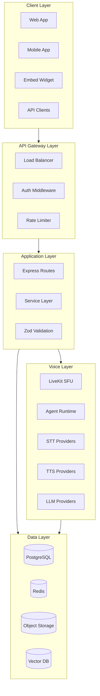
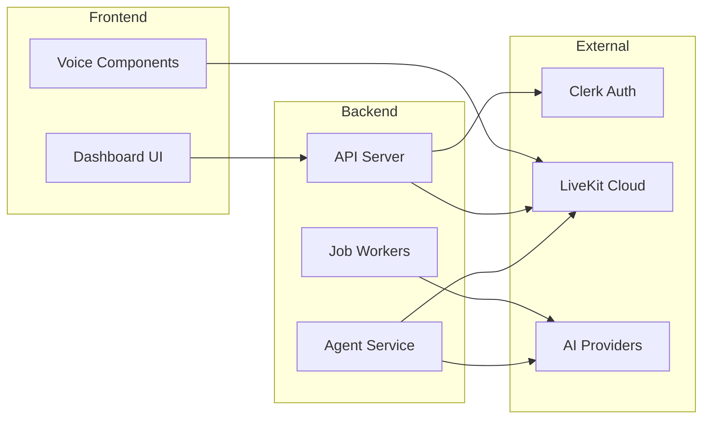
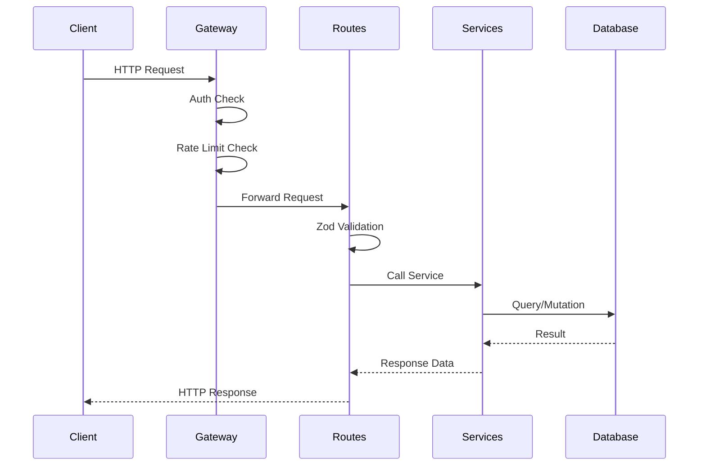
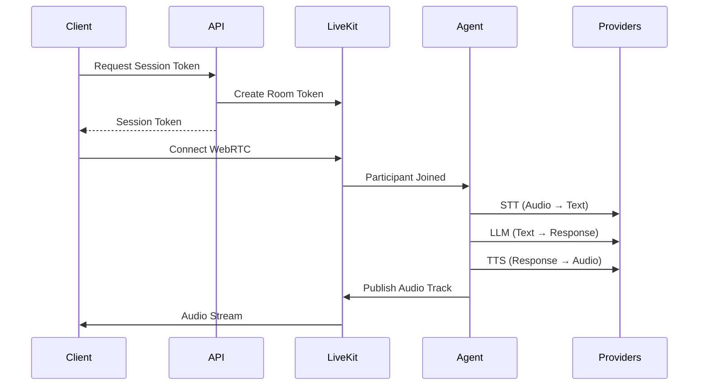
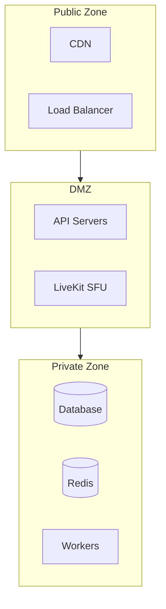

# System Architecture

The Vora Voice AI Platform follows a 5-layer architecture designed for scalability, maintainability, and real-time voice processing.

---

## Architecture Overview

---

## Layer Responsibilities

### 1. Client Layer

User-facing applications that consume Vora services.

| Component | Technology | Purpose |
|-----------|------------|---------|
| Web App | React + Vite | Dashboard, agent management |
| Mobile App | React Native (Expo) | Mobile voice interactions |
| Embed Widget | React component | Embeddable voice agent |
| API Clients | REST/SDK | Programmatic access |

### 2. API Gateway Layer

Request entry point with security and rate limiting.

| Component | Technology | Purpose |
|-----------|------------|---------|
| Load Balancer | Fly.io LB / Nginx | Traffic distribution |
| Auth Middleware | Clerk | JWT validation |
| Rate Limiter | Redis-based | Request throttling |
| CORS | Express CORS | Cross-origin handling |

### 3. Application Layer

Business logic and request processing.

| Component | Technology | Purpose |
|-----------|------------|---------|
| Routes | Express.js | HTTP endpoint handling |
| Services | TypeScript classes | Business logic |
| Validation | Zod | Request/response validation |
| Error Handler | Centralized | Error standardization |

### 4. Voice Layer

Real-time voice processing and AI integration.

| Component | Technology | Purpose |
|-----------|------------|---------|
| LiveKit SFU | LiveKit Cloud | WebRTC media routing |
| Agent Runtime | Python/Node | Voice agent execution |
| STT Providers | Deepgram, etc. | Speech-to-text |
| TTS Providers | ElevenLabs, etc. | Text-to-speech |
| LLM Providers | OpenAI, Gemini | Conversation AI |

### 5. Data Layer

Persistence and caching.

| Component | Technology | Purpose |
|-----------|------------|---------|
| PostgreSQL | Supabase/Neon | Primary database |
| Redis | Upstash | Caching, queues |
| Object Storage | S3/R2 | File storage |
| Vector DB | Embedded | RAG embeddings |

---

## Component Diagram

---

## Key Architectural Decisions

### 1. Separate Voice Layer

**Decision:** Voice processing runs in a dedicated layer with its own runtime.

**Rationale:**
- Voice requires real-time WebRTC, incompatible with request/response HTTP
- Agent runtime needs persistent connections
- Enables independent scaling of voice capacity

### 2. Provider Abstraction

**Decision:** All AI providers (LLM, STT, TTS) accessed through a unified interface.

**Rationale:**
- Easy provider switching (cost, performance, availability)
- Fallback mechanisms for reliability
- Consistent configuration interface

### 3. Monolithic Backend (Current)

**Decision:** Single Express application handles all API routes.

**Rationale:**
- Faster development velocity
- Simpler deployment and debugging
- Appropriate for current scale

**Future:** May split into microservices as scale demands.

### 4. Event-Driven Jobs

**Decision:** Background processing via BullMQ job queues.

**Rationale:**
- Decouples time-sensitive requests from heavy processing
- Retry logic for unreliable external APIs
- Visibility into job status

### 5. Clerk for Authentication

**Decision:** Clerk handles all authentication and user management.

**Rationale:**
- Production-ready auth without building from scratch
- SSO, MFA, session management included
- Works with both frontend and backend

---

## Request Flow

### Synchronous API Request

### Voice Session Flow

---

## Scaling Strategy

| Component | Scaling Type | Method |
|-----------|--------------|--------|
| API Servers | Horizontal | Add instances |
| Workers | Horizontal | Add workers |
| LiveKit | Horizontal | Add SFU nodes |
| PostgreSQL | Vertical + Replicas | Larger instance + read replicas |
| Redis | Vertical + Cluster | Larger instance or cluster |

---

## Security Boundaries

- **Public Zone:** CDN, load balancer - accessible from internet
- **DMZ:** API servers - authenticated access only
- **Private Zone:** Databases, workers - no direct external access

---

## Related Documentation

<CardGroup cols={2}>
  <Card title="Backend Architecture" icon="server" href="/internal/architecture/backend">
    Express + Prisma patterns
  </Card>
  <Card title="Frontend Architecture" icon="browser" href="/internal/architecture/frontend">
    React + TanStack patterns
  </Card>
  <Card title="Voice Pipeline" icon="microphone" href="/internal/architecture/voice-pipeline">
    LiveKit + Agent runtime
  </Card>
  <Card title="Data Flow" icon="arrows-alt" href="/internal/architecture/data-flow">
    Request/response flows
  </Card>
</CardGroup>
