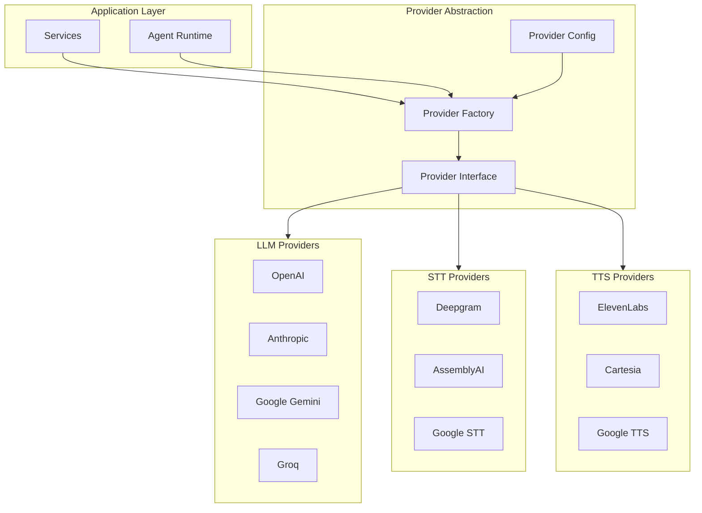

# Provider System Architecture

The Vora provider system provides a unified interface for multiple AI providers (LLM, STT, TTS), enabling easy switching, fallbacks, and consistent configuration.

---

## Architecture Overview



---

## Design Principles

### 1. Interface Segregation

Each provider type has its own interface:

```typescript
// providers/types.ts

interface LLMProvider {
  name: string;
  chat(params: ChatParams): Promise<ChatResponse>;
  stream(params: ChatParams): AsyncIterable<ChatChunk>;
}

interface STTProvider {
  name: string;
  transcribe(audio: Buffer, options?: STTOptions): Promise<Transcript>;
  stream(audioStream: Readable): AsyncIterable<TranscriptChunk>;
}

interface TTSProvider {
  name: string;
  synthesize(text: string, options?: TTSOptions): Promise<Buffer>;
  stream(text: string, options?: TTSOptions): AsyncIterable<Buffer>;
}
```

### 2. Factory Pattern

Providers are created through factories:

```typescript
// providers/factory.ts

export function createLLMProvider(config: LLMConfig): LLMProvider {
  switch (config.provider) {
    case 'openai':
      return new OpenAIProvider({
        apiKey: process.env.OPENAI_API_KEY!,
        model: config.model,
      });
    case 'anthropic':
      return new AnthropicProvider({
        apiKey: process.env.ANTHROPIC_API_KEY!,
        model: config.model,
      });
    case 'google':
      return new GoogleProvider({
        apiKey: process.env.GOOGLE_API_KEY!,
        model: config.model,
      });
    case 'groq':
      return new GroqProvider({
        apiKey: process.env.GROQ_API_KEY!,
        model: config.model,
      });
    default:
      throw new ProviderError(`Unknown LLM provider: ${config.provider}`);
  }
}
```

### 3. Consistent Configuration

All providers share a common configuration schema:

```typescript
// providers/config.ts
import { z } from 'zod';

export const llmConfigSchema = z.object({
  provider: z.enum(['openai', 'anthropic', 'google', 'groq', 'mistral']),
  model: z.string(),
  temperature: z.number().min(0).max(2).default(0.7),
  maxTokens: z.number().optional(),
  topP: z.number().optional(),
});

export const sttConfigSchema = z.object({
  provider: z.enum(['deepgram', 'assemblyai', 'google', 'soniox']),
  language: z.string().default('en-US'),
  model: z.string().optional(),
  punctuate: z.boolean().default(true),
  profanityFilter: z.boolean().default(false),
});

export const ttsConfigSchema = z.object({
  provider: z.enum(['elevenlabs', 'cartesia', 'google']),
  voiceId: z.string(),
  speed: z.number().min(0.25).max(4).default(1),
  pitch: z.number().optional(),
  stability: z.number().optional(),
});
```

---

## Provider Implementation

### LLM Provider Example

```typescript
// providers/llm/openai.ts
import OpenAI from 'openai';
import { LLMProvider, ChatParams, ChatResponse, ChatChunk } from '../types';

export class OpenAIProvider implements LLMProvider {
  name = 'openai';
  private client: OpenAI;
  private defaultModel: string;

  constructor(config: { apiKey: string; model?: string }) {
    this.client = new OpenAI({ apiKey: config.apiKey });
    this.defaultModel = config.model ?? 'gpt-4-turbo';
  }

  async chat(params: ChatParams): Promise<ChatResponse> {
    const response = await this.client.chat.completions.create({
      model: params.model ?? this.defaultModel,
      messages: this.formatMessages(params.messages),
      temperature: params.temperature,
      max_tokens: params.maxTokens,
      tools: params.tools ? this.formatTools(params.tools) : undefined,
    });

    return {
      content: response.choices[0].message.content ?? '',
      toolCalls: response.choices[0].message.tool_calls,
      usage: {
        promptTokens: response.usage?.prompt_tokens ?? 0,
        completionTokens: response.usage?.completion_tokens ?? 0,
      },
      finishReason: response.choices[0].finish_reason,
    };
  }

  async *stream(params: ChatParams): AsyncIterable<ChatChunk> {
    const stream = await this.client.chat.completions.create({
      model: params.model ?? this.defaultModel,
      messages: this.formatMessages(params.messages),
      temperature: params.temperature,
      max_tokens: params.maxTokens,
      stream: true,
    });

    for await (const chunk of stream) {
      const delta = chunk.choices[0]?.delta;
      if (delta?.content) {
        yield {
          content: delta.content,
          finishReason: chunk.choices[0]?.finish_reason ?? null,
        };
      }
    }
  }

  private formatMessages(messages: Message[]): OpenAI.ChatCompletionMessageParam[] {
    return messages.map((msg) => ({
      role: msg.role as 'system' | 'user' | 'assistant',
      content: msg.content,
    }));
  }

  private formatTools(tools: Tool[]): OpenAI.ChatCompletionTool[] {
    return tools.map((tool) => ({
      type: 'function',
      function: {
        name: tool.name,
        description: tool.description,
        parameters: tool.parameters,
      },
    }));
  }
}
```

### STT Provider Example

```typescript
// providers/stt/deepgram.ts
import { createClient, LiveTranscriptionEvents } from '@deepgram/sdk';
import { STTProvider, Transcript, TranscriptChunk, STTOptions } from '../types';

export class DeepgramProvider implements STTProvider {
  name = 'deepgram';
  private client: ReturnType<typeof createClient>;

  constructor(config: { apiKey: string }) {
    this.client = createClient(config.apiKey);
  }

  async transcribe(audio: Buffer, options?: STTOptions): Promise<Transcript> {
    const { result } = await this.client.listen.prerecorded.transcribeFile(
      audio,
      {
        model: options?.model ?? 'nova-2',
        language: options?.language ?? 'en-US',
        punctuate: options?.punctuate ?? true,
        smart_format: true,
      }
    );

    const transcript = result?.results?.channels[0]?.alternatives[0];

    return {
      text: transcript?.transcript ?? '',
      confidence: transcript?.confidence ?? 0,
      words: transcript?.words?.map((w) => ({
        word: w.word,
        start: w.start,
        end: w.end,
        confidence: w.confidence,
      })),
    };
  }

  async *stream(audioStream: Readable): AsyncIterable<TranscriptChunk> {
    const connection = this.client.listen.live({
      model: 'nova-2',
      language: 'en-US',
      punctuate: true,
      interim_results: true,
      endpointing: 300,
    });

    const transcriptQueue: TranscriptChunk[] = [];
    let resolveNext: (() => void) | null = null;

    connection.on(LiveTranscriptionEvents.Transcript, (data) => {
      const transcript = data.channel?.alternatives[0];
      if (transcript?.transcript) {
        transcriptQueue.push({
          text: transcript.transcript,
          isFinal: data.is_final ?? false,
          confidence: transcript.confidence ?? 0,
        });
        resolveNext?.();
      }
    });

    // Pipe audio to connection
    audioStream.on('data', (chunk) => {
      connection.send(chunk);
    });

    audioStream.on('end', () => {
      connection.finish();
    });

    // Yield transcripts as they arrive
    while (true) {
      if (transcriptQueue.length > 0) {
        yield transcriptQueue.shift()!;
      } else {
        await new Promise<void>((resolve) => {
          resolveNext = resolve;
        });
      }
    }
  }
}
```

### TTS Provider Example

```typescript
// providers/tts/elevenlabs.ts
import { ElevenLabsClient } from 'elevenlabs';
import { TTSProvider, TTSOptions } from '../types';

export class ElevenLabsProvider implements TTSProvider {
  name = 'elevenlabs';
  private client: ElevenLabsClient;

  constructor(config: { apiKey: string }) {
    this.client = new ElevenLabsClient({ apiKey: config.apiKey });
  }

  async synthesize(text: string, options?: TTSOptions): Promise<Buffer> {
    const audio = await this.client.generate({
      voice: options?.voiceId ?? 'rachel',
      text,
      model_id: options?.model ?? 'eleven_turbo_v2_5',
      voice_settings: {
        stability: options?.stability ?? 0.5,
        similarity_boost: options?.similarityBoost ?? 0.75,
      },
    });

    // Convert stream to buffer
    const chunks: Buffer[] = [];
    for await (const chunk of audio) {
      chunks.push(chunk);
    }
    return Buffer.concat(chunks);
  }

  async *stream(text: string, options?: TTSOptions): AsyncIterable<Buffer> {
    const audioStream = await this.client.generate({
      voice: options?.voiceId ?? 'rachel',
      text,
      model_id: options?.model ?? 'eleven_turbo_v2_5',
      stream: true,
    });

    for await (const chunk of audioStream) {
      yield chunk;
    }
  }
}
```

---

## Fallback Strategy

### Fallback Chain

```typescript
// providers/fallback.ts

export class FallbackProvider<T extends Provider> {
  constructor(
    private providers: T[],
    private options: FallbackOptions = {}
  ) {}

  async execute<R>(
    operation: (provider: T) => Promise<R>
  ): Promise<R> {
    let lastError: Error | null = null;

    for (const provider of this.providers) {
      try {
        const result = await operation(provider);
        return result;
      } catch (error) {
        lastError = error as Error;

        // Log failure
        logger.warn(`Provider ${provider.name} failed`, {
          error: lastError.message,
        });

        // Check if we should retry
        if (!this.shouldFallback(error)) {
          throw error;
        }
      }
    }

    throw new AllProvidersFailedError(
      'All providers failed',
      lastError!
    );
  }

  private shouldFallback(error: Error): boolean {
    // Don't fallback for validation errors
    if (error instanceof ValidationError) {
      return false;
    }

    // Don't fallback for auth errors
    if (error instanceof AuthenticationError) {
      return false;
    }

    return true;
  }
}

// Usage
const llmFallback = new FallbackProvider([
  createLLMProvider({ provider: 'openai', model: 'gpt-4' }),
  createLLMProvider({ provider: 'anthropic', model: 'claude-3-sonnet' }),
  createLLMProvider({ provider: 'groq', model: 'llama-3-70b' }),
]);

const response = await llmFallback.execute(
  (provider) => provider.chat(params)
);
```

### Rate Limit Handling

```typescript
// providers/rate-limiter.ts

export class RateLimitedProvider<T extends Provider> {
  private rateLimiter: Map<string, RateLimitState> = new Map();

  async execute<R>(
    provider: T,
    operation: (provider: T) => Promise<R>
  ): Promise<R> {
    const state = this.getRateLimitState(provider.name);

    // Check if rate limited
    if (state.isLimited) {
      const waitTime = state.resetAt - Date.now();
      if (waitTime > 0) {
        throw new RateLimitError(
          `Rate limited for ${waitTime}ms`,
          state.resetAt
        );
      }
    }

    try {
      const result = await operation(provider);
      return result;
    } catch (error) {
      if (this.isRateLimitError(error)) {
        this.setRateLimited(provider.name, error);
      }
      throw error;
    }
  }

  private isRateLimitError(error: Error): boolean {
    return (
      error.message.includes('rate limit') ||
      (error as any).status === 429
    );
  }
}
```

---

## Provider Metrics

### Metrics Collection

```typescript
// providers/metrics.ts

export class MetricsCollector {
  private metrics: PrometheusClient;

  constructor() {
    this.requestDuration = new Histogram({
      name: 'provider_request_duration_seconds',
      help: 'Provider request duration',
      labelNames: ['provider', 'type', 'operation'],
    });

    this.requestErrors = new Counter({
      name: 'provider_request_errors_total',
      help: 'Provider request errors',
      labelNames: ['provider', 'type', 'error_type'],
    });

    this.tokenUsage = new Counter({
      name: 'provider_token_usage_total',
      help: 'Token usage by provider',
      labelNames: ['provider', 'type'],
    });
  }

  recordRequest(provider: string, type: string, duration: number) {
    this.requestDuration
      .labels(provider, type, 'request')
      .observe(duration / 1000);
  }

  recordError(provider: string, type: string, errorType: string) {
    this.requestErrors.labels(provider, type, errorType).inc();
  }

  recordTokens(provider: string, type: 'prompt' | 'completion', count: number) {
    this.tokenUsage.labels(provider, type).inc(count);
  }
}
```

### Instrumented Provider

```typescript
// providers/instrumented.ts

export function instrumentProvider<T extends Provider>(
  provider: T,
  metrics: MetricsCollector
): T {
  return new Proxy(provider, {
    get(target, prop, receiver) {
      const value = Reflect.get(target, prop, receiver);

      if (typeof value === 'function') {
        return async (...args: unknown[]) => {
          const start = Date.now();
          try {
            const result = await value.apply(target, args);
            metrics.recordRequest(
              target.name,
              target.constructor.name,
              Date.now() - start
            );
            return result;
          } catch (error) {
            metrics.recordError(
              target.name,
              target.constructor.name,
              (error as Error).constructor.name
            );
            throw error;
          }
        };
      }

      return value;
    },
  });
}
```

---

## Provider Registry

### Registration

```typescript
// providers/registry.ts

class ProviderRegistry {
  private providers = new Map<string, ProviderFactory>();

  register(type: string, name: string, factory: ProviderFactory) {
    const key = `${type}:${name}`;
    this.providers.set(key, factory);
  }

  get(type: string, name: string): ProviderFactory {
    const key = `${type}:${name}`;
    const factory = this.providers.get(key);
    if (!factory) {
      throw new Error(`Unknown provider: ${key}`);
    }
    return factory;
  }

  list(type: string): string[] {
    return Array.from(this.providers.keys())
      .filter((key) => key.startsWith(`${type}:`))
      .map((key) => key.split(':')[1]);
  }
}

// Registration
registry.register('llm', 'openai', OpenAIProvider);
registry.register('llm', 'anthropic', AnthropicProvider);
registry.register('stt', 'deepgram', DeepgramProvider);
registry.register('tts', 'elevenlabs', ElevenLabsProvider);

// Usage
const LLMClass = registry.get('llm', 'openai');
const provider = new LLMClass(config);
```

---

## Related Documentation

<CardGroup cols={2}>
  <Card title="Voice Pipeline" icon="microphone" href="/internal/architecture/voice-pipeline">
    Voice processing architecture
  </Card>
  <Card title="LLM Providers" icon="brain" href="/providers/llm">
    LLM provider configuration
  </Card>
  <Card title="STT Providers" icon="ear-listen" href="/providers/stt">
    Speech-to-text options
  </Card>
  <Card title="TTS Providers" icon="volume-up" href="/providers/tts">
    Text-to-speech options
  </Card>
</CardGroup>
