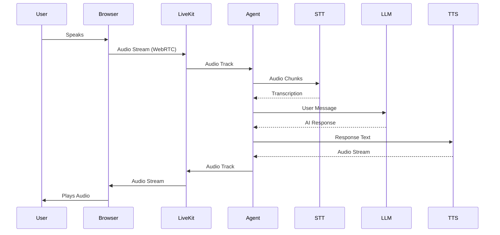
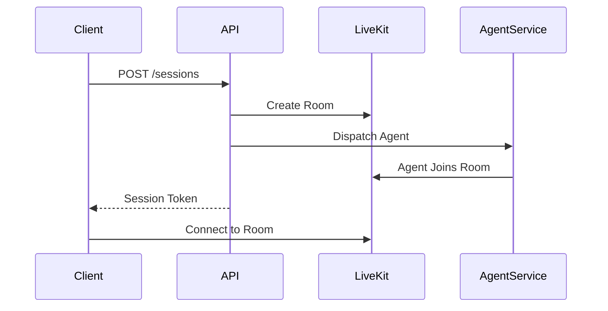
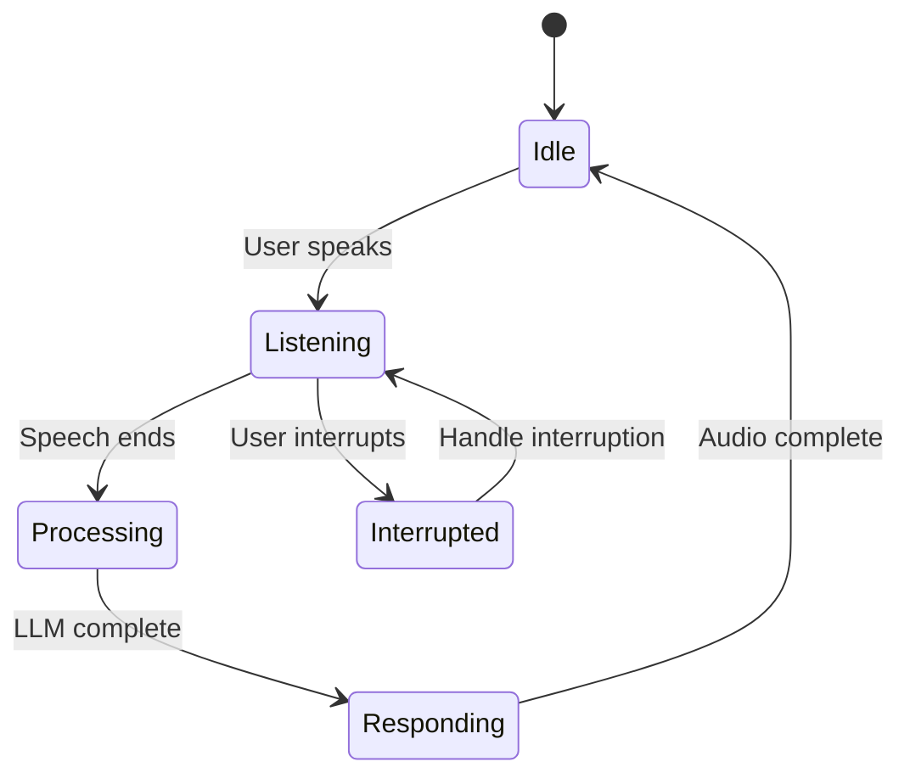
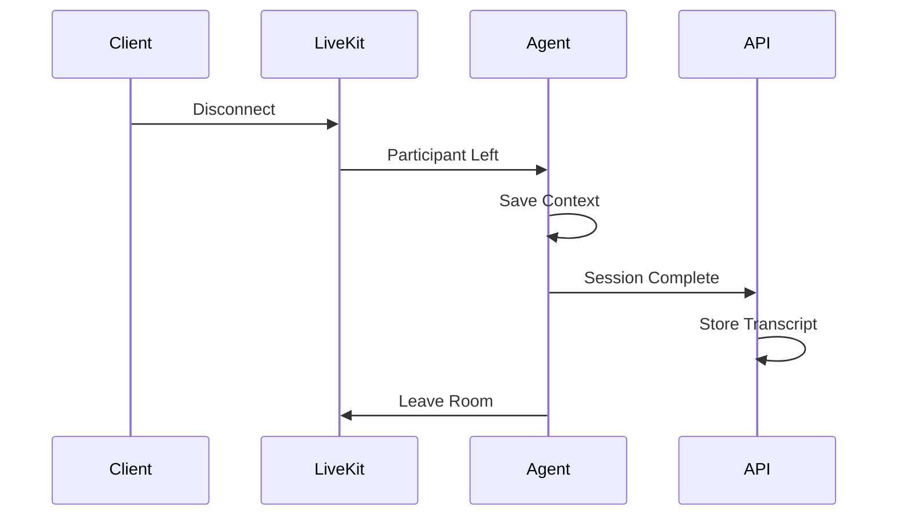

# Voice Pipeline Architecture

The Vora voice pipeline handles real-time audio streaming, speech processing, and AI-powered conversations using LiveKit and custom agent runtime.

---

## Pipeline Overview



---

## Architecture Components

```mermaid
flowchart TB
    subgraph Client["Client (Browser/Mobile)"]
        Mic[Microphone]
        Speaker[Speaker]
        SDK[LiveKit SDK]
    end

    subgraph LiveKit["LiveKit Cloud"]
        Room[Room]
        SFU[Selective Forwarding Unit]
    end

    subgraph AgentRuntime["Agent Runtime"]
        Handler[Connection Handler]
        Pipeline[Voice Pipeline]
        Context[Conversation Context]
    end

    subgraph Providers["AI Providers"]
        STT[STT Provider]
        LLM[LLM Provider]
        TTS[TTS Provider]
    end

    Mic --> SDK
    SDK <--> SFU
    SFU <--> Room
    Room <--> Handler
    Handler --> Pipeline
    Pipeline --> STT
    Pipeline --> LLM
    Pipeline --> TTS
    Pipeline --> Context
    Speaker <-- SDK
```

---

## Components

### 1. LiveKit Room

Manages WebRTC connections and media routing.

| Component | Purpose |
|-----------|---------|
| Room | Logical grouping for participants |
| SFU | Media routing without transcoding |
| Participant | User or agent in the room |
| Track | Audio/video stream |

### 2. Agent Runtime

Python-based service that processes voice interactions.

```python
# Simplified agent structure
class VoiceAgent:
    def __init__(self, config: AgentConfig):
        self.stt = get_stt_provider(config.stt)
        self.llm = get_llm_provider(config.llm)
        self.tts = get_tts_provider(config.tts)
        self.context = ConversationContext()

    async def handle_audio(self, audio_chunk: bytes):
        # 1. Speech-to-text
        text = await self.stt.transcribe(audio_chunk)

        if text:
            # 2. LLM response
            response = await self.llm.chat(
                messages=self.context.get_messages(),
                user_input=text
            )

            # 3. Text-to-speech
            audio = await self.tts.synthesize(response)

            # 4. Send audio back
            await self.publish_audio(audio)
```

### 3. STT Provider

Converts incoming audio to text.

| Provider | Latency | Best For |
|----------|---------|----------|
| Deepgram | ~100ms | Real-time, accuracy |
| AssemblyAI | ~200ms | Long-form, features |
| Google | ~150ms | Multi-language |

### 4. LLM Provider

Generates conversational responses.

| Provider | Latency | Best For |
|----------|---------|----------|
| OpenAI GPT-4 | ~500ms | Quality |
| Gemini Flash | ~200ms | Speed |
| Groq | ~100ms | Ultra-low latency |

### 5. TTS Provider

Converts response text to speech.

| Provider | Latency | Best For |
|----------|---------|----------|
| ElevenLabs | ~200ms | Voice quality |
| Cartesia | ~100ms | Low latency |
| Google | ~150ms | Multi-language |

---

## Voice Session Flow

### 1. Session Initialization



### 2. Audio Processing Loop



### 3. Session Cleanup



---

## Latency Optimization

### Target Latencies

| Stage | Target | Actual |
|-------|--------|--------|
| Audio → STT | < 100ms | ~80ms |
| STT → LLM | < 50ms | ~30ms |
| LLM (TTFT) | < 200ms | ~150ms |
| TTS (TTFB) | < 100ms | ~80ms |
| **Total E2E** | **< 500ms** | **~400ms** |

### Optimization Techniques

#### 1. Streaming Everything

```python
# Stream STT (not wait for full sentence)
async for partial in stt.stream(audio):
    if partial.is_final:
        await process_final(partial.text)
    else:
        update_display(partial.text)

# Stream LLM
async for chunk in llm.stream(messages):
    await tts.stream_input(chunk)

# Stream TTS
async for audio_chunk in tts.stream():
    await publish_audio(audio_chunk)
```

#### 2. Parallel Processing

```python
# Prepare TTS while LLM is generating
async def process_response():
    tts_task = None
    full_response = ""

    async for chunk in llm.stream(messages):
        full_response += chunk

        # Start TTS early
        if len(full_response) > 50 and tts_task is None:
            tts_task = asyncio.create_task(
                tts.synthesize(full_response)
            )
```

#### 3. Voice Activity Detection (VAD)

```python
# Detect speech end quickly
class VoiceActivityDetector:
    def __init__(self, silence_threshold=500):  # 500ms
        self.silence_threshold = silence_threshold
        self.last_speech_time = None

    def process(self, audio: bytes) -> bool:
        energy = calculate_energy(audio)

        if energy > self.threshold:
            self.last_speech_time = time.time()
            return False  # Still speaking

        if self.last_speech_time:
            silence_duration = time.time() - self.last_speech_time
            if silence_duration > self.silence_threshold / 1000:
                return True  # Speech ended

        return False
```

---

## Interruption Handling

### Types of Interruptions

| Type | Trigger | Behavior |
|------|---------|----------|
| Soft | User starts speaking | Queue response, continue after |
| Hard | User speaks over agent | Stop immediately, process new input |
| Cancel | Specific phrase | Cancel current action |

### Implementation

```python
class InterruptionHandler:
    def __init__(self):
        self.is_agent_speaking = False
        self.pending_audio = []

    async def handle_user_audio(self, audio: bytes):
        if self.is_agent_speaking:
            # Detect if user is speaking
            if has_speech(audio):
                # Stop current TTS
                await self.stop_tts()
                self.is_agent_speaking = False

                # Process new input
                await self.process_interruption(audio)

    async def stop_tts(self):
        # Stop audio playback
        await self.audio_publisher.stop()
        # Clear buffer
        self.pending_audio.clear()
```

---

## Context Management

### Conversation Context

```python
class ConversationContext:
    def __init__(self, max_tokens: int = 4000):
        self.messages = []
        self.max_tokens = max_tokens
        self.system_prompt = ""
        self.tool_calls = []

    def add_message(self, role: str, content: str):
        self.messages.append({
            "role": role,
            "content": content,
            "timestamp": datetime.now()
        })
        self._prune_if_needed()

    def _prune_if_needed(self):
        total_tokens = self._estimate_tokens()
        while total_tokens > self.max_tokens:
            # Remove oldest non-system messages
            self.messages.pop(1)  # Keep system prompt
            total_tokens = self._estimate_tokens()

    def get_messages(self) -> list:
        return [{"role": "system", "content": self.system_prompt}] + self.messages
```

### Function Calling

```python
class FunctionHandler:
    def __init__(self, functions: list[AgentFunction]):
        self.functions = {f.name: f for f in functions}

    async def process_tool_calls(self, tool_calls: list) -> str:
        results = []

        for call in tool_calls:
            func = self.functions.get(call.name)
            if func:
                result = await func.execute(call.arguments)
                results.append({
                    "tool_call_id": call.id,
                    "result": result
                })

        return results
```

---

## Error Handling

### Graceful Degradation

```python
class ResilientPipeline:
    async def get_response(self, text: str) -> str:
        try:
            # Try primary LLM
            return await self.primary_llm.chat(text)
        except ProviderError:
            # Fallback to secondary
            try:
                return await self.fallback_llm.chat(text)
            except ProviderError:
                # Final fallback
                return "I'm having trouble right now. Please try again."
```

### Connection Recovery

```python
class ConnectionManager:
    async def handle_disconnect(self, reason: str):
        if self.should_reconnect(reason):
            for attempt in range(3):
                try:
                    await asyncio.sleep(2 ** attempt)  # Exponential backoff
                    await self.reconnect()
                    return
                except Exception:
                    continue

        # Cleanup after failed reconnection
        await self.cleanup()
```

---

## Monitoring

### Key Metrics

| Metric | Description | Alert Threshold |
|--------|-------------|-----------------|
| `voice.latency.e2e` | End-to-end latency | > 1000ms |
| `voice.stt.latency` | STT processing time | > 200ms |
| `voice.llm.ttft` | Time to first token | > 500ms |
| `voice.tts.ttfb` | TTS time to first byte | > 200ms |
| `voice.interruption.rate` | Interruption frequency | > 50% |
| `voice.error.rate` | Processing errors | > 5% |

### Logging

```python
logger.info(
    "Voice turn complete",
    extra={
        "session_id": session.id,
        "user_text": user_text,
        "response_length": len(response),
        "latency": {
            "stt": stt_latency,
            "llm": llm_latency,
            "tts": tts_latency,
            "total": total_latency
        }
    }
)
```

---

## Related Documentation

<CardGroup cols={2}>
  <Card title="System Overview" icon="layer-group" href="/internal/architecture/overview">
    5-layer architecture
  </Card>
  <Card title="Provider System" icon="puzzle-piece" href="/internal/architecture/providers">
    LLM, STT, TTS providers
  </Card>
  <Card title="LiveKit Integration" icon="phone" href="/sdks/livekit">
    Client-side LiveKit setup
  </Card>
  <Card title="Data Flow" icon="arrows-alt" href="/internal/architecture/data-flow">
    Request/response flows
  </Card>
</CardGroup>
