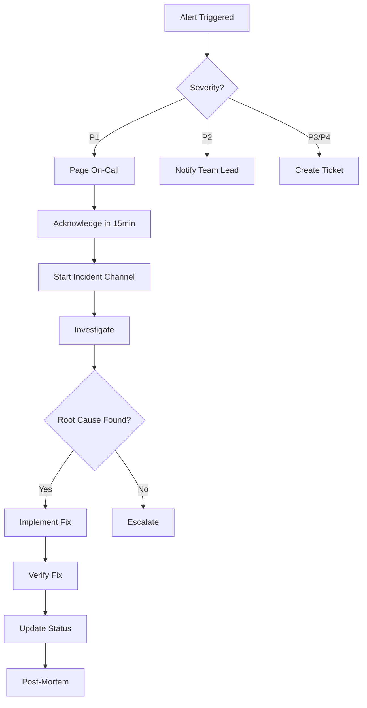

# Incident Response

This runbook covers procedures for detecting, responding to, and resolving production incidents.

---

## Severity Levels

| Level | Definition | Response Time | Examples |
|-------|------------|---------------|----------|
| **P1 - Critical** | Complete service outage | 15 minutes | All voice calls failing, Auth down |
| **P2 - High** | Major feature broken | 1 hour | Session creation failing, High error rate |
| **P3 - Medium** | Degraded experience | 4 hours | Slow responses, Partial functionality |
| **P4 - Low** | Minor issue | 24 hours | UI glitch, Non-critical bug |

---

## Incident Response Flow



---

## Step 1: Detection

### Automatic Alerts

Alerts come through:
- **PagerDuty** - P1/P2 incidents (pages on-call)
- **Slack #engineering-alerts** - All severity levels
- **Sentry** - Error spikes
- **Fly.io** - Infrastructure issues

### Alert Examples

```markdown
🚨 [P1] API Error Rate > 10%
Service: vora-api-production
Error Rate: 15.2%
Started: 2024-01-15 14:00 UTC
Dashboard: [link]
```

### Manual Detection

If you notice an issue:
1. Check monitoring dashboards
2. Verify issue is real (not false positive)
3. Escalate if P1/P2

---

## Step 2: Acknowledge

### For On-Call (P1/P2)

```bash
# Acknowledge in PagerDuty within 15 minutes
# This stops escalation and shows you're responding
```

### Create Incident Channel

```markdown
# In Slack
/incident create "API returning 500 errors"

# This creates #incident-2024-01-15-api-500
# And posts to #engineering-alerts
```

### Initial Status Update

Post in incident channel:

```markdown
**Incident Status Update**
Time: 14:05 UTC
Status: Investigating
Impact: Users cannot create voice sessions
Actions: Checking API logs and error dashboard
ETA: Unknown, will update in 15 minutes
```

---

## Step 3: Investigate

### Quick Diagnostics

```bash
# Check API health
curl https://api.vora.ai/health

# Check recent deployments
fly releases -a vora-api-production

# Check logs for errors
fly logs -a vora-api-production | grep ERROR

# Check database connections
# Via Supabase dashboard

# Check Redis
# Via Upstash dashboard
```

### Common Investigation Paths

#### High Error Rate

```bash
# What type of errors?
fly logs -a vora-api-production | grep -E "ERROR|FATAL" | head -50

# Recent changes?
git log --oneline -10

# Database issues?
# Check Supabase dashboard for connection pool
```

#### Slow Responses

```bash
# Check p99 latency in Fly.io metrics

# Check database query times
# Via Supabase dashboard > Logs

# Check external API status
# OpenAI: https://status.openai.com
# Deepgram: https://status.deepgram.com
```

#### Voice Calls Failing

```bash
# Check LiveKit status
# https://status.livekit.io

# Check LiveKit room creation
curl -X POST https://api.vora.ai/api/debug/livekit-health

# Check session logs
fly logs -a vora-api-production | grep "session"
```

---

## Step 4: Mitigate

### Immediate Actions

| Issue | Immediate Action |
|-------|------------------|
| Bad deployment | Rollback to previous version |
| Database overload | Enable read replica / rate limit |
| External API down | Enable fallback provider |
| DDoS | Enable rate limiting / block IPs |
| Memory leak | Restart machines |

### Rollback Procedure

```bash
# Immediate rollback
fly deploy --image registry.fly.io/vora-api-production:previous -a vora-api-production

# Verify
curl https://api.vora.ai/health

# Update status
```

### Enable Fallback

```bash
# Switch LLM provider
fly secrets set LLM_FALLBACK_ENABLED=true -a vora-api-production

# Switch TTS provider
fly secrets set TTS_FALLBACK_ENABLED=true -a vora-api-production
```

### Scale Resources

```bash
# Add more machines
fly scale count 6 -a vora-api-production

# Increase memory
fly scale memory 1024 -a vora-api-production
```

---

## Step 5: Communicate

### Status Update Template

Post every 15-30 minutes:

```markdown
**Incident Status Update**
Time: 14:30 UTC
Status: Identified | Mitigating | Monitoring | Resolved
Impact: [Who/what is affected]
Root Cause: [If known]
Actions Taken: [What was done]
Next Steps: [What's happening next]
ETA: [If known]
```

### External Communication

For customer-facing issues:
1. Update status page
2. Notify support team
3. Draft customer communication (if needed)

### Escalation

If you can't resolve within 30 minutes:

```markdown
@on-call-backup I need help with this incident.
- Issue: [description]
- What I've tried: [list]
- Current status: [status]
```

---

## Step 6: Resolve

### Verify Fix

```bash
# Check health endpoint
curl https://api.vora.ai/health

# Check error rate returning to normal
# Via monitoring dashboard

# Test affected functionality
# Create test voice session
```

### Close Incident

Post final update:

```markdown
**Incident Resolved**
Time: 15:00 UTC
Duration: 1 hour
Impact: Voice sessions failed for ~500 users
Root Cause: Database connection pool exhausted
Resolution: Increased pool size and added connection timeout

Post-mortem scheduled: Tomorrow 10:00 AM
```

### Archive Channel

```bash
# Rename channel to indicate resolved
/rename incident-2024-01-15-api-500-resolved

# Archive after post-mortem
/archive
```

---

## Step 7: Post-Mortem

### Schedule

- **P1**: Within 24 hours
- **P2**: Within 48 hours
- **P3/P4**: Weekly review

### Template

```markdown
# Post-Mortem: [Incident Title]

## Summary
[2-3 sentence summary]

## Timeline
- 14:00 - Alert triggered
- 14:05 - On-call acknowledged
- 14:15 - Root cause identified
- 14:30 - Fix deployed
- 14:45 - Issue resolved

## Impact
- Duration: 45 minutes
- Users affected: ~500
- Sessions failed: ~200
- Revenue impact: $X (if applicable)

## Root Cause
[Detailed explanation of what went wrong]

## What Went Well
- Alert triggered quickly
- On-call responded within SLA
- Rollback was smooth

## What Went Poorly
- Took 10 minutes to find logs
- Didn't have runbook for this scenario

## Action Items
| Item | Owner | Due Date |
|------|-------|----------|
| Add monitoring for X | @alice | 2024-01-20 |
| Update runbook for Y | @bob | 2024-01-22 |
| Increase pool size | @charlie | Done |

## Lessons Learned
[What we'll do differently next time]
```

---

## On-Call Responsibilities

### Before Your Shift

- [ ] PagerDuty app installed and working
- [ ] Laptop accessible
- [ ] VPN working (if needed)
- [ ] Runbooks reviewed
- [ ] Know how to reach backup

### During Your Shift

- Acknowledge alerts within 15 minutes
- Escalate if you can't resolve in 30 minutes
- Document everything in incident channel
- Hand off properly at shift end

### Shift Handoff

```markdown
**On-Call Handoff**
From: @alice
To: @bob
Time: 2024-01-15 09:00 UTC

**Active Issues:**
- None

**Recent Issues:**
- 2024-01-14: Brief API latency spike, resolved

**Things to Watch:**
- New deployment scheduled for tomorrow

**Notes:**
- All quiet, systems healthy
```

---

## Emergency Contacts

| Role | Primary | Backup |
|------|---------|--------|
| On-Call | [Rotation] | [Rotation] |
| Engineering Lead | @alice | @bob |
| DevOps | @charlie | @dave |
| CTO | @eve | - |

### External Contacts

| Service | Support |
|---------|---------|
| Fly.io | support@fly.io |
| Supabase | support@supabase.io |
| LiveKit | support@livekit.io |
| Clerk | support@clerk.com |

---

## Quick Reference Commands

```bash
# Health checks
curl https://api.vora.ai/health

# View logs
fly logs -a vora-api-production

# Recent deployments
fly releases -a vora-api-production

# Rollback
fly deploy --image registry.fly.io/vora-api-production:previous -a vora-api-production

# Scale up
fly scale count 6 -a vora-api-production

# Restart
fly machines restart -a vora-api-production
```

---

## Related Runbooks

<CardGroup cols={2}>
  <Card title="Provider Outages" icon="cloud" href="/internal/runbooks/provider-outages">
    External service issues
  </Card>
  <Card title="Database Issues" icon="database" href="/internal/runbooks/database">
    Database troubleshooting
  </Card>
  <Card title="Rollback Procedures" icon="rotate-left" href="/internal/deployment/rollback">
    How to rollback
  </Card>
  <Card title="Deployment Overview" icon="rocket" href="/internal/deployment/overview">
    Deployment architecture
  </Card>
</CardGroup>
