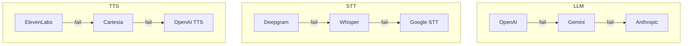

# Provider Outage Runbook

This runbook covers procedures for handling outages from external service providers (OpenAI, Deepgram, ElevenLabs, LiveKit, etc.).

---

## Provider Status Pages

### Quick Links

| Provider | Status Page | Support |
|----------|-------------|---------|
| **OpenAI** | [status.openai.com](https://status.openai.com) | support@openai.com |
| **Deepgram** | [status.deepgram.com](https://status.deepgram.com) | support@deepgram.com |
| **ElevenLabs** | [status.elevenlabs.io](https://status.elevenlabs.io) | support@elevenlabs.io |
| **LiveKit** | [status.livekit.io](https://status.livekit.io) | support@livekit.io |
| **Supabase** | [status.supabase.com](https://status.supabase.com) | support@supabase.io |
| **Clerk** | [status.clerk.com](https://status.clerk.com) | support@clerk.com |
| **Fly.io** | [status.fly.io](https://status.fly.io) | support@fly.io |
| **Upstash** | [status.upstash.com](https://status.upstash.com) | support@upstash.com |

---

## Detection

### Signs of Provider Outage

| Symptom | Likely Provider |
|---------|-----------------|
| LLM responses failing | OpenAI / Gemini |
| Transcription not working | Deepgram |
| TTS audio not generating | ElevenLabs / Cartesia |
| Voice calls not connecting | LiveKit |
| Auth failing for all users | Clerk |
| Database connections failing | Supabase |
| Cache timeouts | Upstash |

### Verification Steps

```bash
# Check our error logs
fly logs -a vora-api-production | grep -E "openai|deepgram|elevenlabs|livekit"

# Check specific provider health
curl https://api.openai.com/v1/models -H "Authorization: Bearer $OPENAI_API_KEY"

# Check internal health endpoint
curl https://api.vora.ai/health
```

---

## LLM Outages (OpenAI / Gemini)

### Impact

- AI responses fail
- Agent conversations stop working
- High error rates in session service

### Detection

```bash
# Check for OpenAI errors in logs
fly logs -a vora-api-production | grep "openai" | grep -i "error"

# Common error messages:
# - "429 Too Many Requests"
# - "503 Service Unavailable"
# - "Connection timeout"
```

### Fallback Procedure

```bash
# 1. Enable fallback to secondary provider
fly secrets set LLM_FALLBACK_ENABLED=true -a vora-api-production

# 2. Switch primary provider (if needed)
fly secrets set LLM_PRIMARY_PROVIDER=gemini -a vora-api-production

# 3. Monitor for recovery
# Check status.openai.com
```

### Configuration

```typescript
// config/llm.ts
export const llmConfig = {
  providers: {
    primary: process.env.LLM_PRIMARY_PROVIDER || 'openai',
    fallback: process.env.LLM_FALLBACK_PROVIDER || 'gemini',
    fallbackEnabled: process.env.LLM_FALLBACK_ENABLED === 'true',
  },
  timeout: 30000,
  retries: 3,
};
```

### Recovery

```bash
# Once OpenAI is back:
# 1. Verify OpenAI is responding
curl https://api.openai.com/v1/models -H "Authorization: Bearer $OPENAI_API_KEY"

# 2. Disable fallback (optional, can keep for resilience)
fly secrets set LLM_FALLBACK_ENABLED=false -a vora-api-production

# 3. Switch back to primary
fly secrets set LLM_PRIMARY_PROVIDER=openai -a vora-api-production
```

---

## Speech-to-Text Outages (Deepgram)

### Impact

- User speech not transcribed
- Agent can't hear users
- Complete voice functionality broken

### Detection

```bash
# Check for Deepgram errors
fly logs -a vora-api-production | grep "deepgram" | grep -i "error"

# Test Deepgram directly
curl -X POST "https://api.deepgram.com/v1/listen" \
  -H "Authorization: Token $DEEPGRAM_API_KEY" \
  -H "Content-Type: audio/wav" \
  --data-binary @test-audio.wav
```

### Fallback Procedure

```bash
# 1. Enable Whisper fallback (slower but reliable)
fly secrets set STT_FALLBACK_ENABLED=true -a vora-api-production
fly secrets set STT_FALLBACK_PROVIDER=whisper -a vora-api-production

# 2. Note: Whisper has higher latency
# Consider notifying users of degraded experience
```

### Alternative: Google Speech-to-Text

```bash
# If Whisper also struggling
fly secrets set STT_FALLBACK_PROVIDER=google -a vora-api-production

# Requires Google Cloud credentials
fly secrets set GOOGLE_APPLICATION_CREDENTIALS="..." -a vora-api-production
```

---

## Text-to-Speech Outages (ElevenLabs)

### Impact

- Agent can't speak
- Voice sessions silent on agent side
- TTS requests failing

### Detection

```bash
# Check for ElevenLabs errors
fly logs -a vora-api-production | grep "elevenlabs" | grep -i "error"

# Test ElevenLabs directly
curl -X POST "https://api.elevenlabs.io/v1/text-to-speech/rachel" \
  -H "xi-api-key: $ELEVENLABS_API_KEY" \
  -H "Content-Type: application/json" \
  -d '{"text": "Hello world"}'
```

### Fallback Procedure

```bash
# 1. Enable Cartesia fallback
fly secrets set TTS_FALLBACK_ENABLED=true -a vora-api-production
fly secrets set TTS_FALLBACK_PROVIDER=cartesia -a vora-api-production

# 2. Alternative: OpenAI TTS
fly secrets set TTS_FALLBACK_PROVIDER=openai -a vora-api-production
```

### Voice Mapping

When switching providers, voice quality may differ:

| ElevenLabs Voice | Cartesia Equivalent | OpenAI Equivalent |
|------------------|---------------------|-------------------|
| rachel | emma | alloy |
| adam | michael | echo |
| bella | olivia | nova |

```bash
# Update voice mappings if needed
fly secrets set TTS_VOICE_MAPPING='{"rachel":"emma","adam":"michael"}' -a vora-api-production
```

---

## LiveKit Outages

### Impact

- Voice sessions can't be created
- Existing sessions may drop
- WebRTC connections failing

### Detection

```bash
# Check LiveKit errors
fly logs -a vora-api-production | grep "livekit" | grep -i "error"

# Check LiveKit cloud status
curl https://api.livekit.cloud/health
```

### Mitigation

LiveKit Cloud has built-in redundancy. If issues persist:

```bash
# 1. Check if it's our config
fly secrets list -a vora-api-production | grep LIVEKIT

# 2. Verify credentials
# Use LiveKit CLI to test

# 3. Contact LiveKit support
# support@livekit.io with your Cloud project ID
```

### No Direct Fallback

LiveKit is our core real-time infrastructure. No simple fallback exists.

**Mitigation options:**
1. Enable degraded mode (audio only, lower quality)
2. Queue sessions for retry
3. Notify users of temporary unavailability

```bash
# Enable degraded mode
fly secrets set LIVEKIT_DEGRADED_MODE=true -a vora-api-production
```

---

## Authentication Outages (Clerk)

### Impact

- Users can't log in
- API requests failing with 401
- Dashboard inaccessible

### Detection

```bash
# Check Clerk errors
fly logs -a vora-api-production | grep "clerk" | grep -i "error"

# Check Clerk status page
# status.clerk.com
```

### Mitigation

```bash
# 1. Enable session cache (if not already)
# Allows existing sessions to work

# 2. For backend-to-backend, use fallback auth
# API keys as backup for critical operations
fly secrets set FALLBACK_AUTH_ENABLED=true -a vora-api-production
```

### No Easy Fallback

Authentication is critical and Clerk has no drop-in replacement.

**Communication:**
1. Notify users via status page
2. Notify support team
3. Extend session timeouts if possible

---

## Database Outages (Supabase)

See [Database Runbook](/internal/runbooks/database) for detailed procedures.

### Quick Actions

```bash
# 1. Check Supabase status
# status.supabase.com

# 2. Check connection pool
# Supabase dashboard > Database > Connection Pooling

# 3. Enable read replica if write issues
fly secrets set USE_READ_REPLICA=true -a vora-api-production
```

---

## Multi-Provider Outage

If multiple providers are down simultaneously:

### Triage Priority

1. **Authentication** - Users can't access anything
2. **Database** - No data operations possible
3. **LiveKit** - Voice functionality broken
4. **LLM** - AI responses failing
5. **STT/TTS** - Voice input/output broken

### Communication Template

```markdown
**Service Disruption Notice**

We're experiencing issues with our voice AI service due to
outages at multiple upstream providers.

**Affected:**
- Voice calls may fail or have degraded quality
- Response times may be slower

**What we're doing:**
- Monitoring provider status pages
- Enabling fallback systems where possible
- Will update every 15 minutes

**Status:** Monitoring
**Last updated:** 14:00 UTC
```

---

## General Fallback Architecture



### Enable All Fallbacks

```bash
# Enable comprehensive fallback mode
fly secrets set \
  LLM_FALLBACK_ENABLED=true \
  STT_FALLBACK_ENABLED=true \
  TTS_FALLBACK_ENABLED=true \
  -a vora-api-production
```

---

## Monitoring After Recovery

### Verify Services Restored

```bash
# Full health check
curl https://api.vora.ai/health | jq

# Test voice session creation
# Via internal testing tool

# Check error rates returning to normal
# Via monitoring dashboard
```

### Post-Outage Review

1. Document timeline of events
2. Note which fallbacks were used
3. Evaluate fallback performance
4. Update runbook if needed

---

## Related Documentation

<CardGroup cols={2}>
  <Card title="Incident Response" icon="bell" href="/internal/runbooks/incident-response">
    General incident handling
  </Card>
  <Card title="Database Runbook" icon="database" href="/internal/runbooks/database">
    Database issues
  </Card>
  <Card title="Rollback Procedures" icon="rotate-left" href="/internal/deployment/rollback">
    How to rollback
  </Card>
  <Card title="Architecture: Providers" icon="puzzle-piece" href="/internal/architecture/providers">
    Provider architecture
  </Card>
</CardGroup>
