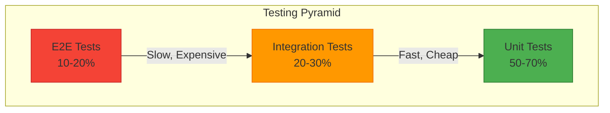

# Testing Overview

This document outlines the testing philosophy, strategies, and tools used across the Vora platform.

---

## Testing Philosophy

### Core Principles

1. **Test behavior, not implementation** - Tests should verify what code does, not how it does it
2. **Fast feedback loops** - Tests should run quickly to encourage frequent execution
3. **Reliable tests** - Flaky tests are worse than no tests
4. **Appropriate coverage** - Focus on critical paths, not 100% coverage

### Testing Pyramid



---

## Test Types

### Unit Tests

Test individual functions and classes in isolation.

| Aspect | Guideline |
|--------|-----------|
| Scope | Single function/method |
| Dependencies | Mocked |
| Speed | < 50ms per test |
| Coverage target | 80%+ for services |

**Example:**

```typescript
describe('calculateSessionCost', () => {
  it('calculates cost based on duration and rate', () => {
    const cost = calculateSessionCost({
      durationMs: 60000, // 1 minute
      ratePerMinute: 0.05,
    });

    expect(cost).toBe(0.05);
  });
});
```

### Integration Tests

Test interactions between components.

| Aspect | Guideline |
|--------|-----------|
| Scope | Multiple components |
| Dependencies | Real or containerized |
| Speed | < 5s per test |
| Coverage target | Critical paths |

**Example:**

```typescript
describe('AgentService.create', () => {
  it('creates agent and triggers welcome email', async () => {
    const agent = await agentService.create('user_123', {
      name: 'Test Agent',
      llm: { provider: 'openai', model: 'gpt-4' },
    });

    expect(agent.id).toBeDefined();
    expect(emailQueue.add).toHaveBeenCalledWith(
      'welcome',
      expect.objectContaining({ agentId: agent.id })
    );
  });
});
```

### E2E Tests

Test complete user flows.

| Aspect | Guideline |
|--------|-----------|
| Scope | Full user journey |
| Dependencies | Real services |
| Speed | < 30s per test |
| Coverage target | Happy paths + critical errors |

**Example:**

```typescript
test('user can create and test an agent', async ({ page }) => {
  await page.goto('/agents/new');
  await page.fill('[name="name"]', 'Test Agent');
  await page.click('button[type="submit"]');

  await expect(page.locator('.toast-success')).toBeVisible();
  await expect(page).toHaveURL(/\/agents\/ag_/);
});
```

---

## Testing Tools

### Test Runners

| Tool | Use Case | Configuration |
|------|----------|---------------|
| Vitest | Unit & Integration (Node) | `vitest.config.ts` |
| Playwright | E2E & Browser | `playwright.config.ts` |
| Jest | Legacy tests | `jest.config.js` |

### Supporting Libraries

| Library | Purpose |
|---------|---------|
| `@testing-library/react` | React component testing |
| `msw` | API mocking |
| `supertest` | HTTP testing |
| `testcontainers` | Docker-based testing |
| `@faker-js/faker` | Test data generation |

---

## Test Organization

### Directory Structure

```
ventus-voice/
├── backend/
│   ├── src/
│   │   └── services/
│   │       └── agent.service.ts
│   └── tests/
│       ├── unit/
│       │   └── services/
│       │       └── agent.service.test.ts
│       ├── integration/
│       │   └── api/
│       │       └── agents.test.ts
│       ├── fixtures/
│       │   └── agents.ts
│       └── mocks/
│           └── prisma.ts
│
├── frontend/
│   ├── src/
│   │   └── components/
│   │       └── AgentCard.tsx
│   └── tests/
│       ├── components/
│       │   └── AgentCard.test.tsx
│       └── e2e/
│           └── agents.spec.ts
```

### File Naming

| Type | Pattern | Example |
|------|---------|---------|
| Unit test | `*.test.ts` | `agent.service.test.ts` |
| Integration test | `*.test.ts` | `agents.api.test.ts` |
| E2E test | `*.spec.ts` | `agents.spec.ts` |
| Test fixtures | `*.fixture.ts` | `agent.fixture.ts` |

---

## Test Configuration

### Vitest Configuration

```typescript
// vitest.config.ts
import { defineConfig } from 'vitest/config';
import path from 'path';

export default defineConfig({
  test: {
    globals: true,
    environment: 'node',
    include: ['tests/**/*.test.ts'],
    exclude: ['tests/e2e/**'],
    coverage: {
      provider: 'v8',
      reporter: ['text', 'html', 'lcov'],
      exclude: ['**/node_modules/**', '**/tests/**'],
    },
    setupFiles: ['tests/setup.ts'],
    testTimeout: 10000,
  },
  resolve: {
    alias: {
      '@': path.resolve(__dirname, './src'),
    },
  },
});
```

### Playwright Configuration

```typescript
// playwright.config.ts
import { defineConfig, devices } from '@playwright/test';

export default defineConfig({
  testDir: './tests/e2e',
  fullyParallel: true,
  forbidOnly: !!process.env.CI,
  retries: process.env.CI ? 2 : 0,
  workers: process.env.CI ? 1 : undefined,
  reporter: [['html'], ['json', { outputFile: 'test-results/results.json' }]],

  use: {
    baseURL: 'http://localhost:3000',
    trace: 'on-first-retry',
    screenshot: 'only-on-failure',
  },

  projects: [
    { name: 'chromium', use: { ...devices['Desktop Chrome'] } },
    { name: 'firefox', use: { ...devices['Desktop Firefox'] } },
    { name: 'mobile', use: { ...devices['iPhone 13'] } },
  ],

  webServer: {
    command: 'npm run dev',
    url: 'http://localhost:3000',
    reuseExistingServer: !process.env.CI,
  },
});
```

---

## Running Tests

### CLI Commands

```bash
# Run all unit tests
npm run test

# Run tests in watch mode
npm run test:watch

# Run with coverage
npm run test:coverage

# Run integration tests
npm run test:integration

# Run E2E tests
npm run test:e2e

# Run specific test file
npm run test -- agent.service.test.ts

# Run tests matching pattern
npm run test -- --grep "creates agent"
```

### IDE Integration

**VS Code settings:**

```json
// .vscode/settings.json
{
  "vitest.enable": true,
  "vitest.commandLine": "npx vitest",
  "testing.automaticallyOpenPeekView": "failureInVisibleDocument"
}
```

---

## CI/CD Integration

### GitHub Actions

```yaml
# .github/workflows/test.yml
name: Tests

on: [push, pull_request]

jobs:
  unit:
    runs-on: ubuntu-latest
    steps:
      - uses: actions/checkout@v4
      - uses: actions/setup-node@v4
        with:
          node-version: '20'
          cache: 'npm'
      - run: npm ci
      - run: npm run test:coverage
      - uses: codecov/codecov-action@v4

  integration:
    runs-on: ubuntu-latest
    services:
      postgres:
        image: postgres:15
        env:
          POSTGRES_DB: test
          POSTGRES_PASSWORD: test
        ports:
          - 5432:5432
      redis:
        image: redis:7
        ports:
          - 6379:6379
    steps:
      - uses: actions/checkout@v4
      - uses: actions/setup-node@v4
      - run: npm ci
      - run: npm run test:integration

  e2e:
    runs-on: ubuntu-latest
    steps:
      - uses: actions/checkout@v4
      - uses: actions/setup-node@v4
      - run: npm ci
      - run: npx playwright install --with-deps
      - run: npm run test:e2e
      - uses: actions/upload-artifact@v4
        if: failure()
        with:
          name: playwright-report
          path: playwright-report/
```

---

## Coverage Requirements

### Minimum Coverage

| Area | Line Coverage | Branch Coverage |
|------|---------------|-----------------|
| Services | 80% | 70% |
| API Routes | 70% | 60% |
| Utilities | 90% | 80% |
| Components | 60% | 50% |
| Overall | 75% | 65% |

### Exclusions

```typescript
// vitest.config.ts
coverage: {
  exclude: [
    '**/node_modules/**',
    '**/tests/**',
    '**/*.d.ts',
    '**/index.ts',           // Barrel files
    '**/types/**',           // Type definitions
    '**/migrations/**',      // Database migrations
    '**/scripts/**',         // Build scripts
  ],
}
```

---

## Related Documentation

<CardGroup cols={2}>
  <Card title="Unit Testing" icon="cube" href="/internal/testing/unit">
    Unit test patterns
  </Card>
  <Card title="Integration Testing" icon="layer-group" href="/internal/testing/integration">
    API and service testing
  </Card>
  <Card title="E2E Testing" icon="browser" href="/internal/testing/e2e">
    End-to-end testing
  </Card>
  <Card title="Security Testing" icon="shield" href="/internal/testing/security">
    Security test patterns
  </Card>
</CardGroup>
