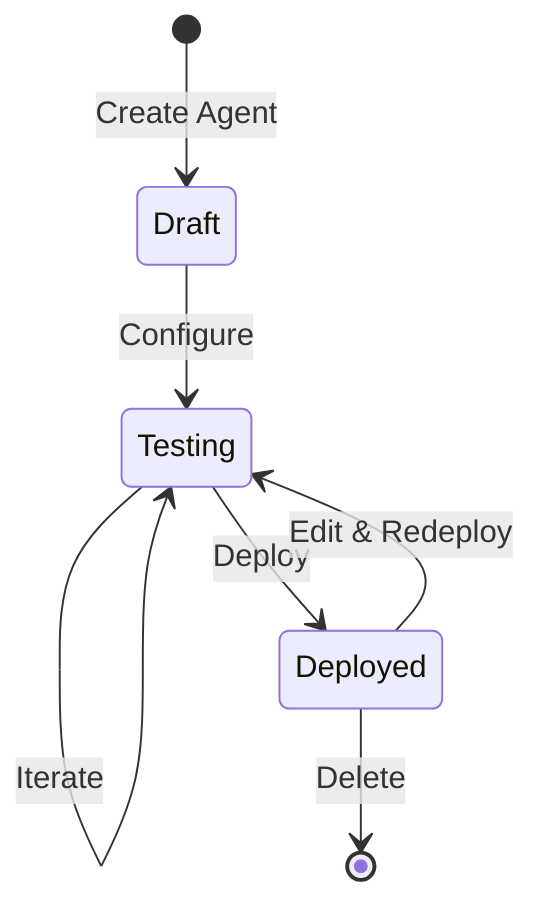

# Agents

Agents are the heart of Vora. Each agent is a voice AI assistant that can handle conversations, answer questions, and take actions on your behalf.

---

## What is an Agent?

A Vora agent is a voice AI that can:

- **Converse naturally** - Understands and responds to human speech in real-time
- **Answer questions** - Uses your knowledge base to provide accurate information
- **Take actions** - Executes functions like booking appointments or updating CRM records
- **Escalate** - Transfers to human agents when needed

---

## Creation Methods

Vora offers three ways to create agents, each suited for different needs:

<CardGroup cols={3}>
  <Card title="Interview" icon="microphone" href="/platform/agents/interview">
    **Best for beginners**

    Vora asks you questions and builds the agent for you.
  </Card>
  <Card title="URL Import" icon="globe" href="/platform/agents/url-import">
    **Best for existing content**

    Import your website or documentation to create an agent.
  </Card>
  <Card title="Prompt Mode" icon="code" href="/platform/agents/prompt-mode">
    **Best for developers**

    Write the system prompt directly for maximum control.
  </Card>
</CardGroup>

### Method Comparison

| Feature | Interview | URL Import | Prompt Mode |
|---------|-----------|------------|-------------|
| Ease of use | Easiest | Easy | Advanced |
| Time to create | 5-10 min | 2-5 min | 10-30 min |
| Customization | Medium | Low | Full |
| Best for | First-time users | Documentation agents | Complex use cases |
| Knowledge included | Conversational | Extracted from URL | Manual |

---

## Agent Lifecycle

1. **Draft** - Agent is created but not yet configured
2. **Testing** - Agent is configured and being tested in simulator
3. **Deployed** - Agent is live and handling calls
4. **Archived** - Agent is soft-deleted (recoverable for 30 days)

---

## Quick Start

Create your first agent in just a few steps:

<Steps>
  <Step title="Choose a method">
    Go to **Agents** → **Create Agent** and select Interview, URL Import, or Prompt Mode.
  </Step>
  <Step title="Configure basics">
    Set the agent's name, description, and primary use case.
  </Step>
  <Step title="Select voice">
    Choose a voice from our library or use your own custom voice.
  </Step>
  <Step title="Test thoroughly">
    Use the simulator to test various scenarios before going live.
  </Step>
  <Step title="Deploy">
    Click Deploy and connect to a phone number or web widget.
  </Step>
</Steps>

---

## Agent Components

Every agent consists of:

### System Prompt
The instructions that define your agent's behavior, personality, and capabilities.

### Voice Configuration
- **Voice** - The TTS voice used for speech
- **Language** - Primary language(s) the agent speaks
- **Speed** - Speech rate adjustment

### AI Model
- **LLM Provider** - OpenAI, Google, Anthropic, etc.
- **Model** - GPT-4, Gemini Pro, Claude, etc.
- **Temperature** - Creativity vs consistency

### Knowledge Base (Optional)
Documents and websites that provide information for the agent to reference.

### Functions (Optional)
Custom actions the agent can take, like booking appointments or querying databases.

### Integrations (Optional)
Connected services like CRM, calendar, or messaging platforms.

---

## Documentation

<CardGroup cols={2}>
  <Card title="Interview Method" icon="microphone" href="/platform/agents/interview">
    Step-by-step guide to the conversational creation flow
  </Card>
  <Card title="URL Import" icon="globe" href="/platform/agents/url-import">
    Create agents from your website or docs
  </Card>
  <Card title="Prompt Mode" icon="code" href="/platform/agents/prompt-mode">
    Full control with custom prompts
  </Card>
  <Card title="Configuration" icon="sliders" href="/platform/agents/configuration">
    All settings and options explained
  </Card>
  <Card title="Testing" icon="flask" href="/platform/agents/testing">
    How to test before going live
  </Card>
  <Card title="Deployment" icon="rocket" href="/platform/agents/deployment">
    Deploy and monitor your agent
  </Card>
  <Card title="Versions" icon="clock-rotate-left" href="/platform/agents/versions">
    Version control and rollback
  </Card>
</CardGroup>
