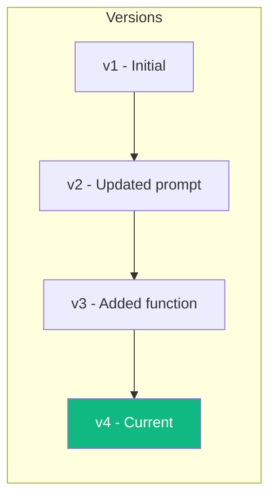
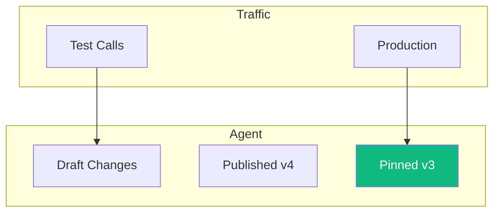

# Version Management

Vora automatically versions your agent configuration, allowing you to track changes, compare versions, and rollback if needed.

---

## How Versioning Works

Every time you deploy an agent, Vora creates a new version:



### What's Versioned

| Component | Versioned | Notes |
|-----------|-----------|-------|
| **System prompt** | ✓ | Full prompt text |
| **Model settings** | ✓ | Temperature, max tokens, etc. |
| **Voice settings** | ✓ | Voice, speed, provider |
| **Functions** | ✓ | Connected functions and configs |
| **Knowledge bases** | Reference | Points to KB version |
| **Integrations** | Reference | Connection settings |

### What's Not Versioned

- API keys (managed separately)
- Phone number assignments
- Billing settings
- Team permissions

---

## Viewing Version History

<Steps>
  <Step title="Open Version History">
    Go to **Agent** → **Settings** → **Versions**.
  </Step>
  <Step title="Browse Versions">
    See a list of all versions with:
    - Version number
    - Creation date
    - Creator (team member)
    - Change summary
  </Step>
  <Step title="View Details">
    Click any version to see the full configuration at that point in time.
  </Step>
</Steps>

### Version List

| Version | Created | By | Changes |
|---------|---------|-----|---------|
| v4 (current) | Jan 15, 2024 | Sarah | Added order lookup function |
| v3 | Jan 14, 2024 | Mike | Updated greeting message |
| v2 | Jan 10, 2024 | Sarah | Changed voice to Emma |
| v1 | Jan 5, 2024 | Sarah | Initial creation |

---

## Comparing Versions

Compare any two versions to see what changed:

<Steps>
  <Step title="Select versions">
    In the version history, select two versions to compare.
  </Step>
  <Step title="View diff">
    See a side-by-side comparison highlighting:
    - Added content (green)
    - Removed content (red)
    - Modified settings
  </Step>
</Steps>

### Example Diff

```diff
System Prompt:
- You are a helpful customer support agent.
+ You are a friendly customer support agent for TechCorp.
+ You specialize in technical troubleshooting.

Model Settings:
  temperature: 0.7
- max_tokens: 200
+ max_tokens: 300

Functions:
+ order_lookup (new)
```

---

## Rolling Back

If a new version causes issues, rollback to a previous version:

<Steps>
  <Step title="Find the version">
    Go to **Versions** and find the version you want to restore.
  </Step>
  <Step title="Preview the rollback">
    Click **Preview Rollback** to see what will change.
  </Step>
  <Step title="Confirm rollback">
    Click **Rollback to This Version** to apply.
  </Step>
  <Step title="Verify">
    Test the agent to ensure it's working as expected.
  </Step>
</Steps>

<Warning>
  Rolling back creates a new version (e.g., v5) with the old configuration. The version history is preserved.
</Warning>

### Quick Rollback via API

```javascript
// Rollback to a specific version
await vora.agents.rollback('agent_abc123', {
  version: 3,
  reason: 'v4 causing increased error rate',
});
```

---

## Version Naming

Add descriptive names to versions for easier identification:

### Adding a Name

```javascript
await vora.agents.update('agent_abc123', {
  versionName: 'Holiday Greeting Update',
  versionNotes: 'Updated greeting for holiday season',
});
```

### Named Versions

| Version | Name | Created |
|---------|------|---------|
| v4 | Holiday Greeting Update | Jan 15, 2024 |
| v3 | Performance Optimization | Jan 14, 2024 |
| v2 | New Voice | Jan 10, 2024 |
| v1 | Initial Release | Jan 5, 2024 |

---

## Version Pinning

For critical deployments, pin a specific version:

### How Pinning Works



### Setting a Pinned Version

```javascript
// Pin to specific version for production
await vora.agents.update('agent_abc123', {
  pinnedVersion: 3,
});

// Unpin to use latest
await vora.agents.update('agent_abc123', {
  pinnedVersion: null,
});
```

<Tip>
  Use version pinning when making experimental changes. Test with the draft, then update the pinned version once validated.
</Tip>

---

## Branching (Enterprise)

Enterprise plans support version branching for A/B testing:

### Creating a Branch

```javascript
// Create a branch from current version
const branch = await vora.agents.createBranch('agent_abc123', {
  name: 'experiment-new-voice',
  baseVersion: 4,
});

// Make changes to branch
await vora.agents.update(branch.id, {
  voice: 'emma',
});

// Split traffic
await vora.agents.setTrafficSplit('agent_abc123', {
  main: 80, // 80% to main
  'experiment-new-voice': 20, // 20% to branch
});
```

### Branch Metrics

Compare performance across branches:

| Branch | Calls | Completion Rate | Avg Duration | Sentiment |
|--------|-------|-----------------|--------------|-----------|
| main | 1,000 | 82% | 3:45 | 0.72 |
| experiment-new-voice | 250 | 85% | 3:30 | 0.78 |

---

## Version Lifecycle

### Automatic Cleanup

Old versions are retained based on your plan:

| Plan | Version Retention |
|------|-------------------|
| Free | Last 10 versions |
| Pro | Last 50 versions |
| Enterprise | Unlimited |

### Manual Deletion

Delete specific versions (cannot delete current or pinned):

```javascript
await vora.agents.deleteVersion('agent_abc123', {
  version: 2,
});
```

---

## Best Practices

<AccordionGroup>
  <Accordion title="Use descriptive version names">
    Instead of relying on version numbers, add names like "Holiday Campaign" or "New KB Integration" for easier tracking.
  </Accordion>

  <Accordion title="Test before deploying">
    Always use test mode sessions before publishing a new version to production.
  </Accordion>

  <Accordion title="Document changes">
    Add notes to versions explaining why changes were made. This helps when debugging issues later.
  </Accordion>

  <Accordion title="Pin production versions">
    For stable production environments, pin a tested version rather than auto-deploying latest changes.
  </Accordion>

  <Accordion title="Use branches for experiments">
    Don't modify production directly. Create a branch, test with split traffic, then merge if successful.
  </Accordion>
</AccordionGroup>

---

## Audit Trail

Every version change is logged:

| Action | User | Time | Details |
|--------|------|------|---------|
| Created v4 | sarah@company.com | Jan 15, 10:30 | Added order lookup function |
| Deployed v4 | sarah@company.com | Jan 15, 10:32 | Published to production |
| Rollback to v3 | mike@company.com | Jan 15, 14:00 | Error rate increase |
| Created v5 | sarah@company.com | Jan 15, 15:00 | Fixed function bug |

Access audit logs in **Settings** → **Audit Log**.

---

## API Reference

### List Versions

```javascript
const versions = await vora.agents.listVersions('agent_abc123');

// Response
{
  "versions": [
    {
      "version": 4,
      "name": "Holiday Update",
      "createdAt": "2024-01-15T10:30:00Z",
      "createdBy": "user_123",
      "isCurrent": true,
      "isPinned": false
    },
    // ...more versions
  ]
}
```

### Get Version Details

```javascript
const version = await vora.agents.getVersion('agent_abc123', 3);

// Returns full configuration at that version
```

### Restore Version

```javascript
await vora.agents.restoreVersion('agent_abc123', {
  version: 3,
  reason: 'Rolling back due to issues',
});
```

---

## Next Steps

<CardGroup cols={2}>
  <Card title="Testing" icon="flask" href="/platform/agents/testing">
    Test changes before deploying
  </Card>
  <Card title="Deployment" icon="rocket" href="/platform/agents/deployment">
    Deploy your agent
  </Card>
  <Card title="Analytics" icon="chart-line" href="/platform/analytics">
    Monitor version performance
  </Card>
  <Card title="API Reference" icon="code" href="/api/agents">
    Agents API documentation
  </Card>
</CardGroup>
