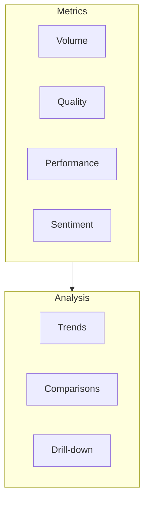
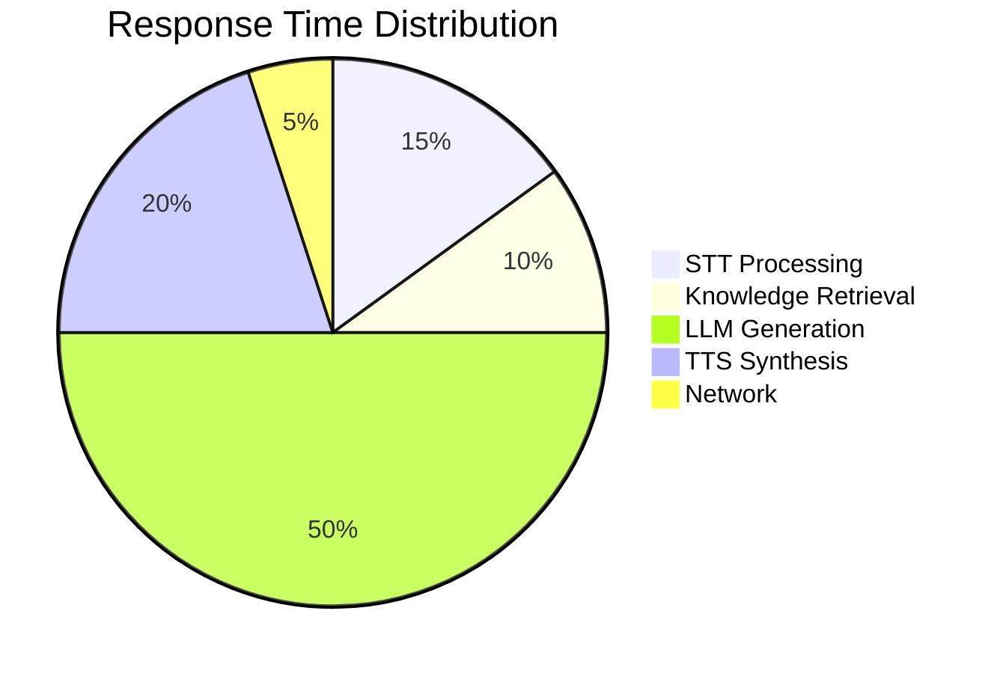

# Analytics

Monitor your agent's performance, understand user behavior, and optimize conversations with Vora's analytics dashboard.

---

## Dashboard Overview

The analytics dashboard provides a comprehensive view of your agent's performance:



---

## Key Metrics

### Volume Metrics

| Metric | Description | Target |
|--------|-------------|--------|
| **Total Sessions** | Number of conversations | Varies |
| **Unique Users** | Distinct callers | Varies |
| **Peak Hours** | Busiest times | For planning |
| **Average Duration** | Typical call length | &lt;5 min |

### Quality Metrics

| Metric | Description | Target |
|--------|-------------|--------|
| **Completion Rate** | Calls resolved by agent | >80% |
| **Escalation Rate** | Transferred to human | &lt;20% |
| **First Call Resolution** | Resolved without callback | >75% |
| **Knowledge Base Usage** | KB queries per session | Varies |

### Performance Metrics

| Metric | Description | Target |
|--------|-------------|--------|
| **Response Time** | Time to first response | &lt;500ms |
| **Total Latency** | End-to-end delay | &lt;1.5s |
| **Error Rate** | Failed sessions | &lt;1% |
| **Uptime** | Service availability | >99.9% |

### Sentiment Metrics

| Metric | Description | Target |
|--------|-------------|--------|
| **Average Sentiment** | Overall caller mood | >0.5 |
| **Positive Rate** | % positive interactions | >70% |
| **Negative Rate** | % negative interactions | &lt;10% |
| **Sentiment Trend** | Change over time | Improving |

---

## Dashboard Views

### Overview

The main dashboard shows:

- **Key metrics cards** - Top-line numbers at a glance
- **Trend charts** - Volume and quality over time
- **Agent comparison** - Performance across agents
- **Recent activity** - Latest sessions

### Time Ranges

Select time ranges for analysis:

| Range | Use Case |
|-------|----------|
| **Today** | Real-time monitoring |
| **Last 7 days** | Weekly trends |
| **Last 30 days** | Monthly performance |
| **Custom** | Specific date ranges |

### Filters

Filter data by:

- **Agent** - Specific agent or all
- **Channel** - Phone, web, app
- **Outcome** - Completed, escalated, abandoned
- **Sentiment** - Positive, neutral, negative

---

## Volume Analytics

### Session Trends

View session volume over time:

```
Sessions per Day (Last 30 Days)
│
│    ╭─╮    ╭─╮
│   ╭╯ ╰─╮ ╭╯ ╰╮
│ ╭─╯    ╰─╯   ╰─╮
│─╯               ╰──
└─────────────────────
  Mon    Wed    Fri
```

### Peak Hours

Identify busiest times:

| Hour | Sessions | % of Total |
|------|----------|------------|
| 9 AM | 145 | 12% |
| 10 AM | 178 | 15% |
| 11 AM | 156 | 13% |
| 2 PM | 142 | 12% |
| 3 PM | 134 | 11% |

### Geographic Distribution

See where your calls originate:

| Region | Sessions | % |
|--------|----------|---|
| United States | 5,234 | 65% |
| United Kingdom | 1,245 | 15% |
| Canada | 823 | 10% |
| Australia | 412 | 5% |
| Other | 400 | 5% |

---

## Quality Analytics

### Completion Analysis

Understand how conversations end:

| Outcome | Count | % | Trend |
|---------|-------|---|-------|
| **Resolved** | 4,512 | 72% | ↑ 5% |
| **Escalated** | 1,124 | 18% | ↓ 3% |
| **Abandoned** | 378 | 6% | → 0% |
| **Error** | 250 | 4% | ↓ 2% |

### Escalation Reasons

Why calls are transferred to humans:

| Reason | Count | % |
|--------|-------|---|
| User requested | 534 | 48% |
| Complex issue | 312 | 28% |
| Agent uncertain | 178 | 16% |
| Policy requirement | 100 | 8% |

### Knowledge Base Performance

How well the KB serves users:

| Metric | Value |
|--------|-------|
| **KB queries** | 12,456 |
| **Successful retrievals** | 11,234 (90%) |
| **Zero results** | 456 (4%) |
| **Low confidence** | 766 (6%) |

---

## Performance Analytics

### Latency Breakdown

Understand response time components:



### Error Analysis

Track and diagnose errors:

| Error Type | Count | % | Status |
|------------|-------|---|--------|
| Timeout | 45 | 36% | Investigating |
| API failure | 28 | 22% | Resolved |
| Connection lost | 25 | 20% | Monitoring |
| Auth error | 15 | 12% | Fixed |
| Other | 12 | 10% | - |

---

## Sentiment Analytics

### Sentiment Distribution

Overall sentiment breakdown:

| Sentiment | Count | % |
|-----------|-------|---|
| 😊 Positive | 4,234 | 67% |
| 😐 Neutral | 1,456 | 23% |
| 😠 Negative | 623 | 10% |

### Sentiment Trends

Track sentiment changes over time:

```
Average Sentiment Score (Last 30 Days)
│ 0.8
│      ╭───╮    ╭──╮
│ 0.6 ─╯   ╰────╯  ╰──
│ 0.4
│ 0.2
└─────────────────────
    Week 1   2   3   4
```

### Sentiment by Topic

Identify problematic areas:

| Topic | Avg Sentiment | Sessions |
|-------|---------------|----------|
| Billing | 0.45 | 1,234 |
| Technical support | 0.62 | 2,345 |
| Product info | 0.78 | 3,456 |
| Returns | 0.52 | 876 |

---

## Custom Reports

### Building Reports

Create custom reports with:

1. **Metrics** - Select the data points to include
2. **Dimensions** - Group by agent, time, channel, etc.
3. **Filters** - Narrow down the data
4. **Visualization** - Choose chart types

### Scheduled Reports

Automate report delivery:

| Report | Frequency | Recipients |
|--------|-----------|------------|
| Daily Summary | Daily 9 AM | team@company.com |
| Weekly Review | Monday 8 AM | managers@company.com |
| Monthly Executive | 1st of month | executives@company.com |

### Export Options

| Format | Use Case |
|--------|----------|
| CSV | Spreadsheet analysis |
| PDF | Presentations |
| API | Integration with BI tools |

---

## Alerts

### Configuring Alerts

Set up alerts for important events:

<Steps>
  <Step title="Navigate to Alerts">
    Go to **Analytics** → **Alerts**.
  </Step>
  <Step title="Create Alert">
    Click **New Alert** and configure:
    - Metric to monitor
    - Threshold
    - Notification channels
  </Step>
  <Step title="Test">
    Send a test notification to verify setup.
  </Step>
</Steps>

### Alert Types

| Alert | Trigger | Priority |
|-------|---------|----------|
| **Error rate spike** | >5% errors | High |
| **Latency increase** | >2s avg response | Medium |
| **Volume anomaly** | ±50% from normal | Low |
| **Sentiment drop** | &lt;0.3 avg | High |

### Notification Channels

- **Email** - Summary and details
- **Slack** - Real-time notifications
- **Webhook** - Custom integrations
- **PagerDuty** - Incident management

---

## Integrations

### BI Tools

Connect analytics to your existing tools:

| Tool | Connection | Features |
|------|------------|----------|
| **Tableau** | Direct connector | Full data access |
| **Looker** | API | Custom dashboards |
| **Power BI** | Export | Scheduled syncs |
| **Metabase** | API | Self-hosted option |

### Data Warehouse

Export to your data warehouse:

```javascript
// Sync analytics to BigQuery
{
  "destination": "bigquery",
  "project": "my-project",
  "dataset": "vora_analytics",
  "tables": ["sessions", "events", "metrics"],
  "schedule": "hourly"
}
```

---

## Best Practices

<AccordionGroup>
  <Accordion title="Review daily">
    Check the dashboard daily to catch issues early and spot trends.
  </Accordion>

  <Accordion title="Set meaningful alerts">
    Configure alerts for metrics that matter, not everything. Too many alerts leads to alert fatigue.
  </Accordion>

  <Accordion title="Compare time periods">
    Always compare current performance to previous periods to understand trends.
  </Accordion>

  <Accordion title="Drill into anomalies">
    When you see unusual patterns, drill down to individual sessions to understand why.
  </Accordion>

  <Accordion title="Act on insights">
    Analytics are only valuable if you use them. Create a process for reviewing and acting on data.
  </Accordion>
</AccordionGroup>

---

## Next Steps

<CardGroup cols={2}>
  <Card title="Session Details" icon="list" href="/platform/sessions">
    Explore individual conversations
  </Card>
  <Card title="Transcripts" icon="closed-captioning" href="/platform/sessions/transcripts">
    Review conversation transcripts
  </Card>
  <Card title="Recordings" icon="microphone" href="/platform/sessions/recordings">
    Listen to call recordings
  </Card>
  <Card title="API Access" icon="code" href="/api/analytics">
    Query analytics via API
  </Card>
</CardGroup>
