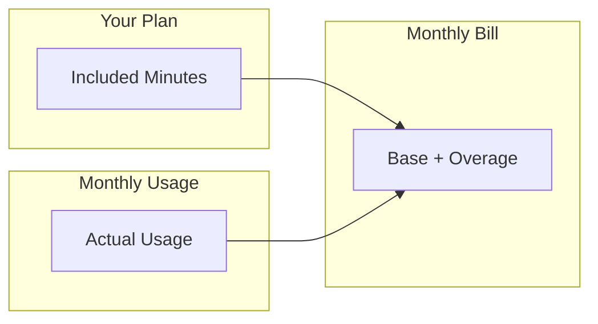

# Billing

Manage your subscription, view usage, and handle payments for your Vora account.

---

## Overview

Vora uses a usage-based pricing model with included minutes per plan:



---

## Billing Dashboard

Access your billing information at **Settings** → **Billing**.

### Dashboard Sections

| Section | Description |
|---------|-------------|
| **Current Plan** | Your subscription tier and limits |
| **Usage This Month** | Minutes used, remaining, projected |
| **Payment Method** | Card on file, billing details |
| **Invoices** | Past and current invoices |
| **Cost Breakdown** | Detailed usage by category |

### Quick Stats

```
┌─────────────────────────────────────────────────────────────┐
│  Current Period: Jan 1 - Jan 31, 2024                       │
├─────────────────────────────────────────────────────────────┤
│  Plan: Growth ($99/mo)                                      │
│  Included: 500 minutes                                      │
│  Used: 347 minutes (69%)                                    │
│  Remaining: 153 minutes                                     │
│  Projected: 485 minutes                                     │
└─────────────────────────────────────────────────────────────┘
```

---

## Understanding Your Bill

### Bill Components

| Component | Description |
|-----------|-------------|
| **Base subscription** | Monthly plan fee |
| **Included minutes** | Minutes bundled with plan |
| **Overage minutes** | Additional minutes beyond included |
| **Phone numbers** | Monthly number rental fees |
| **Add-ons** | Premium features, extra seats |

### Sample Invoice

```
INVOICE #INV-2024-001
Period: January 1-31, 2024

Description                          Qty      Rate        Amount
─────────────────────────────────────────────────────────────────
Growth Plan (Monthly)                 1     $99.00       $99.00
  └─ Includes 500 minutes

Overage Minutes                      75     $0.12        $9.00
  └─ 575 total - 500 included

Phone Numbers
  └─ +1 (800) 555-0123               1      $2.00        $2.00
  └─ +1 (415) 555-0456               1      $1.00        $1.00

─────────────────────────────────────────────────────────────────
                                   Subtotal:           $111.00
                                   Tax (8.5%):           $9.44
                                   ─────────────────────────────
                                   Total:              $120.44
```

---

## Payment Methods

### Accepted Payments

| Method | Description |
|--------|-------------|
| **Credit/Debit Card** | Visa, Mastercard, Amex, Discover |
| **ACH Bank Transfer** | US bank accounts (Growth+) |
| **Wire Transfer** | Enterprise plans only |
| **Invoice** | NET 30 terms (Enterprise) |

### Managing Cards

<Steps>
  <Step title="Go to Billing">
    Navigate to **Settings** → **Billing** → **Payment Methods**.
  </Step>
  <Step title="Add card">
    Click **Add Payment Method** and enter card details.
  </Step>
  <Step title="Set default">
    Choose which card to charge for automatic payments.
  </Step>
  <Step title="Remove old cards">
    Delete cards you no longer want on file.
  </Step>
</Steps>

### Billing Information

Update your billing details:

- **Company name** - For invoice display
- **Billing email** - Where invoices are sent
- **Address** - For tax calculation
- **Tax ID** - VAT/GST number if applicable

---

## Invoices

### Accessing Invoices

1. Go to **Settings** → **Billing** → **Invoices**
2. View all past and current invoices
3. Download as PDF
4. Email to additional recipients

### Invoice Status

| Status | Description |
|--------|-------------|
| **Draft** | Current period, not yet finalized |
| **Open** | Finalized, awaiting payment |
| **Paid** | Payment received |
| **Past Due** | Payment overdue |
| **Void** | Cancelled invoice |

### Automatic Payments

With a card on file, invoices are charged automatically:

- **Attempt 1**: Invoice date
- **Attempt 2**: 3 days later (if failed)
- **Attempt 3**: 7 days later (if failed)
- **Account suspension**: 14 days after first failure

---

## Usage Tracking

### Real-Time Usage

Monitor usage throughout the billing period:

```javascript
// Via API
const usage = await vora.billing.usage.get({
  period: 'current'
});

console.log(`Used: ${usage.minutes.used} minutes`);
console.log(`Remaining: ${usage.minutes.remaining} minutes`);
console.log(`Projected: ${usage.minutes.projected} minutes`);
```

### Usage Breakdown

| Category | Description |
|----------|-------------|
| **Inbound calls** | Calls received on your numbers |
| **Outbound calls** | Calls initiated via API |
| **Web sessions** | Browser-based voice sessions |
| **API sessions** | SDK/API voice sessions |

### Usage by Agent

See which agents consume the most minutes:

| Agent | Sessions | Minutes | % of Total |
|-------|----------|---------|------------|
| Customer Support | 1,247 | 312 | 54% |
| Sales Assistant | 523 | 186 | 32% |
| Appointment Booking | 312 | 78 | 14% |

---

## Alerts & Notifications

### Usage Alerts

Configure alerts to avoid surprises:

| Alert | Trigger |
|-------|---------|
| **50% used** | Half of included minutes consumed |
| **80% used** | Approaching limit |
| **100% used** | Entering overage |
| **Budget reached** | Custom spending limit hit |

### Setting Up Alerts

```javascript
{
  "alerts": {
    "usageThresholds": [50, 80, 100],
    "budgetLimit": 150,  // USD
    "recipients": [
      "billing@company.com",
      "ops@company.com"
    ],
    "channels": ["email", "slack"]
  }
}
```

### Slack Integration

Receive billing alerts in Slack:

1. Go to **Settings** → **Integrations** → **Slack**
2. Select billing alert channel
3. Choose which alerts to receive

---

## Cost Optimization

### Tips to Reduce Costs

<AccordionGroup>
  <Accordion title="Optimize agent responses">
    Shorter, more efficient responses reduce call duration.
    - Remove filler phrases
    - Get to the point quickly
    - Avoid unnecessary confirmations
  </Accordion>

  <Accordion title="Use appropriate LLM">
    Match LLM complexity to task:
    - Simple FAQ → Gemini Flash
    - Complex reasoning → Gemini Pro
    - Saves on per-minute costs
  </Accordion>

  <Accordion title="Set session limits">
    Prevent runaway sessions:
    - Max session duration
    - Idle timeout
    - Turn limits
  </Accordion>

  <Accordion title="Route calls efficiently">
    Not every call needs AI:
    - Transfer simple requests to IVR
    - Route to humans when appropriate
    - Use self-service where possible
  </Accordion>
</AccordionGroup>

### Cost Calculator

Estimate monthly costs:

```
Base Plan:             $99.00
Expected Minutes:      600
Included Minutes:      500
Overage Minutes:       100 × $0.12 = $12.00
Phone Numbers:         2 × $1.50 = $3.00
───────────────────────────────────
Estimated Total:       $114.00/month
```

---

## Enterprise Billing

### Enterprise Features

| Feature | Description |
|---------|-------------|
| **Custom contracts** | Negotiated rates and terms |
| **Volume discounts** | Lower per-minute rates |
| **Invoice payment** | NET 30/60 terms |
| **Dedicated support** | Billing specialist |
| **SLA guarantees** | Uptime and support commitments |

### Annual Contracts

Save with annual billing:

| Plan | Monthly | Annual | Savings |
|------|---------|--------|---------|
| Starter | $29 | $290 | 17% |
| Growth | $99 | $990 | 17% |
| Business | $299 | $2,990 | 17% |

---

## Billing API

### Get Current Usage

```javascript
const usage = await vora.billing.usage.get();

console.log(usage);
// {
//   period: { start: '2024-01-01', end: '2024-01-31' },
//   minutes: { used: 347, included: 500, remaining: 153 },
//   cost: { current: 99.00, projected: 111.00 }
// }
```

### List Invoices

```javascript
const invoices = await vora.billing.invoices.list({
  limit: 12
});

for (const invoice of invoices) {
  console.log(`${invoice.id}: $${invoice.total} - ${invoice.status}`);
}
```

### Download Invoice

```javascript
const pdf = await vora.billing.invoices.download('inv_abc123');

fs.writeFileSync('invoice.pdf', pdf);
```

---

## FAQs

<AccordionGroup>
  <Accordion title="When am I billed?">
    Subscriptions are billed on the anniversary of your sign-up date. Usage is calculated at the end of each billing period.
  </Accordion>

  <Accordion title="Can I change plans mid-cycle?">
    Yes. Upgrades are prorated immediately. Downgrades take effect at the next billing cycle.
  </Accordion>

  <Accordion title="What happens if payment fails?">
    We retry 3 times over 7 days. After 14 days, the account is suspended until payment is received.
  </Accordion>

  <Accordion title="How do I get a refund?">
    Contact support within 30 days of the charge. We review refund requests case-by-case.
  </Accordion>

  <Accordion title="Are there any hidden fees?">
    No hidden fees. You pay for your plan, usage overage, and phone numbers. All fees are shown before purchase.
  </Accordion>
</AccordionGroup>

---

## Next Steps

<CardGroup cols={2}>
  <Card title="Plans & Pricing" icon="tags" href="/platform/billing/plans">
    Compare plan features
  </Card>
  <Card title="Usage Details" icon="chart-pie" href="/platform/billing/usage">
    Detailed usage breakdown
  </Card>
  <Card title="Support" icon="headset" href="/platform/support">
    Billing questions
  </Card>
  <Card title="Enterprise" icon="building" href="/enterprise">
    Custom pricing
  </Card>
</CardGroup>
