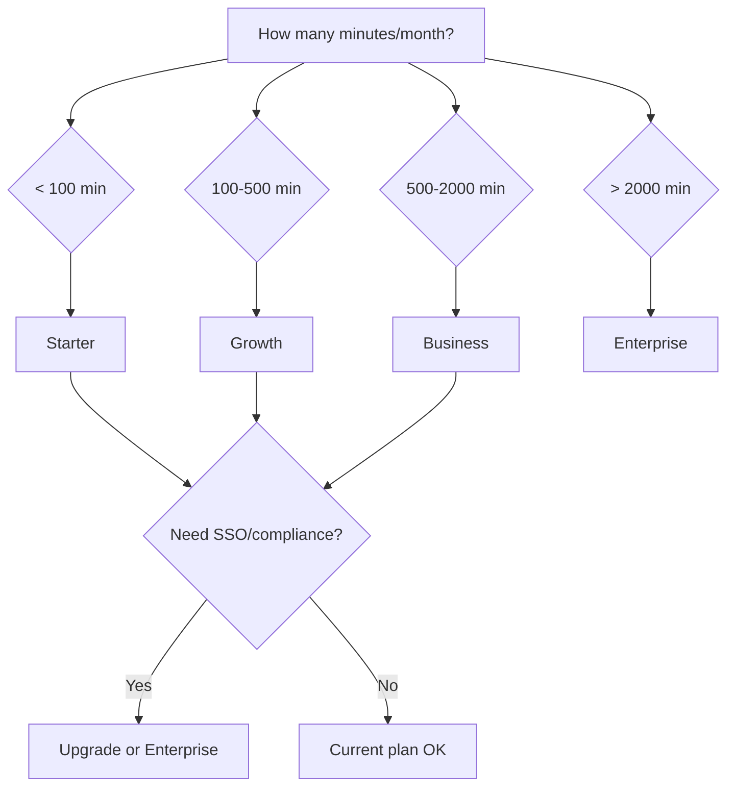

# Plans & Pricing

Vora offers flexible plans to match your voice AI needs, from startups to enterprises.

---

## Plan Comparison

<Tabs>
  <Tab title="Monthly">
    | Feature | Starter | Growth | Business | Enterprise |
    |---------|---------|--------|----------|------------|
    | **Price** | $29/mo | $99/mo | $299/mo | Custom |
    | **Included Minutes** | 100 | 500 | 2,000 | Custom |
    | **Overage Rate** | $0.15/min | $0.12/min | $0.10/min | Custom |
    | **Agents** | 3 | 10 | Unlimited | Unlimited |
    | **Team Members** | 2 | 5 | 20 | Unlimited |
    | **Phone Numbers** | 1 | 5 | 20 | Unlimited |
    | **Knowledge Base** | 10MB | 100MB | 1GB | Unlimited |
    | **Support** | Email | Priority | Dedicated | 24/7 + TAM |
  </Tab>
  <Tab title="Annual (Save 17%)">
    | Feature | Starter | Growth | Business | Enterprise |
    |---------|---------|--------|----------|------------|
    | **Price** | $24/mo | $82/mo | $249/mo | Custom |
    | **Billed** | $290/yr | $990/yr | $2,990/yr | Custom |
    | **Included Minutes** | 100 | 500 | 2,000 | Custom |
    | **Overage Rate** | $0.15/min | $0.12/min | $0.10/min | Custom |
    | **Agents** | 3 | 10 | Unlimited | Unlimited |
    | **Team Members** | 2 | 5 | 20 | Unlimited |
    | **Phone Numbers** | 1 | 5 | 20 | Unlimited |
    | **Knowledge Base** | 10MB | 100MB | 1GB | Unlimited |
    | **Support** | Email | Priority | Dedicated | 24/7 + TAM |
  </Tab>
</Tabs>

---

## Plan Details

### Starter - $29/month

Best for: **Individuals and small projects**

<AccordionGroup>
  <Accordion title="What's Included">
    - 100 minutes/month
    - 3 agents
    - 2 team members
    - 1 phone number
    - 10MB knowledge base
    - Email support (48hr response)
    - Basic analytics
    - Community access
  </Accordion>

  <Accordion title="Limitations">
    - No custom voice cloning
    - No SIP trunking
    - No SSO/SAML
    - No API rate limit increase
    - No dedicated support
  </Accordion>
</AccordionGroup>

---

### Growth - $99/month

Best for: **Growing businesses**

<AccordionGroup>
  <Accordion title="What's Included">
    **Everything in Starter, plus:**
    - 500 minutes/month
    - 10 agents
    - 5 team members
    - 5 phone numbers
    - 100MB knowledge base
    - Priority email support (24hr response)
    - Advanced analytics
    - Webhook integrations
    - Custom voice selection
  </Accordion>

  <Accordion title="Key Upgrades">
    - 5× more minutes
    - More agents for different use cases
    - Priority support queue
    - Advanced reporting
  </Accordion>
</AccordionGroup>

---

### Business - $299/month

Best for: **Scaling operations**

<AccordionGroup>
  <Accordion title="What's Included">
    **Everything in Growth, plus:**
    - 2,000 minutes/month
    - Unlimited agents
    - 20 team members
    - 20 phone numbers
    - 1GB knowledge base
    - Dedicated support (4hr response)
    - Custom voice cloning
    - SIP trunking
    - Advanced security (SSO/SAML)
    - Role-based access control
    - API rate limit increase
    - Audit logs
  </Accordion>

  <Accordion title="Key Upgrades">
    - 4× more minutes than Growth
    - Unlimited agents
    - Enterprise security features
    - Custom voice cloning
    - Dedicated support representative
  </Accordion>
</AccordionGroup>

---

### Enterprise - Custom Pricing

Best for: **Large organizations with custom needs**

<AccordionGroup>
  <Accordion title="What's Included">
    **Everything in Business, plus:**
    - Custom minute packages
    - Unlimited everything
    - 24/7 phone support
    - Technical Account Manager
    - Custom SLAs
    - On-premise deployment option
    - HIPAA/SOC2 compliance
    - Custom integrations
    - Volume discounts
    - Dedicated infrastructure
  </Accordion>

  <Accordion title="Contact Sales">
    [Schedule a call](https://vora.ai/contact-sales) to discuss your requirements.
  </Accordion>
</AccordionGroup>

---

## Feature Breakdown

### Core Features

| Feature | Starter | Growth | Business | Enterprise |
|---------|:-------:|:------:|:--------:|:----------:|
| Voice agents | ✓ | ✓ | ✓ | ✓ |
| Web widget | ✓ | ✓ | ✓ | ✓ |
| Phone integration | ✓ | ✓ | ✓ | ✓ |
| Knowledge base | ✓ | ✓ | ✓ | ✓ |
| Session transcripts | ✓ | ✓ | ✓ | ✓ |
| Basic analytics | ✓ | ✓ | ✓ | ✓ |

### Advanced Features

| Feature | Starter | Growth | Business | Enterprise |
|---------|:-------:|:------:|:--------:|:----------:|
| Webhook integrations | — | ✓ | ✓ | ✓ |
| Custom functions | — | ✓ | ✓ | ✓ |
| Advanced analytics | — | ✓ | ✓ | ✓ |
| CRM integrations | — | ✓ | ✓ | ✓ |
| Custom voice cloning | — | — | ✓ | ✓ |
| SIP trunking | — | — | ✓ | ✓ |
| Bring your own carrier | — | — | ✓ | ✓ |

### Security & Compliance

| Feature | Starter | Growth | Business | Enterprise |
|---------|:-------:|:------:|:--------:|:----------:|
| SSL/TLS encryption | ✓ | ✓ | ✓ | ✓ |
| SOC 2 Type II | ✓ | ✓ | ✓ | ✓ |
| SSO/SAML | — | — | ✓ | ✓ |
| Role-based access | — | — | ✓ | ✓ |
| Audit logs | — | — | ✓ | ✓ |
| HIPAA compliance | — | — | — | ✓ |
| Data residency | — | — | — | ✓ |
| On-premise option | — | — | — | ✓ |

### Support

| Feature | Starter | Growth | Business | Enterprise |
|---------|:-------:|:------:|:--------:|:----------:|
| Documentation | ✓ | ✓ | ✓ | ✓ |
| Community forum | ✓ | ✓ | ✓ | ✓ |
| Email support | 48hr | 24hr | 4hr | 1hr |
| Chat support | — | ✓ | ✓ | ✓ |
| Phone support | — | — | — | ✓ |
| Dedicated rep | — | — | ✓ | ✓ |
| Technical Account Manager | — | — | — | ✓ |
| Custom training | — | — | — | ✓ |

---

## Add-Ons

Enhance any plan with add-ons:

| Add-On | Price | Description |
|--------|-------|-------------|
| **Extra minutes** | $0.10-0.15/min | Based on your plan |
| **Additional phone numbers** | $1-2/mo each | Local or toll-free |
| **Knowledge base storage** | $10/GB/mo | Extra document storage |
| **Team members** | $15/user/mo | Additional seats |
| **Premium voice** | $20/mo | ElevenLabs voices |
| **Voice cloning** | $50/mo | Custom voice creation |
| **Recording storage** | $5/100GB/mo | Extended retention |

---

## Minute Calculation

### What Counts as a Minute?

Billing is based on **voice session duration**:

- Inbound phone calls
- Outbound phone calls
- Web widget voice sessions
- API voice sessions

### What Doesn't Count?

- Text chat sessions
- API calls (non-voice)
- Dashboard usage
- Testing in sandbox mode

### Rounding

- Sessions are rounded up to the nearest second
- Billed in 1-second increments
- Minimum session: 1 second

### Example

```
Session 1: 2:34 = 154 seconds
Session 2: 0:45 = 45 seconds
Session 3: 5:12 = 312 seconds
─────────────────────────────────
Total: 511 seconds = 8.52 minutes
```

---

## Choosing a Plan

### Decision Guide



### Recommendations

| You Need | Recommended Plan |
|----------|------------------|
| Testing and prototyping | Starter |
| Small customer support | Growth |
| Sales automation | Growth |
| Multi-department deployment | Business |
| Custom voice brand | Business |
| HIPAA compliance | Enterprise |
| High volume (10k+ min/mo) | Enterprise |

---

## Changing Plans

### Upgrading

- **Immediate effect**: Access new features right away
- **Prorated billing**: Pay difference for remainder of period
- **Keep your data**: All settings, agents, and history preserved

### Downgrading

- **End of period**: Change takes effect at next billing cycle
- **Review limits**: Ensure you're within new plan limits
- **Data preserved**: But access to premium features restricted

### How to Change

1. Go to **Settings** → **Billing** → **Plan**
2. Click **Change Plan**
3. Select new plan
4. Confirm change

---

## FAQs

<AccordionGroup>
  <Accordion title="Can I try before I buy?">
    Yes! Start with a 14-day free trial with 50 included minutes. No credit card required.
  </Accordion>

  <Accordion title="What happens if I exceed my minutes?">
    Overage minutes are charged at your plan's overage rate. You can set alerts to avoid surprises.
  </Accordion>

  <Accordion title="Do unused minutes roll over?">
    No, included minutes reset each billing cycle. Consider a higher plan if you consistently exceed.
  </Accordion>

  <Accordion title="Can I get a custom plan?">
    Yes, contact sales for custom minute packages, pricing, and enterprise features.
  </Accordion>

  <Accordion title="Is there a setup fee?">
    No setup fees for any plan. Pay only the monthly/annual subscription.
  </Accordion>

  <Accordion title="Do you offer non-profit discounts?">
    Yes, qualified non-profits receive 25% off. Contact support with proof of status.
  </Accordion>
</AccordionGroup>

---

## Get Started

<CardGroup cols={2}>
  <Card title="Start Free Trial" icon="play" href="https://app.vora.ai/signup">
    14 days free, no credit card
  </Card>
  <Card title="Contact Sales" icon="phone" href="https://vora.ai/contact-sales">
    Custom enterprise pricing
  </Card>
  <Card title="Usage Calculator" icon="calculator" href="/platform/billing/usage">
    Estimate your costs
  </Card>
  <Card title="Compare Features" icon="table" href="#feature-breakdown">
    Detailed comparison
  </Card>
</CardGroup>
