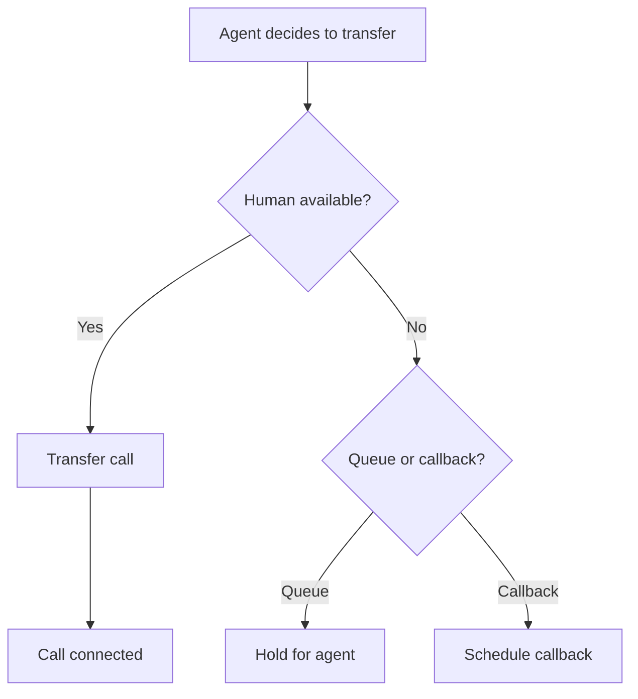

# Built-in Functions

Built-in functions are provided by Vora and available to all agents without additional configuration.

---

## Available Functions

### Call Control

| Function | Description |
|----------|-------------|
| `transfer_to_human` | Transfer to a human agent |
| `end_call` | End the current conversation |
| `hold` | Put the caller on hold |
| `resume` | Resume from hold |

### Communication

| Function | Description |
|----------|-------------|
| `send_sms` | Send an SMS message |
| `send_email` | Send an email |
| `send_dtmf` | Send DTMF tones |

### Session

| Function | Description |
|----------|-------------|
| `set_variable` | Store a value for the session |
| `get_variable` | Retrieve a stored value |
| `add_note` | Add a note to the session |

---

## Transfer to Human

Escalate the call to a human agent.

### Parameters

| Parameter | Type | Required | Description |
|-----------|------|----------|-------------|
| `reason` | string | Yes | Why the transfer is needed |
| `department` | string | No | Target department |
| `priority` | string | No | Transfer priority |
| `summary` | string | No | Brief conversation summary |

### Example

```javascript
{
  "function": "transfer_to_human",
  "parameters": {
    "reason": "Customer requesting refund",
    "department": "billing",
    "priority": "high",
    "summary": "Customer's order ORD-123 arrived damaged, requesting full refund"
  }
}
```

### Configuration

Configure transfer behavior in **Agent** → **Settings** → **Transfers**:

| Setting | Description |
|---------|-------------|
| **Default department** | Where to transfer if not specified |
| **Transfer message** | What to say before transferring |
| **Queue behavior** | What to do if no agents available |
| **Callback option** | Offer callback instead of queue |

### Transfer Flow



---

## End Call

Gracefully end the conversation.

### Parameters

| Parameter | Type | Required | Description |
|-----------|------|----------|-------------|
| `reason` | string | No | Why the call ended |
| `outcome` | string | No | Call outcome classification |
| `followUp` | boolean | No | Schedule follow-up |

### Example

```javascript
{
  "function": "end_call",
  "parameters": {
    "reason": "Issue resolved",
    "outcome": "resolved",
    "followUp": false
  }
}
```

### Outcome Values

| Outcome | Description |
|---------|-------------|
| `resolved` | Issue was resolved |
| `transferred` | Transferred to human |
| `callback_scheduled` | Follow-up scheduled |
| `abandoned` | Caller hung up |
| `voicemail` | Left voicemail |

---

## Send SMS

Send a text message to a phone number.

### Parameters

| Parameter | Type | Required | Description |
|-----------|------|----------|-------------|
| `to` | string | Yes | Recipient phone number |
| `message` | string | Yes | SMS content |
| `from` | string | No | Sender ID (if available) |

### Example

```javascript
{
  "function": "send_sms",
  "parameters": {
    "to": "+1234567890",
    "message": "Your appointment is confirmed for Thursday at 2 PM. Reply CANCEL to cancel."
  }
}
```

### Usage in Conversation

```
Agent: I'll send you a text with the confirmation details.
       [send_sms executed]
       You should receive it shortly. Is there anything else?
```

### Configuration

Set up SMS in **Settings** → **Messaging**:

- Connect Twilio or other SMS provider
- Configure sender IDs
- Set rate limits
- Enable/disable per agent

---

## Send Email

Send an email message.

### Parameters

| Parameter | Type | Required | Description |
|-----------|------|----------|-------------|
| `to` | string | Yes | Recipient email |
| `subject` | string | Yes | Email subject |
| `body` | string | Yes | Email content (plain text or HTML) |
| `template` | string | No | Use a predefined template |
| `templateData` | object | No | Data for template |

### Example

```javascript
{
  "function": "send_email",
  "parameters": {
    "to": "john@example.com",
    "subject": "Your Order Confirmation - ORD-12345",
    "template": "order_confirmation",
    "templateData": {
      "order_id": "ORD-12345",
      "items": ["Widget Pro", "Accessory Pack"],
      "total": "$149.99"
    }
  }
}
```

### Email Templates

Create templates in **Settings** → **Email Templates**:

```html
<h1>Order Confirmation</h1>
<p>Thank you for your order!</p>
<p><strong>Order ID:</strong> {{order_id}}</p>
<ul>
  {{#each items}}
  <li>{{this}}</li>
  {{/each}}
</ul>
<p><strong>Total:</strong> {{total}}</p>
```

---

## Hold and Resume

Put the caller on hold while performing actions.

### Hold

```javascript
{
  "function": "hold",
  "parameters": {
    "message": "Please hold while I look that up for you.",
    "music": true,
    "estimatedDuration": 30
  }
}
```

### Resume

```javascript
{
  "function": "resume",
  "parameters": {
    "message": "Thank you for holding. I found your information."
  }
}
```

### Hold Settings

Configure hold behavior:

| Setting | Description |
|---------|-------------|
| **Hold music** | Audio to play during hold |
| **Max hold time** | Auto-resume after duration |
| **Status updates** | Periodic "still looking" messages |

---

## Set Variable

Store data for use later in the session.

### Parameters

| Parameter | Type | Required | Description |
|-----------|------|----------|-------------|
| `key` | string | Yes | Variable name |
| `value` | any | Yes | Value to store |

### Example

```javascript
{
  "function": "set_variable",
  "parameters": {
    "key": "verified_customer",
    "value": true
  }
}
```

### Using Variables

Access stored variables in prompts:

```
{{verified_customer}}
```

Or in functions:

```javascript
{
  "condition": "{{verified_customer}} == true"
}
```

---

## Get Variable

Retrieve a stored variable.

### Parameters

| Parameter | Type | Required | Description |
|-----------|------|----------|-------------|
| `key` | string | Yes | Variable name |
| `default` | any | No | Default if not found |

### Example

```javascript
{
  "function": "get_variable",
  "parameters": {
    "key": "order_number",
    "default": null
  }
}
```

---

## Add Note

Add a note to the session for later review.

### Parameters

| Parameter | Type | Required | Description |
|-----------|------|----------|-------------|
| `content` | string | Yes | Note content |
| `category` | string | No | Note category |
| `priority` | string | No | Note priority |

### Example

```javascript
{
  "function": "add_note",
  "parameters": {
    "content": "Customer expressed interest in enterprise plan",
    "category": "sales_opportunity",
    "priority": "high"
  }
}
```

### Viewing Notes

Notes appear in the session details:

| Time | Category | Note |
|------|----------|------|
| 10:31:45 | sales_opportunity | Customer expressed interest in enterprise plan |
| 10:32:30 | follow_up | Requested product comparison email |

---

## Send DTMF

Send DTMF (touch-tone) signals.

### Parameters

| Parameter | Type | Required | Description |
|-----------|------|----------|-------------|
| `digits` | string | Yes | DTMF digits to send |
| `duration` | number | No | Tone duration (ms) |

### Example

```javascript
{
  "function": "send_dtmf",
  "parameters": {
    "digits": "1234#",
    "duration": 250
  }
}
```

### Use Case

Navigate IVR systems or enter PIN codes when transferring calls.

---

## Agent Instructions

Guide the agent on when to use built-in functions:

```markdown
## When to Transfer

Transfer to a human when:
- Customer explicitly asks for a person
- Issue requires actions you can't perform (refunds, account changes)
- Customer is frustrated after 2 failed resolution attempts
- Issue involves sensitive information

Always summarize the conversation before transferring.

## Ending Calls

End calls when:
- Issue is resolved and customer confirms
- Customer says goodbye
- No response after 3 prompts

Always confirm the customer is satisfied before ending.

## Communication

- Send confirmation SMS for all bookings
- Send follow-up email when customer requests documentation
- Always confirm contact information before sending
```

---

## Next Steps

<CardGroup cols={2}>
  <Card title="Custom Functions" icon="code" href="/platform/functions">
    Create custom functions
  </Card>
  <Card title="Integrations" icon="plug" href="/platform/integrations">
    Connect external services
  </Card>
  <Card title="Agent Configuration" icon="sliders" href="/platform/agents/configuration">
    Configure your agent
  </Card>
  <Card title="Testing" icon="flask" href="/platform/agents/testing">
    Test function behavior
  </Card>
</CardGroup>
