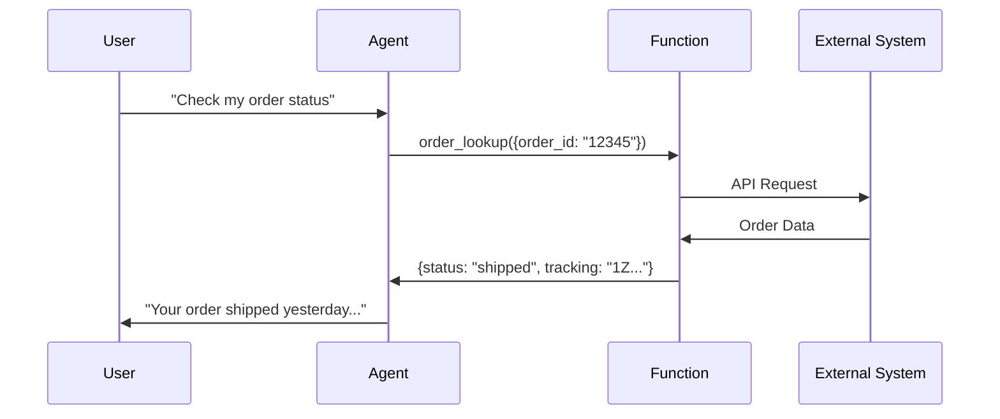

# Functions

Functions give your agent the ability to take actions during conversations—looking up data, making bookings, sending messages, and more.

---

## How Functions Work

When the agent determines it needs to take an action or get information, it calls a function:



---

## Function Types

### Integration Functions

Pre-built functions from connected integrations:

| Source | Example Functions |
|--------|-------------------|
| **HubSpot** | `contact.get`, `deal.create`, `ticket.create` |
| **Google Calendar** | `availability.check`, `event.create` |
| **Zendesk** | `ticket.create`, `article.search` |

See [Integrations](/platform/integrations) for available functions.

### Webhook Functions

Custom functions that call your endpoints:

```javascript
{
  "name": "order_lookup",
  "type": "webhook",
  "url": "https://api.yoursite.com/orders/{{order_id}}",
  "method": "GET"
}
```

See [Custom Webhooks](/platform/integrations/webhooks) for details.

### Built-in Functions

Functions provided by Vora:

| Function | Description |
|----------|-------------|
| `transfer_to_human` | Escalate to a human agent |
| `end_call` | End the conversation |
| `send_sms` | Send a text message |
| `send_email` | Send an email |
| `set_variable` | Store data for the session |

---

## Creating Functions

### Quick Create

<Steps>
  <Step title="Navigate to Functions">
    Go to **Functions** → **Create Function**.
  </Step>
  <Step title="Choose type">
    Select Integration, Webhook, or Built-in.
  </Step>
  <Step title="Configure">
    Set name, description, and parameters.
  </Step>
  <Step title="Test">
    Verify the function works correctly.
  </Step>
  <Step title="Attach to Agent">
    Add the function to your agent's configuration.
  </Step>
</Steps>

### Function Structure

```javascript
{
  "name": "book_appointment",
  "description": "Books an appointment for the caller",
  "parameters": {
    "type": "object",
    "properties": {
      "date": {
        "type": "string",
        "description": "Appointment date (YYYY-MM-DD)"
      },
      "time": {
        "type": "string",
        "description": "Appointment time (HH:MM)"
      },
      "type": {
        "type": "string",
        "enum": ["consultation", "demo", "support"],
        "description": "Type of appointment"
      }
    },
    "required": ["date", "time", "type"]
  }
}
```

---

## Function Parameters

### Parameter Types

| Type | Description | Example |
|------|-------------|---------|
| `string` | Text value | `"ORD-12345"` |
| `number` | Numeric value | `42` |
| `boolean` | True/false | `true` |
| `array` | List of values | `["a", "b"]` |
| `object` | Nested structure | `{"key": "value"}` |

### Parameter Options

```javascript
{
  "properties": {
    "email": {
      "type": "string",
      "description": "Customer email address",
      "format": "email"
    },
    "priority": {
      "type": "string",
      "description": "Issue priority",
      "enum": ["low", "medium", "high"],
      "default": "medium"
    },
    "amount": {
      "type": "number",
      "description": "Order amount",
      "minimum": 0,
      "maximum": 10000
    }
  }
}
```

### Required vs Optional

```javascript
{
  "properties": {
    "order_id": { ... },     // Required
    "include_items": { ... } // Optional
  },
  "required": ["order_id"]   // Only order_id is required
}
```

---

## Attaching Functions to Agents

### In the Dashboard

1. Go to **Agent** → **Functions**
2. Click **Add Function**
3. Select or search for functions
4. Configure function-specific settings
5. Save

### Function Settings per Agent

| Setting | Description |
|---------|-------------|
| **Enabled** | Turn function on/off for this agent |
| **Confirmation** | Require user confirmation before executing |
| **Rate limit** | Max calls per session |
| **Timeout** | Max execution time |

---

## Function Behavior

### When Functions Are Called

The LLM decides to call a function when:

1. The user requests an action ("book me an appointment")
2. The agent needs information ("let me check your order")
3. The conversation requires external data

### Guiding Function Use

Add instructions to your agent's prompt:

```markdown
## Function Usage

When a user asks about their order:
1. Ask for the order number
2. Use the order_lookup function
3. Tell the user the status and delivery date

When booking an appointment:
1. Check availability first using gcal.availability.check
2. Offer the user 2-3 time options
3. Confirm before booking with gcal.event.create
```

### Confirmation Flow

For sensitive actions, require confirmation:

```
Agent: I can schedule your appointment for Thursday at 2 PM.
       Should I go ahead and book that?

User: Yes, please.

[Function: gcal.event.create executed]

Agent: Done! Your appointment is confirmed for Thursday at 2 PM.
```

---

## Function Execution

### Timing

| Phase | Description |
|-------|-------------|
| **Intent** | Agent determines function is needed |
| **Parameters** | Agent extracts/asks for required data |
| **Execution** | Function runs (webhook call, etc.) |
| **Response** | Agent uses result in response |

### Execution Context

Functions receive context about the session:

```javascript
{
  "session": {
    "id": "sess_abc123",
    "participant": {
      "name": "John Doe",
      "phone": "+1234567890"
    },
    "variables": {
      "account_tier": "premium"
    }
  },
  "agent": {
    "id": "agent_xyz",
    "name": "Customer Support"
  },
  "parameters": {
    "order_id": "ORD-12345"
  }
}
```

---

## Error Handling

### Function Errors

| Error | Cause | Agent Response |
|-------|-------|----------------|
| **Timeout** | Function took too long | Fallback message |
| **Not found** | Resource doesn't exist | Inform user |
| **Auth error** | Credentials invalid | Apologize, escalate |
| **Rate limited** | Too many calls | Wait and retry |

### Configuring Fallbacks

```javascript
{
  "errorHandling": {
    "timeout": {
      "message": "I'm having trouble accessing that information. Let me transfer you to someone who can help."
    },
    "notFound": {
      "message": "I couldn't find a record with that information. Can you double-check the details?"
    },
    "default": {
      "message": "I'm experiencing a technical issue. Would you like me to transfer you?"
    }
  }
}
```

---

## Testing Functions

### In the Dashboard

1. Go to **Functions** → Select function
2. Click **Test**
3. Enter test parameters
4. View execution result

### In the Simulator

1. Open agent simulator
2. Trigger a function call naturally
3. See function execution in the transcript
4. Verify correct parameters and response

### Via API

```javascript
const result = await vora.functions.test('func_abc123', {
  order_id: 'ORD-12345'
});

console.log(result.success);
console.log(result.output);
console.log(result.duration);
```

---

## Function Analytics

### Metrics

| Metric | Description |
|--------|-------------|
| **Calls** | Total function invocations |
| **Success rate** | % successful executions |
| **Avg latency** | Average execution time |
| **Errors** | Error count and types |

### Viewing Analytics

Go to **Functions** → **Analytics** to see:

- Function usage over time
- Success/error breakdown
- Latency distribution
- Common error patterns

---

## Best Practices

<AccordionGroup>
  <Accordion title="Write clear descriptions">
    Descriptions help the LLM understand when and how to use functions. Be specific.
  </Accordion>

  <Accordion title="Use meaningful parameter names">
    `order_number` is better than `num`. Clear names reduce errors.
  </Accordion>

  <Accordion title="Handle all error cases">
    Configure fallback messages for every error type. Don't leave the agent speechless.
  </Accordion>

  <Accordion title="Set appropriate timeouts">
    External APIs can be slow. Set reasonable timeouts and inform users when waiting.
  </Accordion>

  <Accordion title="Require confirmation for important actions">
    Booking, canceling, or modifying should require user confirmation.
  </Accordion>

  <Accordion title="Test with edge cases">
    Test with invalid inputs, missing data, and error conditions.
  </Accordion>
</AccordionGroup>

---

## Example Functions

### Order Lookup

```javascript
{
  "name": "order_lookup",
  "description": "Look up an order by order number or customer email",
  "parameters": {
    "type": "object",
    "properties": {
      "order_number": {
        "type": "string",
        "description": "Order number (e.g., ORD-12345)"
      },
      "email": {
        "type": "string",
        "description": "Customer email address"
      }
    }
  }
}
```

### Create Support Ticket

```javascript
{
  "name": "create_ticket",
  "description": "Create a support ticket for the caller's issue",
  "parameters": {
    "type": "object",
    "properties": {
      "subject": {
        "type": "string",
        "description": "Brief description of the issue"
      },
      "description": {
        "type": "string",
        "description": "Detailed description of the problem"
      },
      "priority": {
        "type": "string",
        "enum": ["low", "medium", "high", "urgent"],
        "default": "medium"
      }
    },
    "required": ["subject", "description"]
  }
}
```

### Transfer to Human

```javascript
{
  "name": "transfer_to_human",
  "description": "Transfer the call to a human agent",
  "parameters": {
    "type": "object",
    "properties": {
      "reason": {
        "type": "string",
        "description": "Why the transfer is needed"
      },
      "department": {
        "type": "string",
        "enum": ["sales", "support", "billing"],
        "description": "Which department to transfer to"
      }
    },
    "required": ["reason"]
  }
}
```

---

## Next Steps

<CardGroup cols={2}>
  <Card title="Custom Webhooks" icon="webhook" href="/platform/integrations/webhooks">
    Build custom functions
  </Card>
  <Card title="HubSpot" icon="hubspot" href="/platform/integrations/hubspot">
    CRM functions
  </Card>
  <Card title="Google Calendar" icon="google" href="/platform/integrations/google-calendar">
    Calendar functions
  </Card>
  <Card title="Functions API" icon="code" href="/api/functions">
    API reference
  </Card>
</CardGroup>
