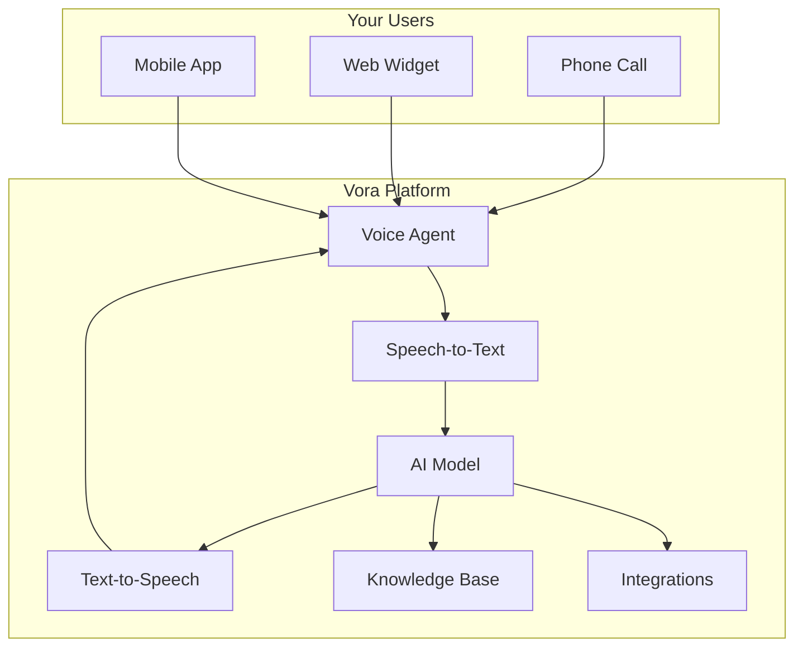

# Platform Guide

Welcome to the Vora Platform Guide. This documentation covers everything you need to create, configure, and deploy voice AI agents.

<Info>
  Looking for the API? Head to the [API Reference](/api) for programmatic access.
</Info>

## Getting Started

<CardGroup cols={2}>
  <Card title="Quickstart" icon="rocket" href="/platform/quickstart">
    Create your first agent in under 5 minutes
  </Card>
  <Card title="Account Setup" icon="user" href="/platform/account">
    Configure your account and team
  </Card>
</CardGroup>

---

## Core Features

<CardGroup cols={3}>
  <Card title="Agents" icon="robot" href="/platform/agents">
    Create and configure voice agents
  </Card>
  <Card title="Knowledge Base" icon="database" href="/platform/knowledge-base">
    Add documents for RAG-powered responses
  </Card>
  <Card title="Voice Settings" icon="microphone" href="/platform/voice">
    Customize voice and language
  </Card>
</CardGroup>

<CardGroup cols={3}>
  <Card title="Integrations" icon="plug" href="/platform/integrations">
    Connect CRM, calendar, and more
  </Card>
  <Card title="Functions" icon="code" href="/platform/functions">
    Create custom tool actions
  </Card>
  <Card title="Analytics" icon="chart-bar" href="/platform/analytics">
    Monitor performance and costs
  </Card>
</CardGroup>

---

## What Can You Build?

Vora agents can handle a variety of voice AI use cases:

<AccordionGroup>
  <Accordion title="Customer Support">
    Build 24/7 support agents that answer questions, troubleshoot issues, and escalate to humans when needed.

    - Answer FAQs from your knowledge base
    - Look up order status via integrations
    - Create support tickets automatically
  </Accordion>

  <Accordion title="Sales & Lead Qualification">
    Engage leads, qualify prospects, and book meetings automatically.

    - Conversational lead qualification
    - Calendar booking integration
    - CRM updates in real-time
  </Accordion>

  <Accordion title="Appointment Scheduling">
    Let callers book, reschedule, or cancel appointments.

    - Google Calendar integration
    - Availability checking
    - SMS confirmations
  </Accordion>

  <Accordion title="Information Hotlines">
    Provide information to callers about your products, services, or organization.

    - Knowledge base powered
    - Multi-language support
    - 24/7 availability
  </Accordion>
</AccordionGroup>

---

## Platform Architecture

Vora's voice AI platform consists of several key components:

1. **Voice Input** - Callers connect via phone, web widget, or mobile app
2. **Speech-to-Text** - Audio is transcribed in real-time using providers like Deepgram
3. **AI Model** - The transcript is processed by LLMs like GPT-4 or Gemini
4. **Knowledge Base** - RAG retrieval augments responses with your documents
5. **Integrations** - External systems are queried or updated as needed
6. **Text-to-Speech** - Responses are converted to natural speech using ElevenLabs or Cartesia

---

## Quick Links

<CardGroup cols={2}>
  <Card title="Phone Numbers" icon="phone" href="/platform/phone">
    Get a number or connect SIP trunk
  </Card>
  <Card title="Troubleshooting" icon="wrench" href="/platform/troubleshooting">
    Common issues and solutions
  </Card>
  <Card title="Billing" icon="credit-card" href="/platform/billing">
    Plans, pricing, and usage
  </Card>
  <Card title="Support" icon="headset" href="/platform/support">
    Get help from our team
  </Card>
</CardGroup>
