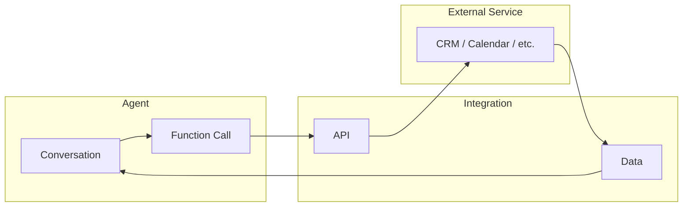

# Integrations

Integrations connect your Vora agent to external services like CRMs, calendars, and communication platforms. Enable your agent to look up customer data, book appointments, and take real actions.

---

## How Integrations Work

Integrations expose actions to your agent through functions:



When the agent determines it needs external data or wants to take an action, it:

1. Calls the appropriate function
2. Vora executes the API call to the external service
3. Results are returned to the agent
4. Agent uses the data in its response

---

## Available Integrations

### CRM

| Integration | Features |
|-------------|----------|
| [**HubSpot**](/platform/integrations/hubspot) | Contacts, deals, tickets |
| [**Salesforce**](/platform/integrations/salesforce) | Leads, opportunities, cases |
| [**Zoho CRM**](/platform/integrations/zoho) | Contacts, leads, deals |
| [**Pipedrive**](/platform/integrations/pipedrive) | Contacts, deals |

### Calendar

| Integration | Features |
|-------------|----------|
| [**Google Calendar**](/platform/integrations/google-calendar) | View, create, update events |
| [**Microsoft 365**](/platform/integrations/microsoft-calendar) | Outlook calendar access |
| [**Calendly**](/platform/integrations/calendly) | Book scheduling links |

### Communication

| Integration | Features |
|-------------|----------|
| [**Slack**](/platform/integrations/slack) | Send messages, notifications |
| [**Microsoft Teams**](/platform/integrations/teams) | Messages, channels |
| [**WhatsApp**](/platform/integrations/whatsapp) | Send follow-up messages |
| [**Email (SMTP)**](/platform/integrations/email) | Send confirmation emails |

### Support

| Integration | Features |
|-------------|----------|
| [**Zendesk**](/platform/integrations/zendesk) | Create tickets, look up info |
| [**Intercom**](/platform/integrations/intercom) | Create conversations |
| [**Freshdesk**](/platform/integrations/freshdesk) | Create and update tickets |

### E-commerce

| Integration | Features |
|-------------|----------|
| [**Shopify**](/platform/integrations/shopify) | Orders, customers, products |
| [**WooCommerce**](/platform/integrations/woocommerce) | Order lookup |
| [**Stripe**](/platform/integrations/stripe) | Payment info, invoices |

### Custom

| Integration | Features |
|-------------|----------|
| [**Webhooks**](/platform/integrations/webhooks) | Any HTTP endpoint |
| [**Custom API**](/platform/integrations/custom) | Build your own |

---

## Setting Up Integrations

### Quick Setup

<Steps>
  <Step title="Navigate to Integrations">
    Go to **Integrations** in the sidebar.
  </Step>
  <Step title="Choose an integration">
    Browse available integrations and click **Connect**.
  </Step>
  <Step title="Authenticate">
    Follow the OAuth flow or enter API credentials.
  </Step>
  <Step title="Configure">
    Select which actions to enable for your agents.
  </Step>
  <Step title="Attach to Agent">
    Add the integration to your agent's configuration.
  </Step>
</Steps>

### OAuth vs API Keys

| Method | Security | Setup | Best For |
|--------|----------|-------|----------|
| **OAuth** | High | Click-through | Most integrations |
| **API Key** | Medium | Manual entry | Custom integrations |
| **Webhook** | Variable | Custom setup | Custom backends |

---

## Integration Functions

Each integration exposes functions the agent can call:

### Example: HubSpot Integration

| Function | Description | Parameters |
|----------|-------------|------------|
| `hubspot.contact.get` | Look up contact | email, phone |
| `hubspot.contact.create` | Create new contact | name, email, phone |
| `hubspot.deal.create` | Create deal | title, amount, contact |
| `hubspot.ticket.create` | Create support ticket | subject, description |

### Example: Google Calendar Integration

| Function | Description | Parameters |
|----------|-------------|------------|
| `gcal.availability.check` | Check available slots | date, duration |
| `gcal.event.create` | Book appointment | datetime, title, attendee |
| `gcal.event.cancel` | Cancel appointment | event_id |
| `gcal.event.reschedule` | Move appointment | event_id, new_datetime |

---

## Integration Settings

### Per-Integration Settings

Each integration has configurable options:

| Setting | Description |
|---------|-------------|
| **Enabled** | Turn integration on/off |
| **Rate limits** | Max calls per minute |
| **Timeout** | Max wait time for response |
| **Retry** | Retry failed calls |
| **Fallback** | Message if integration fails |

### Field Mapping

Map your data fields to integration fields:

```javascript
{
  "fieldMappings": {
    "caller_email": "contact.email",
    "caller_phone": "contact.phone",
    "caller_name": "contact.full_name"
  }
}
```

### Permissions

Control what the integration can access:

| Permission | Description |
|------------|-------------|
| **Read** | Look up information |
| **Create** | Create new records |
| **Update** | Modify existing records |
| **Delete** | Remove records |

---

## Using Integrations in Agents

### Attaching Integrations

1. Go to **Agent** → **Integrations**
2. Click **Add Integration**
3. Select configured integrations
4. Configure agent-specific settings

### Agent Instructions

Guide the agent on when to use integrations:

```
When a caller wants to book an appointment:
1. Check calendar availability using gcal.availability.check
2. Offer available time slots
3. Confirm the booking using gcal.event.create
4. Send confirmation to caller's email
```

### Error Handling

Configure what happens when integrations fail:

| Scenario | Fallback Action |
|----------|-----------------|
| Timeout | "Let me check that manually..." |
| Auth error | "I'm having technical difficulties..." |
| Not found | "I couldn't find that record..." |
| Rate limited | Retry with delay |

---

## Integration Health

### Monitoring

View integration status and metrics:

| Metric | Description |
|--------|-------------|
| **Status** | Connected, Error, Disabled |
| **Calls** | Total API calls made |
| **Success rate** | % successful calls |
| **Avg latency** | Response time |
| **Errors** | Recent error count |

### Troubleshooting

| Issue | Possible Cause | Solution |
|-------|----------------|----------|
| **Auth failed** | Token expired | Reconnect integration |
| **Rate limited** | Too many calls | Reduce call frequency |
| **Timeout** | Slow API | Increase timeout |
| **Not found** | Wrong ID/key | Check field mappings |

---

## Best Practices

<AccordionGroup>
  <Accordion title="Use OAuth when available">
    OAuth is more secure and easier to manage than API keys.
  </Accordion>

  <Accordion title="Set appropriate timeouts">
    External APIs can be slow. Set reasonable timeouts and good fallback messages.
  </Accordion>

  <Accordion title="Handle failures gracefully">
    Always have a fallback for when integrations fail. Users should still have a good experience.
  </Accordion>

  <Accordion title="Monitor usage">
    Watch integration metrics to catch issues before they affect users.
  </Accordion>

  <Accordion title="Use test accounts first">
    Configure integrations with test accounts before using production data.
  </Accordion>
</AccordionGroup>

---

## Enterprise Features

### Custom Integrations

Build integrations for internal systems:

- REST API endpoints
- GraphQL APIs
- SOAP services
- Database connections

### SSO Integration

Connect with enterprise identity:

- SAML 2.0
- OpenID Connect
- Azure AD
- Okta

### Data Residency

Choose where integration data is processed:

- US
- EU
- Asia-Pacific
- Custom regions

---

## Next Steps

<CardGroup cols={2}>
  <Card title="HubSpot" icon="hubspot" href="/platform/integrations/hubspot">
    Connect HubSpot CRM
  </Card>
  <Card title="Google Calendar" icon="google" href="/platform/integrations/google-calendar">
    Connect Google Calendar
  </Card>
  <Card title="Custom Webhooks" icon="webhook" href="/platform/integrations/webhooks">
    Build custom integrations
  </Card>
  <Card title="Functions" icon="code" href="/platform/functions">
    Create custom functions
  </Card>
</CardGroup>
