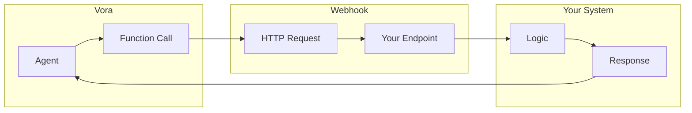

# Custom Webhooks

Webhooks let you connect Vora to any HTTP endpoint, enabling custom integrations with your own systems and third-party APIs.

---

## Overview

Use webhooks to:

- **Connect internal systems** - CRM, ERP, databases
- **Call external APIs** - Any REST endpoint
- **Execute custom logic** - Your own backend functions
- **Integrate unsupported services** - When no native integration exists



---

## Creating a Webhook Function

<Steps>
  <Step title="Navigate to Functions">
    Go to **Functions** → **Create Function** → **Webhook**.
  </Step>
  <Step title="Configure endpoint">
    Enter your webhook URL and settings.
  </Step>
  <Step title="Define parameters">
    Specify what data the function accepts.
  </Step>
  <Step title="Set up authentication">
    Configure how Vora authenticates with your endpoint.
  </Step>
  <Step title="Test">
    Send test requests to verify it works.
  </Step>
</Steps>

---

## Webhook Configuration

### Basic Settings

| Setting | Description | Example |
|---------|-------------|---------|
| **Name** | Function name | `order_lookup` |
| **Description** | What it does | "Look up order by ID" |
| **URL** | Endpoint URL | `https://api.example.com/orders` |
| **Method** | HTTP method | GET, POST, PUT, DELETE |

### Request Configuration

```javascript
{
  "name": "order_lookup",
  "description": "Look up an order by order number",
  "webhook": {
    "url": "https://api.yourcompany.com/orders/{{order_number}}",
    "method": "GET",
    "headers": {
      "Content-Type": "application/json",
      "Authorization": "Bearer {{secret.api_key}}"
    },
    "timeout": 10000
  }
}
```

### Parameters

Define what the agent can pass to the function:

```javascript
{
  "parameters": {
    "type": "object",
    "properties": {
      "order_number": {
        "type": "string",
        "description": "The order number to look up"
      },
      "include_items": {
        "type": "boolean",
        "description": "Whether to include order items",
        "default": false
      }
    },
    "required": ["order_number"]
  }
}
```

---

## Authentication

### API Key

```javascript
{
  "auth": {
    "type": "api_key",
    "header": "X-API-Key",
    "value": "{{secret.api_key}}"
  }
}
```

### Bearer Token

```javascript
{
  "auth": {
    "type": "bearer",
    "token": "{{secret.access_token}}"
  }
}
```

### Basic Auth

```javascript
{
  "auth": {
    "type": "basic",
    "username": "{{secret.username}}",
    "password": "{{secret.password}}"
  }
}
```

### Custom Headers

```javascript
{
  "headers": {
    "Authorization": "Bearer {{secret.token}}",
    "X-Custom-Header": "value",
    "X-Request-ID": "{{request_id}}"
  }
}
```

### Managing Secrets

Store sensitive values securely:

1. Go to **Settings** → **Secrets**
2. Add a secret (e.g., `api_key`)
3. Reference in webhook config as `{{secret.api_key}}`

---

## Request Body

### JSON Body

```javascript
{
  "webhook": {
    "url": "https://api.example.com/orders",
    "method": "POST",
    "body": {
      "order_id": "{{order_number}}",
      "action": "lookup",
      "caller_id": "{{session.participant.phone}}"
    }
  }
}
```

### Dynamic Body

Use all available parameters:

```javascript
{
  "body": {
    "query": "{{search_query}}",
    "filters": {
      "status": "{{status}}",
      "date_from": "{{date_from}}"
    },
    "metadata": {
      "session_id": "{{session.id}}",
      "agent_id": "{{agent.id}}"
    }
  }
}
```

### Form Data

```javascript
{
  "webhook": {
    "method": "POST",
    "contentType": "application/x-www-form-urlencoded",
    "body": {
      "field1": "{{value1}}",
      "field2": "{{value2}}"
    }
  }
}
```

---

## Response Handling

### Expected Response

Your endpoint should return JSON:

```json
{
  "success": true,
  "data": {
    "order_number": "ORD-12345",
    "status": "shipped",
    "tracking": "1Z999ABC",
    "estimated_delivery": "2024-01-20"
  }
}
```

### Response Mapping

Extract specific fields for the agent:

```javascript
{
  "response": {
    "mapping": {
      "order_status": "$.data.status",
      "tracking_number": "$.data.tracking",
      "delivery_date": "$.data.estimated_delivery"
    }
  }
}
```

### Error Handling

Handle errors gracefully:

```javascript
{
  "errorHandling": {
    "onTimeout": {
      "message": "I'm having trouble looking that up. Please hold."
    },
    "onError": {
      "message": "I couldn't find that order. Let me transfer you."
    },
    "on404": {
      "message": "I couldn't find an order with that number."
    }
  }
}
```

---

## Your Endpoint

### Request Format

Vora sends requests like:

```http
POST /api/orders HTTP/1.1
Host: api.yourcompany.com
Content-Type: application/json
Authorization: Bearer your-api-key
X-Vora-Session-ID: sess_abc123
X-Vora-Request-ID: req_xyz789

{
  "order_number": "ORD-12345",
  "include_items": true
}
```

### Example Endpoint (Node.js)

```javascript
const express = require('express');
const app = express();

app.use(express.json());

app.post('/api/orders', async (req, res) => {
  const { order_number, include_items } = req.body;

  // Validate request
  if (!order_number) {
    return res.status(400).json({
      success: false,
      error: 'Order number required'
    });
  }

  // Look up order
  const order = await db.orders.findOne({ number: order_number });

  if (!order) {
    return res.status(404).json({
      success: false,
      error: 'Order not found'
    });
  }

  // Return order data
  res.json({
    success: true,
    data: {
      order_number: order.number,
      status: order.status,
      tracking: order.tracking_number,
      estimated_delivery: order.est_delivery,
      items: include_items ? order.items : undefined
    }
  });
});

app.listen(3000);
```

### Example Endpoint (Python)

```python
from flask import Flask, request, jsonify

app = Flask(__name__)

@app.route('/api/orders', methods=['POST'])
def lookup_order():
    data = request.json
    order_number = data.get('order_number')

    if not order_number:
        return jsonify({
            'success': False,
            'error': 'Order number required'
        }), 400

    order = db.orders.find_one({'number': order_number})

    if not order:
        return jsonify({
            'success': False,
            'error': 'Order not found'
        }), 404

    return jsonify({
        'success': True,
        'data': {
            'order_number': order['number'],
            'status': order['status'],
            'tracking': order.get('tracking_number'),
            'estimated_delivery': order.get('est_delivery')
        }
    })
```

---

## Request Validation

### Verifying Requests

Verify requests are from Vora using signatures:

```javascript
const crypto = require('crypto');

function verifyVoraSignature(req, secret) {
  const signature = req.headers['x-vora-signature'];
  const timestamp = req.headers['x-vora-timestamp'];
  const body = JSON.stringify(req.body);

  const expected = crypto
    .createHmac('sha256', secret)
    .update(`${timestamp}.${body}`)
    .digest('hex');

  return crypto.timingSafeEqual(
    Buffer.from(signature),
    Buffer.from(expected)
  );
}

app.use((req, res, next) => {
  if (!verifyVoraSignature(req, process.env.WEBHOOK_SECRET)) {
    return res.status(401).json({ error: 'Invalid signature' });
  }
  next();
});
```

---

## Testing

### Test in Dashboard

1. Go to **Functions** → Select your function
2. Click **Test**
3. Enter test parameters
4. View request/response

### Test via API

```bash
curl -X POST https://api.vora.ai/functions/func_abc123/test \
  -H "Authorization: Bearer sk_live_xxx" \
  -H "Content-Type: application/json" \
  -d '{"order_number": "ORD-12345"}'
```

### Debug Mode

Enable debug logging:

```javascript
{
  "debug": true,
  "logRequests": true,
  "logResponses": true
}
```

View logs in **Functions** → **Logs**.

---

## Best Practices

<AccordionGroup>
  <Accordion title="Keep endpoints fast">
    Webhook calls add latency to conversations. Keep response times under 2 seconds.
  </Accordion>

  <Accordion title="Handle errors gracefully">
    Always return meaningful error messages so the agent can respond appropriately.
  </Accordion>

  <Accordion title="Use HTTPS">
    Always use HTTPS endpoints for security.
  </Accordion>

  <Accordion title="Validate signatures">
    Verify request signatures to ensure requests are from Vora.
  </Accordion>

  <Accordion title="Set appropriate timeouts">
    Configure timeouts based on expected response time. Default is 10 seconds.
  </Accordion>

  <Accordion title="Log everything">
    Log requests and responses on your end for debugging.
  </Accordion>
</AccordionGroup>

---

## Troubleshooting

### Common Issues

| Issue | Cause | Solution |
|-------|-------|----------|
| **Timeout** | Slow endpoint | Optimize or increase timeout |
| **401 Unauthorized** | Bad credentials | Check auth config |
| **Connection refused** | Firewall/network | Whitelist Vora IPs |
| **Invalid JSON** | Response format | Return valid JSON |
| **SSL error** | Certificate issue | Ensure valid HTTPS cert |

### Vora IP Addresses

Whitelist these IPs in your firewall:

```
34.102.136.180
35.192.45.67
35.224.98.123
```

---

## Next Steps

<CardGroup cols={2}>
  <Card title="Functions" icon="code" href="/platform/functions">
    Learn about all function types
  </Card>
  <Card title="HubSpot" icon="hubspot" href="/platform/integrations/hubspot">
    Use pre-built integrations
  </Card>
  <Card title="API Reference" icon="book" href="/api/functions">
    Functions API documentation
  </Card>
  <Card title="Webhooks API" icon="webhook" href="/api/webhooks">
    Receive events from Vora
  </Card>
</CardGroup>
