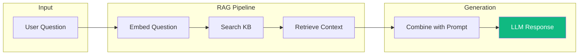
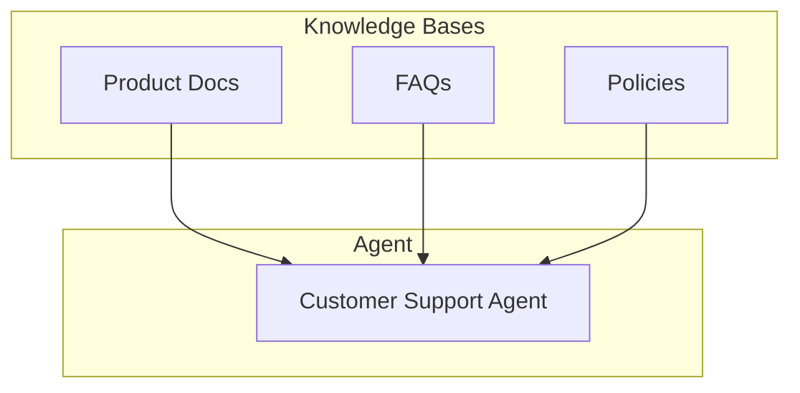

# Knowledge Base

The Knowledge Base powers your agent with accurate, up-to-date information from your own content. Instead of relying solely on the language model's training data, your agent retrieves relevant information from your documents to answer questions.

---

## How It Works

Vora uses **Retrieval-Augmented Generation (RAG)** to enhance agent responses:

1. **User asks a question** - "What's your return policy?"
2. **Question is embedded** - Converted to a vector representation
3. **Knowledge base is searched** - Find semantically similar content
4. **Context is retrieved** - Relevant chunks are extracted
5. **Response is generated** - LLM answers using the retrieved context

---

## Benefits

<CardGroup cols={2}>
  <Card title="Accurate Answers" icon="check">
    Responses grounded in your actual documentation, not hallucinations
  </Card>
  <Card title="Always Up-to-Date" icon="refresh">
    Update your content and agents immediately have the latest information
  </Card>
  <Card title="Source Citations" icon="quote-left">
    Optionally show users where information came from
  </Card>
  <Card title="Reduced Prompt Size" icon="compress">
    Dynamic retrieval instead of stuffing everything into the prompt
  </Card>
</CardGroup>

---

## Content Sources

Add content to your knowledge base from multiple sources:

| Source | Description | Best For |
|--------|-------------|----------|
| [**Documents**](/platform/knowledge-base/documents) | Upload PDFs, DOCX, TXT files | Product manuals, policies |
| [**URLs**](/platform/knowledge-base/urls) | Crawl and sync websites | Documentation, help centers |
| [**Text**](/platform/knowledge-base/text) | Paste or type content directly | FAQs, quick additions |
| [**Integrations**](/platform/knowledge-base/integrations) | Sync from Notion, Confluence, etc. | Team knowledge bases |

---

## Creating a Knowledge Base

<Steps>
  <Step title="Navigate to Knowledge Bases">
    Go to **Knowledge Bases** in the sidebar.
  </Step>
  <Step title="Create New">
    Click **New Knowledge Base** and give it a name.
  </Step>
  <Step title="Add Sources">
    Upload documents, add URLs, or paste text content.
  </Step>
  <Step title="Wait for Processing">
    Content is chunked, embedded, and indexed automatically.
  </Step>
  <Step title="Connect to Agent">
    Attach the knowledge base to one or more agents.
  </Step>
</Steps>

---

## Knowledge Base Settings

### Chunking

Content is split into chunks for retrieval:

| Setting | Description | Default |
|---------|-------------|---------|
| **Chunk size** | Characters per chunk | 1000 |
| **Chunk overlap** | Overlap between chunks | 200 |
| **Separator** | How to split content | Paragraphs |

<Tip>
  Smaller chunks (500-800) work better for specific Q&A. Larger chunks (1000-1500) work better for context-heavy topics.
</Tip>

### Retrieval

Configure how content is retrieved:

| Setting | Description | Default |
|---------|-------------|---------|
| **Search method** | Semantic, keyword, or hybrid | Hybrid |
| **Results count** | Chunks to retrieve per query | 5 |
| **Similarity threshold** | Minimum relevance score | 0.7 |
| **Reranking** | Re-order results by relevance | Enabled |

### Embedding Model

Choose the embedding model for your content:

| Model | Dimensions | Best For |
|-------|------------|----------|
| `text-embedding-3-small` | 1536 | General purpose |
| `text-embedding-3-large` | 3072 | Higher accuracy |
| `multilingual-e5-large` | 1024 | Non-English content |

---

## Connecting to Agents

### Attach a Knowledge Base

1. Go to your agent's configuration
2. Click **Knowledge Base** tab
3. Select one or more knowledge bases
4. Configure retrieval settings

### Multiple Knowledge Bases

You can attach multiple knowledge bases to an agent:

Results from all knowledge bases are combined and ranked.

### Search Priority

Control which knowledge base is searched first:

| Priority | Knowledge Base | Weight |
|----------|----------------|--------|
| 1 | Product Documentation | 1.5 |
| 2 | FAQs | 1.2 |
| 3 | Policies | 1.0 |

---

## Testing Your Knowledge Base

### Direct Testing

Test retrieval without an agent:

1. Go to **Knowledge Base** → **Test**
2. Enter a question
3. See which chunks are retrieved
4. Adjust settings if needed

### Agent Testing

Test through the agent simulator:

1. Go to **Agent** → **Test**
2. Ask questions that should use the KB
3. Check if responses are accurate
4. Verify correct sources are used

---

## Best Practices

<AccordionGroup>
  <Accordion title="Keep content focused">
    A knowledge base about "Product Support" will perform better than one with everything from marketing to HR policies.
  </Accordion>

  <Accordion title="Use clear, complete content">
    The agent can only answer from what's in the knowledge base. Ensure your content answers the questions customers ask.
  </Accordion>

  <Accordion title="Update regularly">
    Stale content leads to outdated answers. Set up automatic syncing for web sources or schedule regular updates.
  </Accordion>

  <Accordion title="Test with real questions">
    Use actual customer questions to test retrieval. This reveals gaps in your content.
  </Accordion>

  <Accordion title="Monitor retrieval quality">
    Check analytics to see which questions result in poor retrieval. Add content to fill gaps.
  </Accordion>
</AccordionGroup>

---

## Troubleshooting

### Agent Not Using Knowledge Base

| Symptom | Cause | Solution |
|---------|-------|----------|
| Uses general knowledge | KB not attached | Attach KB to agent |
| Answers are vague | Low similarity scores | Lower threshold or improve content |
| Wrong information | Incorrect chunks retrieved | Adjust chunking or add better content |
| "I don't know" responses | Content doesn't exist | Add relevant content |

### Poor Retrieval Quality

1. **Check chunk sizes** - Too large means irrelevant content; too small means missing context
2. **Review content quality** - Ensure content clearly answers questions
3. **Test different queries** - See how slight rephrasing affects results
4. **Enable reranking** - Improves result ordering

---

## Limits

| Plan | Knowledge Bases | Total Storage | Sources per KB |
|------|-----------------|---------------|----------------|
| Free | 2 | 50 MB | 10 |
| Pro | 10 | 1 GB | 100 |
| Enterprise | Unlimited | Unlimited | Unlimited |

---

## Next Steps

<CardGroup cols={2}>
  <Card title="Add Documents" icon="file-arrow-up" href="/platform/knowledge-base/documents">
    Upload PDFs, DOCX, and more
  </Card>
  <Card title="Sync URLs" icon="globe" href="/platform/knowledge-base/urls">
    Crawl websites and documentation
  </Card>
  <Card title="Add Text" icon="align-left" href="/platform/knowledge-base/text">
    Paste content directly
  </Card>
  <Card title="Integrations" icon="plug" href="/platform/knowledge-base/integrations">
    Sync from Notion, Confluence
  </Card>
</CardGroup>
