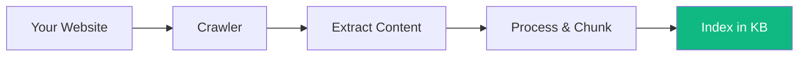

# URL Sources

Keep your knowledge base synchronized with your website, documentation, or help center by adding URL sources.

---

## How It Works

1. **Add URLs** - Provide starting URLs or sitemaps
2. **Crawl content** - Vora visits pages and extracts text
3. **Process content** - Text is chunked and embedded
4. **Stay in sync** - Optionally re-crawl on a schedule



---

## Adding URL Sources

<Steps>
  <Step title="Open Knowledge Base">
    Go to **Knowledge Bases** → Select your KB → **Sources**.
  </Step>
  <Step title="Add URL Source">
    Click **Add Source** → **URL**.
  </Step>
  <Step title="Configure URLs">
    Enter one or more URLs:

    ```
    https://docs.yourcompany.com
    https://yourcompany.com/help
    https://yourcompany.com/faq
    ```
  </Step>
  <Step title="Set Crawl Options">
    Configure depth, limits, and patterns.
  </Step>
  <Step title="Start Crawl">
    Click **Start Crawl** to begin importing content.
  </Step>
</Steps>

---

## Crawl Configuration

### Starting Points

| Option | Description | Example |
|--------|-------------|---------|
| **Single URL** | One specific page | `https://docs.example.com/getting-started` |
| **Multiple URLs** | List of pages | Multiple documentation sections |
| **Sitemap** | XML sitemap | `https://example.com/sitemap.xml` |
| **Domain** | Entire domain | `https://docs.example.com` |

### Crawl Depth

| Depth | Description | Pages Crawled |
|-------|-------------|---------------|
| **0** | Starting URL only | Just the provided URLs |
| **1** | Direct links | Starting pages + linked pages |
| **2** | Two levels deep | More comprehensive coverage |
| **3+** | Deeper crawling | Full site coverage |

<Tip>
  Start with depth 1-2 and increase if needed. Deep crawls may include irrelevant content.
</Tip>

### Page Limits

Control how many pages are crawled:

| Plan | Max Pages per Source |
|------|---------------------|
| Free | 50 |
| Pro | 500 |
| Enterprise | Unlimited |

### URL Patterns

#### Include Patterns

Only crawl URLs matching these patterns:

```
/docs/*
/help/*
/support/*
/guides/*
```

#### Exclude Patterns

Skip URLs matching these patterns:

```
/blog/*
/news/*
/careers/*
/login/*
```

---

## Content Extraction

### What's Extracted

| Element | Extracted | Notes |
|---------|-----------|-------|
| **Main content** | ✓ | Article body, documentation text |
| **Headings** | ✓ | Used for chunk metadata |
| **Lists** | ✓ | Bullet points, numbered lists |
| **Tables** | ✓ | Converted to text format |
| **Code blocks** | ✓ | Preserved with formatting |
| **Navigation** | ✗ | Filtered out |
| **Headers/footers** | ✗ | Filtered out |
| **Ads/sidebars** | ✗ | Filtered out |

### Content Selectors (Enterprise)

Specify CSS selectors for content extraction:

```javascript
{
  "contentSelector": "article.main-content",
  "excludeSelectors": [
    ".sidebar",
    ".advertisement",
    ".comments"
  ]
}
```

---

## Managing URL Sources

### Viewing Crawl Status

Each URL source shows:

| Field | Description |
|-------|-------------|
| **Status** | Crawling, Ready, Error |
| **Pages crawled** | Number of pages processed |
| **Last crawl** | When last updated |
| **Next crawl** | Scheduled sync time |

### Crawl History

View past crawls with:
- Pages added/updated/removed
- Errors encountered
- Duration and performance

### Viewing Pages

Click on a URL source to see all crawled pages:

| Page | Status | Chunks | Last Updated |
|------|--------|--------|--------------|
| `/getting-started` | Ready | 12 | Jan 15, 2024 |
| `/installation` | Ready | 8 | Jan 15, 2024 |
| `/configuration` | Updated | 15 | Jan 20, 2024 |
| `/deprecated` | Removed | - | Jan 20, 2024 |

---

## Automatic Syncing

Keep content up-to-date with scheduled re-crawls:

### Sync Frequency

| Frequency | Best For |
|-----------|----------|
| **Daily** | Frequently updated content |
| **Weekly** | Standard documentation |
| **Monthly** | Stable, rarely changed content |
| **Manual** | Full control over updates |

### What Happens During Sync

1. **New pages** are added to the knowledge base
2. **Changed pages** are updated (re-chunked and re-embedded)
3. **Removed pages** are deleted from the knowledge base
4. **Unchanged pages** are skipped (efficient)

### Sync Notifications

Get notified when syncs complete:
- Number of pages updated
- Any errors encountered
- Significant changes detected

---

## JavaScript Rendering

For sites that require JavaScript to render content:

### Static Sites (Default)

Most documentation sites work with static crawling:
- GitBook, ReadMe, Docusaurus
- WordPress, Ghost
- Static HTML sites

### Dynamic Sites (Enterprise)

Enable JavaScript rendering for:
- Single Page Applications (SPAs)
- Sites with client-side rendering
- Content behind JavaScript interactions

```javascript
// Enable JS rendering
{
  "urlSource": "https://app.example.com/help",
  "renderJavaScript": true,
  "waitForSelector": ".content-loaded"
}
```

---

## Authentication (Enterprise)

Crawl pages behind authentication:

### Basic Auth

```javascript
{
  "auth": {
    "type": "basic",
    "username": "crawler",
    "password": "secret"
  }
}
```

### Cookie Auth

```javascript
{
  "auth": {
    "type": "cookie",
    "cookies": [
      {
        "name": "session",
        "value": "abc123",
        "domain": ".example.com"
      }
    ]
  }
}
```

### Custom Headers

```javascript
{
  "headers": {
    "Authorization": "Bearer token123",
    "X-Custom-Header": "value"
  }
}
```

---

## API Usage

### Create URL Source

```javascript
const source = await vora.knowledgeBase.urlSources.create(
  'kb_abc123',
  {
    urls: ['https://docs.example.com'],
    crawlDepth: 2,
    maxPages: 100,
    includePatterns: ['/docs/*'],
    excludePatterns: ['/blog/*'],
    syncFrequency: 'weekly',
  }
);

console.log(`Source created: ${source.id}`);
```

### Trigger Manual Crawl

```javascript
await vora.knowledgeBase.urlSources.crawl('source_abc123');
```

### Check Crawl Status

```javascript
const status = await vora.knowledgeBase.urlSources.getStatus('source_abc123');

console.log(`Status: ${status.state}`);
console.log(`Pages: ${status.pagesCrawled}`);
console.log(`Progress: ${status.progress}%`);
```

---

## Best Practices

<AccordionGroup>
  <Accordion title="Start with sitemaps when available">
    Sitemaps provide a complete list of pages and are more efficient than deep crawling.
  </Accordion>

  <Accordion title="Use include patterns">
    Be specific about what to crawl. `/docs/*` is better than crawling the entire domain.
  </Accordion>

  <Accordion title="Test before full crawl">
    Start with depth 0 or 1 to verify content extraction before deep crawling.
  </Accordion>

  <Accordion title="Set appropriate sync frequency">
    Match sync frequency to how often your content changes. Over-syncing wastes resources.
  </Accordion>

  <Accordion title="Monitor for errors">
    Check crawl history for failed pages. These might be important content that needs attention.
  </Accordion>
</AccordionGroup>

---

## Troubleshooting

### Common Issues

| Issue | Cause | Solution |
|-------|-------|----------|
| **No content extracted** | JavaScript-rendered site | Enable JS rendering (Enterprise) |
| **Wrong content** | Extracting nav/footer | Use content selectors |
| **Pages missing** | robots.txt blocking | Check robots.txt rules |
| **404 errors** | Pages removed or moved | Update URLs |
| **Slow crawling** | Rate limiting | Reduce crawl speed |

### Checking robots.txt

Vora respects robots.txt by default. Check if your crawler is blocked:

```
# robots.txt
User-agent: VoraBot
Disallow: /admin/
Allow: /docs/
```

### Rate Limiting

If receiving 429 errors, adjust crawl rate:

```javascript
{
  "crawlRate": {
    "requestsPerSecond": 1,
    "delayBetweenRequests": 1000
  }
}
```

---

## Limits

| Limit | Free | Pro | Enterprise |
|-------|------|-----|------------|
| **URL sources** | 2 | 10 | Unlimited |
| **Pages per source** | 50 | 500 | Unlimited |
| **Sync frequency** | Manual | Weekly | Hourly |
| **JS rendering** | No | No | Yes |
| **Auth crawling** | No | No | Yes |

---

## Next Steps

<CardGroup cols={2}>
  <Card title="Add Documents" icon="file-arrow-up" href="/platform/knowledge-base/documents">
    Upload PDFs and other files
  </Card>
  <Card title="Add Text" icon="align-left" href="/platform/knowledge-base/text">
    Paste content directly
  </Card>
  <Card title="Test Retrieval" icon="flask" href="/platform/knowledge-base#testing-your-knowledge-base">
    Verify content is being retrieved
  </Card>
  <Card title="View Analytics" icon="chart-line" href="/platform/analytics">
    Track knowledge base usage
  </Card>
</CardGroup>
