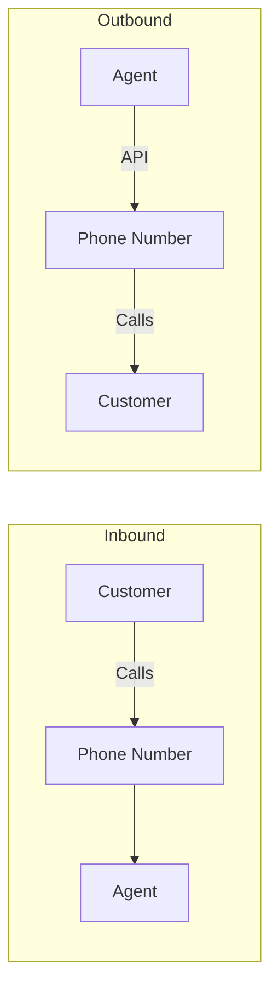
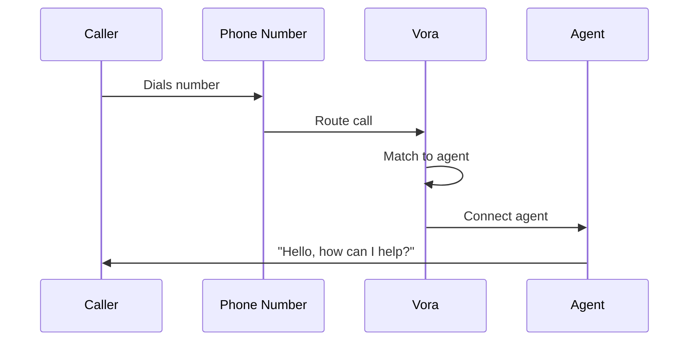

# Phone Numbers

Connect your agents to phone numbers to handle inbound and outbound voice calls.

---

## Overview

Vora provides phone numbers in 50+ countries, allowing your agents to:

- **Receive inbound calls** - Customers call your number
- **Make outbound calls** - Agent initiates calls
- **Transfer calls** - Route to human agents
- **Send SMS** - Text messaging capabilities



---

## Getting Phone Numbers

### Purchase a Number

<Steps>
  <Step title="Navigate to Phone Numbers">
    Go to **Settings** → **Phone Numbers** → **Get Number**.
  </Step>
  <Step title="Select country">
    Choose the country for your number.
  </Step>
  <Step title="Choose number type">
    Select Local, Toll-Free, or Mobile.
  </Step>
  <Step title="Search for numbers">
    Browse available numbers or search for specific patterns.
  </Step>
  <Step title="Purchase">
    Click **Purchase** to add the number to your account.
  </Step>
</Steps>

### Number Types

| Type | Description | Best For |
|------|-------------|----------|
| **Local** | Area code matches region | Regional presence |
| **Toll-Free** | Free for callers (800, 888, etc.) | National reach |
| **Mobile** | Mobile number format | SMS + Voice |

### Pricing

| Country | Local | Toll-Free | SMS |
|---------|-------|-----------|-----|
| 🇺🇸 United States | $1/mo | $2/mo | ✓ |
| 🇬🇧 United Kingdom | $1.50/mo | $3/mo | ✓ |
| 🇩🇪 Germany | $2/mo | $4/mo | ✓ |
| 🇦🇺 Australia | $2/mo | $3.50/mo | ✓ |

See [Pricing](/platform/billing/plans) for complete rates.

---

## Connecting Numbers to Agents

### Assign to Agent

1. Go to **Phone Numbers** → Select number
2. Click **Connect Agent**
3. Choose the agent to handle calls
4. Configure call settings
5. Save

### Call Settings

| Setting | Description |
|---------|-------------|
| **Greeting delay** | Seconds before agent speaks |
| **Ring timeout** | How long to ring before voicemail |
| **Recording** | Auto-record all calls |
| **Transcription** | Generate transcripts |

### Multiple Numbers, One Agent

Assign multiple numbers to the same agent:

```javascript
// Numbers with different greetings
{
  "numbers": [
    {
      "number": "+1-800-SUPPORT",
      "greeting": "Thank you for calling customer support..."
    },
    {
      "number": "+1-800-SALES",
      "greeting": "Thanks for your interest in our products..."
    }
  ],
  "agent": "agent_xyz"
}
```

---

## Inbound Calls

### Call Flow



### Caller ID

Access caller information during the call:

```javascript
{
  "session": {
    "participant": {
      "phone": "+1234567890",
      "callerName": "John Doe",  // If available
      "location": {
        "city": "San Francisco",
        "state": "CA",
        "country": "US"
      }
    }
  }
}
```

### Business Hours

Configure when the number is available:

```javascript
{
  "businessHours": {
    "timezone": "America/New_York",
    "schedule": {
      "monday": { "start": "09:00", "end": "17:00" },
      "tuesday": { "start": "09:00", "end": "17:00" },
      "wednesday": { "start": "09:00", "end": "17:00" },
      "thursday": { "start": "09:00", "end": "17:00" },
      "friday": { "start": "09:00", "end": "17:00" },
      "saturday": null,
      "sunday": null
    },
    "afterHours": {
      "action": "voicemail",
      "message": "We're currently closed. Please leave a message."
    }
  }
}
```

---

## Outbound Calls

### API-Initiated Calls

Start calls programmatically:

```javascript
const call = await vora.calls.create({
  to: '+1234567890',
  from: 'pn_abc123',  // Your phone number ID
  agent: 'agent_xyz',
  context: {
    purpose: 'appointment_reminder',
    appointment: {
      date: '2024-01-20',
      time: '14:00'
    }
  }
});

console.log('Call started:', call.id);
```

### Caller ID Display

Configure what callers see:

| Option | Description |
|--------|-------------|
| **Phone number** | Shows your Vora number |
| **Business name** | CNAM registration (US only) |
| **Custom** | Verified number (requires approval) |

### Outbound Restrictions

- Must have verified business identity
- Comply with TCPA, GDPR, and local regulations
- Respect do-not-call lists
- Rate limits apply per number

---

## Bring Your Own Number

### Supported Providers

Port numbers from these carriers:

| Provider | Port Time | Notes |
|----------|-----------|-------|
| **Twilio** | 1-2 days | Direct API transfer |
| **Vonage** | 2-5 days | LOA required |
| **Bandwidth** | 1-3 days | LOA required |
| **Other carriers** | 5-14 days | Standard port process |

### Porting Process

<Steps>
  <Step title="Submit request">
    Go to **Phone Numbers** → **Port Number**.
  </Step>
  <Step title="Provide documentation">
    Upload Letter of Authorization (LOA) and recent bill.
  </Step>
  <Step title="Verify ownership">
    Confirm you own the number.
  </Step>
  <Step title="Schedule port">
    Choose port date (business days only).
  </Step>
  <Step title="Complete">
    Number transfers to Vora on scheduled date.
  </Step>
</Steps>

### SIP Trunking

Connect your existing telephony infrastructure:

```javascript
{
  "sipTrunk": {
    "name": "Office PBX",
    "uri": "sip:trunk.yourcompany.com:5060",
    "authentication": {
      "username": "vora",
      "password": "{{secret.sip_password}}"
    },
    "codecs": ["PCMU", "PCMA", "G729"]
  }
}
```

---

## Call Quality

### Network Requirements

| Metric | Minimum | Recommended |
|--------|---------|-------------|
| **Bandwidth** | 100 Kbps | 256 Kbps |
| **Latency** | < 300ms | < 150ms |
| **Jitter** | < 50ms | < 20ms |
| **Packet loss** | < 3% | < 1% |

### Quality Monitoring

Monitor call quality in real-time:

```javascript
{
  "callQuality": {
    "mos": 4.2,           // Mean Opinion Score (1-5)
    "latency": 120,       // ms
    "jitter": 15,         // ms
    "packetLoss": 0.5     // %
  }
}
```

### Troubleshooting

| Issue | Possible Cause | Solution |
|-------|----------------|----------|
| **Echo** | Poor network | Enable echo cancellation |
| **Choppy audio** | High latency | Check network connection |
| **One-way audio** | Firewall blocking | Open RTP ports (10000-60000) |
| **No audio** | Codec mismatch | Verify supported codecs |

---

## Compliance

### Regulatory Requirements

| Region | Requirement |
|--------|-------------|
| **US** | TCPA compliance, A2P 10DLC registration |
| **EU** | GDPR consent, ePrivacy compliance |
| **UK** | ICO registration, PECR compliance |
| **Australia** | ACMA registration, Do Not Call list |

### Number Verification

For outbound calling, verify your business:

1. Submit business documentation
2. Provide use case description
3. Await approval (1-3 business days)
4. Numbers approved for outbound use

### Recording Consent

Configure consent handling:

```javascript
{
  "recording": {
    "enabled": true,
    "consent": {
      "type": "one-party",  // or "two-party"
      "announcement": "This call may be recorded for quality purposes.",
      "position": "start"   // Announce at call start
    }
  }
}
```

---

## Best Practices

<AccordionGroup>
  <Accordion title="Choose the right number type">
    - **Local**: For regional businesses wanting local presence
    - **Toll-Free**: For national reach, customer perception of legitimacy
    - **Mobile**: When SMS capability is essential
  </Accordion>

  <Accordion title="Set up business hours">
    Configure after-hours handling to avoid missed opportunities:
    - Voicemail with callback option
    - Text message with business hours
    - Emergency escalation path
  </Accordion>

  <Accordion title="Monitor call quality">
    Regularly check MOS scores and network metrics. Poor quality degrades user experience.
  </Accordion>

  <Accordion title="Stay compliant">
    Ensure regulatory compliance for each region you operate in. Violations can result in fines.
  </Accordion>
</AccordionGroup>

---

## Next Steps

<CardGroup cols={2}>
  <Card title="Agent Deployment" icon="rocket" href="/platform/agents/deployment">
    Connect agents to numbers
  </Card>
  <Card title="Call Analytics" icon="chart-line" href="/platform/analytics">
    Monitor call performance
  </Card>
  <Card title="Billing" icon="credit-card" href="/platform/billing">
    View number costs
  </Card>
  <Card title="Support" icon="headset" href="/platform/support">
    Get help with numbers
  </Card>
</CardGroup>
