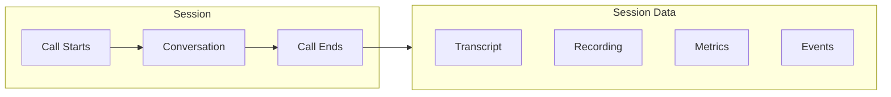

# Sessions

Every conversation with your agent creates a session. This page explains how to view, search, and manage sessions.

---

## What is a Session?

A session represents a single conversation between a user and your agent:



### Session Contains

| Data | Description |
|------|-------------|
| **Transcript** | Full text of the conversation |
| **Recording** | Audio file (if enabled) |
| **Metrics** | Duration, latency, sentiment |
| **Events** | Function calls, transfers, errors |
| **Metadata** | User info, channel, timestamp |

---

## Sessions List

### Viewing Sessions

Go to **Sessions** in the sidebar to see all conversations:

| Column | Description |
|--------|-------------|
| **ID** | Unique session identifier |
| **Agent** | Which agent handled the call |
| **User** | Caller info (if available) |
| **Duration** | Call length |
| **Outcome** | Completed, escalated, abandoned |
| **Sentiment** | Overall mood |
| **Time** | When the call occurred |

### Sorting and Filtering

**Sort by:**
- Most recent (default)
- Longest duration
- Lowest sentiment
- Most events

**Filter by:**
- Agent
- Date range
- Outcome
- Sentiment
- Has recording
- Has errors

---

## Session Details

Click any session to view details:

### Overview Tab

| Field | Example |
|-------|---------|
| **Session ID** | `sess_abc123xyz` |
| **Agent** | Customer Support Agent |
| **Started** | Jan 15, 2024 10:30:45 AM |
| **Duration** | 3 minutes 24 seconds |
| **Outcome** | Resolved |
| **Sentiment** | 0.72 (Positive) |

### User Information

| Field | Value |
|-------|-------|
| **Phone** | +1 (555) 123-4567 |
| **Name** | John Doe |
| **Email** | john@example.com |
| **Location** | New York, NY |
| **Previous sessions** | 3 |

### Session Variables

Variables passed when the session started:

```json
{
  "account_id": "acc_123",
  "tier": "premium",
  "language": "en"
}
```

---

## Transcript View

See the full conversation:

```
[10:30:45] Agent: Hi! Thanks for calling Acme Corp. This is Sarah.
                  How can I help you today?

[10:30:52] User: Hi, I need to check on my order status.

[10:30:55] Agent: I'd be happy to help you with that. Could you
                  please provide your order number?

[10:31:02] User: It's order number 12345.

[10:31:05] [Function: order_lookup]
           Input: { "order_number": "12345" }
           Output: { "status": "shipped", "tracking": "1Z999..." }

[10:31:08] Agent: I found your order. It was shipped yesterday and
                  is currently in transit. You can track it with
                  tracking number 1Z999...
```

### Transcript Features

- **Search** - Find specific words or phrases
- **Timestamps** - See exact timing
- **Speaker labels** - Agent vs User
- **Function calls** - See what actions were taken
- **Sentiment** - Per-message sentiment scores

---

## Events Timeline

View all events that occurred during the session:

| Time | Event | Details |
|------|-------|---------|
| 10:30:45 | `session.started` | Connection established |
| 10:30:45 | `agent.greeting` | Greeting played |
| 10:31:05 | `function.called` | order_lookup |
| 10:31:06 | `function.completed` | Success |
| 10:32:15 | `session.ended` | User hung up |

### Event Types

| Event | Description |
|-------|-------------|
| `session.started` | Call connected |
| `session.ended` | Call ended |
| `agent.speaking` | Agent started/stopped |
| `user.speaking` | User started/stopped |
| `function.called` | Function executed |
| `kb.query` | Knowledge base searched |
| `error` | Something went wrong |
| `transfer` | Escalation initiated |

---

## Session Metrics

### Latency Breakdown

| Component | Time |
|-----------|------|
| Speech-to-text | 120ms |
| Knowledge retrieval | 85ms |
| LLM generation | 450ms |
| Text-to-speech | 180ms |
| **Total** | 835ms |

### Conversation Metrics

| Metric | Value |
|--------|-------|
| **Turns** | 8 |
| **User words** | 45 |
| **Agent words** | 156 |
| **Interruptions** | 1 |
| **Silences** | 2 |

### Quality Metrics

| Metric | Value |
|--------|-------|
| **Sentiment** | 0.72 |
| **Resolution** | Resolved |
| **KB hits** | 3 |
| **Functions** | 2 |

---

## Recordings

### Playing Recordings

If recording is enabled, listen to the audio:

1. Click **Recording** tab
2. Use the audio player controls
3. Speed up/slow down playback
4. Download for offline review

### Recording Controls

| Control | Action |
|---------|--------|
| **Play/Pause** | Start/stop playback |
| **Scrub** | Jump to specific time |
| **Speed** | 0.5x, 1x, 1.5x, 2x |
| **Download** | Save MP3 file |
| **Share** | Generate shareable link |

### Recording Settings

Configure recording at the agent level:

| Setting | Options |
|---------|---------|
| **Enable recording** | Yes/No |
| **Recording format** | MP3, WAV |
| **Retention** | 7, 30, 90, 365 days |
| **Consent message** | Optional disclosure |

---

## Session Actions

### Export Session

Export session data:

| Format | Includes |
|--------|----------|
| **JSON** | All data, structured |
| **CSV** | Tabular transcript |
| **PDF** | Formatted report |
| **Audio** | Recording file |

### Add Notes

Add internal notes to sessions:

```markdown
**Follow-up needed**

Customer was satisfied but mentioned they'd like
a feature for batch ordering. Passed to product team.

- Added by: Sarah M.
- Date: Jan 15, 2024
```

### Create Support Ticket

Convert a session into a support ticket:

1. Click **Create Ticket**
2. Select destination (Zendesk, Intercom, etc.)
3. Review pre-filled information
4. Submit ticket

---

## Session Search

### Basic Search

Search across all session content:

```
order status shipping
```

Searches:
- Transcripts
- User information
- Session notes
- Function parameters

### Advanced Search

Use operators for precise searches:

| Operator | Example | Description |
|----------|---------|-------------|
| `agent:` | `agent:"Support Agent"` | Specific agent |
| `user:` | `user:"john@example.com"` | Specific user |
| `sentiment:` | `sentiment:&lt;0.3` | Sentiment range |
| `duration:` | `duration:>300` | Duration in seconds |
| `outcome:` | `outcome:escalated` | Specific outcome |
| `function:` | `function:order_lookup` | Function was called |
| `date:` | `date:2024-01-15` | Specific date |

### Saved Searches

Save frequently used searches:

| Name | Query | Count |
|------|-------|-------|
| Escalated calls | `outcome:escalated` | 124 |
| Negative sentiment | `sentiment:&lt;0.3` | 56 |
| Order issues | `"order" AND sentiment:&lt;0.5` | 89 |

---

## Bulk Operations

### Select Multiple Sessions

Select sessions for bulk actions:

1. Check boxes next to sessions
2. Or use **Select All** for filtered results

### Available Actions

| Action | Description |
|--------|-------------|
| **Export** | Download as CSV/JSON |
| **Tag** | Add labels |
| **Delete** | Remove sessions |
| **Archive** | Move to archive |

---

## Session API

### List Sessions

```javascript
const sessions = await vora.sessions.list({
  agentId: 'agent_abc123',
  limit: 50,
  offset: 0,
  filters: {
    outcome: 'completed',
    sentimentMin: 0.5,
    startedAfter: '2024-01-01',
  },
});
```

### Get Session Details

```javascript
const session = await vora.sessions.get('sess_abc123');

console.log(session.transcript);
console.log(session.events);
console.log(session.metrics);
```

### Download Recording

```javascript
const recording = await vora.sessions.getRecording('sess_abc123');
// Returns presigned URL for download
```

See [Sessions API](/api/sessions) for full documentation.

---

## Best Practices

<AccordionGroup>
  <Accordion title="Review low-sentiment sessions">
    Regularly review sessions with negative sentiment to identify and fix issues.
  </Accordion>

  <Accordion title="Add notes for context">
    Add notes to sessions that need follow-up or contain important feedback.
  </Accordion>

  <Accordion title="Use saved searches">
    Create saved searches for common queries to speed up your workflow.
  </Accordion>

  <Accordion title="Set appropriate retention">
    Balance storage costs with compliance and analysis needs when setting retention periods.
  </Accordion>
</AccordionGroup>

---

## Next Steps

<CardGroup cols={2}>
  <Card title="Transcripts" icon="closed-captioning" href="/platform/sessions/transcripts">
    Deep dive into transcripts
  </Card>
  <Card title="Recordings" icon="microphone" href="/platform/sessions/recordings">
    Working with recordings
  </Card>
  <Card title="Analytics" icon="chart-line" href="/platform/analytics">
    Aggregate analytics
  </Card>
  <Card title="Sessions API" icon="code" href="/api/sessions">
    API documentation
  </Card>
</CardGroup>
