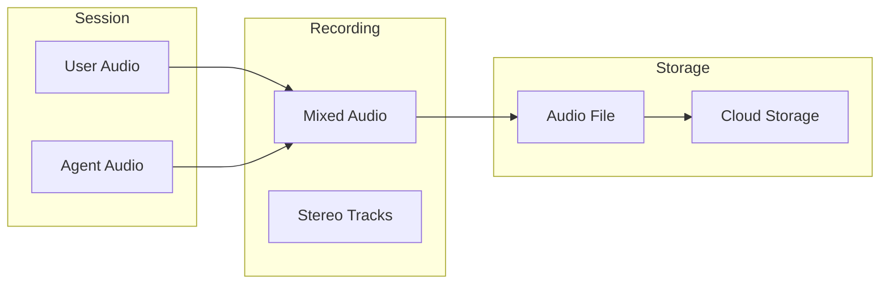

# Recordings

Call recordings provide the complete audio record of conversations. Use them for quality assurance, training, compliance, and dispute resolution.

---

## Recording Overview

When enabled, Vora records the full audio of each session:



### Recording Contains

| Component | Description |
|-----------|-------------|
| **User audio** | What the caller said |
| **Agent audio** | What the agent said |
| **Background** | Ambient sounds |
| **Timestamps** | Sync with transcript |

---

## Enabling Recordings

### Agent-Level Setting

Enable recording for all sessions with an agent:

1. Go to **Agent** → **Settings** → **Recording**
2. Toggle **Enable recording**
3. Configure options

### Session-Level Control

Override for specific sessions via API:

```javascript
const session = await vora.sessions.create({
  agentId: 'agent_abc123',
  recording: {
    enabled: true,  // Override agent setting
    format: 'mp3',
  },
  participant: { name: 'John' },
});
```

### Recording Options

| Option | Values | Default |
|--------|--------|---------|
| **Format** | MP3, WAV, FLAC | MP3 |
| **Quality** | Low, Medium, High | High |
| **Channels** | Mono, Stereo | Mono |
| **Sample rate** | 8k, 16k, 44.1k | 16k |

---

## Accessing Recordings

### In the Dashboard

1. Go to **Sessions** → Select a session
2. Click the **Recording** tab
3. Use the audio player

### Player Controls

| Control | Action |
|---------|--------|
| **Play/Pause** | Start/stop playback |
| **Progress bar** | Scrub to position |
| **Speed** | 0.5x, 1x, 1.5x, 2x |
| **Volume** | Adjust volume |
| **Download** | Save locally |

### Synchronized View

View transcript alongside recording:

- Click on transcript text to jump to that point in the recording
- Click on timeline to highlight corresponding transcript text
- Useful for reviewing specific moments

---

## Downloading Recordings

### Individual Download

1. Open the session
2. Go to **Recording** tab
3. Click **Download**
4. Choose format

### Bulk Download

1. Select multiple sessions
2. Click **Export** → **Recordings**
3. Download as ZIP

### Via API

```javascript
// Get recording URL
const recording = await vora.sessions.getRecording('sess_abc123');

console.log(recording.url);         // Presigned download URL
console.log(recording.duration);    // Duration in seconds
console.log(recording.size);        // File size in bytes
console.log(recording.expiresAt);   // URL expiration
```

---

## Recording Formats

### Audio Formats

| Format | Quality | Size | Use Case |
|--------|---------|------|----------|
| **MP3** | Good | Small | General use |
| **WAV** | Excellent | Large | Analysis |
| **FLAC** | Excellent | Medium | Archival |

### Channel Options

| Option | Description |
|--------|-------------|
| **Mono** | Mixed audio, single channel |
| **Stereo** | User left, Agent right |
| **Dual mono** | Separate files per speaker |

<Tip>
  Use **Stereo** recordings for quality analysis - it's easier to isolate and review each speaker independently.
</Tip>

---

## Storage and Retention

### Retention Settings

Configure how long recordings are kept:

| Setting | Description |
|---------|-------------|
| **7 days** | Short-term review |
| **30 days** | Standard retention |
| **90 days** | Extended retention |
| **1 year** | Compliance requirements |
| **Forever** | Permanent storage |

### Storage Locations

| Plan | Storage |
|------|---------|
| **Free** | Vora cloud, 7 days |
| **Pro** | Vora cloud, configurable |
| **Enterprise** | Your cloud (S3, GCS, Azure) |

### Bring Your Own Storage (Enterprise)

Store recordings in your own cloud:

```javascript
// Configure S3 storage
{
  "recording": {
    "storage": {
      "provider": "s3",
      "bucket": "my-recordings",
      "region": "us-east-1",
      "prefix": "vora/",
      "credentials": {
        "accessKeyId": "...",
        "secretAccessKey": "..."
      }
    }
  }
}
```

---

## Consent and Compliance

### Recording Disclosure

Configure consent messages:

| Setting | Description |
|---------|-------------|
| **Disclosure message** | "This call may be recorded for quality assurance" |
| **Timing** | Beginning, after greeting, custom |
| **Skip option** | Allow users to opt out |

### Compliance Considerations

<Warning>
  Recording laws vary by jurisdiction. Ensure compliance with:
  - Two-party consent states/countries
  - Industry regulations (HIPAA, PCI, etc.)
  - Data protection laws (GDPR, CCPA)
</Warning>

### Consent Options

| Mode | Description |
|------|-------------|
| **All-party** | Announce recording to everyone |
| **One-party** | Record without announcement (where legal) |
| **Opt-in** | Ask for explicit consent |
| **Opt-out** | Announce with option to disable |

---

## Quality Assurance

### Review Workflow

Set up a QA review process:

<Steps>
  <Step title="Select recordings to review">
    Filter by agent, date, or outcome.
  </Step>
  <Step title="Listen and evaluate">
    Score based on criteria (see below).
  </Step>
  <Step title="Add notes">
    Document feedback for training.
  </Step>
  <Step title="Track metrics">
    Monitor QA scores over time.
  </Step>
</Steps>

### Evaluation Criteria

| Criterion | Weight | Description |
|-----------|--------|-------------|
| **Accuracy** | 25% | Information correctness |
| **Clarity** | 20% | Clear communication |
| **Efficiency** | 20% | Time to resolution |
| **Tone** | 15% | Appropriate demeanor |
| **Compliance** | 20% | Policy adherence |

### QA Scoring

Add scores to sessions:

```javascript
await vora.sessions.addQaScore('sess_abc123', {
  reviewer: 'qa_team',
  score: 85,
  criteria: {
    accuracy: 90,
    clarity: 85,
    efficiency: 80,
    tone: 85,
    compliance: 85,
  },
  notes: 'Good handling of complex question',
});
```

---

## Recording Analysis

### Silence Detection

Identify long pauses:

| Silence Type | Duration | Indication |
|--------------|----------|------------|
| Brief pause | &lt;2 sec | Normal |
| Long pause | 2-5 sec | Possible issue |
| Extended silence | >5 sec | Problem |

### Audio Quality Issues

Detect and flag:

- **Echo** - Audio feedback
- **Noise** - Background interference
- **Clipping** - Audio too loud
- **Dropouts** - Missing audio

### Automated Insights

AI-powered analysis:

| Insight | Description |
|---------|-------------|
| **Key moments** | Important points in call |
| **Objections** | User concerns raised |
| **Action items** | Follow-ups needed |
| **Sentiment shifts** | Mood changes |

---

## Security

### Access Control

Control who can access recordings:

| Permission | Admin | Manager | Agent | Viewer |
|------------|-------|---------|-------|--------|
| Listen | ✓ | ✓ | ✓ | ✓ |
| Download | ✓ | ✓ | ✗ | ✗ |
| Delete | ✓ | ✗ | ✗ | ✗ |
| Share | ✓ | ✓ | ✗ | ✗ |

### Encryption

| At Rest | In Transit |
|---------|------------|
| AES-256 | TLS 1.3 |

### Audit Logging

All recording access is logged:

| Action | User | Timestamp |
|--------|------|-----------|
| Played | sarah@company.com | Jan 15, 10:30 |
| Downloaded | mike@company.com | Jan 15, 11:00 |
| Shared | sarah@company.com | Jan 15, 14:30 |

---

## API Reference

### Get Recording

```javascript
const recording = await vora.sessions.getRecording('sess_abc123');

// Response
{
  "id": "rec_xyz789",
  "sessionId": "sess_abc123",
  "url": "https://...",
  "format": "mp3",
  "duration": 205,
  "size": 1640000,
  "createdAt": "2024-01-15T10:30:45Z",
  "expiresAt": "2024-01-15T11:30:45Z"
}
```

### List Recordings

```javascript
const recordings = await vora.recordings.list({
  agentId: 'agent_abc123',
  dateFrom: '2024-01-01',
  dateTo: '2024-01-31',
  limit: 50,
});
```

### Delete Recording

```javascript
await vora.recordings.delete('rec_xyz789');
```

---

## Best Practices

<AccordionGroup>
  <Accordion title="Review a sample regularly">
    Listen to a random sample of recordings weekly to ensure quality.
  </Accordion>

  <Accordion title="Use stereo for analysis">
    Stereo recordings make it easier to isolate and analyze each speaker.
  </Accordion>

  <Accordion title="Set appropriate retention">
    Balance compliance requirements with storage costs.
  </Accordion>

  <Accordion title="Implement consent properly">
    Ensure your recording disclosure meets legal requirements for your jurisdiction.
  </Accordion>

  <Accordion title="Secure sensitive recordings">
    Use BYOS (bring your own storage) for sensitive industries.
  </Accordion>
</AccordionGroup>

---

## Next Steps

<CardGroup cols={2}>
  <Card title="Transcripts" icon="closed-captioning" href="/platform/sessions/transcripts">
    Text transcripts
  </Card>
  <Card title="Sessions" icon="list" href="/platform/sessions">
    Session management
  </Card>
  <Card title="Analytics" icon="chart-line" href="/platform/analytics">
    Performance metrics
  </Card>
  <Card title="Compliance" icon="shield-check" href="/platform/security">
    Security & compliance
  </Card>
</CardGroup>
