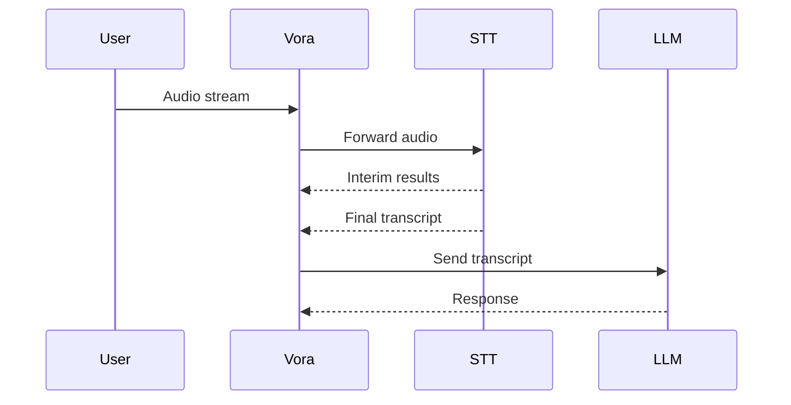

# STT Providers

Vora integrates with **12 speech-to-text providers** for converting caller audio to text. Choose based on language support, latency, accuracy, and cost.

---

## Available Providers

<CardGroup cols={3}>
  <Card title="Deepgram" icon="microphone" href="/providers/stt/deepgram">
    Nova-3 - Ultra-fast streaming, 30+ languages
  </Card>
  <Card title="Google Cloud" icon="google" href="/providers/stt/google">
    Chirp 3 - 125+ languages, best coverage
  </Card>
  <Card title="AssemblyAI" icon="waveform" href="/providers/stt/assemblyai">
    Universal-2 - 99+ languages, high accuracy
  </Card>
  <Card title="Soniox" icon="audio-description" href="/providers/stt/soniox">
    v4 - Cheapest, real-time translation
  </Card>
  <Card title="Azure Speech" icon="microsoft" href="/providers/stt/google">
    110+ languages, enterprise custom models
  </Card>
  <Card title="AWS Transcribe" icon="aws" href="/providers/stt/google">
    100+ languages, medical transcription
  </Card>
  <Card title="ElevenLabs Scribe" icon="waveform-lines" href="/providers/tts/elevenlabs">
    99+ languages, high accuracy batch
  </Card>
  <Card title="Speechmatics" icon="comments" href="/providers/stt/google">
    55+ languages, medical/enterprise
  </Card>
  <Card title="Sarvam AI" icon="globe" href="/languages/hindi">
    Saarika - Best for 11 Indian languages
  </Card>
  <Card title="Munsit (CNTXT)" icon="language" href="/languages/arabic">
    Best for Arabic (25+ dialects)
  </Card>
  <Card title="Valsea" icon="earth-asia" href="/languages/indonesian">
    Best for SEA languages and Singlish
  </Card>
  <Card title="iFLYTEK" icon="dragon" href="/providers/stt/google">
    Chinese and Asian language focus
  </Card>
</CardGroup>

---

## Comparison Matrix

| Provider | Languages | Latency | Pricing | Best For |
|----------|-----------|---------|---------|----------|
| [Deepgram Nova-3](/providers/stt/deepgram) | 30+ | ~100ms | $0.0077/min | Real-time voice agents |
| [Google Cloud STT](/providers/stt/google) | 125+ | ~200-300ms | $0.016/min | Widest language coverage |
| [AssemblyAI](/providers/stt/assemblyai) | 99+ | ~300ms | $0.15/hr | Accuracy + add-ons |
| [Soniox v4](/providers/stt/soniox) | 60+ | ~150ms | $0.10/hr | Lowest cost |
| Azure Speech | 110+ | ~200-300ms | $0.017-$0.033/min | Enterprise, custom models |
| AWS Transcribe | 100+ | ~300ms | $0.016-$0.024/min | Enterprise, medical |
| ElevenLabs Scribe | 99+ | ~400ms | $0.40/hr | High accuracy batch |
| Speechmatics | 55+ | ~300ms | ~$0.04/min | Medical, enterprise |
| [Sarvam AI](/languages/hindi) | 11 Indian | ~300ms | ~$0.35/hr | Indian languages |
| [Munsit](/languages/arabic) | Arabic (25+ dialects) | ~300ms | Enterprise | Arabic dialects |
| [Valsea](/languages/indonesian) | 7 SEA | ~300ms | Contact | SEA accents, Singlish |
| iFLYTEK | 15 | ~300ms | Contact | Chinese/Asian |

---

## Choosing a Provider

### By Use Case

| Use Case | Recommended | Why |
|----------|-------------|-----|
| **Voice agents (general)** | Deepgram Nova-3 | Lowest latency, great accuracy |
| **Multi-language (broad)** | Google Cloud STT | 125+ languages with Chirp 3 |
| **Indian languages** | Sarvam AI Saarika | Purpose-built for 11 Indian languages |
| **Arabic dialects** | Munsit (CNTXT) | 25+ Arabic dialect support |
| **Southeast Asian** | Valsea | Singlish, accented English, SEA languages |
| **Lowest latency** | Deepgram Nova-3 | ~100ms streaming |
| **Lowest cost** | Soniox v4 | $0.10/hr async |
| **Enterprise/custom** | Azure Speech | Custom acoustic models |

### By Region

| Region | Recommended Providers |
|--------|----------------------|
| **North America** | Deepgram, Google, Azure |
| **Europe** | Azure, Google, Speechmatics |
| **India** | Sarvam AI, Google, Deepgram |
| **MENA** | Munsit, Google, Azure |
| **Southeast Asia** | Valsea, Google, Deepgram |
| **China** | iFLYTEK, Google |

---

## Key Considerations

### Latency

For real-time voice agents, STT latency is critical:

| Rank | Provider | Typical Latency |
|------|----------|-----------------|
| 1 | Deepgram Nova-3 | ~100ms |
| 2 | Soniox v4 | ~150ms |
| 3 | Google / Azure | ~200-300ms |
| 4 | AssemblyAI | ~300ms |

### Accuracy

Accuracy varies by language and accent:
- **English**: Deepgram and AssemblyAI lead
- **Indian languages**: Sarvam AI leads with purpose-built models
- **Arabic**: Munsit leads with 25+ dialect support
- **SEA languages**: Valsea leads with Singlish and accent support

### Pricing

Most cost-effective options:

| Rank | Provider | Cost |
|------|----------|------|
| 1 | Deepgram | $0.0077/min (best value for quality) |
| 2 | Soniox | $0.10/hr async ($0.0017/min) |
| 3 | Google | $0.016/min |
| 4 | Azure | $0.017/min |

---

## Configuration

Configure STT providers in the Command Center [Ears Tab](/advanced/command-center/ears-tab):
1. Select your primary STT provider
2. Set the language code
3. Configure VAD (voice activity detection) settings
4. Optionally set a fallback provider in the [Advanced Tab](/advanced/command-center/advanced-tab)

### API Configuration

```typescript
const agent = await vora.agents.create({
  name: 'Voice Agent',
  systemPrompt: 'You are a helpful assistant.',
  stt: {
    provider: 'deepgram',
    model: 'nova-3',
    language: 'en-US',
    punctuate: true,
    interimResults: true,
    utteranceEndMs: 1000
  }
});
```

---

## Streaming Architecture



---

## Best Practices

<AccordionGroup>
  <Accordion title="Optimize for Voice AI">
    ```typescript
    stt: {
      provider: 'deepgram',
      model: 'nova-3',
      punctuate: true,
      numerals: true,
      utteranceEndMs: 800,
      interimResults: true
    }
    ```
  </Accordion>

  <Accordion title="Multi-Language Support">
    For international audiences, use Google Cloud STT with auto-detection:
    ```typescript
    stt: {
      provider: 'google',
      model: 'chirp_3',
      languageCode: 'auto'
    }
    ```
  </Accordion>

  <Accordion title="Configure Fallbacks">
    Set up automatic failover:
    ```
    Primary: Deepgram Nova-3
    Fallback: Google Cloud STT
    Fallback: Azure Speech
    ```
    Configure in the [Advanced Tab](/advanced/command-center/advanced-tab).
  </Accordion>
</AccordionGroup>

---

## Provider Details

<CardGroup cols={2}>
  <Card title="Deepgram" icon="microphone" href="/providers/stt/deepgram">
    Nova-3 streaming
  </Card>
  <Card title="Google Cloud" icon="google" href="/providers/stt/google">
    Chirp 3, 125+ languages
  </Card>
  <Card title="AssemblyAI" icon="waveform" href="/providers/stt/assemblyai">
    Universal-2, high accuracy
  </Card>
  <Card title="Soniox" icon="audio-description" href="/providers/stt/soniox">
    v4, lowest cost
  </Card>
</CardGroup>

<Tip>
  For detailed language-specific provider recommendations, see the [ASR Provider Comparison](/languages/asr-providers) page.
</Tip>
