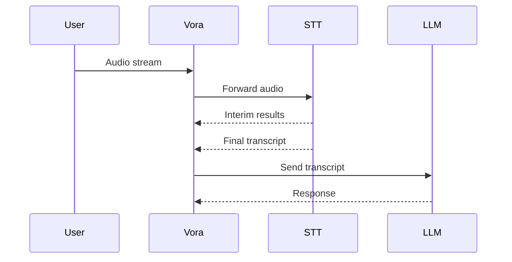

# STT Providers

Vora integrates with speech-to-text providers for converting caller audio to text. Choose based on language support, latency, accuracy, and cost.

---

## Available Providers

<CardGroup cols={3}>
  <Card title="Deepgram" icon="microphone" href="/providers/stt/deepgram">
    Nova-3 - Ultra-fast streaming, 30+ languages
  </Card>
  <Card title="Google Cloud" icon="google" href="/providers/stt/google">
    Chirp 3 - 125+ languages, best coverage
  </Card>
  <Card title="AssemblyAI" icon="waveform" href="/providers/stt/assemblyai">
    Universal-2 - 99+ languages, high accuracy
  </Card>
</CardGroup>

---

## Comparison Matrix

| Provider | Languages | Latency | Pricing | Best For |
|----------|-----------|---------|---------|----------|
| [Deepgram Nova-3](/providers/stt/deepgram) | 30+ | ~100ms | $0.0077/min | Real-time voice agents |
| [Google Cloud STT](/providers/stt/google) | 125+ | ~200-300ms | $0.016/min | Widest language coverage |
| [AssemblyAI](/providers/stt/assemblyai) | 99+ | ~300ms | $0.15/hr | Accuracy + add-ons |

---

## Choosing a Provider

### By Use Case

| Use Case | Recommended | Why |
|----------|-------------|-----|
| **Voice agents (general)** | Deepgram Nova-3 | Lowest latency, great accuracy |
| **Multi-language (broad)** | Google Cloud STT | 125+ languages with Chirp 3 |
| **Lowest latency** | Deepgram Nova-3 | ~100ms streaming |
| **Highest accuracy** | AssemblyAI | Universal-2 with add-ons |
| **Enterprise/custom** | Google Cloud STT | Custom acoustic models available |

### By Region

| Region | Recommended Providers |
|--------|----------------------|
| **North America** | Deepgram, Google |
| **Europe** | Google, AssemblyAI |
| **India** | Google, Deepgram |
| **MENA** | Google, AssemblyAI |
| **Southeast Asia** | Google, Deepgram |

---

## Key Considerations

### Latency

For real-time voice agents, STT latency is critical:

| Rank | Provider | Typical Latency |
|------|----------|-----------------|
| 1 | Deepgram Nova-3 | ~100ms |
| 2 | Google / AssemblyAI | ~200-300ms |
| 3 | AssemblyAI | ~300ms |

### Accuracy

Accuracy varies by language and accent:
- **English**: Deepgram and AssemblyAI lead
- **Broad multilingual**: Google Cloud STT with Chirp 3 covers 125+ languages

### Pricing

Most cost-effective options:

| Rank | Provider | Cost |
|------|----------|------|
| 1 | Deepgram | $0.0077/min (best value for quality) |
| 2 | Google | $0.016/min |
| 3 | AssemblyAI | $0.15/hr |

---

## Configuration

Configure STT providers in the Command Center [Ears Tab](/advanced/command-center/ears-tab):
1. Select your primary STT provider
2. Set the language code
3. Configure VAD (voice activity detection) settings
4. Optionally set a fallback provider in the [Advanced Tab](/advanced/command-center/advanced-tab)

### API Configuration

```typescript
const agent = await vora.agents.create({
  name: 'Voice Agent',
  systemPrompt: 'You are a helpful assistant.',
  stt: {
    provider: 'deepgram',
    model: 'nova-3',
    language: 'en-US',
    punctuate: true,
    interimResults: true,
    utteranceEndMs: 1000
  }
});
```

---

## Streaming Architecture



---

## Best Practices

<AccordionGroup>
  <Accordion title="Optimize for Voice AI">
    ```typescript
    stt: {
      provider: 'deepgram',
      model: 'nova-3',
      punctuate: true,
      numerals: true,
      utteranceEndMs: 800,
      interimResults: true
    }
    ```
  </Accordion>

  <Accordion title="Multi-Language Support">
    For international audiences, use Google Cloud STT with auto-detection:
    ```typescript
    stt: {
      provider: 'google',
      model: 'chirp_3',
      languageCode: 'auto'
    }
    ```
  </Accordion>

  <Accordion title="Configure Fallbacks">
    Set up automatic failover:
    ```
    Primary: Deepgram Nova-3
    Fallback: Google Cloud STT
    ```
    Configure in the [Advanced Tab](/advanced/command-center/advanced-tab).
  </Accordion>
</AccordionGroup>

---

## Provider Details

<CardGroup cols={2}>
  <Card title="Deepgram" icon="microphone" href="/providers/stt/deepgram">
    Nova-3 streaming
  </Card>
  <Card title="Google Cloud" icon="google" href="/providers/stt/google">
    Chirp 3, 125+ languages
  </Card>
  <Card title="AssemblyAI" icon="waveform" href="/providers/stt/assemblyai">
    Universal-2, high accuracy
  </Card>
</CardGroup>

<Tip>
  For detailed language-specific provider recommendations, see the [ASR Provider Comparison](/languages/asr-providers) page.
</Tip>
