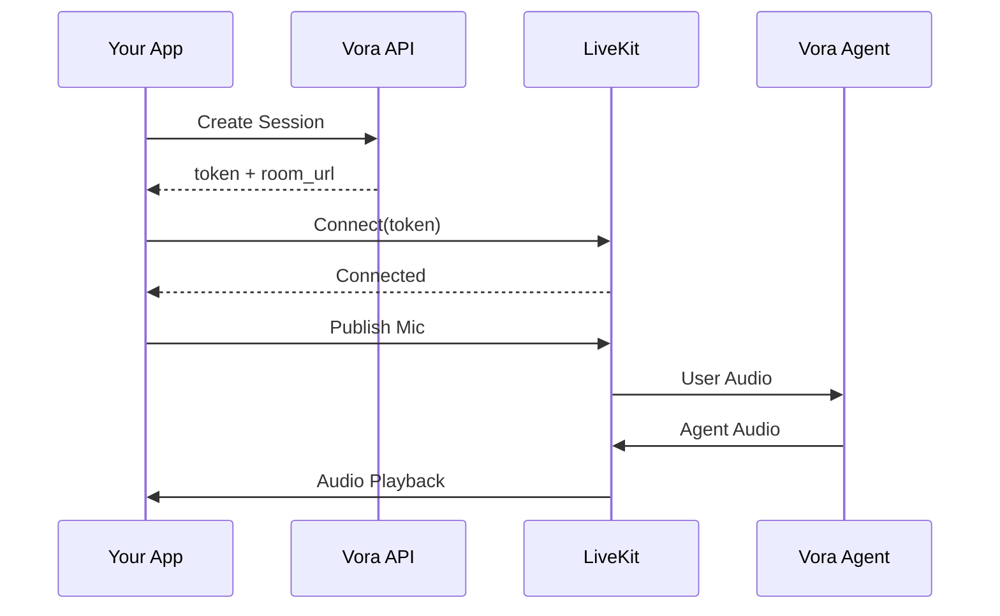

# LiveKit Integration

Vora uses LiveKit for real-time voice communication. This guide covers connecting to voice sessions across different platforms.

---

## Overview

LiveKit is a WebRTC-based platform that handles real-time audio/video communication. When you create a Vora session, you receive:

- **Token**: JWT for authentication
- **Room URL**: WebSocket endpoint for connection



---

## Platform Support

<CardGroup cols={2}>
  <Card title="React" icon="react" href="/sdks/livekit/react">
    Web applications with React
  </Card>
  <Card title="React Native" icon="mobile" href="/sdks/livekit/react-native">
    iOS and Android mobile apps
  </Card>
  <Card title="Vanilla JS" icon="js" href="/sdks/livekit/vanilla">
    Plain JavaScript integration
  </Card>
  <Card title="Python" icon="python" href="/sdks/python/sessions">
    Python backend integration
  </Card>
</CardGroup>

---

## Quick Start

### 1. Create a Session

First, create a session via your backend:

<Tabs>
  <Tab title="JavaScript">
    ```typescript
    // Backend
    const session = await vora.sessions.create({
      agentId: 'agent_abc123',
      userId: 'user_123'
    });

    // Return token and roomUrl to frontend
    return {
      token: session.token,
      roomUrl: session.roomUrl
    };
    ```
  </Tab>
  <Tab title="Python">
    ```python
    # Backend
    session = await client.sessions.create(
        agent_id="agent_abc123",
        user_id="user_123"
    )

    # Return token and room_url to frontend
    return {
        "token": session.token,
        "room_url": session.room_url
    }
    ```
  </Tab>
</Tabs>

### 2. Connect from Frontend

<Tabs>
  <Tab title="React">
    ```tsx
    import { VoraRoom, VoiceAssistant, AudioRenderer } from '@vora-ai/react';

    function VoiceChat({ token, roomUrl }) {
      return (
        <VoraRoom token={token} serverUrl={roomUrl} connect={true} audio={true}>
          <VoiceAssistant />
          <AudioRenderer />
        </VoraRoom>
      );
    }
    ```
  </Tab>
  <Tab title="Vanilla JS">
    ```javascript
    import { Room, RoomEvent } from 'livekit-client';

    const room = new Room();

    room.on(RoomEvent.TrackSubscribed, (track) => {
      if (track.kind === 'audio') {
        const element = track.attach();
        document.body.appendChild(element);
      }
    });

    await room.connect(roomUrl, token);
    await room.localParticipant.setMicrophoneEnabled(true);
    ```
  </Tab>
</Tabs>

---

## Connection States

Handle connection lifecycle properly:

| State | Description | Action |
|-------|-------------|--------|
| `connecting` | Establishing connection | Show loading indicator |
| `connected` | Ready for voice | Enable microphone |
| `reconnecting` | Temporary disconnect | Show "reconnecting" UI |
| `disconnected` | Session ended | Clean up, show end screen |

```typescript
room.on(RoomEvent.ConnectionStateChanged, (state) => {
  switch (state) {
    case ConnectionState.Connecting:
      showLoading();
      break;
    case ConnectionState.Connected:
      hideLoading();
      enableMic();
      break;
    case ConnectionState.Reconnecting:
      showReconnecting();
      break;
    case ConnectionState.Disconnected:
      cleanup();
      showEndScreen();
      break;
  }
});
```

---

## Audio Handling

### Microphone Access

Always request microphone permission before connecting:

```typescript
// Check for permission
const permission = await navigator.permissions.query({ name: 'microphone' });

if (permission.state === 'denied') {
  showMicPermissionError();
  return;
}

// Request access
try {
  await navigator.mediaDevices.getUserMedia({ audio: true });
  await room.connect(roomUrl, token);
} catch (error) {
  if (error.name === 'NotAllowedError') {
    showMicPermissionError();
  }
}
```

### Audio Playback

Handle audio tracks from the agent:

```typescript
room.on(RoomEvent.TrackSubscribed, (track, publication, participant) => {
  if (track.kind === Track.Kind.Audio) {
    // Create audio element
    const audioElement = track.attach();
    audioElement.id = `audio-${participant.identity}`;
    document.getElementById('audio-container').appendChild(audioElement);
  }
});

room.on(RoomEvent.TrackUnsubscribed, (track, publication, participant) => {
  // Clean up audio element
  const audioElement = document.getElementById(`audio-${participant.identity}`);
  if (audioElement) {
    track.detach(audioElement);
    audioElement.remove();
  }
});
```

---

## Data Channel

Receive real-time events from the agent:

```typescript
room.on(RoomEvent.DataReceived, (data, participant) => {
  const message = JSON.parse(new TextDecoder().decode(data));

  switch (message.type) {
    case 'transcript':
      // Real-time transcript
      addTranscriptMessage(message.speaker, message.text);
      break;

    case 'agent_state':
      // Agent state update
      updateAgentState(message.state); // 'idle' | 'listening' | 'thinking' | 'speaking'
      break;

    case 'function_call':
      // Agent calling a function
      showFunctionCall(message.name, message.parameters);
      break;

    case 'function_result':
      // Function result
      showFunctionResult(message.result);
      break;

    case 'error':
      // Session error
      handleError(message.error);
      break;
  }
});
```

### Send Data to Agent

Update session variables mid-conversation:

```typescript
const data = new TextEncoder().encode(JSON.stringify({
  type: 'update_variables',
  variables: {
    current_step: 'checkout',
    cart_total: 99.99
  }
}));

room.localParticipant.publishData(data, { reliable: true });
```

---

## Quality Optimization

### Adaptive Audio

Configure audio for voice calls:

```typescript
const room = new Room({
  adaptiveStream: true,
  dynacast: true,
  audioCaptureDefaults: {
    echoCancellation: true,
    noiseSuppression: true,
    autoGainControl: true
  },
  audioOutputDefaults: {
    // Ensure audio plays through speakers
    deviceId: 'default'
  }
});
```

### Network Handling

Handle poor network conditions:

```typescript
room.on(RoomEvent.ConnectionQualityChanged, (quality, participant) => {
  if (participant.isLocal) {
    switch (quality) {
      case ConnectionQuality.Excellent:
      case ConnectionQuality.Good:
        setNetworkIndicator('good');
        break;
      case ConnectionQuality.Poor:
        setNetworkIndicator('poor');
        showNetworkWarning();
        break;
      case ConnectionQuality.Unknown:
        setNetworkIndicator('unknown');
        break;
    }
  }
});
```

---

## Cleanup

Always clean up properly:

```typescript
async function endSession(room: Room) {
  // Disable local tracks
  await room.localParticipant.setMicrophoneEnabled(false);

  // Detach all audio elements
  room.remoteParticipants.forEach((participant) => {
    participant.audioTrackPublications.forEach((publication) => {
      if (publication.track) {
        publication.track.detach();
      }
    });
  });

  // Disconnect
  await room.disconnect();
}

// On component unmount or page unload
window.addEventListener('beforeunload', () => {
  endSession(room);
});
```

---

## Error Handling

Handle common connection errors:

```typescript
room.on(RoomEvent.Disconnected, (reason) => {
  switch (reason) {
    case DisconnectReason.CLIENT_INITIATED:
      // Normal disconnect
      showEndScreen();
      break;

    case DisconnectReason.SERVER_SHUTDOWN:
    case DisconnectReason.PARTICIPANT_REMOVED:
      // Server-side disconnect
      showSessionEnded();
      break;

    case DisconnectReason.DUPLICATE_IDENTITY:
      // User connected from another device
      showDuplicateSessionError();
      break;

    default:
      // Unexpected disconnect
      showErrorAndRetry();
  }
});

room.on(RoomEvent.MediaDevicesError, (error) => {
  if (error.name === 'NotAllowedError') {
    showMicPermissionError();
  } else if (error.name === 'NotFoundError') {
    showNoMicError();
  } else {
    showGenericDeviceError(error);
  }
});
```

---

## Best Practices

<AccordionGroup>
  <Accordion title="1. Always Use Backend for Session Creation">
    Never expose your Vora API key in frontend code. Create sessions through your backend:

    ```typescript
    // ❌ Bad - API key exposed
    const vora = new VoraClient({ apiKey: 'sk_live_...' });

    // ✅ Good - Backend creates session
    const { token, roomUrl } = await fetch('/api/session', {
      method: 'POST',
      body: JSON.stringify({ agentId })
    }).then(r => r.json());
    ```
  </Accordion>

  <Accordion title="2. Request Microphone Permission Early">
    Request permission before users start the call:

    ```typescript
    // On page load or "Start Call" click
    const stream = await navigator.mediaDevices.getUserMedia({ audio: true });
    stream.getTracks().forEach(track => track.stop()); // Release immediately

    // Now connect - permission is granted
    await room.connect(roomUrl, token);
    ```
  </Accordion>

  <Accordion title="3. Handle Background/Focus Events">
    ```typescript
    document.addEventListener('visibilitychange', () => {
      if (document.hidden) {
        // Optional: mute mic when in background
        room.localParticipant.setMicrophoneEnabled(false);
      } else {
        // Restore when returning
        room.localParticipant.setMicrophoneEnabled(true);
      }
    });
    ```
  </Accordion>

  <Accordion title="4. Provide Visual Feedback">
    Always show connection state to users:

    - Loading indicator during connection
    - Microphone on/off status
    - Network quality indicator
    - Agent speaking/listening state
    - Clear end-of-session UI
  </Accordion>
</AccordionGroup>

---

## Platform Guides

<CardGroup cols={2}>
  <Card title="React" icon="react" href="/sdks/livekit/react">
    Components and hooks for React
  </Card>
  <Card title="React Native" icon="mobile" href="/sdks/livekit/react-native">
    Mobile integration guide
  </Card>
  <Card title="Vanilla JS" icon="js" href="/sdks/livekit/vanilla">
    Plain JavaScript integration
  </Card>
  <Card title="Voice Components" icon="microphone" href="/sdks/javascript/voice">
    Vora's React voice components
  </Card>
</CardGroup>
