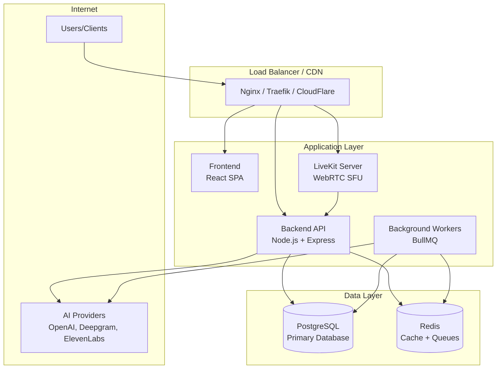

# Self-Hosting Guide

Run Vora on your own infrastructure for maximum control, compliance, and data privacy.

---

## Why Self-Host?

<CardGroup cols={2}>
  <Card title="Data Sovereignty" icon="shield-check">
    Keep all data on your infrastructure
  </Card>
  <Card title="Compliance" icon="file-contract">
    Meet HIPAA, GDPR, SOC 2 requirements
  </Card>
  <Card title="Customization" icon="gear">
    Full control over configuration
  </Card>
  <Card title="Cost Control" icon="chart-line">
    Predictable infrastructure costs
  </Card>
</CardGroup>

---

## Deployment Options

<CardGroup cols={2}>
  <Card title="Docker Compose" icon="docker" href="/self-hosting/docker">
    Single server deployment for development and small scale
  </Card>
  <Card title="Fly.io" icon="paper-plane" href="/self-hosting/fly">
    Managed container platform with global edge deployment
  </Card>
</CardGroup>

---

## Quick Start

### Prerequisites

Before deploying Vora, ensure you have:

- Docker 24.0+ and Docker Compose v2
- PostgreSQL 14+ database
- Redis 7+ instance
- API keys for providers (OpenAI, Deepgram, ElevenLabs)
- Domain with SSL certificate

### Fastest Path

```bash
# 1. Clone the deployment repository
git clone https://github.com/vorahq/vora-self-hosted.git
cd vora-self-hosted

# 2. Copy environment template
cp .env.example .env

# 3. Configure your environment
# Edit .env with your API keys and database credentials

# 4. Start the stack
docker compose up -d

# 5. Verify deployment
curl http://localhost:3000/health
```

---

## Architecture Overview



---

## System Requirements

### Minimum Hardware

| Component | Development | Production |
|-----------|-------------|------------|
| CPU | 4 cores | 8+ cores |
| RAM | 16 GB | 32+ GB |
| Storage | 50 GB SSD | 200+ GB SSD |
| Network | 100 Mbps | 1 Gbps |

### Software Requirements

| Software | Version | Purpose |
|----------|---------|---------|
| Docker | 24.0+ | Container runtime |
| Docker Compose | v2.0+ | Orchestration |
| PostgreSQL | 14+ | Primary database |
| Redis | 7+ | Cache and queues |
| Node.js | 20 LTS | Runtime (for source builds) |
| LiveKit Server | Latest | WebRTC infrastructure |

### Network Requirements

| Port | Protocol | Purpose |
|------|----------|---------|
| 80 | HTTP | Web traffic (redirect to HTTPS) |
| 443 | HTTPS | Web traffic |
| 7880 | TCP | LiveKit API |
| 7881 | TCP | LiveKit RTC |
| 7882 | UDP | LiveKit RTC (UDP) |
| 50000-60000 | UDP | WebRTC media ports |

---

## Components

### Core Services

| Service | Description | Scaling |
|---------|-------------|---------|
| **Backend API** | Express.js API server | Horizontal |
| **Frontend** | React SPA with Vite | Static/CDN |
| **Workers** | BullMQ background jobs | Horizontal |
| **LiveKit** | WebRTC media server | Horizontal |

### Data Stores

| Store | Purpose | High Availability |
|-------|---------|-------------------|
| **PostgreSQL** | User data, agents, sessions | Primary/Replica |
| **Redis** | Sessions, cache, job queue | Sentinel/Cluster |

### External Dependencies

| Provider | Purpose | Required |
|----------|---------|----------|
| Clerk | Authentication | Yes (or self-hosted auth) |
| OpenAI/Anthropic | LLM inference | At least one |
| Deepgram | Speech-to-text | At least one STT |
| ElevenLabs/Cartesia | Text-to-speech | At least one TTS |

---

## Configuration Reference

All configuration is done via environment variables.

<CardGroup cols={2}>
  <Card title="Environment Variables" icon="key" href="/self-hosting/environment">
    Complete environment configuration reference
  </Card>
  <Card title="Database Setup" icon="database" href="/self-hosting/database">
    PostgreSQL configuration and migrations
  </Card>
  <Card title="Redis Setup" icon="bolt" href="/self-hosting/redis">
    Redis for caching and job queues
  </Card>
  <Card title="Scaling Guide" icon="arrows-alt" href="/self-hosting/scaling">
    Scale for production workloads
  </Card>
</CardGroup>

---

## Deployment Guides

<Steps>
  <Step title="Choose Deployment Method">
    Docker Compose for simple setups, Fly.io for production
  </Step>
  <Step title="Configure Environment">
    Set up all required environment variables
  </Step>
  <Step title="Set Up Database">
    Deploy PostgreSQL and run migrations
  </Step>
  <Step title="Set Up Redis">
    Deploy Redis for caching and queues
  </Step>
  <Step title="Deploy Application">
    Start all services
  </Step>
  <Step title="Configure Monitoring">
    Set up logging and alerting
  </Step>
</Steps>

---

## Security Considerations

### Required Security Measures

<AccordionGroup>
  <Accordion title="SSL/TLS Encryption">
    All traffic must use HTTPS:

    ```nginx
    server {
      listen 443 ssl http2;
      ssl_certificate /etc/letsencrypt/live/yourdomain/fullchain.pem;
      ssl_certificate_key /etc/letsencrypt/live/yourdomain/privkey.pem;
      ssl_protocols TLSv1.2 TLSv1.3;
    }
    ```
  </Accordion>

  <Accordion title="Database Security">
    - Use strong passwords
    - Enable SSL connections
    - Restrict network access
    - Regular backups with encryption
  </Accordion>

  <Accordion title="API Key Management">
    - Never commit secrets to git
    - Use secret management (Vault, AWS Secrets Manager)
    - Rotate keys regularly
    - Audit API key usage
  </Accordion>

  <Accordion title="Network Security">
    - Use private networks for internal communication
    - Configure firewall rules
    - Enable rate limiting
    - DDoS protection
  </Accordion>
</AccordionGroup>

---

## Monitoring & Operations

<CardGroup cols={2}>
  <Card title="Monitoring Setup" icon="chart-area" href="/self-hosting/monitoring">
    Prometheus, Grafana, and alerting
  </Card>
  <Card title="Backup & Recovery" icon="cloud-arrow-up" href="/self-hosting/backup">
    Database backups and disaster recovery
  </Card>
</CardGroup>

---

## Support & Resources

### Self-Hosting Support

| Resource | Description |
|----------|-------------|
| [GitHub Discussions](https://github.com/vorahq/vora/discussions) | Community support |
| [Discord #self-hosting](https://discord.gg/vora) | Real-time help |
| [Enterprise Support](mailto:support@vora.dev) | Priority support |

### Common Issues

<AccordionGroup>
  <Accordion title="Container won't start">
    Check logs:
    ```bash
    docker compose logs backend
    docker compose logs -f  # Follow all logs
    ```

    Common causes:
    - Missing environment variables
    - Database connection issues
    - Port conflicts
  </Accordion>

  <Accordion title="Database connection errors">
    Verify:
    - PostgreSQL is running
    - Connection string is correct
    - Network allows connection
    - SSL settings match
  </Accordion>

  <Accordion title="WebRTC issues">
    Check:
    - LiveKit server is accessible
    - UDP ports are open (7882, 50000-60000)
    - TURN server configured if behind NAT
  </Accordion>
</AccordionGroup>

---

## Next Steps

<CardGroup cols={2}>
  <Card title="Docker Deployment" icon="docker" href="/self-hosting/docker">
    Start with Docker Compose
  </Card>
  <Card title="Fly.io Deployment" icon="paper-plane" href="/self-hosting/fly">
    Deploy to Fly.io
  </Card>
</CardGroup>
