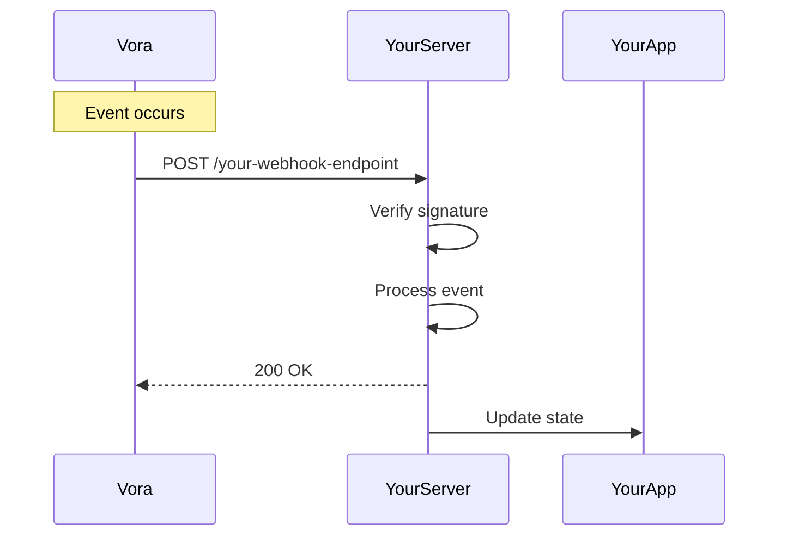

# Webhooks API

Webhooks allow you to receive real-time HTTP notifications when events occur in your Vora account.

## Overview

Instead of polling the API for changes, webhooks push data to your server instantly when:
- Sessions start, end, or encounter errors
- Agents are deployed or updated
- Transcripts become available
- Functions are executed
- Billing events occur

## How It Works



1. **Event occurs** in Vora (e.g., session ends)
2. **Vora sends** HTTP POST to your webhook URL
3. **Your server verifies** the webhook signature
4. **Your server processes** the event
5. **Your server responds** with 200 OK

## Endpoints

| Method | Endpoint | Description |
|--------|----------|-------------|
| `POST` | `/webhooks` | Create a webhook |
| `GET` | `/webhooks` | List all webhooks |
| `GET` | `/webhooks/:id` | Get a webhook |
| `PATCH` | `/webhooks/:id` | Update a webhook |
| `DELETE` | `/webhooks/:id` | Delete a webhook |
| `POST` | `/webhooks/:id/test` | Send a test event |

## Webhook Object

```json
{
  "id": "wh_abc123xyz",
  "url": "https://api.yourcompany.com/webhooks/vora",
  "events": [
    "session.completed",
    "session.failed",
    "transcript.ready"
  ],
  "secret": "whsec_xxxxxxxxxxxxx",
  "status": "active",
  "metadata": {
    "environment": "production"
  },
  "created_at": "2024-01-15T10:30:00Z",
  "updated_at": "2024-01-15T10:30:00Z"
}
```

### Fields

| Field | Type | Description |
|-------|------|-------------|
| `id` | string | Unique identifier |
| `url` | string | Endpoint URL (HTTPS required) |
| `events` | array | Events to subscribe to |
| `secret` | string | Signing secret for verification |
| `status` | string | `active`, `disabled`, `failing` |
| `metadata` | object | Custom metadata |

## Quick Start

### Create a Webhook

<CodeGroup>
```javascript JavaScript
const webhook = await vora.webhooks.create({
  url: 'https://api.yourcompany.com/webhooks/vora',
  events: [
    'session.started',
    'session.completed',
    'session.failed',
    'transcript.ready'
  ]
});

console.log(`Webhook ID: ${webhook.id}`);
console.log(`Secret: ${webhook.secret}`);  // Store this securely!
```

```python Python
webhook = vora.webhooks.create(
    url='https://api.yourcompany.com/webhooks/vora',
    events=[
        'session.started',
        'session.completed',
        'session.failed',
        'transcript.ready'
    ]
)

print(f"Webhook ID: {webhook.id}")
print(f"Secret: {webhook.secret}")  # Store this securely!
```

```bash cURL
curl -X POST https://api.voicevora.com/v1/webhooks \
  -H "Authorization: Bearer YOUR_API_KEY" \
  -H "Content-Type: application/json" \
  -d '{
    "url": "https://api.yourcompany.com/webhooks/vora",
    "events": ["session.started", "session.completed", "transcript.ready"]
  }'
```
</CodeGroup>

### Handle Webhook Events

<CodeGroup>
```javascript Express.js
const express = require('express');
const crypto = require('crypto');

const app = express();

// Use raw body for signature verification
app.post('/webhooks/vora',
  express.raw({ type: 'application/json' }),
  (req, res) => {
    const signature = req.headers['x-vora-signature'];
    const timestamp = req.headers['x-vora-timestamp'];

    // Verify signature
    if (!verifySignature(req.body, signature, timestamp)) {
      return res.status(401).send('Invalid signature');
    }

    const event = JSON.parse(req.body);

    // Handle event by type
    switch (event.type) {
      case 'session.completed':
        handleSessionCompleted(event.data);
        break;
      case 'session.failed':
        handleSessionFailed(event.data);
        break;
      case 'transcript.ready':
        handleTranscriptReady(event.data);
        break;
      default:
        console.log(`Unhandled event: ${event.type}`);
    }

    res.status(200).send('OK');
  }
);

function verifySignature(payload, signature, timestamp) {
  const secret = process.env.VORA_WEBHOOK_SECRET;
  const signedPayload = `${timestamp}.${payload}`;
  const expectedSignature = crypto
    .createHmac('sha256', secret)
    .update(signedPayload)
    .digest('hex');

  return crypto.timingSafeEqual(
    Buffer.from(signature),
    Buffer.from(`v1=${expectedSignature}`)
  );
}

function handleSessionCompleted(data) {
  console.log(`Session ${data.session_id} completed`);
  console.log(`Duration: ${data.duration_seconds}s`);
  // Update your database, trigger workflows, etc.
}

function handleSessionFailed(data) {
  console.error(`Session ${data.session_id} failed: ${data.error}`);
  // Alert your team, log to monitoring, etc.
}

function handleTranscriptReady(data) {
  console.log(`Transcript ready for session ${data.session_id}`);
  // Fetch and store transcript
}
```

```python FastAPI
from fastapi import FastAPI, Request, HTTPException
import hmac
import hashlib
import os

app = FastAPI()

@app.post("/webhooks/vora")
async def handle_webhook(request: Request):
    # Get headers
    signature = request.headers.get("x-vora-signature")
    timestamp = request.headers.get("x-vora-timestamp")

    # Get raw body
    body = await request.body()

    # Verify signature
    if not verify_signature(body, signature, timestamp):
        raise HTTPException(status_code=401, detail="Invalid signature")

    event = await request.json()

    # Handle event by type
    match event["type"]:
        case "session.completed":
            handle_session_completed(event["data"])
        case "session.failed":
            handle_session_failed(event["data"])
        case "transcript.ready":
            handle_transcript_ready(event["data"])
        case _:
            print(f"Unhandled event: {event['type']}")

    return {"status": "ok"}

def verify_signature(payload: bytes, signature: str, timestamp: str) -> bool:
    secret = os.environ["VORA_WEBHOOK_SECRET"]
    signed_payload = f"{timestamp}.{payload.decode()}"

    expected = hmac.new(
        secret.encode(),
        signed_payload.encode(),
        hashlib.sha256
    ).hexdigest()

    return hmac.compare_digest(signature, f"v1={expected}")

def handle_session_completed(data):
    print(f"Session {data['session_id']} completed")

def handle_session_failed(data):
    print(f"Session {data['session_id']} failed: {data['error']}")

def handle_transcript_ready(data):
    print(f"Transcript ready for session {data['session_id']}")
```
</CodeGroup>

## Webhook Security

### Signature Verification

Every webhook includes these headers:

| Header | Description |
|--------|-------------|
| `x-vora-signature` | HMAC-SHA256 signature |
| `x-vora-timestamp` | Unix timestamp when sent |
| `x-vora-event-id` | Unique event ID |

**Signature format:** `v1=<hex-encoded-hmac>`

**Signed payload:** `{timestamp}.{raw-body}`

### Verification Example

```javascript
function verifyWebhookSignature(rawBody, signature, timestamp, secret) {
  // Check timestamp to prevent replay attacks (5 min tolerance)
  const now = Math.floor(Date.now() / 1000);
  if (Math.abs(now - parseInt(timestamp)) > 300) {
    throw new Error('Timestamp too old');
  }

  // Compute expected signature
  const signedPayload = `${timestamp}.${rawBody}`;
  const expected = crypto
    .createHmac('sha256', secret)
    .update(signedPayload)
    .digest('hex');

  // Compare signatures (timing-safe)
  const actual = signature.replace('v1=', '');
  return crypto.timingSafeEqual(
    Buffer.from(expected),
    Buffer.from(actual)
  );
}
```

<Warning>
  Always verify webhook signatures to ensure requests come from Vora.
  Never trust the payload without verification.
</Warning>

## Retry Behavior

If your endpoint fails, Vora retries with exponential backoff:

| Attempt | Delay | Total Time |
|---------|-------|------------|
| 1 | Immediate | 0 |
| 2 | 1 minute | 1 min |
| 3 | 5 minutes | 6 min |
| 4 | 30 minutes | 36 min |
| 5 | 2 hours | 2.5 hours |
| 6 | 8 hours | 10.5 hours |

After 6 failures, the webhook is marked as `failing` and events are logged but not delivered.

### Failure Detection

Your webhook is considered failed if:
- HTTP response status is not 2xx
- Connection timeout (30 seconds)
- SSL/TLS errors
- DNS resolution failures

## Event Types

See [Webhook Events](/api/webhooks/events) for the complete list of events and their payloads.

### Common Events

| Event | Description |
|-------|-------------|
| `session.started` | Voice session began |
| `session.completed` | Session ended normally |
| `session.failed` | Session encountered an error |
| `transcript.ready` | Transcript is available |
| `agent.deployed` | Agent was deployed |
| `function.executed` | Function call completed |

## Best Practices

<AccordionGroup>
  <Accordion title="Return 200 quickly">
    Process webhooks asynchronously. Return 200 immediately, then process in background:

    ```javascript
    app.post('/webhooks/vora', async (req, res) => {
      // Verify and acknowledge immediately
      if (!verifySignature(req)) {
        return res.status(401).send('Invalid');
      }
      res.status(200).send('OK');

      // Process asynchronously
      setImmediate(() => processWebhook(req.body));
    });
    ```
  </Accordion>

  <Accordion title="Handle duplicates">
    Webhooks may be delivered more than once. Use the event ID for idempotency:

    ```javascript
    async function processWebhook(event) {
      const eventId = event.id;

      // Check if already processed
      if (await redis.exists(`webhook:${eventId}`)) {
        console.log(`Duplicate event: ${eventId}`);
        return;
      }

      // Mark as processing
      await redis.setex(`webhook:${eventId}`, 86400, 'processing');

      // Process event
      await handleEvent(event);

      // Mark as processed
      await redis.setex(`webhook:${eventId}`, 86400, 'processed');
    }
    ```
  </Accordion>

  <Accordion title="Monitor webhook health">
    Set up monitoring to detect webhook failures:

    ```javascript
    // Track webhook latency
    const start = Date.now();
    await processWebhook(event);
    const latency = Date.now() - start;

    metrics.histogram('webhook.latency', latency);
    metrics.increment('webhook.processed', { event: event.type });
    ```
  </Accordion>

  <Accordion title="Use HTTPS only">
    Webhook URLs must use HTTPS. Self-signed certificates are not supported.
  </Accordion>
</AccordionGroup>

## Testing Webhooks

### Send Test Event

<CodeGroup>
```javascript JavaScript
// Send a test event to verify your endpoint
await vora.webhooks.test('wh_abc123xyz', {
  event_type: 'session.completed'
});
```

```python Python
vora.webhooks.test('wh_abc123xyz', event_type='session.completed')
```

```bash cURL
curl -X POST https://api.voicevora.com/v1/webhooks/wh_abc123xyz/test \
  -H "Authorization: Bearer YOUR_API_KEY" \
  -H "Content-Type: application/json" \
  -d '{"event_type": "session.completed"}'
```
</CodeGroup>

### Local Development

Use a tunnel service for local testing:

```bash
# Using ngrok
ngrok http 3000

# Then update your webhook URL
curl -X PATCH https://api.voicevora.com/v1/webhooks/wh_abc123xyz \
  -H "Authorization: Bearer YOUR_API_KEY" \
  -H "Content-Type: application/json" \
  -d '{"url": "https://abc123.ngrok.io/webhooks/vora"}'
```

## Managing Webhooks

### List Webhooks

```javascript
const webhooks = await vora.webhooks.list();
webhooks.forEach(wh => {
  console.log(`${wh.id}: ${wh.status} - ${wh.events.join(', ')}`);
});
```

### Disable Webhook

```javascript
await vora.webhooks.update('wh_abc123xyz', {
  status: 'disabled'
});
```

### Rotate Secret

```javascript
const webhook = await vora.webhooks.rotateSecret('wh_abc123xyz');
console.log(`New secret: ${webhook.secret}`);
// Update your server with the new secret
```

## Next Steps

<CardGroup cols={2}>
  <Card title="Webhook Events" icon="list" href="/api/webhooks/events">
    Complete event reference
  </Card>
  <Card title="Sessions" icon="phone" href="/api/sessions">
    Session lifecycle events
  </Card>
</CardGroup>
