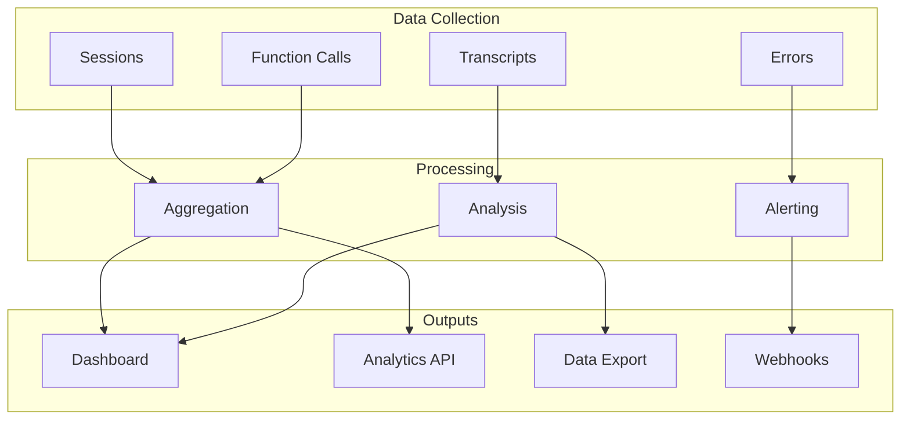

# Analytics

Track voice agent performance with real-time metrics, conversation analytics, and custom dashboards. This guide covers available metrics, accessing data, and building insights.

---

## Analytics Overview



---

## Key Metrics

### Session Metrics

| Metric | Description |
|--------|-------------|
| **Total Sessions** | Number of voice sessions |
| **Session Duration** | Average conversation length |
| **Completion Rate** | Sessions that ended normally |
| **Error Rate** | Sessions with errors |

### Performance Metrics

| Metric | Description |
|--------|-------------|
| **Latency (P50/P95/P99)** | Response time percentiles |
| **Time to First Word** | Agent response delay |
| **Turn Duration** | Average conversation turn |
| **STT Accuracy** | Transcription accuracy |

### Engagement Metrics

| Metric | Description |
|--------|-------------|
| **Turns per Session** | Conversation depth |
| **Function Usage** | Actions triggered |
| **User Satisfaction** | Post-call ratings |
| **Goal Completion** | Task success rate |

---

## Accessing Analytics

### Dashboard

Access the analytics dashboard at **[Dashboard](https://app.vora.ai/analytics)**:

1. **Overview** - High-level metrics and trends
2. **Sessions** - Individual session analysis
3. **Agents** - Per-agent performance
4. **Functions** - Tool usage patterns
5. **Errors** - Error tracking and alerts

### Analytics API

Retrieve metrics programmatically:

```javascript
// Get session metrics
const metrics = await vora.analytics.sessions({
  startDate: '2024-01-01',
  endDate: '2024-01-31',
  agentId: 'agent_abc123',
  granularity: 'day'
});

console.log(metrics);
// {
//   totalSessions: 1500,
//   avgDuration: 180,
//   completionRate: 0.92,
//   errorRate: 0.03,
//   timeSeries: [
//     { date: '2024-01-01', sessions: 45, avgDuration: 175 },
//     { date: '2024-01-02', sessions: 52, avgDuration: 182 },
//     ...
//   ]
// }
```

### Performance Analytics

```javascript
// Get latency metrics
const performance = await vora.analytics.performance({
  startDate: '2024-01-01',
  endDate: '2024-01-31',
  agentId: 'agent_abc123'
});

console.log(performance);
// {
//   latency: {
//     p50: 450,
//     p95: 820,
//     p99: 1200
//   },
//   timeToFirstWord: {
//     p50: 380,
//     p95: 650
//   },
//   providerLatency: {
//     stt: { p50: 120, p95: 250 },
//     llm: { p50: 280, p95: 450 },
//     tts: { p50: 50, p95: 120 }
//   }
// }
```

### Function Analytics

```javascript
// Get function usage
const functions = await vora.analytics.functions({
  startDate: '2024-01-01',
  endDate: '2024-01-31',
  agentId: 'agent_abc123'
});

console.log(functions);
// {
//   totalCalls: 890,
//   successRate: 0.98,
//   byFunction: [
//     { name: 'get_order_status', calls: 450, successRate: 0.99 },
//     { name: 'book_appointment', calls: 320, successRate: 0.97 },
//     { name: 'transfer_call', calls: 120, successRate: 0.95 }
//   ]
// }
```

---

## Session Analysis

### Individual Session Details

```javascript
const session = await vora.analytics.session('sess_xyz789');

console.log(session);
// {
//   id: 'sess_xyz789',
//   agentId: 'agent_abc123',
//   userId: 'user_123',
//   duration: 240,
//   turns: 15,
//   sentiment: 0.75,
//   topics: ['order_status', 'shipping'],
//   functionCalls: [
//     { name: 'get_order_status', result: 'success', latency: 180 }
//   ],
//   timeline: [
//     { time: 0, event: 'session_start' },
//     { time: 5, event: 'first_agent_response' },
//     { time: 120, event: 'function_call', function: 'get_order_status' },
//     { time: 240, event: 'session_end' }
//   ]
// }
```

### Session Search

```javascript
// Search sessions by criteria
const sessions = await vora.analytics.searchSessions({
  startDate: '2024-01-15',
  endDate: '2024-01-16',
  agentId: 'agent_abc123',
  filters: {
    minDuration: 60,
    maxDuration: 600,
    hasErrors: false,
    topics: ['billing']
  },
  limit: 100
});
```

---

## Conversation Analytics

### Transcript Analysis

```javascript
// Analyze transcript patterns
const analysis = await vora.analytics.transcripts({
  startDate: '2024-01-01',
  endDate: '2024-01-31',
  agentId: 'agent_abc123'
});

console.log(analysis);
// {
//   topTopics: [
//     { topic: 'order_status', percentage: 0.35 },
//     { topic: 'returns', percentage: 0.25 },
//     { topic: 'shipping', percentage: 0.20 }
//   ],
//   commonQueries: [
//     { query: 'where is my order', count: 280 },
//     { query: 'how do i return', count: 195 }
//   ],
//   sentiment: {
//     positive: 0.65,
//     neutral: 0.28,
//     negative: 0.07
//   }
// }
```

### Intent Distribution

```javascript
// Get intent breakdown
const intents = await vora.analytics.intents({
  startDate: '2024-01-01',
  endDate: '2024-01-31',
  agentId: 'agent_abc123'
});

console.log(intents);
// {
//   intents: [
//     { name: 'check_order', count: 450, resolution: 0.95 },
//     { name: 'request_return', count: 280, resolution: 0.88 },
//     { name: 'billing_inquiry', count: 180, resolution: 0.92 },
//     { name: 'general_support', count: 150, resolution: 0.85 }
//   ]
// }
```

---

## Real-Time Monitoring

### Live Dashboard

```javascript
// Subscribe to real-time metrics
const unsubscribe = vora.analytics.realtime.subscribe({
  agentId: 'agent_abc123',
  metrics: ['activeSessions', 'latency', 'errors'],
  onUpdate: (data) => {
    console.log('Real-time update:', data);
    // {
    //   activeSessions: 12,
    //   latency: { current: 420, trend: 'stable' },
    //   errors: { last5min: 0, rate: 0.0 }
    // }
  }
});

// Later: cleanup
unsubscribe();
```

### Active Sessions

```javascript
// Get current active sessions
const active = await vora.analytics.activeSessions({
  agentId: 'agent_abc123'
});

console.log(active);
// {
//   count: 8,
//   sessions: [
//     { id: 'sess_1', duration: 45, userId: 'user_a' },
//     { id: 'sess_2', duration: 120, userId: 'user_b' },
//     ...
//   ]
// }
```

---

## Custom Reports

### Building Reports

```javascript
// Create custom report
const report = await vora.analytics.createReport({
  name: 'Weekly Performance',
  metrics: [
    'totalSessions',
    'avgDuration',
    'completionRate',
    'functionUsage'
  ],
  groupBy: 'day',
  filters: {
    agentIds: ['agent_abc', 'agent_xyz']
  },
  schedule: {
    frequency: 'weekly',
    dayOfWeek: 'monday',
    time: '09:00',
    timezone: 'America/New_York',
    recipients: ['analytics@company.com']
  }
});
```

### Export Data

```javascript
// Export session data
const exportJob = await vora.analytics.export({
  startDate: '2024-01-01',
  endDate: '2024-01-31',
  format: 'csv',  // or 'json', 'parquet'
  include: ['sessions', 'transcripts', 'functions'],
  filters: {
    agentId: 'agent_abc123'
  }
});

// Check export status
const status = await vora.analytics.getExport(exportJob.id);
// { status: 'completed', downloadUrl: 'https://...' }
```

---

## Alerting

### Configure Alerts

```javascript
// Set up performance alerts
await vora.analytics.alerts.create({
  name: 'High Error Rate',
  metric: 'errorRate',
  condition: {
    operator: 'greater_than',
    threshold: 0.05,
    window: '5m'
  },
  agentIds: ['agent_abc123'],
  notify: {
    channels: ['slack', 'email'],
    recipients: ['ops@company.com'],
    slackWebhook: 'https://hooks.slack.com/...'
  }
});
```

### Alert Types

| Alert | Description |
|-------|-------------|
| **Error Rate** | Errors exceed threshold |
| **Latency** | Response time spike |
| **Session Volume** | Unusual traffic |
| **Function Failures** | Tool errors |
| **Provider Issues** | STT/TTS/LLM problems |

---

## Integration with External Tools

### Webhook Export

```javascript
// Stream analytics to external system
await vora.analytics.webhooks.create({
  url: 'https://analytics.company.com/ingest',
  events: ['session.ended', 'function.completed'],
  transform: {
    format: 'json',
    include: ['metrics', 'transcript']
  }
});
```

### DataDog Integration

```javascript
const dogstatsd = require('node-dogstatsd').StatsD;
const client = new dogstatsd();

// Stream metrics to DataDog
vora.analytics.realtime.subscribe({
  metrics: ['latency', 'errorRate', 'activeSessions'],
  onUpdate: (data) => {
    client.gauge('vora.latency.p95', data.latency.p95);
    client.gauge('vora.error_rate', data.errorRate);
    client.gauge('vora.active_sessions', data.activeSessions);
  }
});
```

### BigQuery Export

```javascript
// Export to BigQuery
await vora.analytics.integrations.create({
  type: 'bigquery',
  config: {
    projectId: 'your-project',
    datasetId: 'vora_analytics',
    credentials: process.env.GOOGLE_CREDENTIALS
  },
  schedule: 'hourly',
  tables: ['sessions', 'transcripts', 'functions']
});
```

---

## Dashboard Examples

### Agent Performance Dashboard

```javascript
// Fetch dashboard data
async function getAgentDashboard(agentId) {
  const [sessions, performance, functions, errors] = await Promise.all([
    vora.analytics.sessions({ agentId, granularity: 'hour', last: '24h' }),
    vora.analytics.performance({ agentId, last: '24h' }),
    vora.analytics.functions({ agentId, last: '24h' }),
    vora.analytics.errors({ agentId, last: '24h' })
  ]);

  return {
    summary: {
      totalSessions: sessions.totalSessions,
      avgDuration: sessions.avgDuration,
      completionRate: sessions.completionRate,
      latencyP95: performance.latency.p95
    },
    trends: {
      sessionsOverTime: sessions.timeSeries,
      latencyOverTime: performance.timeSeries
    },
    topFunctions: functions.byFunction.slice(0, 5),
    recentErrors: errors.recent.slice(0, 10)
  };
}
```

### Comparison View

```javascript
// Compare agents
async function compareAgents(agentIds, period = '7d') {
  const results = await Promise.all(
    agentIds.map(id => vora.analytics.sessions({
      agentId: id,
      last: period
    }))
  );

  return agentIds.map((id, i) => ({
    agentId: id,
    sessions: results[i].totalSessions,
    duration: results[i].avgDuration,
    completion: results[i].completionRate
  }));
}
```

---

## Best Practices

<AccordionGroup>
  <Accordion title="Set up alerting early">
    Configure alerts for key metrics before going to production. Include:
    - Error rate > 5%
    - Latency P95 > 2s
    - Session volume anomalies
  </Accordion>

  <Accordion title="Track business metrics">
    Beyond technical metrics, track business outcomes:
    - Goal completion rate
    - Transfer to human rate
    - Customer satisfaction
    - Cost per conversation
  </Accordion>

  <Accordion title="Regular review cadence">
    Schedule weekly reviews of:
    - Top error messages
    - Longest sessions (might indicate confusion)
    - Failed function calls
    - New conversation topics
  </Accordion>

  <Accordion title="A/B test with analytics">
    Use analytics to measure A/B tests:
    ```javascript
    const metrics = await vora.analytics.compare({
      variants: ['agent_control', 'agent_variant'],
      period: '7d',
      metrics: ['completionRate', 'duration', 'sentiment']
    });
    ```
  </Accordion>
</AccordionGroup>

---

## Next Steps

<CardGroup cols={2}>
  <Card title="API Reference" icon="code" href="/api/analytics">
    Full analytics API documentation
  </Card>
  <Card title="Webhooks" icon="webhook" href="/developers/webhooks">
    Stream events in real-time
  </Card>
</CardGroup>
