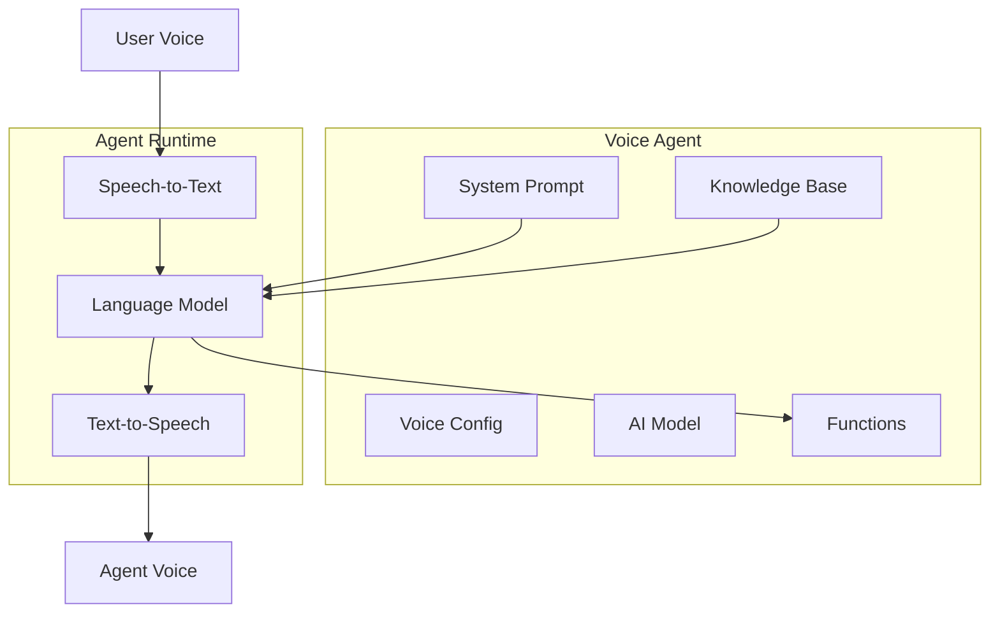
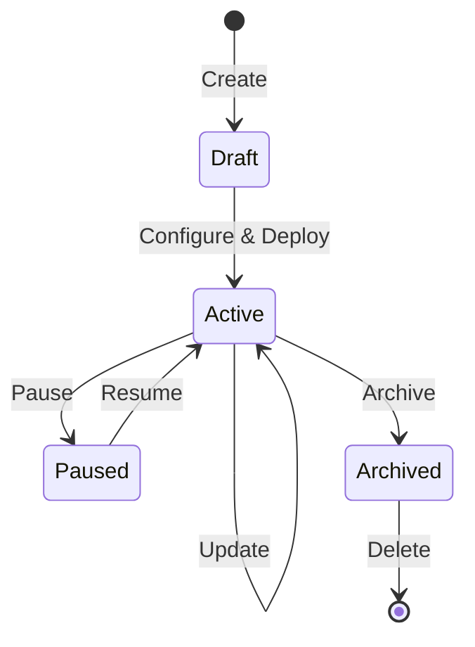

# Agents

Agents are the core of Vora. Each agent is a voice AI assistant configured to handle specific types of conversations.

---

## What is an Agent?

An agent combines:

- **System Prompt** - Instructions that define behavior and personality
- **Voice Configuration** - TTS voice, language, and speech settings
- **AI Model** - LLM provider and model selection
- **Knowledge Base** - Optional documents for context
- **Functions** - Optional actions the agent can take



---

## Agent Lifecycle

Agents go through several states during their lifetime:



| State | Description |
|-------|-------------|
| **Draft** | Newly created, not yet configured |
| **Active** | Deployed and handling conversations |
| **Paused** | Temporarily disabled |
| **Archived** | Soft-deleted, recoverable for 30 days |

---

## Agent Configuration

### Core Properties

```typescript
interface Agent {
  id: string;                    // Unique identifier
  name: string;                  // Display name
  description?: string;          // Purpose description
  systemPrompt: string;          // Behavior instructions
  status: AgentStatus;           // Current state
  createdAt: Date;
  updatedAt: Date;
}
```

### Voice Configuration

```typescript
interface VoiceConfig {
  provider: 'elevenlabs' | 'cartesia' | 'google';
  voiceId: string;               // Provider-specific voice ID
  language: string;              // BCP-47 language code
  speed: number;                 // Speech rate (0.5-2.0)
  stability?: number;            // Voice stability (ElevenLabs)
  similarity?: number;           // Voice similarity (ElevenLabs)
}
```

### AI Model Configuration

```typescript
interface ModelConfig {
  llm: {
    provider: 'openai' | 'google' | 'anthropic' | 'groq';
    model: string;               // e.g., 'gpt-4-turbo', 'gemini-pro'
    temperature: number;         // Creativity (0.0-2.0)
    maxTokens?: number;          // Response length limit
  };
  stt: {
    provider: 'deepgram' | 'assemblyai' | 'google';
    model?: string;              // Optional model variant
    language?: string;           // Override language
  };
}
```

---

## Creating an Agent

<Tabs>
  <Tab title="JavaScript">
    ```javascript
    const agent = await vora.agents.create({
      name: 'Customer Support',
      systemPrompt: `You are a helpful customer support agent for Acme Corp.
        Be friendly, professional, and concise.
        If you can't help, offer to transfer to a human.`,
      voice: {
        provider: 'elevenlabs',
        voiceId: 'EXAVITQu4vr4xnSDxMaL',  // Sarah
        language: 'en-US'
      },
      llm: {
        provider: 'openai',
        model: 'gpt-4-turbo',
        temperature: 0.7
      }
    });

    console.log(`Created agent: ${agent.id}`);
    ```
  </Tab>
  <Tab title="Python">
    ```python
    agent = await vora.agents.create(
        name="Customer Support",
        system_prompt="""You are a helpful customer support agent for Acme Corp.
        Be friendly, professional, and concise.
        If you can't help, offer to transfer to a human.""",
        voice={
            "provider": "elevenlabs",
            "voice_id": "EXAVITQu4vr4xnSDxMaL",  # Sarah
            "language": "en-US"
        },
        llm={
            "provider": "openai",
            "model": "gpt-4-turbo",
            "temperature": 0.7
        }
    )

    print(f"Created agent: {agent.id}")
    ```
  </Tab>
  <Tab title="cURL">
    ```bash
    curl -X POST https://api.vora.ai/v1/agents \
      -H "Authorization: Bearer sk_live_..." \
      -H "Content-Type: application/json" \
      -d '{
        "name": "Customer Support",
        "systemPrompt": "You are a helpful customer support agent...",
        "voice": {
          "provider": "elevenlabs",
          "voiceId": "EXAVITQu4vr4xnSDxMaL",
          "language": "en-US"
        },
        "llm": {
          "provider": "openai",
          "model": "gpt-4-turbo",
          "temperature": 0.7
        }
      }'
    ```
  </Tab>
</Tabs>

---

## System Prompt Design

The system prompt is the most important part of agent configuration. It defines:

- **Personality** - How the agent speaks and behaves
- **Knowledge scope** - What the agent knows and doesn't know
- **Boundaries** - What the agent should and shouldn't do
- **Escalation** - When to transfer to humans

### System Prompt Template

```markdown
## Role
You are [role] for [company].

## Personality
- Be [trait 1]
- Be [trait 2]
- Avoid [anti-trait]

## Knowledge
You know about:
- [Topic 1]
- [Topic 2]

You don't know about:
- [Out of scope topic]

## Guidelines
1. [Guideline 1]
2. [Guideline 2]

## Escalation
Transfer to a human when:
- [Condition 1]
- [Condition 2]
```

### Example System Prompt

```markdown
## Role
You are Sarah, a friendly customer support agent for TechGadgets Inc.

## Personality
- Be warm and empathetic
- Keep responses concise (2-3 sentences)
- Use simple, non-technical language
- Never say "I don't know" - offer alternatives

## Knowledge
You can help with:
- Order status and tracking
- Returns and refunds (within 30 days)
- Product specifications
- Account management

You cannot help with:
- Technical troubleshooting (transfer to tech support)
- Billing disputes over $100 (transfer to billing)

## Guidelines
1. Always verify the customer's identity first
2. Confirm understanding before taking action
3. End calls by asking if there's anything else

## Escalation
Transfer to a human when:
- Customer explicitly requests it
- Issue requires account changes
- Customer is frustrated after 2 attempts to help
```

---

## Agent with Knowledge Base

Connect documents to give your agent specific knowledge:

```javascript
// Create agent with knowledge base
const agent = await vora.agents.create({
  name: 'Product Expert',
  systemPrompt: '...',
  knowledgeBase: {
    enabled: true,
    sources: ['kb_product_docs', 'kb_faq']
  }
});

// Or add knowledge base later
await vora.agents.update(agent.id, {
  knowledgeBase: {
    enabled: true,
    topK: 5,           // Number of chunks to retrieve
    threshold: 0.7     // Relevance threshold
  }
});
```

---

## Agent with Functions

Enable your agent to take actions:

```javascript
const agent = await vora.agents.create({
  name: 'Appointment Scheduler',
  systemPrompt: '...',
  functions: [
    {
      name: 'check_availability',
      description: 'Check available appointment slots',
      parameters: {
        type: 'object',
        properties: {
          date: { type: 'string', format: 'date' }
        },
        required: ['date']
      }
    },
    {
      name: 'book_appointment',
      description: 'Book an appointment slot',
      parameters: {
        type: 'object',
        properties: {
          datetime: { type: 'string', format: 'date-time' },
          customerName: { type: 'string' },
          customerEmail: { type: 'string' }
        },
        required: ['datetime', 'customerName']
      }
    }
  ]
});
```

See [Functions](/developers/concepts/functions) for complete function documentation.

---

## Agent Versioning

Agents support versioning for safe updates:

```javascript
// Create new version
const version = await vora.agents.versions.create(agentId, {
  description: 'Updated greeting message'
});

// List versions
const versions = await vora.agents.versions.list(agentId);

// Rollback to previous version
await vora.agents.versions.activate(agentId, previousVersionId);
```

---

## Best Practices

<AccordionGroup>
  <Accordion title="Keep prompts focused">
    Single-purpose agents perform better than generalists. Create separate agents for support, sales, and scheduling.
  </Accordion>

  <Accordion title="Test with real scenarios">
    Use the simulator to test edge cases before deploying. Test happy paths and error scenarios.
  </Accordion>

  <Accordion title="Monitor and iterate">
    Review session transcripts regularly. Update prompts based on actual conversations.
  </Accordion>

  <Accordion title="Set clear boundaries">
    Explicitly state what the agent can and cannot do. This prevents hallucinations and inappropriate responses.
  </Accordion>

  <Accordion title="Use functions for actions">
    Don't rely on the agent to "remember" to do things. Use functions for any real-world actions.
  </Accordion>
</AccordionGroup>

---

## Next Steps

<CardGroup cols={2}>
  <Card title="Sessions" icon="messages" href="/developers/concepts/sessions">
    Learn about voice sessions
  </Card>
  <Card title="Functions" icon="function" href="/developers/concepts/functions">
    Add actions to your agent
  </Card>
</CardGroup>
