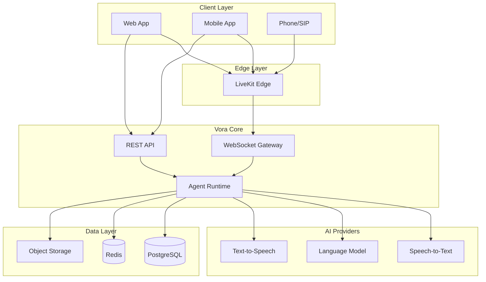

# Developer Guide

Welcome to the Vora Developer Guide. This section covers everything you need to build, integrate, and scale voice AI applications.

---

## Architecture Overview

Vora's architecture is designed for low-latency voice interactions with enterprise-grade reliability:

### Key Components

| Component | Purpose |
|-----------|---------|
| **REST API** | Agent management, configuration, analytics |
| **WebSocket Gateway** | Real-time voice session handling |
| **Agent Runtime** | Voice pipeline orchestration |
| **LiveKit** | Low-latency WebRTC infrastructure |
| **Providers** | STT, LLM, TTS integrations |

---

## Getting Started

<CardGroup cols={2}>
  <Card title="JavaScript Quickstart" icon="js" href="/developers/quickstarts/javascript">
    Get started with Node.js or browser applications
  </Card>
  <Card title="Python Quickstart" icon="python" href="/developers/quickstarts/python">
    Build voice apps with Python and FastAPI
  </Card>
  <Card title="cURL Examples" icon="terminal" href="/developers/quickstarts/curl">
    Quick API testing with command line
  </Card>
  <Card title="Authentication" icon="key" href="/developers/authentication">
    API keys and JWT authentication
  </Card>
</CardGroup>

---

## Core Concepts

Understanding these concepts will help you build effective voice AI applications:

<CardGroup cols={3}>
  <Card title="Agents" icon="robot" href="/developers/concepts/agents">
    Voice AI assistants that handle conversations
  </Card>
  <Card title="Sessions" icon="messages" href="/developers/concepts/sessions">
    Individual voice conversations
  </Card>
  <Card title="Providers" icon="plug" href="/developers/concepts/providers">
    LLM, STT, and TTS services
  </Card>
  <Card title="Functions" icon="function" href="/developers/concepts/functions">
    Tool calling and actions
  </Card>
  <Card title="Knowledge Base" icon="book" href="/developers/concepts/knowledge-base">
    RAG and document retrieval
  </Card>
  <Card title="Deployments" icon="rocket" href="/developers/concepts/deployments">
    Phone, web, and API access
  </Card>
</CardGroup>

---

## SDKs & Libraries

Official SDKs for building Vora integrations:

| SDK | Languages | Use Case |
|-----|-----------|----------|
| [JavaScript SDK](/sdks/javascript) | TypeScript, JavaScript | Web apps, Node.js servers |
| [Python SDK](/sdks/python) | Python 3.8+ | Backend services, scripts |
| [LiveKit React](/sdks/livekit/react) | React, Next.js | Voice UI components |
| [LiveKit React Native](/sdks/livekit/react-native) | React Native, Expo | Mobile apps |

---

## Prerequisites

Before you begin, ensure you have:

<Steps>
  <Step title="Vora Account">
    Sign up at [app.vora.ai](https://app.vora.ai) and verify your email.
  </Step>
  <Step title="API Key">
    Generate an API key in **Settings** → **API Keys**.
  </Step>
  <Step title="Development Environment">
    - Node.js 18+ (for JavaScript)
    - Python 3.8+ (for Python)
    - Modern browser with microphone access
  </Step>
</Steps>

---

## API Reference

The Vora API provides programmatic access to all platform features:

<CardGroup cols={2}>
  <Card title="API Overview" icon="code" href="/api">
    Complete API documentation
  </Card>
  <Card title="Authentication" icon="lock" href="/api/authentication">
    API keys and authorization
  </Card>
  <Card title="Agents API" icon="robot" href="/api/agents">
    Create and manage agents
  </Card>
  <Card title="Sessions API" icon="messages" href="/api/sessions">
    Voice session management
  </Card>
</CardGroup>

---

## Advanced Topics

<CardGroup cols={2}>
  <Card title="Webhooks" icon="webhook" href="/developers/webhooks">
    Real-time event notifications
  </Card>
  <Card title="Error Handling" icon="triangle-exclamation" href="/developers/error-handling">
    Retry patterns and recovery
  </Card>
  <Card title="Analytics" icon="chart-line" href="/developers/analytics">
    Usage metrics and reporting
  </Card>
  <Card title="Self-Hosting" icon="server" href="/self-hosting">
    Deploy Vora on your infrastructure
  </Card>
</CardGroup>

---

## Support

<CardGroup cols={2}>
  <Card title="Discord Community" icon="discord" href="https://discord.gg/vora">
    Join developers building with Vora
  </Card>
  <Card title="GitHub" icon="github" href="https://github.com/vora-ai">
    SDKs, examples, and issues
  </Card>
</CardGroup>
