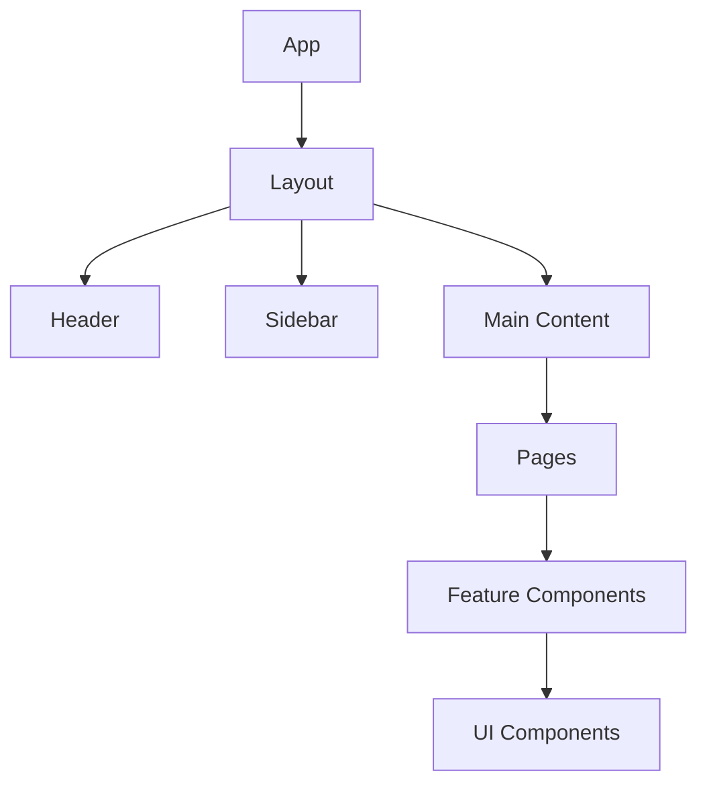

# Frontend Architecture

The Vora frontend is built with React and TypeScript, using TanStack Query for server state and shadcn/ui for components.

---

## Technology Stack

| Layer | Technology | Purpose |
|-------|------------|---------|
| Framework | React 18 | UI library |
| Build | Vite | Development and bundling |
| Language | TypeScript 5.x | Type safety |
| Styling | Tailwind CSS | Utility-first CSS |
| Components | shadcn/ui | UI component library |
| State | TanStack Query | Server state management |
| Forms | React Hook Form | Form handling |
| Validation | Zod | Schema validation |
| Routing | React Router | Client-side routing |
| Auth | Clerk | Authentication |

---

## Directory Structure

```
ventus-voice/frontend/
├── src/
│   ├── main.tsx              # Application entry
│   ├── App.tsx               # Root component
│   ├── components/           # Reusable UI components
│   │   ├── ui/               # shadcn/ui components
│   │   ├── agents/           # Agent-specific components
│   │   ├── voice/            # Voice UI components
│   │   └── layout/           # Layout components
│   ├── pages/                # Route pages
│   │   ├── Dashboard.tsx
│   │   ├── AgentBuilder.tsx
│   │   └── ...
│   ├── hooks/                # Custom React hooks
│   │   ├── useAgents.ts      # TanStack Query hooks
│   │   ├── useVoice.ts
│   │   └── ...
│   ├── services/             # API client layer
│   │   ├── api.ts            # Axios instance
│   │   ├── agents.api.ts
│   │   └── ...
│   ├── lib/                  # Utilities
│   ├── types/                # TypeScript types
│   └── styles/               # Global styles
├── public/                   # Static assets
└── tests/                    # Test files
```

---

## Component Architecture

### Component Hierarchy



### Component Types

| Type | Location | Purpose |
|------|----------|---------|
| Pages | `pages/` | Route-level components |
| Features | `components/{domain}/` | Domain-specific components |
| UI | `components/ui/` | Reusable UI primitives |
| Layout | `components/layout/` | Layout components |

---

## TanStack Query Patterns

### Query Hook

```typescript
// hooks/useAgents.ts
import { useQuery, useMutation, useQueryClient } from '@tanstack/react-query';
import { agentsApi } from '../services/agents.api';

// Query keys factory
export const agentKeys = {
  all: ['agents'] as const,
  lists: () => [...agentKeys.all, 'list'] as const,
  list: (filters: AgentFilters) => [...agentKeys.lists(), filters] as const,
  details: () => [...agentKeys.all, 'detail'] as const,
  detail: (id: string) => [...agentKeys.details(), id] as const,
};

// List query
export function useAgents(filters: AgentFilters = {}) {
  return useQuery({
    queryKey: agentKeys.list(filters),
    queryFn: () => agentsApi.list(filters),
  });
}

// Detail query
export function useAgent(id: string) {
  return useQuery({
    queryKey: agentKeys.detail(id),
    queryFn: () => agentsApi.get(id),
    enabled: !!id,
  });
}

// Create mutation
export function useCreateAgent() {
  const queryClient = useQueryClient();

  return useMutation({
    mutationFn: agentsApi.create,
    onSuccess: () => {
      queryClient.invalidateQueries({ queryKey: agentKeys.lists() });
    },
  });
}

// Update mutation
export function useUpdateAgent() {
  const queryClient = useQueryClient();

  return useMutation({
    mutationFn: ({ id, data }: { id: string; data: UpdateAgentInput }) =>
      agentsApi.update(id, data),
    onSuccess: (data, variables) => {
      queryClient.setQueryData(agentKeys.detail(variables.id), data);
      queryClient.invalidateQueries({ queryKey: agentKeys.lists() });
    },
  });
}
```

### Using Query Hooks

```tsx
// pages/AgentList.tsx
import { useAgents, useDeleteAgent } from '../hooks/useAgents';

export function AgentList() {
  const { data: agents, isLoading, error } = useAgents();
  const deleteAgent = useDeleteAgent();

  if (isLoading) return <AgentListSkeleton />;
  if (error) return <ErrorBoundary error={error} />;

  return (
    <div className="grid grid-cols-3 gap-4">
      {agents?.map((agent) => (
        <AgentCard
          key={agent.id}
          agent={agent}
          onDelete={() => deleteAgent.mutate(agent.id)}
        />
      ))}
    </div>
  );
}
```

---

## API Client Layer

### Axios Instance

```typescript
// services/api.ts
import axios from 'axios';
import { useAuth } from '@clerk/clerk-react';

const api = axios.create({
  baseURL: import.meta.env.VITE_API_URL,
  headers: {
    'Content-Type': 'application/json',
  },
});

// Auth interceptor
api.interceptors.request.use(async (config) => {
  const { getToken } = useAuth();
  const token = await getToken();

  if (token) {
    config.headers.Authorization = `Bearer ${token}`;
  }

  return config;
});

// Error interceptor
api.interceptors.response.use(
  (response) => response,
  (error) => {
    if (error.response?.status === 401) {
      // Handle unauthorized
      window.location.href = '/sign-in';
    }
    return Promise.reject(error);
  }
);

export { api };
```

### Domain API Service

```typescript
// services/agents.api.ts
import { api } from './api';
import type { Agent, CreateAgentInput, UpdateAgentInput } from '../types';

export const agentsApi = {
  list: async (filters?: AgentFilters): Promise<Agent[]> => {
    const { data } = await api.get('/agents', { params: filters });
    return data;
  },

  get: async (id: string): Promise<Agent> => {
    const { data } = await api.get(`/agents/${id}`);
    return data;
  },

  create: async (input: CreateAgentInput): Promise<Agent> => {
    const { data } = await api.post('/agents', input);
    return data;
  },

  update: async (id: string, input: UpdateAgentInput): Promise<Agent> => {
    const { data } = await api.patch(`/agents/${id}`, input);
    return data;
  },

  delete: async (id: string): Promise<void> => {
    await api.delete(`/agents/${id}`);
  },
};
```

---

## Form Patterns

### React Hook Form + Zod

```tsx
// components/agents/AgentForm.tsx
import { useForm } from 'react-hook-form';
import { zodResolver } from '@hookform/resolvers/zod';
import { z } from 'zod';

const agentSchema = z.object({
  name: z.string().min(1, 'Name is required').max(100),
  description: z.string().optional(),
  systemPrompt: z.string().min(10, 'System prompt must be at least 10 characters'),
  llm: z.object({
    provider: z.enum(['openai', 'anthropic', 'google']),
    model: z.string(),
  }),
});

type AgentFormData = z.infer<typeof agentSchema>;

export function AgentForm({ onSubmit, defaultValues }: AgentFormProps) {
  const form = useForm<AgentFormData>({
    resolver: zodResolver(agentSchema),
    defaultValues,
  });

  return (
    <Form {...form}>
      <form onSubmit={form.handleSubmit(onSubmit)} className="space-y-6">
        <FormField
          control={form.control}
          name="name"
          render={({ field }) => (
            <FormItem>
              <FormLabel>Name</FormLabel>
              <FormControl>
                <Input placeholder="My Agent" {...field} />
              </FormControl>
              <FormMessage />
            </FormItem>
          )}
        />

        <FormField
          control={form.control}
          name="systemPrompt"
          render={({ field }) => (
            <FormItem>
              <FormLabel>System Prompt</FormLabel>
              <FormControl>
                <Textarea rows={6} {...field} />
              </FormControl>
              <FormMessage />
            </FormItem>
          )}
        />

        <Button type="submit" disabled={form.formState.isSubmitting}>
          {form.formState.isSubmitting ? 'Saving...' : 'Save Agent'}
        </Button>
      </form>
    </Form>
  );
}
```

---

## Component Patterns

### shadcn/ui Usage

```tsx
// components/agents/AgentCard.tsx
import {
  Card,
  CardContent,
  CardDescription,
  CardFooter,
  CardHeader,
  CardTitle,
} from '@/components/ui/card';
import { Button } from '@/components/ui/button';
import { Badge } from '@/components/ui/badge';
import {
  DropdownMenu,
  DropdownMenuContent,
  DropdownMenuItem,
  DropdownMenuTrigger,
} from '@/components/ui/dropdown-menu';
import { MoreVertical, Edit, Trash, Phone } from 'lucide-react';

export function AgentCard({ agent, onEdit, onDelete, onTest }: AgentCardProps) {
  return (
    <Card>
      <CardHeader className="flex flex-row items-center justify-between">
        <div>
          <CardTitle>{agent.name}</CardTitle>
          <CardDescription>{agent.description}</CardDescription>
        </div>
        <DropdownMenu>
          <DropdownMenuTrigger asChild>
            <Button variant="ghost" size="icon">
              <MoreVertical className="h-4 w-4" />
            </Button>
          </DropdownMenuTrigger>
          <DropdownMenuContent align="end">
            <DropdownMenuItem onClick={onEdit}>
              <Edit className="mr-2 h-4 w-4" />
              Edit
            </DropdownMenuItem>
            <DropdownMenuItem onClick={onDelete} className="text-destructive">
              <Trash className="mr-2 h-4 w-4" />
              Delete
            </DropdownMenuItem>
          </DropdownMenuContent>
        </DropdownMenu>
      </CardHeader>
      <CardContent>
        <div className="flex gap-2">
          <Badge variant="outline">{agent.llm.provider}</Badge>
          <Badge variant="secondary">{agent.status}</Badge>
        </div>
      </CardContent>
      <CardFooter>
        <Button onClick={onTest} className="w-full">
          <Phone className="mr-2 h-4 w-4" />
          Test Agent
        </Button>
      </CardFooter>
    </Card>
  );
}
```

### Loading States

```tsx
// components/agents/AgentListSkeleton.tsx
import { Skeleton } from '@/components/ui/skeleton';
import { Card, CardContent, CardHeader } from '@/components/ui/card';

export function AgentListSkeleton() {
  return (
    <div className="grid grid-cols-3 gap-4">
      {Array.from({ length: 6 }).map((_, i) => (
        <Card key={i}>
          <CardHeader>
            <Skeleton className="h-6 w-3/4" />
            <Skeleton className="h-4 w-1/2" />
          </CardHeader>
          <CardContent>
            <div className="flex gap-2">
              <Skeleton className="h-5 w-16" />
              <Skeleton className="h-5 w-12" />
            </div>
          </CardContent>
        </Card>
      ))}
    </div>
  );
}
```

### Error Boundaries

```tsx
// components/ErrorBoundary.tsx
import { Button } from '@/components/ui/button';
import { AlertCircle } from 'lucide-react';

interface ErrorBoundaryProps {
  error: Error;
  reset?: () => void;
}

export function ErrorBoundary({ error, reset }: ErrorBoundaryProps) {
  return (
    <div className="flex flex-col items-center justify-center p-8 text-center">
      <AlertCircle className="h-12 w-12 text-destructive mb-4" />
      <h2 className="text-xl font-semibold mb-2">Something went wrong</h2>
      <p className="text-muted-foreground mb-4">
        {error.message || 'An unexpected error occurred'}
      </p>
      {reset && (
        <Button onClick={reset} variant="outline">
          Try again
        </Button>
      )}
    </div>
  );
}
```

---

## Routing

### Route Configuration

```tsx
// App.tsx
import { BrowserRouter, Routes, Route, Navigate } from 'react-router-dom';
import { ClerkProvider, SignedIn, SignedOut } from '@clerk/clerk-react';

export function App() {
  return (
    <ClerkProvider publishableKey={import.meta.env.VITE_CLERK_PUBLISHABLE_KEY}>
      <QueryClientProvider client={queryClient}>
        <BrowserRouter>
          <Routes>
            {/* Public routes */}
            <Route path="/sign-in/*" element={<SignIn />} />
            <Route path="/sign-up/*" element={<SignUp />} />

            {/* Protected routes */}
            <Route element={<ProtectedLayout />}>
              <Route path="/" element={<Dashboard />} />
              <Route path="/agents" element={<AgentList />} />
              <Route path="/agents/new" element={<AgentBuilder />} />
              <Route path="/agents/:id" element={<AgentDetail />} />
              <Route path="/sessions" element={<SessionList />} />
              <Route path="/settings" element={<Settings />} />
            </Route>

            <Route path="*" element={<Navigate to="/" replace />} />
          </Routes>
        </BrowserRouter>
      </QueryClientProvider>
    </ClerkProvider>
  );
}
```

---

## State Management

### Local State

Use React state for component-level UI state:

```tsx
const [isOpen, setIsOpen] = useState(false);
const [selectedTab, setSelectedTab] = useState('overview');
```

### Server State

Use TanStack Query for server data:

```tsx
const { data: agents } = useAgents();
const createAgent = useCreateAgent();
```

### Form State

Use React Hook Form:

```tsx
const form = useForm<FormData>({
  resolver: zodResolver(schema),
});
```

### URL State

Use React Router for URL-based state:

```tsx
const [searchParams, setSearchParams] = useSearchParams();
const filter = searchParams.get('status') ?? 'all';
```

---

## Related Documentation

<CardGroup cols={2}>
  <Card title="System Overview" icon="layer-group" href="/internal/architecture/overview">
    5-layer architecture
  </Card>
  <Card title="Voice Pipeline" icon="microphone" href="/internal/architecture/voice-pipeline">
    LiveKit + Agent runtime
  </Card>
  <Card title="Testing Patterns" icon="vial" href="/internal/testing/overview">
    Testing strategies
  </Card>
  <Card title="Style Guide" icon="paint-brush" href="/internal/standards/style-guide">
    Code formatting rules
  </Card>
</CardGroup>
