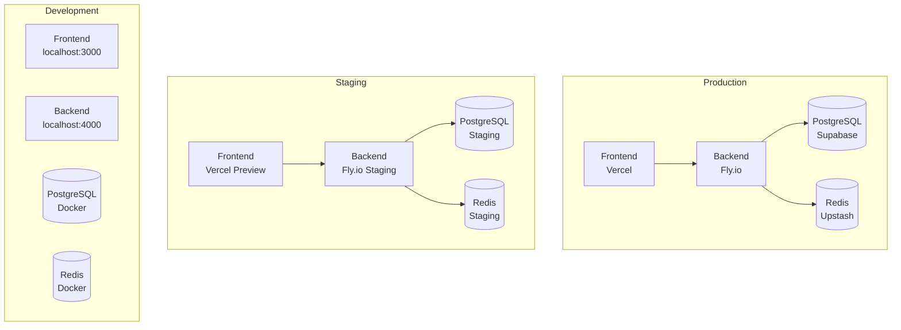
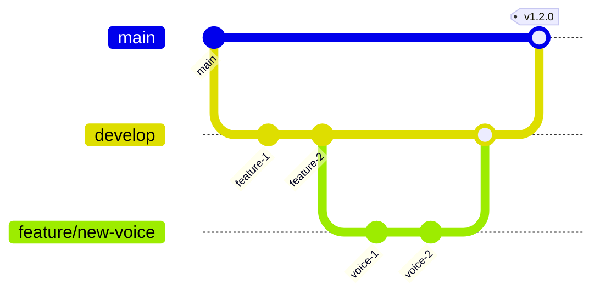
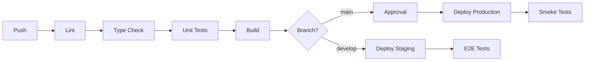

# Deployment Overview

This document outlines the deployment architecture, environments, and release strategy for the Vora platform.

---

## Architecture

### Environment Topology



### Service Matrix

| Service | Development | Staging | Production |
|---------|-------------|---------|------------|
| **Frontend** | localhost:3000 | Vercel Preview | app.vora.ai |
| **Backend** | localhost:4000 | staging-api.vora.ai | api.vora.ai |
| **Database** | Docker PostgreSQL | Supabase (Staging) | Supabase (Prod) |
| **Redis** | Docker Redis | Upstash (Staging) | Upstash (Prod) |
| **LiveKit** | Local/Cloud | Cloud (Staging) | Cloud (Prod) |

---

## Infrastructure

### Frontend (Vercel)

```yaml
Platform: Vercel
Framework: Vite + React
Build Command: npm run build
Output Directory: dist
Node Version: 20.x

Features:
  - Automatic Preview Deployments
  - Edge Functions (API Routes)
  - Image Optimization
  - Analytics
```

### Backend (Fly.io)

```yaml
Platform: Fly.io
Runtime: Node.js 20 (Docker)
Regions:
  - Primary: iad (US East)
  - Scaling: Auto (2-10 machines)

Resources:
  - CPU: shared-cpu-2x
  - Memory: 512MB
  - Persistent Storage: None (stateless)
```

### Database (Supabase)

```yaml
Platform: Supabase
Engine: PostgreSQL 15
Connection Pooling: PgBouncer (Transaction mode)

Features:
  - Point-in-time Recovery
  - Daily Backups
  - Connection Pooling
  - Read Replicas (Production)
```

### Cache & Queue (Upstash)

```yaml
Platform: Upstash
Services:
  - Redis (Caching, Rate Limiting)
  - QStash (Scheduled Jobs)

Configuration:
  - Eviction: volatile-lru
  - Max Memory: 256MB
  - Persistence: Enabled
```

---

## Environments

### Development

Local development environment for individual developers.

```bash
# Start all services
docker-compose up -d

# Run migrations
npm run db:migrate

# Start development servers
npm run dev
```

**Environment Variables:**
- `.env.local` - Local overrides (gitignored)
- `.env.development` - Development defaults

### Staging

Pre-production environment for testing and QA.

| Aspect | Configuration |
|--------|---------------|
| URL | staging.vora.ai |
| Branch | `develop` |
| Deploy | Auto on merge |
| Data | Anonymized production subset |

**Purpose:**
- Integration testing
- QA verification
- Client demos
- Load testing

### Production

Live production environment serving customers.

| Aspect | Configuration |
|--------|---------------|
| URL | app.vora.ai |
| Branch | `main` |
| Deploy | Manual approval |
| Data | Live customer data |

**Safeguards:**
- Deployment approval required
- Automatic rollback on failure
- Zero-downtime deployments
- Database migrations run first

---

## Release Strategy

### Branch Strategy



### Release Process

```
1. Feature Development
   └── feature/* branches
   └── PR to develop
   └── Auto-deploy to Staging

2. Release Candidate
   └── Create release/* branch
   └── Bug fixes only
   └── QA sign-off

3. Production Release
   └── PR to main
   └── Approval required
   └── Auto-deploy to Production
   └── Git tag created
```

### Versioning

We follow [Semantic Versioning](https://semver.org/):

```
MAJOR.MINOR.PATCH

- MAJOR: Breaking API changes
- MINOR: New features (backward compatible)
- PATCH: Bug fixes
```

**Examples:**
- `v1.0.0` → `v1.0.1` - Bug fix
- `v1.0.1` → `v1.1.0` - New feature
- `v1.1.0` → `v2.0.0` - Breaking change

---

## CI/CD Pipeline

### GitHub Actions Workflow

```yaml
name: Deploy

on:
  push:
    branches: [main, develop]
  pull_request:
    branches: [main, develop]

jobs:
  test:
    runs-on: ubuntu-latest
    steps:
      - uses: actions/checkout@v4
      - uses: actions/setup-node@v4
        with:
          node-version: '20'
          cache: 'npm'
      - run: npm ci
      - run: npm run lint
      - run: npm run typecheck
      - run: npm run test:coverage

  build:
    needs: test
    runs-on: ubuntu-latest
    steps:
      - uses: actions/checkout@v4
      - run: npm ci
      - run: npm run build
      - uses: actions/upload-artifact@v4
        with:
          name: build
          path: dist/

  deploy-staging:
    needs: build
    if: github.ref == 'refs/heads/develop'
    runs-on: ubuntu-latest
    environment: staging
    steps:
      - uses: actions/checkout@v4
      - uses: superfly/flyctl-actions/setup-flyctl@master
      - run: flyctl deploy --config fly.staging.toml
        env:
          FLY_API_TOKEN: ${{ secrets.FLY_API_TOKEN }}

  deploy-production:
    needs: build
    if: github.ref == 'refs/heads/main'
    runs-on: ubuntu-latest
    environment: production
    steps:
      - uses: actions/checkout@v4
      - uses: superfly/flyctl-actions/setup-flyctl@master
      - run: flyctl deploy --config fly.production.toml
        env:
          FLY_API_TOKEN: ${{ secrets.FLY_API_TOKEN }}
```

### Pipeline Stages



---

## Deployment Commands

### Frontend (Vercel)

```bash
# Deploy to preview
vercel

# Deploy to production
vercel --prod

# View deployment logs
vercel logs <deployment-url>

# Rollback to previous
vercel rollback
```

### Backend (Fly.io)

```bash
# Deploy to staging
fly deploy --config fly.staging.toml

# Deploy to production
fly deploy --config fly.production.toml

# View logs
fly logs -a vora-api-production

# SSH into machine
fly ssh console -a vora-api-production

# Scale machines
fly scale count 4 -a vora-api-production
```

### Database Migrations

```bash
# Generate migration
npx prisma migrate dev --name <migration-name>

# Deploy migrations (staging)
DATABASE_URL=$STAGING_DB npx prisma migrate deploy

# Deploy migrations (production)
DATABASE_URL=$PROD_DB npx prisma migrate deploy

# Rollback (manual)
# See migrations/rollback.mdx
```

---

## Monitoring

### Health Checks

```typescript
// /health endpoint response
{
  "status": "healthy",
  "version": "1.2.3",
  "timestamp": "2024-01-15T12:00:00Z",
  "checks": {
    "database": "healthy",
    "redis": "healthy",
    "livekit": "healthy"
  }
}
```

### Key Metrics

| Metric | Target | Alert Threshold |
|--------|--------|-----------------|
| Response Time (p99) | < 500ms | > 1000ms |
| Error Rate | < 0.1% | > 1% |
| Uptime | 99.9% | < 99.5% |
| CPU Usage | < 70% | > 85% |
| Memory Usage | < 80% | > 90% |

### Alerting

```yaml
# PagerDuty integration for critical alerts
alerts:
  - name: High Error Rate
    condition: error_rate > 1%
    severity: critical
    channel: pagerduty

  - name: High Latency
    condition: p99_latency > 2000ms
    severity: warning
    channel: slack

  - name: Database Connection Pool
    condition: pool_usage > 80%
    severity: warning
    channel: slack
```

---

## Security

### Secrets Management

```yaml
# Secrets stored in:
- GitHub Secrets (CI/CD)
- Fly.io Secrets (Backend)
- Vercel Environment Variables (Frontend)

# Never in:
- Git repository
- Docker images
- Log files
```

### Access Control

| Role | Staging | Production |
|------|---------|------------|
| Developer | Deploy | Read-only |
| Lead | Deploy | Deploy (approval) |
| DevOps | Full | Full |

---

## Related Documentation

<CardGroup cols={2}>
  <Card title="Staging Deployment" icon="flask" href="/internal/deployment/staging">
    Staging environment
  </Card>
  <Card title="Production Deployment" icon="rocket" href="/internal/deployment/production">
    Production releases
  </Card>
  <Card title="Migrations" icon="database" href="/internal/deployment/migrations">
    Database migrations
  </Card>
  <Card title="Rollback" icon="rotate-left" href="/internal/deployment/rollback">
    Rollback procedures
  </Card>
</CardGroup>
