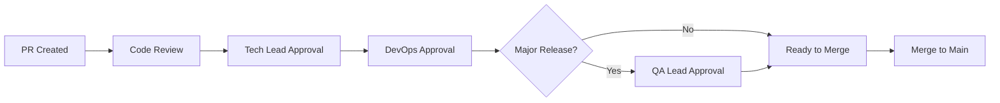
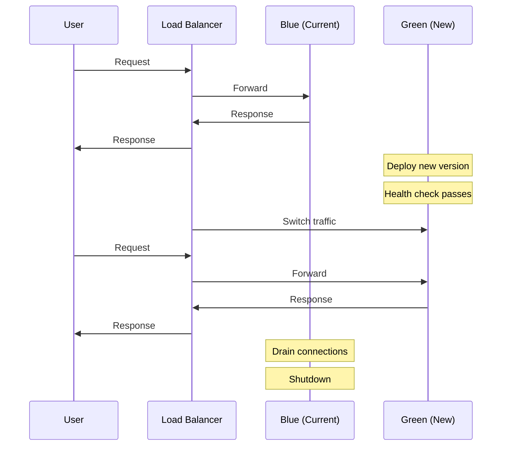

# Production Deployment

Production deployments require careful coordination and approval. This guide covers the complete production release process.

---

## Pre-Deployment Checklist

### Before Requesting Approval

- [ ] All tests passing on `develop` branch
- [ ] Staging deployment verified and tested
- [ ] QA sign-off obtained
- [ ] Database migrations tested on staging
- [ ] Performance benchmarks within acceptable range
- [ ] Security scan completed (no critical issues)
- [ ] Changelog updated
- [ ] Rollback plan documented

### Feature Flags

```typescript
// Ensure new features are behind flags
const features = {
  newVoiceEngine: process.env.FEATURE_NEW_VOICE_ENGINE === 'true',
  enhancedRAG: process.env.FEATURE_ENHANCED_RAG === 'true',
};

// Gradual rollout
if (features.newVoiceEngine && user.isBetaTester) {
  // New code path
}
```

---

## Release Process

### 1. Create Release Branch

```bash
# Create release branch from develop
git checkout develop
git pull origin develop
git checkout -b release/v1.2.0

# Update version in package.json
npm version minor --no-git-tag-version

# Update CHANGELOG.md
# Document all changes since last release

# Commit version bump
git add package.json package-lock.json CHANGELOG.md
git commit -m "chore: bump version to 1.2.0"

# Push release branch
git push -u origin release/v1.2.0
```

### 2. Create Pull Request

```bash
# Create PR to main
gh pr create \
  --base main \
  --title "Release v1.2.0" \
  --body "## Release v1.2.0

### Changes
- Feature: New voice engine integration
- Fix: Session timeout handling
- Improvement: API response times

### Checklist
- [ ] Staging tested
- [ ] QA approved
- [ ] Migrations verified
- [ ] Rollback plan ready

### Deployment Steps
1. Merge this PR
2. Migrations run automatically
3. Backend deploys to Fly.io
4. Frontend deploys to Vercel
5. Smoke tests pass
6. Git tag created
"
```

### 3. Approval Process

Required approvers:
- Tech Lead
- DevOps Engineer
- QA Lead (for major releases)



### 4. Merge and Deploy

```bash
# After approvals, merge PR
gh pr merge --squash

# GitHub Actions automatically:
# 1. Runs migrations
# 2. Deploys backend to Fly.io
# 3. Deploys frontend to Vercel
# 4. Runs smoke tests
# 5. Creates git tag
```

---

## Deployment Pipeline

### GitHub Actions Production Workflow

```yaml
# .github/workflows/deploy-production.yml
name: Deploy Production

on:
  push:
    branches: [main]

jobs:
  deploy:
    runs-on: ubuntu-latest
    environment: production
    concurrency:
      group: production
      cancel-in-progress: false

    steps:
      - uses: actions/checkout@v4
        with:
          fetch-depth: 0

      - name: Setup Node.js
        uses: actions/setup-node@v4
        with:
          node-version: '20'
          cache: 'npm'

      - name: Install dependencies
        run: npm ci

      - name: Run tests
        run: npm run test

      - name: Run migrations
        run: npx prisma migrate deploy
        env:
          DATABASE_URL: ${{ secrets.PRODUCTION_DATABASE_URL }}

      - name: Deploy Backend
        uses: superfly/flyctl-actions/setup-flyctl@master
      - run: flyctl deploy --config fly.production.toml
        env:
          FLY_API_TOKEN: ${{ secrets.FLY_API_TOKEN }}

      - name: Smoke Tests
        run: npm run test:smoke
        env:
          API_URL: https://api.vora.ai

      - name: Create Release Tag
        run: |
          VERSION=$(node -p "require('./package.json').version")
          git tag "v$VERSION"
          git push origin "v$VERSION"

      - name: Notify Success
        uses: slackapi/slack-github-action@v1
        with:
          payload: |
            {
              "text": "Production deployment successful: v${{ env.VERSION }}"
            }
        env:
          SLACK_WEBHOOK_URL: ${{ secrets.SLACK_WEBHOOK }}
```

---

## Manual Deployment

For emergency or manual deployments:

### Backend Deployment

```bash
# 1. Ensure you're on main branch
git checkout main
git pull origin main

# 2. Verify version
cat package.json | jq .version

# 3. Run migrations FIRST
DATABASE_URL=$PRODUCTION_DATABASE_URL npx prisma migrate deploy

# 4. Deploy to Fly.io
fly deploy --config fly.production.toml

# 5. Verify deployment
fly status -a vora-api-production

# 6. Run smoke tests
npm run test:smoke:production

# 7. Monitor logs
fly logs -a vora-api-production
```

### Frontend Deployment

```bash
# 1. Ensure you're on main branch
git checkout main
git pull origin main

# 2. Build
npm run build

# 3. Deploy to Vercel production
vercel --prod

# 4. Verify deployment
curl -I https://app.vora.ai

# 5. Check Vercel dashboard
# https://vercel.com/vora/vora-app
```

---

## Production Configuration

### Fly.io Production Config

```toml
# fly.production.toml
app = "vora-api-production"
primary_region = "iad"
kill_signal = "SIGTERM"
kill_timeout = 30

[build]
  dockerfile = "Dockerfile"

[env]
  NODE_ENV = "production"
  LOG_LEVEL = "info"
  PORT = "4000"

[http_service]
  internal_port = 4000
  force_https = true
  auto_stop_machines = false
  auto_start_machines = true
  min_machines_running = 2

[http_service.concurrency]
  type = "requests"
  hard_limit = 250
  soft_limit = 200

[[services]]
  protocol = "tcp"
  internal_port = 4000

  [[services.ports]]
    port = 80
    handlers = ["http"]

  [[services.ports]]
    port = 443
    handlers = ["tls", "http"]

  [[services.http_checks]]
    interval = "10s"
    timeout = "2s"
    grace_period = "10s"
    path = "/health"

  [[services.tcp_checks]]
    interval = "15s"
    timeout = "2s"
    grace_period = "10s"

[[vm]]
  cpu_kind = "shared"
  cpus = 2
  memory_mb = 512
```

### Scaling Configuration

```bash
# Scale machines
fly scale count 4 -a vora-api-production

# Scale memory
fly scale memory 1024 -a vora-api-production

# Scale CPU
fly scale vm shared-cpu-4x -a vora-api-production

# View current scale
fly scale show -a vora-api-production
```

---

## Zero-Downtime Deployment

### Blue-Green Strategy



### Fly.io Rolling Deployment

Fly.io performs rolling deployments by default:

1. New machines start with new version
2. Health checks pass
3. Traffic shifts to new machines
4. Old machines receive SIGTERM
5. Old machines shut down after drain

```bash
# Watch deployment progress
fly status -a vora-api-production

# View machine transitions
fly machines list -a vora-api-production
```

---

## Post-Deployment

### Smoke Tests

```typescript
// tests/smoke/production.test.ts
import { test, expect } from '@playwright/test';

test.describe('Production Smoke Tests', () => {
  test('health check', async ({ request }) => {
    const response = await request.get('https://api.vora.ai/health');
    expect(response.ok()).toBe(true);

    const body = await response.json();
    expect(body.status).toBe('healthy');
  });

  test('authentication works', async ({ page }) => {
    await page.goto('https://app.vora.ai');
    await expect(page.locator('.auth-button')).toBeVisible();
  });

  test('API responds', async ({ request }) => {
    const response = await request.get('https://api.vora.ai/api/status');
    expect(response.status()).toBe(200);
  });
});
```

### Monitoring

```bash
# Watch error rates
fly logs -a vora-api-production | grep -E "(ERROR|FATAL)"

# Check metrics
# https://fly.io/apps/vora-api-production/metrics

# Check Sentry for new issues
# https://sentry.io/organizations/vora/issues/
```

### Verification Checklist

- [ ] Health endpoint responding
- [ ] API endpoints working
- [ ] WebSocket connections establishing
- [ ] Voice calls connecting
- [ ] No new errors in Sentry
- [ ] Metrics within normal range
- [ ] Customer-reported issues checked

---

## Emergency Procedures

### Immediate Rollback

If critical issues are detected:

```bash
# Rollback to previous version
fly deploy --image registry.fly.io/vora-api-production:previous -a vora-api-production

# Or rollback to specific version
fly releases -a vora-api-production
fly deploy --image registry.fly.io/vora-api-production:v1.1.9 -a vora-api-production
```

### Incident Communication

```markdown
# Slack message template
:rotating_light: **Production Incident**

**Status**: Investigating / Identified / Resolved
**Impact**: [Description of user impact]
**Start Time**: [Time]

**What happened**:
[Brief description]

**Current actions**:
[What's being done]

**Updates**: #incident-channel
```

### Post-Incident

1. Resolve immediate issue
2. Create incident report
3. Schedule post-mortem
4. Update runbooks if needed

---

## Secrets Management

### Viewing Secrets

```bash
# List secrets (names only)
fly secrets list -a vora-api-production

# Secrets are never displayed in plain text
# Update via Fly.io dashboard or CLI
```

### Updating Secrets

```bash
# Update single secret
fly secrets set API_KEY="new-value" -a vora-api-production

# Update multiple secrets
fly secrets set \
  OPENAI_API_KEY="sk-..." \
  DEEPGRAM_API_KEY="..." \
  -a vora-api-production

# Machines automatically restart with new secrets
```

### Secret Rotation

```bash
# 1. Set new secret with different name
fly secrets set NEW_API_KEY="new-value" -a vora-api-production

# 2. Update code to use new secret name
# 3. Deploy code change
# 4. Remove old secret
fly secrets unset OLD_API_KEY -a vora-api-production
```

---

## Related Documentation

<CardGroup cols={2}>
  <Card title="Deployment Overview" icon="globe" href="/internal/deployment/overview">
    Architecture overview
  </Card>
  <Card title="Staging Deployment" icon="flask" href="/internal/deployment/staging">
    Staging environment
  </Card>
  <Card title="Migrations" icon="database" href="/internal/deployment/migrations">
    Database migrations
  </Card>
  <Card title="Rollback" icon="rotate-left" href="/internal/deployment/rollback">
    Rollback procedures
  </Card>
</CardGroup>
