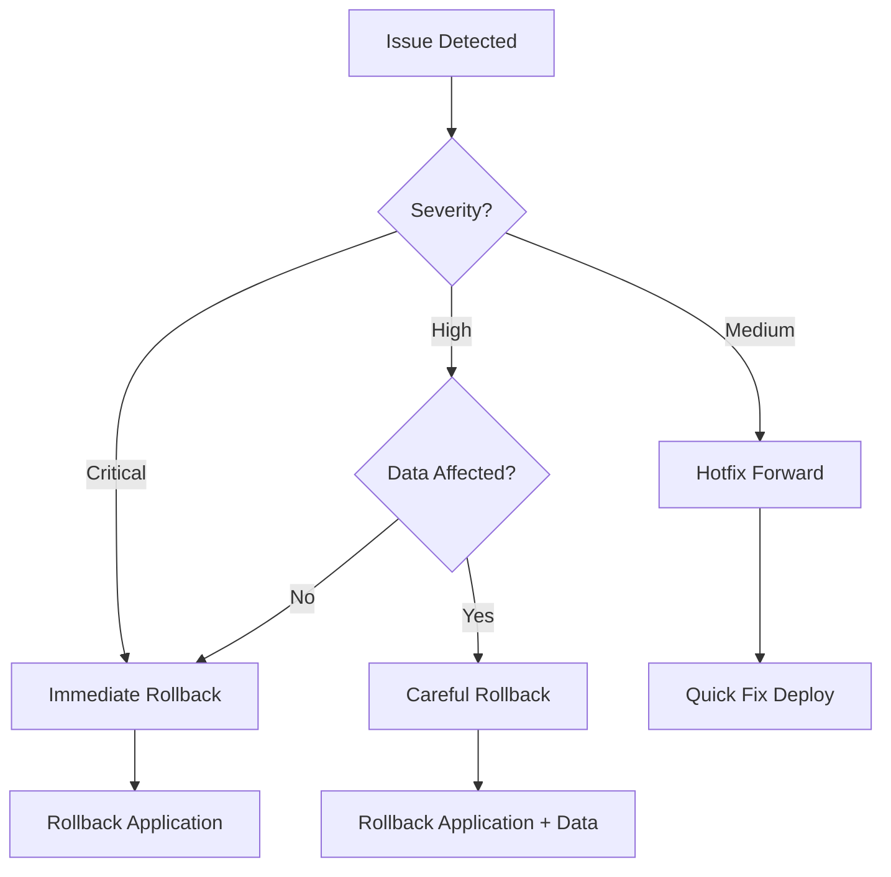

# Rollback Procedures

This guide covers rollback procedures for different scenarios and services.

---

## Quick Reference

### Emergency Rollback Commands

```bash
# Backend (Fly.io) - Immediate rollback
fly deploy --image registry.fly.io/vora-api-production:previous -a vora-api-production

# Frontend (Vercel) - Immediate rollback
vercel rollback

# Database - DO NOT rollback without careful planning
# See Database Rollback section below
```

---

## Decision Matrix



### When to Rollback

| Symptom | Action |
|---------|--------|
| 500 errors > 5% | Immediate rollback |
| Voice calls failing | Immediate rollback |
| Auth completely broken | Immediate rollback |
| Performance degraded 2x | Evaluate, likely rollback |
| Minor feature bug | Hotfix forward |
| UI rendering issues | Evaluate severity |

---

## Backend Rollback (Fly.io)

### View Available Versions

```bash
# List recent releases
fly releases -a vora-api-production

# Output:
# VERSION  STABLE  TYPE      STATUS     DESCRIPTION                  USER        DATE
# v42      true    scale     succeeded  Scale to 4                   john@vora   2024-01-15T12:00:00Z
# v41      true    release   succeeded  Deploy image                 github      2024-01-15T11:30:00Z
# v40      true    release   succeeded  Deploy image                 github      2024-01-14T15:00:00Z
```

### Rollback to Previous Version

```bash
# Quick rollback to immediately previous version
fly deploy --image registry.fly.io/vora-api-production:previous -a vora-api-production

# Rollback to specific version
fly deploy --image registry.fly.io/vora-api-production:v40 -a vora-api-production
```

### Rollback with Version Tag

```bash
# If using git tags
git checkout v1.1.9
fly deploy --config fly.production.toml
```

### Verify Rollback

```bash
# Check deployment status
fly status -a vora-api-production

# Verify health endpoint
curl https://api.vora.ai/health

# Check version
curl https://api.vora.ai/health | jq '.version'

# Monitor logs
fly logs -a vora-api-production
```

---

## Frontend Rollback (Vercel)

### Instant Rollback

```bash
# Rollback to previous deployment
vercel rollback

# Rollback to specific deployment
vercel rollback <deployment-url>

# Example:
vercel rollback vora-app-abc123.vercel.app
```

### Via Vercel Dashboard

1. Go to https://vercel.com/vora/vora-app
2. Click "Deployments" tab
3. Find the last working deployment
4. Click "..." → "Promote to Production"

### View Deployment History

```bash
# List recent deployments
vercel ls

# Get deployment details
vercel inspect <deployment-url>
```

---

## Database Rollback

### CRITICAL: Database rollback is complex and risky

Database changes cannot be automatically rolled back. Careful planning is required.

### Option 1: Forward Fix (Preferred)

Instead of rolling back, deploy a fix:

```sql
-- If added a bad column
ALTER TABLE "Agent" DROP COLUMN IF EXISTS "bad_column";

-- If added a bad constraint
ALTER TABLE "Agent" DROP CONSTRAINT IF EXISTS "bad_constraint";
```

### Option 2: Point-in-Time Recovery

For catastrophic data issues only:

```bash
# 1. STOP all application traffic
fly scale count 0 -a vora-api-production

# 2. Contact Supabase support for PITR
# Or use Supabase dashboard:
# - Go to Database → Backups
# - Select restore point
# - Restore to new database

# 3. Update DATABASE_URL to new database
fly secrets set DATABASE_URL="new-connection-string" -a vora-api-production

# 4. Resume traffic
fly scale count 4 -a vora-api-production
```

### Option 3: Manual Migration Rollback

```sql
-- 1. Check migration history
SELECT * FROM "_prisma_migrations" ORDER BY started_at DESC;

-- 2. Mark migration as rolled back
UPDATE "_prisma_migrations"
SET rolled_back_at = NOW()
WHERE migration_name = '20240115_problematic_migration';

-- 3. Manually reverse changes
-- (You must know what the migration did)
DROP TABLE IF EXISTS "NewTable";
ALTER TABLE "Agent" DROP COLUMN IF EXISTS "new_column";
```

### Option 4: Restore from Backup

```bash
# 1. List available backups
# Via Supabase dashboard or API

# 2. Download backup
pg_dump $BACKUP_DATABASE_URL > backup.sql

# 3. Stop application
fly scale count 0 -a vora-api-production

# 4. Restore backup
psql $PRODUCTION_DATABASE_URL < backup.sql

# 5. Resume application
fly scale count 4 -a vora-api-production
```

---

## Rollback Scenarios

### Scenario 1: API Breaking Change

**Symptoms:** 500 errors, mobile apps failing

```bash
# 1. Identify the issue
fly logs -a vora-api-production | grep ERROR

# 2. Immediate rollback
fly deploy --image registry.fly.io/vora-api-production:previous -a vora-api-production

# 3. Notify team
# Post in #engineering-alerts

# 4. Investigate
git log --oneline -10
# Identify problematic commit

# 5. Fix and re-deploy properly
git revert <commit-hash>
git push origin main
```

### Scenario 2: Frontend Crash

**Symptoms:** White screen, console errors

```bash
# 1. Check Vercel logs
vercel logs vora-app.vercel.app

# 2. Rollback frontend
vercel rollback

# 3. Verify
curl https://app.vora.ai

# 4. Check Sentry for errors
# https://sentry.io/organizations/vora/issues/
```

### Scenario 3: Migration Broke Production

**Symptoms:** Database errors, missing columns

```bash
# 1. DO NOT PANIC
# 2. Stop further damage
fly scale count 0 -a vora-api-production

# 3. Assess the situation
psql $PRODUCTION_DATABASE_URL -c "SELECT * FROM _prisma_migrations ORDER BY started_at DESC LIMIT 5"

# 4. If data is intact, apply forward fix
psql $PRODUCTION_DATABASE_URL < fix.sql

# 5. If data is corrupted, restore from backup
# See Option 4 above

# 6. Resume after fix verified
fly scale count 4 -a vora-api-production
```

### Scenario 4: Partial Rollback

When only part of the system needs rollback:

```bash
# Rollback only backend
fly deploy --image registry.fly.io/vora-api-production:previous -a vora-api-production

# Keep frontend on latest
# (No action needed)

# Rollback only frontend
vercel rollback
# Keep backend on latest
```

---

## Rollback Checklist

### Before Rollback

- [ ] Confirm the issue requires rollback (not a quick fix)
- [ ] Identify the last known good version
- [ ] Notify team in #engineering-alerts
- [ ] Check if database changes were involved

### During Rollback

- [ ] Execute rollback command
- [ ] Monitor logs for errors
- [ ] Verify health endpoints
- [ ] Test critical paths (login, voice calls)

### After Rollback

- [ ] Confirm services are stable
- [ ] Update incident channel
- [ ] Create post-mortem ticket
- [ ] Document what went wrong
- [ ] Plan proper fix

---

## Communication Templates

### Slack Alert

```markdown
:rotating_light: **Rollback Initiated**

**Service:** Backend / Frontend / Both
**Reason:** [Brief description]
**Rolling back to:** v1.1.9 / Previous deployment
**ETA:** 2-5 minutes

Will update when complete.
```

### Rollback Complete

```markdown
:white_check_mark: **Rollback Complete**

**Service:** Backend / Frontend / Both
**Previous version:** v1.2.0
**Current version:** v1.1.9
**Duration:** 4 minutes

**Status:** Services stable
**Next steps:** Post-mortem scheduled for [time]
```

### Incident Report

```markdown
## Incident Report: [Date] Deployment Rollback

**Duration:** [start] - [end]
**Impact:** [Description of user impact]
**Severity:** P1 / P2 / P3

### Timeline
- 14:00 - Deployment started
- 14:05 - Errors detected
- 14:08 - Rollback initiated
- 14:12 - Rollback complete
- 14:15 - Services verified stable

### Root Cause
[Description of what went wrong]

### Resolution
[How it was fixed]

### Action Items
- [ ] [Preventive measure 1]
- [ ] [Preventive measure 2]
```

---

## Preventing Rollbacks

### Pre-Deployment

- [ ] Full test suite passing
- [ ] Staging environment tested
- [ ] Load testing for performance changes
- [ ] Database migrations tested separately
- [ ] Feature flags for risky changes

### Deployment

- [ ] Deploy during low-traffic periods
- [ ] Monitor metrics during deploy
- [ ] Have rollback command ready
- [ ] Team member available for support

### Post-Deployment

- [ ] Smoke tests immediately after
- [ ] Monitor error rates for 30 minutes
- [ ] Check Sentry for new issues
- [ ] Verify customer-reported functionality

---

## Related Documentation

<CardGroup cols={2}>
  <Card title="Production Deployment" icon="rocket" href="/internal/deployment/production">
    Production releases
  </Card>
  <Card title="Migrations" icon="database" href="/internal/deployment/migrations">
    Database migrations
  </Card>
  <Card title="Incident Response" icon="bell" href="/internal/runbooks/incident-response">
    Incident procedures
  </Card>
  <Card title="Deployment Overview" icon="globe" href="/internal/deployment/overview">
    Architecture overview
  </Card>
</CardGroup>
