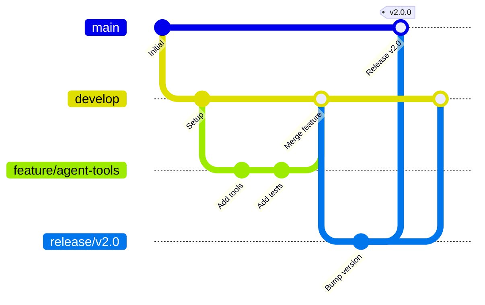

# Git Workflow

This guide covers Git branching strategies, commit conventions, and pull request standards used in the Vora platform development.

---

## Branching Strategy

### Branch Types

| Branch Type | Pattern | Purpose | Lifetime |
|-------------|---------|---------|----------|
| Main | `main` | Production-ready code | Permanent |
| Development | `develop` | Integration branch | Permanent |
| Feature | `feature/*` | New features | Until merged |
| Bugfix | `fix/*` | Bug fixes | Until merged |
| Hotfix | `hotfix/*` | Production fixes | Until merged |
| Release | `release/*` | Release preparation | Until tagged |

### Branch Naming

```bash
# Features
feature/agent-voice-cloning
feature/calendar-integration
feature/auth-sso

# Bug fixes
fix/session-timeout
fix/audio-sync-issue
fix/memory-leak-transcription

# Hotfixes
hotfix/security-patch-1.2.1
hotfix/payment-processing

# Releases
release/v2.0.0
release/v2.1.0-beta
```

### Branch Flow



---

## Commit Conventions

### Conventional Commits Format

```
<type>(<scope>): <subject>

[optional body]

[optional footer(s)]
```

### Types

| Type | Description | Example |
|------|-------------|---------|
| `feat` | New feature | `feat(agents): add voice cloning support` |
| `fix` | Bug fix | `fix(session): resolve memory leak on disconnect` |
| `docs` | Documentation | `docs(api): update authentication examples` |
| `style` | Code style (no logic change) | `style(components): fix indentation` |
| `refactor` | Code refactoring | `refactor(services): extract common validation` |
| `perf` | Performance improvement | `perf(tts): cache audio chunks` |
| `test` | Adding/updating tests | `test(agents): add creation tests` |
| `build` | Build system changes | `build(deps): update prisma to v5` |
| `ci` | CI configuration | `ci(actions): add deployment workflow` |
| `chore` | Other changes | `chore: update .gitignore` |

### Scopes

```bash
# Feature areas
feat(agents): ...
feat(sessions): ...
feat(voice): ...
feat(knowledge): ...

# Layers
feat(api): ...
feat(frontend): ...
feat(backend): ...

# Infrastructure
chore(deps): ...
chore(docker): ...
ci(actions): ...
```

### Subject Line Rules

```bash
# ✅ Good - Imperative mood, lowercase, no period
feat(agents): add voice cloning configuration
fix(auth): handle expired token refresh
docs(api): update rate limit documentation

# ❌ Bad - Past tense
feat(agents): added voice cloning configuration

# ❌ Bad - Capitalized
feat(agents): Add voice cloning configuration

# ❌ Bad - Ends with period
feat(agents): add voice cloning configuration.

# ❌ Bad - Too long (>72 chars)
feat(agents): add voice cloning configuration with multiple provider support and fallback handling
```

### Commit Body

```bash
# For complex changes, add a body explaining WHY

git commit -m "fix(session): prevent duplicate agent dispatch on resume

When a session resumes after a brief disconnect, the agent was being
dispatched again even though it was still connected. This caused
duplicate responses and billing.

Added a check for existing agent participants before dispatching.

Closes #234"
```

### Breaking Changes

```bash
# Footer format for breaking changes

feat(api)!: change agent config structure

BREAKING CHANGE: The agent configuration now requires separate
objects for llm, stt, and tts settings instead of a flat structure.

Before:
  { name: "Agent", provider: "openai", model: "gpt-4" }

After:
  { name: "Agent", llm: { provider: "openai", model: "gpt-4" } }
```

---

## Pull Request Standards

### PR Title Format

Follow the same conventional commit format:

```
feat(agents): add voice cloning support
fix(session): resolve memory leak on disconnect
docs(api): update webhook examples
```

### PR Description Template

```markdown
## Summary
Brief description of what this PR does.

## Changes
- Added X
- Modified Y
- Removed Z

## Testing
- [ ] Unit tests added/updated
- [ ] Integration tests pass
- [ ] Manual testing completed

## Screenshots
(if applicable)

## Related Issues
Closes #123
Related to #456
```

### PR Checklist

Before submitting a PR:

- [ ] Branch is up to date with `develop`
- [ ] All tests pass locally
- [ ] Code follows style guide
- [ ] JSDoc comments added for public APIs
- [ ] No console.log statements (except logger)
- [ ] No TODO comments without issue reference
- [ ] Self-reviewed the diff

### PR Size Guidelines

| Size | Lines Changed | Review Time |
|------|---------------|-------------|
| Small | < 100 | Same day |
| Medium | 100-300 | 1-2 days |
| Large | 300-500 | 2-3 days |
| X-Large | > 500 | Consider splitting |

**Prefer smaller, focused PRs over large omnibus changes.**

---

## Merge Strategy

### Squash and Merge (Default)

- Used for feature branches
- Creates a clean linear history
- Commit message should be the PR title

### Merge Commit

- Used for release branches
- Preserves complete branch history
- Required for hotfix branches

### Rebase and Merge

- Used rarely
- Only when linear history is specifically needed
- Never rebase shared branches

---

## Code Review Guidelines

### For Authors

1. **Self-review first** - Read your own diff before requesting review
2. **Small PRs** - Easier to review thoroughly
3. **Clear description** - Explain the why, not just the what
4. **Respond promptly** - Address feedback within 24 hours
5. **Resolve conversations** - Don't leave threads hanging

### For Reviewers

1. **Be constructive** - Suggest improvements, don't criticize
2. **Ask questions** - Clarify before assuming
3. **Prioritize feedback** - Distinguish blockers from suggestions
4. **Test locally** - For significant changes
5. **Approve or request changes** - Don't leave in limbo

### Comment Prefixes

```
# Blocking - Must be addressed before merge
BLOCKER: This will cause a security vulnerability

# Suggestion - Nice to have, can be addressed later
nit: Consider renaming this variable for clarity

# Question - Need clarification
Q: Why is this check necessary here?

# Optional - Take it or leave it
optional: Could use a ternary here for brevity
```

---

## Git Hooks

### Pre-commit Hooks

```bash
# .husky/pre-commit
#!/bin/sh
. "$(dirname "$0")/_/husky.sh"

# Run linting
npm run lint

# Run type checking
npm run typecheck

# Run affected tests
npm run test:affected
```

### Commit Message Hook

```bash
# .husky/commit-msg
#!/bin/sh
. "$(dirname "$0")/_/husky.sh"

# Validate conventional commit format
npx commitlint --edit $1
```

### Commitlint Configuration

```javascript
// commitlint.config.js
module.exports = {
  extends: ['@commitlint/config-conventional'],
  rules: {
    'scope-enum': [
      2,
      'always',
      [
        'agents',
        'sessions',
        'voice',
        'knowledge',
        'api',
        'frontend',
        'backend',
        'deps',
        'ci',
        'docs',
      ],
    ],
    'subject-case': [2, 'always', 'lower-case'],
    'header-max-length': [2, 'always', 72],
  },
};
```

---

## Common Git Operations

### Updating Feature Branch

```bash
# Fetch latest changes
git fetch origin

# Rebase on develop (preferred)
git rebase origin/develop

# Or merge develop (if conflicts are complex)
git merge origin/develop
```

### Fixing Commits

```bash
# Amend last commit
git commit --amend

# Interactive rebase for multiple commits
git rebase -i HEAD~3

# Fixup a specific commit
git commit --fixup <commit-hash>
git rebase -i --autosquash origin/develop
```

### Undoing Changes

```bash
# Undo uncommitted changes
git checkout -- <file>
git restore <file>

# Undo last commit (keep changes)
git reset --soft HEAD~1

# Undo last commit (discard changes)
git reset --hard HEAD~1

# Revert a pushed commit
git revert <commit-hash>
```

### Stashing

```bash
# Stash current changes
git stash

# Stash with message
git stash save "WIP: agent configuration"

# List stashes
git stash list

# Apply and keep stash
git stash apply

# Apply and remove stash
git stash pop

# Apply specific stash
git stash apply stash@{2}
```

---

## Release Process

### Creating a Release

```bash
# 1. Create release branch
git checkout develop
git pull origin develop
git checkout -b release/v2.1.0

# 2. Bump version
npm version 2.1.0

# 3. Update changelog
# Edit CHANGELOG.md

# 4. Push release branch
git push origin release/v2.1.0

# 5. Create PR to main
# After approval, merge to main

# 6. Tag release
git checkout main
git pull origin main
git tag -a v2.1.0 -m "Release v2.1.0"
git push origin v2.1.0

# 7. Merge back to develop
git checkout develop
git merge main
git push origin develop
```

---

## Related Documentation

<CardGroup cols={2}>
  <Card title="Style Guide" icon="paint-brush" href="/internal/standards/style-guide">
    Code formatting standards
  </Card>
  <Card title="Naming Conventions" icon="tag" href="/internal/standards/naming">
    Naming patterns
  </Card>
  <Card title="CI/CD" icon="rocket" href="/internal/deployment/overview">
    Deployment pipeline
  </Card>
  <Card title="Testing" icon="vial" href="/internal/testing/overview">
    Testing standards
  </Card>
</CardGroup>
