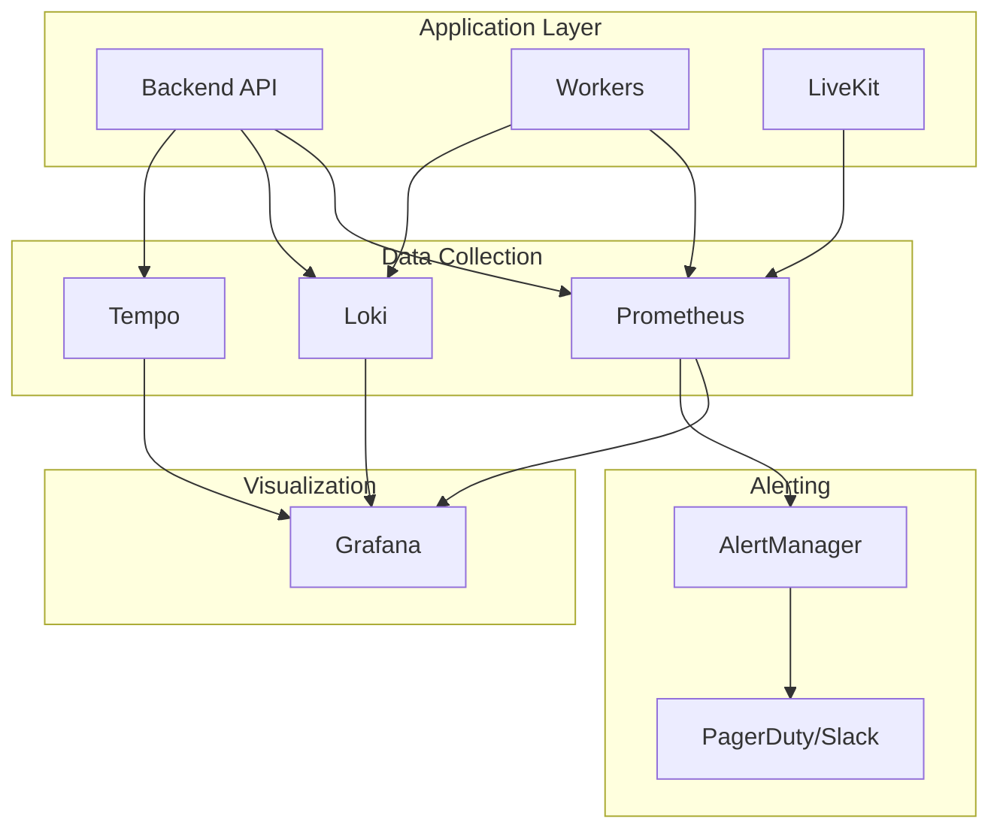

# Monitoring & Observability

Set up comprehensive monitoring for your Vora self-hosted deployment.

---

## Observability Stack



---

## Quick Start

### Docker Compose Monitoring Stack

```yaml
# docker-compose.monitoring.yml
version: '3.8'

services:
  prometheus:
    image: prom/prometheus:latest
    ports:
      - "9090:9090"
    volumes:
      - ./prometheus.yml:/etc/prometheus/prometheus.yml
      - prometheus_data:/prometheus
    command:
      - '--config.file=/etc/prometheus/prometheus.yml'
      - '--storage.tsdb.path=/prometheus'
      - '--web.enable-lifecycle'

  grafana:
    image: grafana/grafana:latest
    ports:
      - "3001:3000"
    environment:
      - GF_SECURITY_ADMIN_PASSWORD=admin
      - GF_USERS_ALLOW_SIGN_UP=false
    volumes:
      - grafana_data:/var/lib/grafana
      - ./grafana/provisioning:/etc/grafana/provisioning

  loki:
    image: grafana/loki:latest
    ports:
      - "3100:3100"
    volumes:
      - ./loki-config.yml:/etc/loki/local-config.yaml
      - loki_data:/loki

  promtail:
    image: grafana/promtail:latest
    volumes:
      - /var/log:/var/log:ro
      - ./promtail-config.yml:/etc/promtail/config.yml
      - /var/run/docker.sock:/var/run/docker.sock

volumes:
  prometheus_data:
  grafana_data:
  loki_data:
```

### Start Monitoring

```bash
docker compose -f docker-compose.yml -f docker-compose.monitoring.yml up -d
```

---

## Metrics (Prometheus)

### Prometheus Configuration

```yaml
# prometheus.yml
global:
  scrape_interval: 15s
  evaluation_interval: 15s

alerting:
  alertmanagers:
    - static_configs:
        - targets:
            - alertmanager:9093

rule_files:
  - /etc/prometheus/alerts/*.yml

scrape_configs:
  # Vora Backend
  - job_name: 'vora-backend'
    static_configs:
      - targets: ['backend:4000']
    metrics_path: /metrics

  # Vora Workers
  - job_name: 'vora-workers'
    static_configs:
      - targets: ['worker:9090']

  # PostgreSQL
  - job_name: 'postgres'
    static_configs:
      - targets: ['postgres-exporter:9187']

  # Redis
  - job_name: 'redis'
    static_configs:
      - targets: ['redis-exporter:9121']

  # LiveKit
  - job_name: 'livekit'
    static_configs:
      - targets: ['livekit:7880']
    metrics_path: /metrics

  # Node metrics
  - job_name: 'node'
    static_configs:
      - targets: ['node-exporter:9100']
```

### Key Metrics

#### Application Metrics

| Metric | Type | Description |
|--------|------|-------------|
| `http_requests_total` | Counter | Total HTTP requests |
| `http_request_duration_seconds` | Histogram | Request latency |
| `active_sessions` | Gauge | Current active voice sessions |
| `llm_requests_total` | Counter | LLM API calls |
| `llm_request_duration_seconds` | Histogram | LLM latency |
| `tts_characters_total` | Counter | TTS characters processed |
| `stt_audio_seconds_total` | Counter | STT audio processed |

#### Infrastructure Metrics

| Metric | Type | Description |
|--------|------|-------------|
| `pg_stat_activity_count` | Gauge | Database connections |
| `redis_connected_clients` | Gauge | Redis connections |
| `redis_memory_used_bytes` | Gauge | Redis memory |
| `bullmq_queue_depth` | Gauge | Job queue length |
| `bullmq_completed_total` | Counter | Completed jobs |
| `bullmq_failed_total` | Counter | Failed jobs |

### Instrumenting the Backend

```typescript
// metrics.ts
import { Registry, Counter, Histogram, Gauge } from 'prom-client';

export const register = new Registry();

// HTTP metrics
export const httpRequestsTotal = new Counter({
  name: 'http_requests_total',
  help: 'Total HTTP requests',
  labelNames: ['method', 'path', 'status'],
  registers: [register],
});

export const httpRequestDuration = new Histogram({
  name: 'http_request_duration_seconds',
  help: 'HTTP request duration',
  labelNames: ['method', 'path'],
  buckets: [0.01, 0.05, 0.1, 0.5, 1, 2, 5],
  registers: [register],
});

// Voice session metrics
export const activeSessions = new Gauge({
  name: 'active_voice_sessions',
  help: 'Number of active voice sessions',
  registers: [register],
});

// LLM metrics
export const llmRequests = new Counter({
  name: 'llm_requests_total',
  help: 'LLM API requests',
  labelNames: ['provider', 'model', 'status'],
  registers: [register],
});

export const llmLatency = new Histogram({
  name: 'llm_request_duration_seconds',
  help: 'LLM request duration',
  labelNames: ['provider', 'model'],
  buckets: [0.1, 0.5, 1, 2, 5, 10],
  registers: [register],
});
```

### Metrics Endpoint

```typescript
// routes/metrics.ts
import { Router } from 'express';
import { register } from '../metrics';

const router = Router();

router.get('/metrics', async (req, res) => {
  res.set('Content-Type', register.contentType);
  res.send(await register.metrics());
});

export default router;
```

---

## Logging (Loki)

### Structured Logging

```typescript
// logger.ts
import pino from 'pino';

export const logger = pino({
  level: process.env.LOG_LEVEL || 'info',
  formatters: {
    level: (label) => ({ level: label }),
  },
  base: {
    service: 'vora-backend',
    version: process.env.APP_VERSION,
  },
});

// Usage
logger.info({ userId, agentId, sessionId }, 'Voice session started');
logger.error({ error, userId }, 'LLM request failed');
```

### Loki Configuration

```yaml
# loki-config.yml
auth_enabled: false

server:
  http_listen_port: 3100

ingester:
  lifecycler:
    ring:
      kvstore:
        store: inmemory
      replication_factor: 1

schema_config:
  configs:
    - from: 2020-10-24
      store: boltdb-shipper
      object_store: filesystem
      schema: v11
      index:
        prefix: index_
        period: 24h

storage_config:
  boltdb_shipper:
    active_index_directory: /loki/index
    cache_location: /loki/cache
    shared_store: filesystem
  filesystem:
    directory: /loki/chunks

limits_config:
  reject_old_samples: true
  reject_old_samples_max_age: 168h

chunk_store_config:
  max_look_back_period: 0s

table_manager:
  retention_deletes_enabled: false
  retention_period: 0s
```

### Promtail Configuration

```yaml
# promtail-config.yml
server:
  http_listen_port: 9080

positions:
  filename: /tmp/positions.yaml

clients:
  - url: http://loki:3100/loki/api/v1/push

scrape_configs:
  # Docker container logs
  - job_name: docker
    docker_sd_configs:
      - host: unix:///var/run/docker.sock
        refresh_interval: 5s
    relabel_configs:
      - source_labels: ['__meta_docker_container_name']
        target_label: 'container'
      - source_labels: ['__meta_docker_container_label_com_docker_compose_service']
        target_label: 'service'

  # Application logs
  - job_name: vora
    static_configs:
      - targets:
          - localhost
        labels:
          job: vora
          __path__: /var/log/vora/*.log
```

### Log Queries (LogQL)

```logql
# Error logs from backend
{service="vora-backend"} |= "error"

# Slow LLM requests
{service="vora-backend"} | json | duration > 5s | provider="openai"

# Voice session events
{service="vora-backend"} |= "voice session" | json | line_format "{{.userId}} - {{.message}}"

# Rate of errors by service
sum(rate({job="vora"} |= "error" [5m])) by (service)
```

---

## Tracing (Optional)

### OpenTelemetry Setup

```typescript
// tracing.ts
import { NodeSDK } from '@opentelemetry/sdk-node';
import { OTLPTraceExporter } from '@opentelemetry/exporter-trace-otlp-http';
import { getNodeAutoInstrumentations } from '@opentelemetry/auto-instrumentations-node';

const sdk = new NodeSDK({
  traceExporter: new OTLPTraceExporter({
    url: process.env.OTEL_EXPORTER_OTLP_ENDPOINT,
  }),
  instrumentations: [getNodeAutoInstrumentations()],
});

sdk.start();
```

### Tempo Configuration

```yaml
# tempo.yml
server:
  http_listen_port: 3200

distributor:
  receivers:
    otlp:
      protocols:
        http:
        grpc:

storage:
  trace:
    backend: local
    local:
      path: /tmp/tempo/blocks
```

---

## Alerting

### AlertManager Configuration

```yaml
# alertmanager.yml
global:
  slack_api_url: 'https://hooks.slack.com/services/xxx'

route:
  receiver: 'slack-notifications'
  group_by: ['alertname', 'severity']
  group_wait: 30s
  group_interval: 5m
  repeat_interval: 4h

  routes:
    - match:
        severity: critical
      receiver: 'pagerduty-critical'
    - match:
        severity: warning
      receiver: 'slack-notifications'

receivers:
  - name: 'slack-notifications'
    slack_configs:
      - channel: '#vora-alerts'
        send_resolved: true
        title: '{{ .GroupLabels.alertname }}'
        text: '{{ range .Alerts }}{{ .Annotations.description }}{{ end }}'

  - name: 'pagerduty-critical'
    pagerduty_configs:
      - service_key: '<pagerduty-key>'
        severity: critical
```

### Alert Rules

```yaml
# alerts/vora.yml
groups:
  - name: vora-application
    rules:
      # High error rate
      - alert: HighErrorRate
        expr: |
          sum(rate(http_requests_total{status=~"5.."}[5m])) /
          sum(rate(http_requests_total[5m])) > 0.05
        for: 5m
        labels:
          severity: critical
        annotations:
          summary: High error rate detected
          description: Error rate is {{ $value | humanizePercentage }}

      # High latency
      - alert: HighLatency
        expr: |
          histogram_quantile(0.99,
            rate(http_request_duration_seconds_bucket[5m])
          ) > 2
        for: 5m
        labels:
          severity: warning
        annotations:
          summary: High API latency
          description: P99 latency is {{ $value | humanizeDuration }}

      # No active sessions (potential outage)
      - alert: NoActiveSessions
        expr: active_voice_sessions == 0
        for: 15m
        labels:
          severity: warning
        annotations:
          summary: No active voice sessions
          description: No voice sessions for 15 minutes

      # LLM provider failures
      - alert: LLMProviderErrors
        expr: |
          rate(llm_requests_total{status="error"}[5m]) > 0.1
        for: 5m
        labels:
          severity: critical
        annotations:
          summary: LLM provider errors
          description: High error rate from {{ $labels.provider }}

  - name: vora-infrastructure
    rules:
      # Database connections
      - alert: DatabaseConnectionsHigh
        expr: pg_stat_activity_count / pg_settings_max_connections > 0.8
        for: 5m
        labels:
          severity: warning
        annotations:
          summary: Database connections near limit
          description: Using {{ $value | humanizePercentage }} of connections

      # Redis memory
      - alert: RedisMemoryHigh
        expr: redis_memory_used_bytes / redis_memory_max_bytes > 0.8
        for: 5m
        labels:
          severity: warning
        annotations:
          summary: Redis memory high
          description: Redis using {{ $value | humanizePercentage }} of memory

      # Job queue backlog
      - alert: JobQueueBacklog
        expr: bullmq_queue_depth{queue="voice-sessions"} > 100
        for: 10m
        labels:
          severity: warning
        annotations:
          summary: Job queue backlog
          description: Queue {{ $labels.queue }} has {{ $value }} pending jobs

      # Failed jobs
      - alert: HighJobFailureRate
        expr: |
          rate(bullmq_failed_total[5m]) /
          rate(bullmq_completed_total[5m]) > 0.1
        for: 10m
        labels:
          severity: warning
        annotations:
          summary: High job failure rate
          description: {{ $value | humanizePercentage }} of jobs failing
```

---

## Grafana Dashboards

### Dashboard Provisioning

```yaml
# grafana/provisioning/dashboards/dashboards.yml
apiVersion: 1

providers:
  - name: 'Vora'
    folder: 'Vora'
    type: file
    options:
      path: /etc/grafana/provisioning/dashboards/vora
```

### Key Dashboard Panels

#### Overview Dashboard

```json
{
  "title": "Vora Overview",
  "panels": [
    {
      "title": "Request Rate",
      "type": "graph",
      "targets": [
        {
          "expr": "sum(rate(http_requests_total[5m]))",
          "legendFormat": "Requests/sec"
        }
      ]
    },
    {
      "title": "Error Rate",
      "type": "stat",
      "targets": [
        {
          "expr": "sum(rate(http_requests_total{status=~\"5..\"}[5m])) / sum(rate(http_requests_total[5m]))"
        }
      ]
    },
    {
      "title": "Active Sessions",
      "type": "gauge",
      "targets": [
        {
          "expr": "active_voice_sessions"
        }
      ]
    },
    {
      "title": "P99 Latency",
      "type": "graph",
      "targets": [
        {
          "expr": "histogram_quantile(0.99, rate(http_request_duration_seconds_bucket[5m]))"
        }
      ]
    }
  ]
}
```

---

## Error Tracking (Sentry)

### Setup

```typescript
// sentry.ts
import * as Sentry from '@sentry/node';

Sentry.init({
  dsn: process.env.SENTRY_DSN,
  environment: process.env.NODE_ENV,
  release: process.env.APP_VERSION,
  tracesSampleRate: 0.1,
  integrations: [
    new Sentry.Integrations.Http({ tracing: true }),
    new Sentry.Integrations.Express({ app }),
    new Sentry.Integrations.Prisma({ client: prisma }),
  ],
});
```

### Error Boundaries

```typescript
// Express error handler
app.use((err, req, res, next) => {
  Sentry.captureException(err, {
    extra: {
      userId: req.auth?.userId,
      path: req.path,
      method: req.method,
    },
  });

  res.status(500).json({ error: 'Internal server error' });
});
```

---

## Health Checks

### Health Endpoint

```typescript
// routes/health.ts
import { Router } from 'express';
import { prisma } from '../db';
import { redis } from '../redis';

const router = Router();

router.get('/health', async (req, res) => {
  const checks = {
    database: 'unknown',
    redis: 'unknown',
    uptime: process.uptime(),
  };

  try {
    await prisma.$queryRaw`SELECT 1`;
    checks.database = 'healthy';
  } catch (e) {
    checks.database = 'unhealthy';
  }

  try {
    await redis.ping();
    checks.redis = 'healthy';
  } catch (e) {
    checks.redis = 'unhealthy';
  }

  const healthy = checks.database === 'healthy' && checks.redis === 'healthy';
  res.status(healthy ? 200 : 503).json(checks);
});

router.get('/ready', async (req, res) => {
  // More thorough readiness check
  res.status(200).json({ ready: true });
});

export default router;
```

---

## Runbooks

### High Error Rate

1. Check error logs: `{service="vora-backend"} |= "error"`
2. Identify error patterns
3. Check external service status (LLM providers, databases)
4. Scale if load-related
5. Rollback if deployment-related

### Database Connection Exhaustion

1. Check active connections: `SELECT * FROM pg_stat_activity`
2. Kill idle connections if needed
3. Increase pool size or add PgBouncer
4. Check for connection leaks

### Job Queue Backlog

1. Check worker status: `docker compose ps worker`
2. Scale workers: `docker compose scale worker=5`
3. Check for stuck jobs
4. Review job processing times

---

## Next Steps

<CardGroup cols={2}>
  <Card title="Scaling Guide" icon="arrows-alt" href="/self-hosting/scaling">
    Scale your deployment
  </Card>
  <Card title="Database Setup" icon="database" href="/self-hosting/database">
    Database monitoring
  </Card>
  <Card title="Redis Setup" icon="bolt" href="/self-hosting/redis">
    Redis monitoring
  </Card>
  <Card title="Self-Hosting Overview" icon="server" href="/self-hosting">
    Back to overview
  </Card>
</CardGroup>
